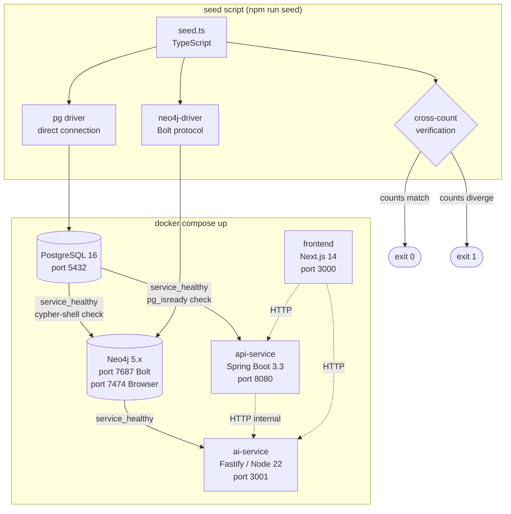

# M1 — Foundation Design

**Status:** Approved
**Date:** 2026-04-23
**ADRs:** [ADR-001 — Seed Strategy](adr-001-seed-strategy.md) | [ADR-002 — Neo4j Health Check](adr-002-neo4j-healthcheck.md)

---

## Architecture Overview



---

## Code Reuse Analysis

| Component | Reuses from | What changes |
|---|---|---|
| Neo4j Bolt connection | `exemplo-13`: `neo4j-driver` already in use via LangChain | Seed uses driver directly, not via LangChain abstraction |
| Seed observability pattern | `exemplo-13`: structured `console.log` with prefixes | Adds elapsed time, counts, and exit codes |
| PostgreSQL schema | New — no prior reference | Standard relational schema for marketplace domain |
| Docker Compose structure | Common pattern; `exemplo-13` has `docker-compose.yml` | Adds health checks, multi-service orchestration |
| `.env` pattern | `exemplo-13` uses `.env` with dotenv | Extended with all 5 services' variables |

---

## Components

### `docker-compose.yml` (root)

Orchestrates all 5 services with explicit health check conditions.

```yaml
# Key structure — not exhaustive
services:
  postgres:
    image: postgres:16-alpine
    healthcheck:
      test: ["CMD", "pg_isready", "-U", "postgres"]
      interval: 5s
      timeout: 5s
      retries: 10

  neo4j:
    image: neo4j:5
    environment:
      NEO4J_AUTH: neo4j/${NEO4J_PASSWORD}
      NEO4J_server_memory_heap_max__size: 512m
      NEO4J_dbms_connector_bolt_thread__pool__max__size: 50
    healthcheck:
      test: ["CMD", "cypher-shell", "-u", "neo4j", "-p", "${NEO4J_PASSWORD}", "RETURN 1"]
      interval: 10s
      timeout: 10s
      retries: 15

  api-service:
    depends_on:
      postgres:
        condition: service_healthy

  ai-service:
    depends_on:
      neo4j:
        condition: service_healthy
```

**Health check strategy (ADR-002):**
- `postgres` → `pg_isready` (standard PostgreSQL readiness check)
- `neo4j` → `cypher-shell "RETURN 1"` (Bolt protocol, not HTTP)
- `api-service` → Spring Actuator `/actuator/health` (returns `{"status":"UP"}`)
- `ai-service` → `GET /health` Fastify route
- `frontend` → Next.js dev server HTTP 200 on `/`

---

### `/infra/postgres/init.sql`

Executed automatically by the `postgres` container on first start via Docker's `/docker-entrypoint-initdb.d/` mechanism.

```sql
CREATE TABLE suppliers (
    id UUID PRIMARY KEY DEFAULT gen_random_uuid(),
    name VARCHAR(100) NOT NULL UNIQUE,
    country_code CHAR(2) NOT NULL,
    created_at TIMESTAMPTZ DEFAULT NOW()
);

CREATE TABLE countries (
    code CHAR(2) PRIMARY KEY,
    name VARCHAR(100) NOT NULL
);

CREATE TABLE products (
    id UUID PRIMARY KEY DEFAULT gen_random_uuid(),
    sku VARCHAR(50) NOT NULL UNIQUE,
    name VARCHAR(200) NOT NULL,
    description TEXT NOT NULL CHECK (char_length(description) >= 30),
    category VARCHAR(30) NOT NULL CHECK (category IN ('beverages','food','personal_care','cleaning','snacks')),
    price NUMERIC(10,2) NOT NULL CHECK (price > 0),
    supplier_id UUID NOT NULL REFERENCES suppliers(id),
    created_at TIMESTAMPTZ DEFAULT NOW()
);

CREATE TABLE product_countries (
    product_id UUID REFERENCES products(id),
    country_code CHAR(2) REFERENCES countries(code),
    PRIMARY KEY (product_id, country_code)
);

CREATE TABLE clients (
    id UUID PRIMARY KEY DEFAULT gen_random_uuid(),
    name VARCHAR(200) NOT NULL,
    segment VARCHAR(20) NOT NULL CHECK (segment IN ('retail','food_service','wholesale')),
    country_code CHAR(2) NOT NULL REFERENCES countries(code),
    created_at TIMESTAMPTZ DEFAULT NOW()
);

CREATE TABLE orders (
    id UUID PRIMARY KEY DEFAULT gen_random_uuid(),
    client_id UUID NOT NULL REFERENCES clients(id),
    order_date TIMESTAMPTZ DEFAULT NOW(),
    total NUMERIC(12,2) NOT NULL
);

CREATE TABLE order_items (
    id UUID PRIMARY KEY DEFAULT gen_random_uuid(),
    order_id UUID NOT NULL REFERENCES orders(id),
    product_id UUID NOT NULL REFERENCES products(id),
    quantity INTEGER NOT NULL CHECK (quantity > 0),
    unit_price NUMERIC(10,2) NOT NULL
);

-- Indexes for common query patterns (M2)
CREATE INDEX idx_products_category ON products(category);
CREATE INDEX idx_products_supplier ON products(supplier_id);
CREATE INDEX idx_clients_country ON clients(country_code);
CREATE INDEX idx_order_items_product ON order_items(product_id);
CREATE INDEX idx_order_items_order ON order_items(order_id);
```

---

### `/infra/neo4j/init.cypher`

Executed on Neo4j startup via the `NEO4J_dbms_directories_scripts` mechanism (mounted as a volume entrypoint script).

```cypher
// Uniqueness constraints (also create implicit indexes)
CREATE CONSTRAINT product_id IF NOT EXISTS FOR (p:Product) REQUIRE p.id IS UNIQUE;
CREATE CONSTRAINT client_id IF NOT EXISTS FOR (c:Client) REQUIRE c.id IS UNIQUE;
CREATE CONSTRAINT category_name IF NOT EXISTS FOR (c:Category) REQUIRE c.name IS UNIQUE;
CREATE CONSTRAINT supplier_name IF NOT EXISTS FOR (s:Supplier) REQUIRE s.name IS UNIQUE;
CREATE CONSTRAINT country_code IF NOT EXISTS FOR (c:Country) REQUIRE c.code IS UNIQUE;
```

**Note:** Vector index (`product_embeddings`) is created in M3 by the embedding pipeline — not here. Schema only contains structural constraints at M1.

---

### `/ai-service/src/seed/seed.ts`

The single entry point for data seeding. Connects directly to both databases (ADR-001).

**Execution flow:**

```
1. Connect to PostgreSQL (pg driver)
2. Connect to Neo4j (neo4j-driver, Bolt)
3. Seed PostgreSQL (sequential):
   a. INSERT countries (5) — ON CONFLICT DO NOTHING
   b. INSERT suppliers (3) — ON CONFLICT DO NOTHING
   c. INSERT products (52) — ON CONFLICT DO NOTHING; log skipped count
   d. INSERT product_countries (junction) — ON CONFLICT DO NOTHING
   e. INSERT clients (20) — ON CONFLICT DO NOTHING
   f. INSERT orders + order_items (100+) — ON CONFLICT DO NOTHING
4. Seed Neo4j (sequential, UNWIND batch MERGE):
   a. MERGE Country nodes (UNWIND $countries AS c MERGE ...)
   b. MERGE Supplier nodes
   c. MERGE Category nodes (derived from product categories)
   d. MERGE Product nodes + [:BELONGS_TO] + [:SUPPLIED_BY] + [:AVAILABLE_IN]
   e. MERGE Client nodes
   f. MERGE [:BOUGHT] relationships (from order_items)
5. Cross-count verification:
   - pg: SELECT COUNT(*) FROM products → pgProductCount
   - neo4j: MATCH (p:Product) RETURN count(p) → neo4jProductCount
   - pg: SELECT COUNT(*) FROM order_items → pgOrderItemCount
   - neo4j: MATCH ()-[r:BOUGHT]->() RETURN count(r) → neo4jBoughtCount
   - IF any mismatch: log error + exit(1)
6. Log summary (elapsed time, total records per entity)
7. Close connections
```

**Key patterns:**
- All Neo4j writes use `UNWIND $list AS item MERGE (n:Label {id: item.id}) SET n += item` — batch reduces round-trips from O(n) to O(1) per entity type
- All PostgreSQL writes use `INSERT ... ON CONFLICT DO NOTHING RETURNING id` — count of returned rows vs. total attempted gives skipped count for observability log
- `await` on every async operation (lesson L-001 from `exemplo-13` bug)

---

### `/ai-service/src/seed/data/` — Static seed data files

```
data/
├── countries.ts    — 5 country records (BR, MX, CO, NL, RO)
├── suppliers.ts    — 3 supplier records
├── products.ts     — 52 product records with rich descriptions (≥30 chars each)
├── clients.ts      — 20 client records with country assignments
└── orders.ts       — generator function: creates realistic purchase patterns
                      (each client buys 5–15 orders, each with 2–5 items,
                       only products available in client's country)
```

**Product description quality constraint:** Each product description is crafted to be semantically meaningful for embedding (M3). Descriptions follow the pattern: `"[Product name] is a [category adjective] [product type] from [supplier/origin], [characteristic 1], [characteristic 2], suitable for [use case]."` — minimum 30 chars, typically 80–150 chars.

---

### Monorepo Root Structure

```
smart-marketplace-recommender/
├── docker-compose.yml          ← orchestrates all 5 services
├── .env.example                ← all variables documented
├── .gitignore                  ← Java + Node + Next.js + Neo4j data
├── README.md                   ← quickstart (M6 responsibility for full content)
├── api-service/
│   ├── pom.xml                 ← Spring Boot 3.3, Java 21
│   ├── Dockerfile              ← multi-stage: maven build → eclipse-temurin:21-jre-alpine
│   └── src/
│       ├── main/java/com/smartmarketplace/
│       └── test/java/com/smartmarketplace/
├── ai-service/
│   ├── package.json            ← Fastify, LangChain, xenova/transformers, tfjs-node
│   ├── tsconfig.json
│   ├── Dockerfile              ← node:22-alpine
│   └── src/
│       ├── seed/               ← seed.ts + data/
│       └── index.ts            ← Fastify app entry (placeholder for M3)
├── frontend/
│   ├── package.json            ← Next.js 14, Tailwind
│   ├── next.config.js
│   ├── Dockerfile              ← node:22-alpine, multi-stage
│   └── app/                   ← Next.js App Router (placeholder for M5)
└── infra/
    ├── postgres/
    │   └── init.sql
    └── neo4j/
        └── init.cypher
```

---

### `.env.example`

```dotenv
# ── PostgreSQL ────────────────────────────────────────────
POSTGRES_HOST=postgres
POSTGRES_PORT=5432
POSTGRES_DB=marketplace
POSTGRES_USER=postgres
POSTGRES_PASSWORD=postgres

# ── Neo4j ─────────────────────────────────────────────────
NEO4J_URI=bolt://neo4j:7687
NEO4J_USER=neo4j
NEO4J_PASSWORD=password123
# Neo4j memory (reduce to 256m on machines with less than 8GB RAM)
NEO4J_HEAP_MAX=512m

# ── AI Service ────────────────────────────────────────────
AI_SERVICE_PORT=3001
# HuggingFace embedding model (local, no API key required)
EMBEDDING_MODEL=Xenova/all-MiniLM-L6-v2

# ── OpenRouter (required for RAG — M3) ────────────────────
# Get your free key at: https://openrouter.ai
OPENROUTER_API_KEY=
NLP_MODEL=mistralai/mistral-7b-instruct:free

# ── API Service ───────────────────────────────────────────
API_SERVICE_PORT=8080
SPRING_PROFILES_ACTIVE=dev

# ── Recommendation weights (M4) ───────────────────────────
NEURAL_SCORE_WEIGHT=0.6
SEMANTIC_SCORE_WEIGHT=0.4
```

---

## Data Models

### PostgreSQL Entity Relationships

```
suppliers (id, name, country_code)
    └──< products (id, sku, name, description, category, price, supplier_id)
              └──< product_countries (product_id, country_code) >── countries (code, name)

clients (id, name, segment, country_code) >── countries
    └──< orders (id, client_id, order_date, total)
              └──< order_items (id, order_id, product_id, quantity, unit_price) >── products
```

### Neo4j Graph Model

```
(:Country {code, name})
(:Supplier {id, name, country})
(:Category {name})
(:Product {id, sku, name, description, price, category})
(:Client {id, name, segment, country})

(:Product)-[:BELONGS_TO]->(:Category)
(:Product)-[:SUPPLIED_BY]->(:Supplier)
(:Product)-[:AVAILABLE_IN]->(:Country)
(:Client)-[:BOUGHT {quantity, order_date}]->(:Product)
```

**Note:** `embedding` property on `Product` nodes and `product_embeddings` vector index are added in M3 — not part of M1 schema.

---

## Error Handling Strategy

| Scenario | Handling |
|---|---|
| `docker compose up` without `.env` | Compose fails at variable substitution with clear message listing undefined vars |
| `postgres` not ready | `api-service` blocked by `depends_on: condition: service_healthy`; never crashes |
| `neo4j` not ready | `ai-service` blocked by `depends_on: condition: service_healthy` |
| Seed: PostgreSQL connection refused | Log `[seed] ERROR: Cannot connect to PostgreSQL — ECONNREFUSED` + exit(1) |
| Seed: Neo4j connection refused | Log `[seed] ERROR: Cannot connect to Neo4j — ServiceUnavailable` + exit(1) |
| Seed: count mismatch at verification | Log each mismatched count + exit(1) |
| Seed run twice | `ON CONFLICT DO NOTHING` (PostgreSQL) + `MERGE` (Neo4j) — idempotent, zero error |
| Product description < 30 chars | TypeScript compile-time data validation in `products.ts` — throws at seed load, not at DB insert |
| Neo4j OOM | `NEO4J_HEAP_MAX=512m` cap in compose; Neo4j logs OOM to container stdout |

---

## Tech Decisions

| Decision | Choice | Rationale |
|---|---|---|
| Seed connects directly to PostgreSQL (not via api-service HTTP) | `pg` driver direct | Eliminates circular startup dependency; api-service may not be up at seed time |
| Neo4j writes use UNWIND batch MERGE | `UNWIND $list AS item MERGE` | Reduces 500+ Cypher round-trips to ~6 (one per entity type) — Staff Eng finding |
| Neo4j healthcheck uses cypher-shell | `cypher-shell "RETURN 1"` | HTTP available before Bolt — ADR-002; prevents false positive healthcheck |
| Neo4j Bolt thread pool capped | `NEO4J_dbms_connector_bolt_thread__pool__max__size=50` | Prevents connection saturation with Community Edition — Staff Eng finding |
| Cross-count verification in seed | pg count vs neo4j count for products + order items | Mechanical enforcement of M1-20; catches partial seed failures |

---

## Alternatives Discarded

| Node | Approach | Eliminated in | Reason |
|------|----------|---------------|--------|
| B | psql + neo4j-admin import as Docker init containers | Phase 2 | `neo4j-admin import` requires Neo4j stopped — incompatible with Community Edition runtime; High severity, no mitigation |
| C | Parallel Promise.all seed to both DBs | Phase 3 | UUID divergence risk between PostgreSQL and Neo4j on parallel writes; Bolt connection pool saturation risk; Node A revisado eliminates both risks with sequential approach |

---

## Committee Findings Applied

| Finding | Persona | How incorporated |
|---------|---------|-----------------|
| Neo4j health check must test Bolt, not HTTP | Staff Eng | `cypher-shell "RETURN 1"` in compose healthcheck — documented in ADR-002 |
| UNWIND batch MERGE for Neo4j performance | Staff Eng | All Neo4j seed writes use `UNWIND $list AS item MERGE` pattern — documented in seed flow |
| Bolt thread pool cap for Community Edition | Staff Eng | `NEO4J_dbms_connector_bolt_thread__pool__max__size=50` added to compose neo4j service |
| Cross-count verification must be mechanical | QA | Explicit verification step 5 in seed.ts flow; exit(1) on mismatch |
| Seed bypasses domain layer — document explicitly | Architect | Comment in seed.ts header + note in README quickstart |
