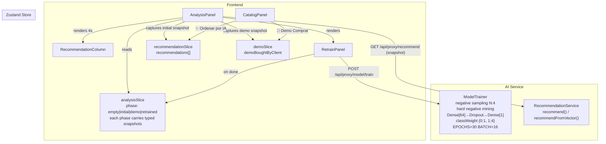

# Design — M11: AI Learning Showcase Panel

**Status**: Approved
**Date**: 2026-04-26
**Feature**: M11 — AI Learning Showcase
**Committee**: Prof. Dr. Engenharia de IA/Recomendações · Prof. Dr. Deep Learning · Arquiteto de Soluções IA · Principal Software Architect · Staff Engineering · QA Staff · Staff Product Engineer · Staff UI Designer

---

## Architecture Overview



---

## Code Reuse Analysis

| Existing artifact | Reused in M11 | How |
|---|---|---|
| `useRetrainJob` hook | ✓ | Captura evento `done` para acionar snapshot `retrained` no `analysisSlice` |
| `RetrainPanel` | ✓ | Sem modificação — `AnalysisPanel` adiciona lógica de snapshot em volta |
| `TrainingProgressBar` | ✓ | Sem modificação |
| `demoSlice` | ✓ | `AnalysisPanel` observa `demoBoughtByClient` para detectar momento de captura do snapshot `demo` |
| `recommendationSlice` | ✓ | Fonte do snapshot `initial` quando recomendações são carregadas pela primeira vez |
| `ShuffledColumn`, `RecommendedColumn` | ✗ (mantidos) | Usados no catálogo — não alterados para evitar regressão |
| `seededShuffle` (LCG em `lib/utils/shuffle.ts`) | ✓ (portado) | Lógica LCG portada para `ModelTrainer` como função pura para seed de negative sampling |

---

## Components

### Novos

| Componente | Localização | Responsabilidade |
|---|---|---|
| `RecommendationColumn` | `components/analysis/RecommendationColumn.tsx` | Presentational: renderiza lista de recomendações com header colorido, score badges, e estado empty/loading |
| `analysisSlice` | `store/analysisSlice.ts` | Zustand slice volátil com type discriminada de 4 fases; captura e invalida snapshots |
| `buildTrainingDataset` | `ai-service/src/services/training-utils.ts` | Função pura: recebe `clientOrderMap`, `productEmbeddingMap`, `products`, `seed` → retorna `{ inputVectors, labels }` com negative sampling + hard negative mining |

### Modificados

| Componente | Mudança |
|---|---|
| `AnalysisPanel` | Adiciona orquestração de snapshots: captura `initial` ao montar se `recommendations` disponíveis; captura `demo` quando `demoSlice` muda; captura `retrained` quando `useRetrainJob.status === 'done'`; layout `grid-cols-1 md:grid-cols-2 xl:grid-cols-4` com accordion para 3ª e 4ª coluna em md |
| `ModelTrainer` | Substitui loop de dataset construction por `buildTrainingDataset()`; arquitetura `Dense[64]→Dropout[0.2]→Dense[1]`; `classWeight: {0:1.0, 1:4.0}`; `EPOCHS=30`, `BATCH_SIZE=16` |
| `useAppStore` | Adiciona `analysisSlice`; encadeia reset de `analysisSlice` quando `clientSlice` muda de cliente |
| `RetrainPanel` | Botão desabilitado quando `analysisSlice.phase === 'empty'` (sem tooltip — UI já comunica pelo contexto) |

---

## Data Models

### `analysisSlice` — Type Discriminada

```typescript
type Snapshot = {
  recommendations: RecommendationResult[];
  capturedAt: string; // ISO string
}

type AnalysisState =
  | { phase: 'empty' }
  | { phase: 'initial'; clientId: string; initial: Snapshot }
  | { phase: 'demo';    clientId: string; initial: Snapshot; demo: Snapshot }
  | { phase: 'retrained'; clientId: string; initial: Snapshot; demo: Snapshot; retrained: Snapshot }

interface AnalysisSlice {
  analysis: AnalysisState;
  captureInitial: (clientId: string, recs: RecommendationResult[]) => void;
  captureDemo:    (clientId: string, recs: RecommendationResult[]) => void;
  captureRetrained: (clientId: string, recs: RecommendationResult[]) => void;
  resetAnalysis:  () => void;
}
```

### `buildTrainingDataset` — Interface

```typescript
interface TrainingDatasetOptions {
  negativeSamplingRatio: number;  // default: 4
  seed?: number;                  // default: Date.now()
}

function buildTrainingDataset(
  clients: ClientDTO[],
  clientOrderMap: Map<string, Set<string>>,
  productEmbeddingMap: Map<string, number[]>,
  products: ProductDTO[],
  options: TrainingDatasetOptions
): { inputVectors: number[][]; labels: number[] }
```

---

## Error Handling Strategy

| Cenário | Comportamento |
|---|---|
| `buildTrainingDataset` retorna 0 amostras | `ModelTrainer.train()` lança `Error('No training samples')` → job status = `failed` → RetrainPanel exibe erro |
| `captureInitial` chamado com `recs=[]` | Ignorado silenciosamente — `AnalysisPanel` só captura se `recs.length > 0` |
| Usuário troca de cliente durante treino | `analysisSlice` reseta para `empty`; `useRetrainJob` continua em background; `retrained` snapshot é descartado se `clientId` do job ≠ `clientId` atual |
| `classWeight` não suportado na versão do TF.js | Fallback: upsampling manual de positivos (duplicar cada amostra positiva 4×) — implementado como branch no `buildTrainingDataset` com flag `useClassWeight: boolean` |

---

## Tech Decisions

| Decisão | Rationale |
|---|---|
| Hard negative mining por categoria | Prof. IA/Rec (High): gradiente de categoria diluído com negativos da mesma categoria; mining garante separação inter-categoria |
| `Dense[64]→Dropout[0.2]→Dense[1]` | Prof. DL (High): overfitting severo com arquitetura atual (ratio params/amostras ~60:1); redução para ~39:1 com L2 regularization |
| `classWeight: {0:1.0, 1:4.0}` | Prof. DL (High): desbalanceamento residual 1:4 com negative sampling N=4; gradiente 4× nos positivos = sinal de compra amplificado |
| Seed derivado de `clientId` no negative sampling | Arquiteto IA (Medium): reproducibilidade da demo; QA (Medium): testes determinísticos |
| Type discriminada `AnalysisState` 4 fases | Arquiteto IA (High) + QA (High): impossibilita estados impossíveis em compile-time |
| `RecommendationColumn` presentational | Arquiteto Principal (Medium): SRP; testabilidade unitária |
| Layout `grid-cols-1 md:grid-cols-2 xl:grid-cols-4` com accordion | Staff PE (High): 4 colunas em tablets (~250px cada) ilegíveis |

---

## Interaction States

| Component | State | Trigger | Visual |
|-----------|-------|---------|--------|
| `RecommendationColumn` | empty | `recommendations === null` e `loading === false` | Ícone + texto de instrução de ação, fundo `gray-50`, border dashed |
| `RecommendationColumn` | loading | `loading === true` | 5 skeleton cards com `animate-pulse` |
| `RecommendationColumn` | populated | `recommendations.length > 0` | Lista de cards com nome, score badge, `capturedAt` timestamp |
| `RecommendationColumn` | error | — (erros propagados como `empty` com mensagem) | Mesmo que empty com texto de erro |
| `AnalysisPanel` coluna 3 (demo) | accordion-closed | `phase !== 'demo' && phase !== 'retrained'` e viewport < xl | Botão "▼ Ver Com Demo" na bottom da coluna 2 |
| `AnalysisPanel` coluna 3 (demo) | accordion-open | Click no botão expand | Coluna 3 expande abaixo da coluna 2 com transition height |
| `RetrainPanel` button | disabled | `analysis.phase === 'empty'` | `cursor-not-allowed bg-gray-200 text-gray-400` (padrão existente) |

---

## Animation Spec

| Animation | Property | Duration | Easing | Reduced-motion fallback |
|-----------|----------|----------|--------|------------------------|
| Snapshot `retrained` aparece | `opacity` 0→1 | 300ms | `ease-out` | Sem transição — aparece instantaneamente |
| Accordion coluna 3/4 expand | `max-height` + `opacity` | 250ms | `ease-out` | Sem animação — exibe diretamente |
| Score badge update em novo snapshot | `transform: scale(1.05)` → `scale(1)` | 200ms | `ease-in-out` | Sem animação |

Todas as animações wrapped em `motion-safe:transition-*` seguindo padrão AD-017 e AD-024.

---

## Accessibility Checklist

| Component | Keyboard nav | Focus management | ARIA | Mobile |
|-----------|-------------|-----------------|------|--------|
| `RecommendationColumn` | Não interativo (lista estática) | N/A | `role="list"` + `aria-label="Recomendações [título da coluna]"` | Cards com `min-h-[44px]`, texto legível em 1 coluna |
| Accordion coluna 3/4 | `Enter`/`Space` no botão expand; `Escape` fecha | Foco retorna ao botão após fechar | `aria-expanded` no botão; `aria-controls` aponta para o painel | Touch target 44×44px no botão |
| `RetrainPanel` button (disabled) | `Tab` alcança; `Enter` não dispara quando disabled | N/A | `aria-disabled="true"` já implementado | OK |
| Timestamp `capturedAt` | N/A | N/A | `<time datetime={isoString}>HH:MM</time>` | OK |

---

## Alternatives Discarded

| Node | Approach | Eliminated in | Reason |
|------|----------|---------------|--------|
| B | Estado local em AnalysisPanel + sem negative sampling | Phase 2 | 2 riscos High: estado inconsistente com demoSlice global + não resolve problema raiz de ML |
| A original | Negative sampling uniforme N=4 + weighted pooling simultâneos | Phase 4 | Prof. IA/Rec: uniform sampling não resolve gradiente de categoria; Prof. DL: acoplamento de duas mudanças ML dificulta debug |

---

## Committee Findings Applied

| Finding | Persona | How incorporated |
|---------|---------|-----------------|
| Hard negative mining por categoria | Prof. IA/Rec (High) | `buildTrainingDataset` garante ≥2 negativos de categoria diferente por positivo |
| Arquitetura reduzida `Dense[64]` + L2 | Prof. DL (High) | `buildModel()` atualizado; ADR-028 |
| `classWeight: {0:1, 1:4}` | Prof. DL (High) | `model.fit()` recebe `classWeight`; fallback upsampling manual se API indisponível |
| Type discriminada `AnalysisState` | Arquiteto IA (High) + QA (High) | `analysisSlice.ts` com 4 tipos; ADR-029 |
| Layout `md:grid-cols-2 xl:grid-cols-4` com accordion | Staff PE (High) | `AnalysisPanel` layout responsivo; colunas 3/4 em accordion em md |
| Seed determinístico no negative sampling | Arquiteto IA (Medium) + QA (Medium) | `buildTrainingDataset` aceita `seed` param; `train()` aceita `seed?: number` |
| `captureInitial` apenas quando `recs.length > 0` | Staff PE (Medium) | `AnalysisPanel` verifica antes de chamar `captureInitial` |
| `classWeight` TF.js fallback | Staff Engineering (Medium) | Flag `useClassWeight` + upsampling manual como fallback em `buildTrainingDataset` |
| `RecommendationColumn` presentational | Arquiteto Principal (Medium) | Props-only; `AnalysisPanel` orquestra fetches; ADR-030 |
| Paleta semântica gray/blue/emerald/violet | Staff UI Designer (Medium) | `colorScheme` prop em `RecommendationColumn` |
| Timestamp `capturedAt` | Staff UI Designer (Low) | `<time>` em cada coluna com `capturedAt` do snapshot |
| EPOCHS=30, BATCH_SIZE=16 | Prof. IA/Rec (Medium) | `ModelTrainer` constantes atualizadas; ADR-028 |
| Early stopping | Prof. DL (Medium) | Implementado como patience=5 em `buildTrainingDataset` via `onEpochEnd` callback |
