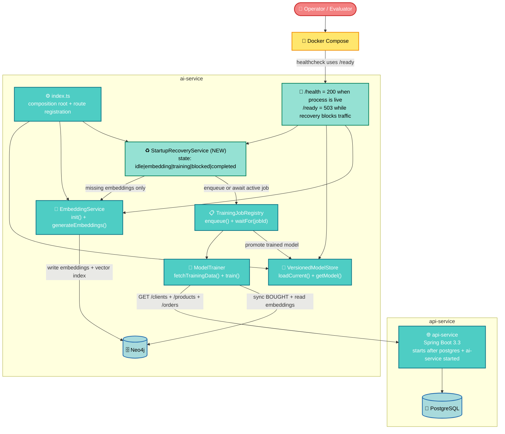

# Design — M12: Self-Healing Model Startup

**Status**: Approved
**Date**: 2026-04-27
**Feature**: M12 — Self-Healing Model Startup
**Spec**: [spec.md](spec.md)
**Committee**: Principal Software Architect · Staff Engineering · QA Staff
**ADRs**: [ADR-033](adr-033-self-healing-model-startup.md) · [ADR-034](adr-034-ready-probe-and-compose-startup-cycle.md)

---

## Architecture Overview

M12 adds a narrow startup orchestration layer to the `ai-service` so the process can boot normally, keep `/health` live, and recover a missing model in background. The recovery path is intentionally scoped to **model self-healing**, not seed orchestration: if the databases are empty because the seed never ran, the service logs a warning, keeps the process alive, and holds `/ready = 503` instead of pretending the system is usable.

To keep the startup path cycle-free, Docker Compose stops treating AI readiness as a prerequisite for `api-service` boot. The `api-service` already tolerates temporary AI unavailability through its existing circuit-breaker fallback, while the `ai-service` needs `api-service` alive to fetch training data for the recovery train. The result is: Fastify becomes live quickly, `/ready` stays blocked during recovery, and the existing async training infrastructure remains the single path for background model creation.



**Compose contract after M12:**

- `ai-service` healthcheck points to `/ready`, because readiness must represent usable recommendation state, not only process liveness.
- `/health` remains pure liveness and continues returning `200` during recovery.
- `api-service` no longer waits for `ai-service` to be healthy; it only waits for the container to be started, avoiding a startup cycle because `ModelTrainer` fetches training data from `api-service`.

---

## Code Reuse Analysis

| Existing artifact | Reused in M12 | How |
|---|---|---|
| `VersionedModelStore.loadCurrent()` | ✓ | Remains the single startup seam that decides whether recovery is needed |
| `VersionedModelStore.getModel()` | ✓ | Continues to define whether a usable neural model is present in memory |
| `EmbeddingService.generateEmbeddings()` | ✓ | Reused as the idempotent "missing embeddings only" recovery step |
| `TrainingJobRegistry.enqueue()` | ✓ | Preserves the existing async background training path instead of inventing a second one |
| `TrainingJobRegistry.getActiveJobId()` | ✓ | Lets startup recovery piggyback on a running job instead of enqueueing duplicates |
| `ModelTrainer.train()` | ✓ | Training implementation stays unchanged; recovery composes it through the registry |
| `Neo4jRepository.getProductsWithoutEmbedding()` | ✓ | Detects whether embedding generation is actually necessary without new schema flags |
| `api-service` recommendation fallback | ✓ | Existing circuit-breaker + fallback makes it safe to relax the compose health dependency on AI readiness |
| `buildApp` test factory | ✗ | Remains route-focused; startup recovery tests need a real bootstrap seam, not only plugin registration |

---

## Components

### New

| Component | Location | Responsibility |
|---|---|---|
| `StartupRecoveryService` | `ai-service/src/services/StartupRecoveryService.ts` | Orchestrates background recovery on boot: decide if recovery is needed, generate embeddings if missing, probe for training data, enqueue or await the training job, and expose whether readiness is currently blocked |
| `StartupRecoveryState` | `ai-service/src/services/StartupRecoveryService.ts` | Small internal state machine that distinguishes skipped, embedding, training, blocked, and completed recovery paths so `/ready` never flips to `200` too early |

### Modified

| Component | Change |
|---|---|
| `ai-service/src/index.ts` | Instantiates `StartupRecoveryService`, marks readiness blocked before `listen()`, triggers recovery after the server starts accepting traffic, and changes `/ready` to require `embeddingService.isReady`, `versionedModelStore.getModel() !== null`, and `!startupRecoveryService.isBlockingReadiness()` |
| `ai-service/src/services/TrainingJobRegistry.ts` | Gains a narrow `waitFor(jobId)` capability so startup recovery can await terminal job completion without polling loops or direct access to `ModelTrainer` internals |
| `ai-service/src/config/env.ts` | Adds `AUTO_HEAL_MODEL` as an opt-out boolean, default enabled, parsed safely from the environment |
| `docker-compose.yml` | Changes the `ai-service` healthcheck target from `/health` to `/ready`, increases `start_period` to `180s`, and relaxes the `api-service -> ai-service` dependency to `service_started` to break the boot cycle |
| `.env.example` | Documents `AUTO_HEAL_MODEL=true` and its intended use in unit and E2E tests |
| `ai-service` startup tests | Add a startup-level test seam for `/health` and `/ready`, while keeping route/plugin-only tests on the existing helper path |

---

## Data Models

### `StartupRecoveryState`

```typescript
type StartupRecoveryState =
  | { phase: 'idle'; reason: 'model-present' | 'disabled' }
  | { phase: 'scheduled' | 'embedding' | 'training'; jobId?: string }
  | {
      phase: 'blocked'
      reason:
        | 'no-training-data'
        | 'api-unavailable'
        | 'neo4j-unavailable'
        | 'training-failed'
      jobId?: string
    }
  | { phase: 'completed'; jobId: string; recoveredAt: string }
```

### Readiness Composition

```typescript
interface ReadyState {
  embeddingReady: boolean
  modelPresent: boolean
  recoveryBlocking: boolean
  ready: boolean
}

// Computed in /ready:
ready =
  embeddingService.isReady &&
  versionedModelStore.getModel() !== null &&
  !startupRecoveryService.isBlockingReadiness()
```

**Interpretation rules:**

1. `embeddingReady === false` means Fastify may be live, but the HF model warm-up is still incomplete.
2. `modelPresent === false` means the neural model is still unavailable in memory, even if embeddings already exist.
3. `recoveryBlocking === true` means startup recovery is still running or ended in a blocked state; `/ready` must stay `503`.

---

## Error Handling Strategy

| Scenario | Behavior |
|---|---|
| Current model loaded successfully from `current` symlink or most recent version | Recovery is skipped; `/ready` becomes `200` as soon as embedding warm-up finishes |
| No model, but embeddings already exist in Neo4j | Recovery skips generation and goes straight to the training job |
| No model and embeddings are missing | Recovery generates embeddings first, then enqueues background training |
| Seed never ran / training probe finds no clients or no orders | Recovery logs a warning, moves to `blocked/no-training-data`, keeps the process alive, and leaves `/ready = 503` |
| `AUTO_HEAL_MODEL=false` | Recovery is disabled entirely; no-model boot remains unready by design so tests stay deterministic |
| Another training job is already running (manual trigger or cron) | Recovery waits for the active job instead of enqueueing a duplicate, preserving single-flight training semantics |
| Neo4j unavailable during embedding phase | Recovery logs the failure, moves to `blocked/neo4j-unavailable`, and keeps `/health = 200` with `/ready = 503` |
| API service unavailable during training-data probe or training | Recovery logs the failure, moves to `blocked/api-unavailable`, and keeps the process alive without retry loops |
| Training job fails | Recovery records `blocked/training-failed`, does not crash Fastify, and does not retry automatically in the same process lifetime |

---

## Tech Decisions

| Decision | Rationale |
|---|---|
| Introduce a narrow `StartupRecoveryService` instead of inline recovery code in `index.ts` | Keeps the composition root readable and creates a unit-test seam without inventing a generic bootstrap framework |
| Reuse `TrainingJobRegistry` instead of calling `ModelTrainer.train()` directly | Preserves the existing async job path, progress tracking, and single-flight guarantee already used by admin-triggered and cron-triggered retraining |
| Add `waitFor(jobId)` to the registry | Startup recovery needs to know when the background job reaches a terminal state; this belongs in the registry, not in ad-hoc polling code |
| Make `/ready` the `ai-service` healthcheck target | Readiness must represent recommendation usability, not only process liveness |
| Relax `api-service` compose dependency from `service_healthy` to `service_started` | Avoids a boot cycle because startup recovery depends on `api-service` training data while `api-service` already has fallback behavior if AI is unavailable |
| Keep `/health` as pure liveness | Meets the explicit requirement that liveness remains `200` even while recovery is still running |
| Add `AUTO_HEAL_MODEL` as an opt-out flag with default enabled | Production and local-dev paths self-heal automatically; tests can disable recovery deterministically with `false` |
| Do not execute the seed automatically in M12 | M12 repairs a missing-model state; coupling runtime startup to the one-shot seed script would expand the milestone into infrastructure orchestration |
| Use a single recovery attempt per process lifetime | Prevents tight retry loops and keeps failure handling explicit and observable |
| Extend only `start_period` to `180s`, retaining interval/timeout/retries values | Matches the milestone requirement while giving the readiness probe enough grace time for a cold auto-heal path |

---

## Alternatives Discarded

| Node | Approach | Eliminated in | Reason |
|------|----------|---------------|--------|
| A | Inline `autoHealModel()` in `index.ts` with module-scoped booleans and manual polling of job status | Phase 3 | Lowest code churn, but poor testability, higher bootstrap coupling, and duplicates lifecycle logic beside `TrainingJobRegistry` |
| C | Compose-side `seed-runner` / init-style startup orchestration that seeds data and trains the model before the stack is considered healthy | Phase 2 | Solves true empty-volume boot, but expands M12 from model self-healing into provisioning orchestration and couples runtime startup to a one-shot seed path |

---

## Committee Findings Applied

| Finding | Persona | How incorporated |
|---------|---------|-----------------|
| The compose graph cannot keep `api-service` waiting on AI health if AI recovery depends on API training data | Principal Software Architect | `docker-compose.yml` now uses `/ready` for `ai-service` health while relaxing the `api-service -> ai-service` dependency to `service_started`; ADR-034 |
| Startup recovery must reuse the existing training single-flight path to avoid duplicate jobs and TF.js contention | Staff Engineering | Recovery composes `TrainingJobRegistry.enqueue()` / `waitFor(jobId)` instead of calling `ModelTrainer` directly; ADR-033 |
| `/ready` must never return `200` when seed data is missing or recovery failed | QA Staff | `StartupRecoveryState` gets an explicit `blocked` branch that holds readiness at `503` for no-data and failure paths |
| Bootstrap orchestration needs an isolated unit-test seam, not only route-level tests | Principal Software Architect + QA Staff | Recovery logic is moved into a dedicated service component, and startup-level tests are included in the design |
| Automatic seeding is a separate concern from missing-model recovery and should not be hidden inside the runtime path | Staff Engineering | The design keeps the no-data path explicit: log warning, stay alive, and keep `/ready = 503` instead of embedding the seed script into service startup |
