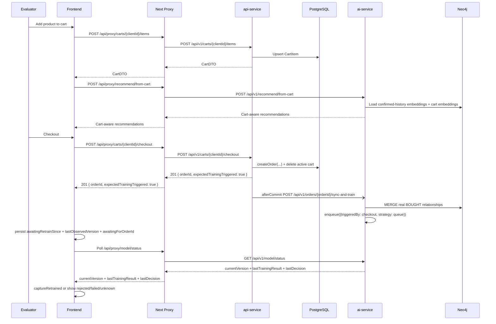

# M13 — Cart, Checkout & Async Retrain Capture — Design

**Spec**: `.specs/features/m13-cart-checkout-async-retrain/spec.md`  
**Status**: Approved  
**Related ADRs**:

- `adr-043-cart-order-ground-truth-after-commit-sync.md`
- `adr-044-model-status-panel-checkout-anchor.md`
- `adr-045-current-version-polling-for-post-checkout-capture.md`
- `adr-046-responsive-cart-summary-bar.md`

**Testing**:

- `.specs/codebase/api-service/TESTING.md`
- `.specs/codebase/ai-service/TESTING.md`
- `.specs/codebase/frontend/TESTING.md`

---

## Architecture Overview

M13 keeps `Order` as the only training ground truth and composes the current service boundaries instead of introducing new infrastructure:

1. `api-service` owns cart persistence in PostgreSQL and lazily creates one active cart per client.
2. `CartApplicationService.checkout()` builds a `CreateOrderRequest` from the active cart, delegates order validation/persistence to `OrderApplicationService`, and deletes the cart in the same transaction.
3. The ai-service notification happens only in `afterCommit`, so retraining never races the just-created order.
4. `ai-service` receives an internal checkout sync request, `MERGE`s confirmed `BOUGHT` edges, queues retraining FIFO for checkout triggers, and records governance metadata (`currentVersion`, `lastTrainingResult`, `lastTrainingTriggeredBy`, `lastOrderId`, `lastDecision`).
5. `RecommendationService` and related Neo4j queries stop treating legacy `is_demo: true` edges as confirmed purchase history.
6. The frontend persists `awaitingRetrainSince` / `lastObservedVersion` / `awaitingForOrderId`, polls `/model/status` by `currentVersion`, and promotes `ModelStatusPanel` to the primary async status anchor.



---

## Code Reuse Analysis

### Existing Components to Leverage

| Component | Location | How to Use |
|---|---|---|
| `Order`, `OrderItem`, `OrderApplicationService.createOrder()` | `api-service/src/main/java/com/smartmarketplace/entity/`, `api-service/src/main/java/com/smartmarketplace/service/OrderApplicationService.java` | Compose checkout on top of the existing order validation/persistence flow instead of duplicating duplicate-product and country-availability rules. |
| `BusinessRuleException`, `ResourceNotFoundException`, `GlobalExceptionHandler` | `api-service/src/main/java/com/smartmarketplace/exception/` | Keep cart validation and empty-cart errors consistent with existing API errors. |
| `AiSyncClient` | `api-service/src/main/java/com/smartmarketplace/service/AiSyncClient.java` | Reuse the fire-and-forget transport style for checkout sync, but send the new payload only in `afterCommit` and serialize with Jackson/ObjectMapper instead of manual JSON. |
| `RecommendationService.recommendFromVector`, `meanPooling` | `ai-service/src/services/RecommendationService.ts` | Implement `recommendFromCart` by reusing the existing hybrid scoring path once the cart profile vector is assembled. |
| `Neo4jRepository.getPurchasedProductIds`, `getClientPurchasedEmbeddings`, `syncBoughtRelationships` | `ai-service/src/repositories/Neo4jRepository.ts` | Reuse confirmed-history and BOUGHT sync queries, but update purchase-profile reads to ignore legacy `is_demo: true` edges. |
| `TrainingJobRegistry.enqueue`, `waitFor`, `getActiveJobId` | `ai-service/src/services/TrainingJobRegistry.ts` | Reuse the job registry as the single async train entrypoint, but extend it from conflict-only single-flight to strategy-aware queueing for checkout triggers. |
| `VersionedModelStore.saveVersioned`, `ModelStore.getEnrichedStatus` | `ai-service/src/services/VersionedModelStore.ts`, `ai-service/src/services/ModelStore.ts` | Centralize promotion/rejection metadata and expose `currentVersion` without inventing a second version ledger. |
| `RetrainPanel`, `TrainingProgressBar`, `ModelMetricsComparison` | `frontend/components/retrain/` | Rename/evolve into `ModelStatusPanel`; keep existing progress and metric visuals. |
| `useRetrainJob`, `getModelStatus`, `postModelTrain` | `frontend/lib/hooks/useRetrainJob.ts`, `frontend/lib/adapters/train.ts` | Reuse polling/error/backoff patterns, but switch the source of truth from `jobId` to `/model/status.currentVersion` and keep the manual trigger only in advanced mode. |
| `analysisSlice`, `useAppStore` persist config | `frontend/store/analysisSlice.ts`, `frontend/store/index.ts` | Extend the slice with persisted awaiting fields and keep hydration explicit via the existing `skipHydration` pattern. |
| `Tabs`, `TabsList`, `TabsTrigger`, `TabsContent` | `frontend/components/ui/tabs.tsx` | Reuse the already-installed Radix tabs primitive so the main navigation and any mobile subviews gain real tab semantics, roving focus, and keyboard navigation instead of plain buttons. |
| `RAGDrawer`, `Dialog`, `ProductDetailModal` | `frontend/components/chat/RAGDrawer.tsx`, `frontend/components/ui/dialog.tsx`, `frontend/components/catalog/ProductDetailModal.tsx` | Reuse current overlay/focus-management patterns only where modal behavior is truly needed; prefer a lighter disclosure pattern for cart item review. |
| `ProductCard`, `RecommendationColumn` | `frontend/components/catalog/ProductCard.tsx`, `frontend/components/analysis/RecommendationColumn.tsx` | Reuse existing badge/button/touch-target patterns for cart actions and analysis snapshots, preserving the project visual language. |

### Integration Points

| System | Integration Method |
|---|---|
| Frontend -> api-service cart | Next.js proxy routes under `frontend/app/api/proxy/carts/...` call `api-service /api/v1/carts/...`. |
| Frontend -> ai-service cart recommendations | Next.js proxy `frontend/app/api/proxy/recommend/from-cart/route.ts` calls `ai-service /api/v1/recommend/from-cart`. |
| api-service -> ai-service checkout sync | `AiSyncClient` sends a fire-and-forget checkout payload to a new ai-service route only after the checkout transaction commits. |
| ai-service -> api-service training data | Existing `ModelTrainer.fetchTrainingData` continues to fetch confirmed orders and clients from `api-service`; demo pairs are no longer merged and failed candidates never overwrite the promoted model state. |
| Frontend -> ai-service model status | `useModelStatus` polls `GET /api/proxy/model/status` and interprets `currentVersion`, `lastTrainingResult`, `lastTrainingTriggeredBy`, `lastOrderId`, and `lastDecision`. |

---

## Design Gaps Confirmed By Code Review

| Gap | Current evidence | M13 design response |
|---|---|---|
| `TrainingJobRegistry` is not a real queue today. | `enqueue()` only checks `modelTrainer.isTraining` and uses `setImmediate`; concurrent checkout triggers can conflict or fail instead of queuing. | Introduce strategy-aware queueing: checkout uses FIFO `queue`, manual admin retains `reject/409` semantics. |
| Promotion logic is currently applied after `ModelTrainer` already swaps the model. | `ModelTrainer.train()` calls `modelStore.setModel(...)` before `VersionedModelStore.saveVersioned(...)`. | Move candidate promotion entirely into `VersionedModelStore`; `ModelTrainer` returns the candidate model/result but does not promote it. |
| Recommendation history still reads legacy demo edges as real purchases. | `getPurchasedProductIds()` and `getClientPurchasedEmbeddings()` match every `:BOUGHT` edge, including `is_demo: true`. | Filter purchase-profile queries with `coalesce(r.is_demo, false) = false` so legacy demo edges stop contaminating baseline and cart-aware recommendations. |
| Frontend retrain waiting state does not survive reload. | `useAppStore` persists only `selectedClient`; `useRetrainJob` keeps all runtime state in React memory. | Persist `awaitingRetrainSince`, `lastObservedVersion`, and `awaitingForOrderId` in Zustand and rehydrate before polling resumes. |
| `AiSyncClient` payloads are hand-built JSON strings. | `buildPayload()` uses `String.format()` plus manual escaping. | Serialize checkout payloads with Jackson/ObjectMapper to avoid malformed JSON and future field-fragility. |

---

## Components

### Cart Persistence

- **Purpose**: Store the evaluator's current intent separately from confirmed training events.
- **Location**:
  - `api-service/src/main/java/com/smartmarketplace/entity/Cart.java`
  - `api-service/src/main/java/com/smartmarketplace/entity/CartItem.java`
  - `api-service/src/main/java/com/smartmarketplace/repository/CartRepository.java`
  - `api-service/src/main/java/com/smartmarketplace/repository/CartItemRepository.java`
  - `api-service/src/main/java/com/smartmarketplace/dto/CartDTO.java`
  - `api-service/src/main/java/com/smartmarketplace/dto/AddCartItemRequest.java`
- **Interfaces**:
  - `CartDTO getActiveCart(UUID clientId)`
  - `CartDTO addItem(UUID clientId, AddCartItemRequest request)`
  - `CartDTO removeItem(UUID clientId, UUID productId)`
  - `CartDTO clearCart(UUID clientId)`
- **Dependencies**: `ClientRepository`, `ProductRepository`, cart repositories.
- **Reuses**: JPA entity/repository/service/controller layering from `OrderApplicationService` and `ProductApplicationService`.
- **Notes**: Keep one active cart per client and one row per `(cart, product)`. Delete the cart row when the last item is removed or checkout succeeds, which preserves the spec contract `cartId: null` without introducing a `CartStatus` enum that the current codebase does not otherwise need.

### Cart Checkout

- **Purpose**: Convert the active cart into a real `Order`, clear the cart, and trigger async learning only after the database commit succeeds.
- **Location**:
  - `api-service/src/main/java/com/smartmarketplace/service/CartApplicationService.java`
  - `api-service/src/main/java/com/smartmarketplace/controller/CartController.java`
  - `api-service/src/main/java/com/smartmarketplace/dto/CheckoutResponse.java`
  - `api-service/src/main/java/com/smartmarketplace/dto/CheckoutSyncRequest.java`
  - `api-service/src/main/java/com/smartmarketplace/service/AiSyncClient.java`
- **Interfaces**:
  - `CheckoutResponse checkout(UUID clientId)`
  - `void AiSyncClient.notifyCheckoutCompleted(CheckoutSyncRequest payload)`
- **Dependencies**: `OrderApplicationService`, `CartRepository`, `AiSyncClient`, Spring transaction synchronization.
- **Reuses**: Existing `CreateOrderRequest` / `OrderDTO` flow and ADR-015 fire-and-forget sync policy.
- **Notes**: `CartApplicationService` must compose `OrderApplicationService.createOrder()` instead of reimplementing duplicate-product and country-availability rules. The ai-service call is registered in `afterCommit`, so `ModelTrainer.fetchTrainingData()` can always observe the new order.

### Checkout Sync And Retrain Route

- **Purpose**: Receive a confirmed order from `api-service`, sync real `BOUGHT` edges, and enqueue retraining without blocking checkout.
- **Location**:
  - `ai-service/src/routes/orderSyncRoutes.ts` (new)
  - `ai-service/src/services/OrderSyncService.ts` (new, if route logic would otherwise grow)
  - `ai-service/src/index.ts`
- **Interfaces**:
  - `POST /api/v1/orders/:orderId/sync-and-train`
  - Request: `{ clientId: string, productIds: string[] }`
  - Response: `{ synced: { created: number, existed: number, skipped: number }, jobId: string, status: 'queued' | 'running' }`
- **Dependencies**: `Neo4jRepository.syncBoughtRelationships`, `TrainingJobRegistry.enqueue({ triggeredBy: 'checkout', orderId, strategy: 'queue' })`.
- **Reuses**: Fastify plugin registration with injected dependencies and the existing route-level known-error pattern.
- **Notes**: The route is internal-to-stack traffic and must not inherit admin/manual semantics. `syncBoughtRelationships()` remains graph-idempotent via `MERGE`; the registry decides whether the retrain is queued or starts immediately.

### Cart-Aware Recommendation

- **Purpose**: Generate a recommendation snapshot from confirmed order history plus unconfirmed cart items.
- **Location**:
  - `ai-service/src/services/RecommendationService.ts`
  - `ai-service/src/routes/recommend.ts`
  - `ai-service/src/repositories/Neo4jRepository.ts`
- **Interfaces**:
  - `recommendFromCart(clientId: string, productIds: string[], limit?: number): Promise<RecommendationResponse>`
  - `POST /api/v1/recommend/from-cart`
- **Dependencies**: `Neo4jRepository.getClientPurchasedEmbeddings`, `Neo4jRepository.getPurchasedProductIds`, batch cart-embedding lookup, `recommendFromVector`.
- **Reuses**: `meanPooling`, `recommendFromVector`, route error mapping in `recommend.ts`.
- **Notes**: Build the cart profile with `confirmedHistoryEmbeddings + validCartEmbeddings`, silently ignore cart products without embeddings, and exclude `confirmedPurchasedIds ∪ cartProductIds` from the candidate set so `Com Carrinho` recommends complementary items instead of echoing the basket.

### Confirmed-History Recommendation And Training

- **Purpose**: Remove demo signals from both training/evaluation and purchase-profile recommendation reads so legacy `is_demo` edges stop contaminating the showcase.
- **Location**:
  - `ai-service/src/services/ModelTrainer.ts`
  - `ai-service/src/services/RecommendationService.ts`
  - `ai-service/src/repositories/Neo4jRepository.ts`
  - `ai-service/src/tests/model.test.ts`
  - `ai-service/src/services/training-utils.test.ts`
- **Interfaces**:
  - `ModelTrainer.train()` no longer calls `getAllDemoBoughtPairs()`.
  - `computePrecisionAtK()` continues using only API orders.
  - `Neo4jRepository.getPurchasedProductIds()` filters `coalesce(r.is_demo, false) = false`.
  - `Neo4jRepository.getClientPurchasedEmbeddings()` filters `coalesce(r.is_demo, false) = false`.
- **Dependencies**: Existing API training-data fetch path plus confirmed-history graph queries.
- **Reuses**: `buildTrainingDataset`; no new training data source is introduced.

### Training Queue And Model Governance

- **Purpose**: Make queued/running/manual/checkout retrains observable without coupling the checkout contract to job IDs, while preserving the currently promoted model on rejection or failure.
- **Location**:
  - `ai-service/src/types/index.ts`
  - `ai-service/src/services/ModelStore.ts`
  - `ai-service/src/services/VersionedModelStore.ts`
  - `ai-service/src/services/TrainingJobRegistry.ts`
  - `ai-service/src/routes/model.ts`
- **Interfaces**:
  - `TrainingTrigger = 'checkout' | 'manual'`
  - `QueueStrategy = 'queue' | 'reject'`
  - `TrainingResultStatus = 'promoted' | 'rejected' | 'failed'`
  - `enqueue({ triggeredBy, orderId, strategy })`
  - `lastDecision: { accepted, reason, currentPrecisionAt5, candidatePrecisionAt5, tolerance }`
- **Dependencies**: `MODEL_PROMOTION_TOLERANCE`, current promoted-model snapshot before candidate evaluation, and the existing versioned symlink store.
- **Reuses**: Existing `TrainingJob`, `TrainingResult`, `ModelHistoryEntry`, and versioned filesystem layout.
- **Notes**:
  - Checkout-triggered jobs use `strategy: 'queue'`; the existing manual admin route keeps `strategy: 'reject'` so the current `409 + activeJobId` UX remains intact.
  - `ModelTrainer` returns the candidate model/result but does not call `setModel()` or `reset()` on the promoted model path.
  - `VersionedModelStore` becomes the single owner of candidate acceptance/rejection/failure metadata and derives `currentVersion` from the accepted history filename (or stripped filename token), which the frontend compares by inequality only.
  - Failed candidates update `lastTrainingResult = 'failed'` without discarding the promoted model that is already serving recommendations.

### Responsive Cart Summary Bar

- **Purpose**: Keep the cart visible and actionable during catalog browsing without moving checkout controls into the global header or forcing a modal drawer for routine review.
- **Location**:
  - `frontend/components/cart/CartSummaryBar.tsx`
  - `frontend/components/cart/CartItemChip.tsx`
  - `frontend/components/cart/MobileCartReviewSheet.tsx`
  - `frontend/lib/adapters/cart.ts`
- **Interfaces**:
  - `CartSummaryBar({ cart, checkoutStatus, onCheckout, onClear, onToggleReview })`
  - `MobileCartReviewSheet({ open, cart, onClose, onRemoveItem, onCheckout })`
- **Dependencies**: `cartSlice`, responsive Tailwind breakpoints, `motion-safe` / `motion-reduce`, selected client context.
- **Reuses**: Existing button/badge visual language from `ProductCard`, touch-target sizing from `RecommendationColumn`, and disclosure/focus patterns already used by `ClientSelectorDropdown`.
- **Notes**:
  - On `md+`, render the bar below catalog filters as a sticky in-flow summary with inline item chips, total, `Esvaziar Carrinho`, and primary `Efetivar Compra`.
  - On `<md`, render a sticky bottom action bar with count + total + checkout CTA and a non-modal disclosure sheet above it for item review.
  - The mobile review sheet is intentionally non-modal so item review stays lightweight and does not require a full dialog/focus trap for every cart interaction.

### Frontend Cart And Model Status

- **Purpose**: Show `Com Carrinho`, drive checkout, and capture `Pos-Efetivar` asynchronously.
- **Location**:
  - `frontend/components/layout/TabNav.tsx`
  - `frontend/components/ui/tabs.tsx`
  - `frontend/components/cart/CartSummaryBar.tsx`
  - `frontend/store/cartSlice.ts` (new canonical slice) plus temporary compatibility selectors where needed
  - `frontend/store/analysisSlice.ts`
  - `frontend/components/catalog/CatalogPanel.tsx`
  - `frontend/components/retrain/ModelStatusPanel.tsx`
  - `frontend/lib/hooks/useModelStatus.ts`
  - `frontend/lib/adapters/cart.ts`
  - `frontend/lib/adapters/train.ts`
- **Interfaces**:
  - `startAwaitingRetrain(orderId, currentVersion)`
  - `clearAwaitingRetrain()`
  - `captureRetrained(clientId, recs)`
  - `useModelStatus({ clientId, fetchRecs })`
- **Dependencies**: Next proxy routes, persisted Zustand partialize, always-mounted `AnalysisPanel`.
- **Reuses**: Existing `RetrainPanel` visual structure, `useRetrainJob` polling/error-backoff patterns, `TrainingProgressBar`, `ModelMetricsComparison`, and ADR-023 always-mounted behavior.
- **Notes**:
  - `ModelStatusPanel` is the canonical component name in M13; the advanced/manual button is nested under a collapsible demo-only section.
  - The persisted awaiting fields stay small and flat so they can be added to `partialize` without persisting the entire comparison snapshot state.
  - `TabNav` should migrate to the existing Radix `Tabs` primitive (or match its semantics exactly) so the real DOM exposes `tablist` / `tab` / `tabpanel`, which aligns keyboard interaction with current E2E expectations.
  - Decorative emoji in tab labels, empty states, and buttons should be wrapped in `aria-hidden="true"` spans when retained visually.

---

## Interaction States

| Component | State | Trigger | Visual |
|-----------|-------|---------|--------|
| `ProductCard` cart action | `idle` | Selected client + product not in cart | Secondary action button `Adicionar ao Carrinho` with normal emphasis. |
| `ProductCard` cart action | `adding` | POST `/carts/{clientId}/items` in flight | Button disabled, `aria-busy=true`, spinner or text `Adicionando...`. |
| `ProductCard` cart action | `in_cart` | Product already present in cart | Success-tinted badge `No carrinho` + action changes to `Remover` or quantity stepper. |
| `ProductCard` cart action | `removing` | DELETE `/carts/{clientId}/items/{productId}` in flight | Button disabled, muted styling, optimistic badge retained until response. |
| `ProductCard` cart action | `disabled_no_client` | No selected client | Button disabled with tooltip/copy `Selecione um cliente`. |
| `CartSummaryBar` | `empty` | Cart has `itemCount = 0` | Subtle placeholder bar with empty copy and disabled checkout CTA. |
| `CartSummaryBar` | `ready` | Cart has 1+ items and no request pending | Sticky summary with item count, total, inline item chips/review affordance, clear, and primary checkout CTA. |
| `CartSummaryBar` | `checkout_pending` | POST `/checkout` in flight | Primary CTA disabled with loading text; destructive actions disabled to avoid conflicting mutations. |
| `CartSummaryBar` | `checkout_error` | Checkout request fails | Inline error banner under the bar with retryable primary CTA. |
| `MobileCartReviewSheet` | `closed` | Default or explicit close | Only bottom summary bar visible. |
| `MobileCartReviewSheet` | `open` | `Ver itens` disclosure activated | Bottom-anchored sheet above CTA bar with item rows, remove actions, and close affordance. |
| `ModelStatusPanel` | `idle` | No pending retrain and no recent decision | Neutral card with current model metrics + copy `Aguardando próximo pedido para aprender`. |
| `ModelStatusPanel` | `training` | Checkout/manual trigger started and awaiting version change | Progress bar, order context, passive guidance that `Pós-Efetivar` is being prepared. |
| `ModelStatusPanel` | `promoted` | `currentVersion` changes | Positive card, metric delta, button `Ver recomendações atualizadas` targeting the last column. |
| `ModelStatusPanel` | `rejected` | `lastTrainingResult = rejected` without version change | Amber card, explicit reason, reassurance that the current model was preserved. |
| `ModelStatusPanel` | `failed` | `lastTrainingResult = failed` | Red card, recoverable copy, advanced/manual retry affordance when applicable. |
| `ModelStatusPanel` | `unknown` | 90s timeout without terminal result | Gray informational card with `Recarregar status` and explanation of the stale state. |
| `ModelStatusPanel` advanced area | `collapsed` | Default after load | Manual/demo controls hidden behind disclosure. |
| `ModelStatusPanel` advanced area | `expanded` | User activates `Avançado / Modo demo` | Manual retrain button and explanatory copy visible in a bordered subpanel. |
| `AnalysisPanel` | `empty` | No selected client or no initial snapshot | Columns show placeholders and instructional copy. |
| `AnalysisPanel` | `initial_loading` | Initial recommendations requested | `Sem IA`/`Com IA` skeletons visible. |
| `AnalysisPanel` | `cart_loading` | Cart-aware recommendations refreshing | `Com Carrinho` column shows localized loading state only. |
| `AnalysisPanel` | `awaiting_post_checkout` | Checkout succeeded and polling active | `Pós-Efetivar` keeps placeholder while `ModelStatusPanel` communicates training progress. |
| `AnalysisPanel` | `retrained_ready` | `captureRetrained()` completes | `Pós-Efetivar` column fades in with captured timestamp and refreshed ranking. |

---

## Animation Spec

| Animation | Property | Duration | Easing | Reduced-motion fallback |
|-----------|----------|----------|--------|------------------------|
| `CartSummaryBar` enter/update | `transform`, `opacity` | `200ms` | `ease-out` | No slide; show instantly with no transition. |
| Desktop cart item chip reorder/add/remove | `transform`, `opacity` | `200ms` | `ease-in-out` | No animated movement; chips update in place. |
| Mobile cart review sheet open/close | `transform`, `opacity` | `250ms` | `ease-out` on open / `ease-in` on close | Sheet appears/disappears instantly. |
| Checkout CTA busy feedback | `opacity` on label + spinner rotation | `150ms` | `linear` spinner / `ease-out` label | No opacity transition; static loading label only. |
| `ModelStatusPanel` state swap (`idle` -> `training` -> terminal) | `opacity`, `transform` | `200ms` | `ease-out` | Card content swaps without transition. |
| `ModelMetricsComparison` promoted/rejected delta reveal | `opacity` | `200ms` | `ease-out` | Delta block appears instantly. |
| Progress bar fill | `transform: scaleX()` | `300ms` | `ease-out` | Width updates without animated interpolation. |
| Scroll to `Pós-Efetivar` after promote | `scroll-behavior` | Browser-native smooth scroll | Browser default | Instant jump/focus target when reduced motion is preferred. |

All new motion should follow the current project pattern of `motion-safe:*` for animation/transition opt-in and `motion-reduce:*` to explicitly disable non-essential motion where an existing utility would otherwise still animate.

---

## Accessibility Checklist

| Component | Keyboard nav | Focus management | ARIA | Mobile |
|-----------|-------------|-----------------|------|--------|
| `TabNav` | Left/Right arrow roving, Home/End optional, Enter/Space activates in manual mode | Focus stays on active tab trigger; hidden panels are not focusable | Real `tablist` / `tab` / `tabpanel` semantics via Radix `Tabs` or equivalent | Touch targets stay `>=44px`; labels remain readable when icons collapse. |
| `ProductCard` cart action | Tab reaches card action; Enter/Space triggers add/remove | Card click and nested button interactions remain separated; action button retains focus after mutation | `aria-busy` during requests, `disabled` for unavailable actions, decorative emoji hidden | Full-width button with `min-h-[44px]`; no hover-only affordances. |
| `CartSummaryBar` | Tab order: review -> clear -> checkout | After add/remove, focus stays on the triggering control; after checkout success, focus moves to `ModelStatusPanel` heading or status action | `aria-live="polite"` for item count/total updates; checkout error tied via `aria-describedby` | Sticky bottom CTA remains reachable with thumb, safe-area padding respected. |
| `MobileCartReviewSheet` | Trigger toggles with Enter/Space; Escape closes; tab sequence remains inside visible sheet controls only | Opening keeps focus on the trigger by default; closing returns to the same trigger | Disclosure button uses `aria-expanded` + `aria-controls`; sheet labeled with heading and item count | Sheet height capped to avoid obscuring the checkout bar; rows stay touch-friendly. |
| `ModelStatusPanel` | `Avançado / Modo demo` disclosure operable by keyboard; terminal CTA buttons focusable in order | On promote, optional CTA receives programmatic focus only if user action initiated checkout from keyboard; otherwise no forced focus jump | `aria-live="polite"` for status copy, progress bar label retained, disclosure uses `aria-expanded` | Status card stacks cleanly in one column; copy wraps without pushing CTA below the fold. |
| `AnalysisPanel` columns | Main controls remain tabbable independent of hidden loading columns | `Pós-Efetivar` target has stable id for scroll/focus after promotion | Column headers label lists; loading states expose descriptive `aria-label`s | One-column stack on mobile preserves chronology: `Sem IA` -> `Com IA` -> `Com Carrinho` -> `Pós-Efetivar`. |

---

## Data Models

### API Service

```java
class Cart {
    UUID id;
    Client client;
    List<CartItem> items;
    Instant createdAt;
    Instant updatedAt;
}

class CartItem {
    UUID id;
    Cart cart;
    Product product;
    int quantity;
    Instant createdAt;
}

record CartDTO(UUID cartId, UUID clientId, List<CartItemDTO> items, int itemCount) {}
record AddCartItemRequest(UUID productId, int quantity) {}
record CheckoutResponse(UUID orderId, boolean expectedTrainingTriggered) {}
record CheckoutSyncRequest(UUID orderId, UUID clientId, List<UUID> productIds) {}
```

`Cart` should enforce one active row per client and `CartItem` should enforce one row per `(cart, product)`. Deleting the cart row when it becomes empty keeps the public contract `cartId: null` simple and avoids introducing lifecycle enums that the rest of the Java service does not currently need.

### AI Service

```typescript
type TrainingTrigger = 'checkout' | 'manual'
type QueueStrategy = 'queue' | 'reject'
type TrainingResultStatus = 'promoted' | 'rejected' | 'failed'

interface LastDecision {
  accepted: boolean
  reason: string
  currentPrecisionAt5: number | null
  candidatePrecisionAt5: number
  tolerance: number
}

interface ModelStatusResponse {
  currentVersion: string | null
  lastTrainingResult: TrainingResultStatus | null
  lastTrainingTriggeredBy: TrainingTrigger | null
  lastOrderId: string | null
  lastDecision?: LastDecision
}

interface TrainingJob {
  jobId: string
  status: 'queued' | 'running' | 'done' | 'failed'
  triggeredBy: TrainingTrigger
  orderId?: string
}
```

`currentVersion` should reuse the accepted `VersionedModelStore` filename/token instead of inventing a second `vN` counter. The frontend only needs a stable string that changes when the promoted model changes.

### Frontend Store

```typescript
interface AnalysisAwaitingState {
  awaitingRetrainSince: number | null
  lastObservedVersion: string | null
  awaitingForOrderId: string | null
}
```

These fields must be included in Zustand `partialize` so reload can resume polling. They stay separate from the larger comparison snapshots, which remain ephemeral UI state.

---

## Error Handling Strategy

| Error Scenario | Handling | User Impact |
|---|---|---|
| Add item references missing client/product | `ResourceNotFoundException` in `api-service` | Existing 404 error response shape. |
| Checkout with empty cart | New `CartEmptyException` mapped explicitly to `422 Unprocessable Entity` in `GlobalExceptionHandler`. | Frontend keeps the cart open and shows an actionable message without changing model state. |
| ai-service checkout sync fails after commit | `AiSyncClient` logs warning and does not rollback `Order`; checkout response still returns `201`. | Order is preserved; `ModelStatusPanel` may end in `failed` or `unknown` if no new status arrives. |
| Checkout arrives while another checkout-triggered retrain is active | `TrainingJobRegistry` enqueues the new checkout job instead of rejecting it. | UI still enters waiting mode; promotion is observed by `currentVersion` rather than by a specific `jobId`. |
| Manual retrain is requested while registry is busy | Manual path keeps the existing `409 + activeJobId` behavior. | Advanced/demo button resumes the in-flight manual status instead of stacking jobs. |
| `recommendFromCart` receives products without embeddings | Ignore missing cart embeddings if at least one confirmed-history/cart vector remains. | Recommendations still return when possible instead of hard-failing. |
| Candidate model is rejected or fails | `VersionedModelStore` keeps the promoted model and records `lastDecision` / `lastTrainingResult`; it must not reset the promoted model metadata. | `ModelStatusPanel` shows explicit `rejected` or `failed` state while recommendations keep using the current model. |
| Retrain status timeout | `useModelStatus` stops polling after 90s. | `ModelStatusPanel` shows `unknown` with a manual refresh action. |

---

## Tech Decisions

| Decision | Choice | Rationale |
|---|---|---|
| Retrain frequency | Every successful non-empty checkout triggers retrain. | Locked in `spec.md`; demo dataset is small and actions are deliberate. |
| Cart lifecycle | One active cart row per client; delete it when empty or after checkout. | Meets `cartId: null` contract without a new lifecycle enum. |
| Checkout reuse | `CartApplicationService` composes `OrderApplicationService.createOrder()`. | Reuses existing validation and persistence rules instead of cloning them into a second order path. |
| AI sync timing | Notify `ai-service` only in `afterCommit`. | Prevents retraining from racing a not-yet-committed order. |
| Checkout retrain response | `api-service` returns `{ orderId, expectedTrainingTriggered: true }`, not `jobId`. | Keeps checkout API decoupled from AI job queue internals (ADR-045). |
| Checkout queue semantics | Checkout uses FIFO queueing; manual admin retrain keeps busy-conflict semantics. | Satisfies CART-14 without regressing the existing advanced/manual UX. |
| Cart recommendation source | `ai-service` computes the cart profile in memory from confirmed-history Neo4j embeddings plus cart embeddings. | Avoids new embedding generation on add-to-cart and reuses `recommendFromVector`. |
| Cart CTA placement | `CartSummaryBar` is sticky in-flow on `md+` and sticky bottom on `<md`, with a non-modal review sheet for mobile item inspection. | Keeps checkout visible during browsing without overloading the global header or introducing modal overhead for routine cart review. |
| Tab semantics | Main navigation and any mobile analysis subviews use Radix `Tabs` (or equivalent semantics) instead of plain buttons. | Reuses an existing accessible primitive and aligns the DOM with current E2E expectations and keyboard navigation. |
| Current version token | `currentVersion` reuses the accepted versioned-model filename/token. | Avoids maintaining a second numeric version ledger just for polling. |
| Async status source | Frontend polls `/model/status` for `currentVersion` / result changes and persists a tiny awaiting-state subset. | Survives reload and works for both checkout and manual triggers. |
| Motion strategy | New cart/status transitions use `transform` / `opacity` only, guarded by `motion-safe` and neutralized with `motion-reduce`. | Preserves a responsive feel while respecting reduced-motion preferences and avoiding layout-thrashing animations. |
| Promotion gate | `candidatePrecisionAt5 >= currentPrecisionAt5 - MODEL_PROMOTION_TOLERANCE`. | Reduces false rejection in small datasets while keeping rejection visible. |
| Legacy demo isolation | M13 ignores `is_demo` edges in training and purchase-profile queries; offline cleanup remains separate. | Stops legacy demo data from contaminating the new cart/order narrative without destructive data migration. |

---

## Risks And Mitigations

| Risk | Mitigation |
|---|---|
| `AiSyncClient` has manual JSON construction fragility (C-J01). | Serialize the checkout payload with Jackson/ObjectMapper and keep the DTO flat. |
| `Neo4jRepository` has no integration coverage (C-A02). | Keep new Cypher narrowly scoped, add unit/integration coverage around the route/service contract, and use E2E/manual validation for the full graph path. |
| Frontend has no unit/component test framework (C-F02). | Keep adapter/store logic small and cover the final flow with a dedicated Playwright `m13-cart-async-retrain.spec.ts`. |
| Existing E2E selectors are fragile and some M9 selectors are already stale (C-F03). | Add `data-testid` to cart and model-status controls, replace stale mobile-tab assumptions, and align DOM semantics with real tabs. |
| `TabNav` currently exposes button semantics while tests expect tabs. | Migrate to the existing Radix `Tabs` primitive or match its semantics exactly before updating M13 E2E coverage. |
| Global header space is already dense with client/status/chat controls. | Keep the cart shell inside `CatalogPanel` instead of adding another persistent control group to the header. |
| Polling can attribute a nearby manual retrain to the current checkout. | Display `lastTrainingTriggeredBy` and `lastOrderId` in `ModelStatusPanel`; manual retrain is visually separated under `Avançado / Modo demo`. |
| Queue depth could grow under bursty checkouts. | Acceptable at demo scale; keep queue FIFO, log queue depth, and preserve `manual -> reject` semantics to avoid unbounded instructor-triggered bursts. |
| Motion regressions can reintroduce non-essential animation for reduced-motion users. | Require `motion-safe` / `motion-reduce` on every new animated cart/status surface and verify manually in the browser. |

---

## Alternatives Discarded

| Node | Approach | Eliminated in | Reason |
|---|---|---|---|
| B | Keep cart/demo intent in Neo4j and continue the manual retrain / `jobId`-centric flow. | Phase 2 | Preserves the original intent-vs-ground-truth coupling and leaves legacy `is_demo` contamination in recommendation history. |
| C | Introduce durable outbox/event bus plus SSE/WebSocket for checkout and retrain status. | Phase 3 | Improves durability and push UX, but it does not fit the current codebase patterns and adds disproportionate infrastructure cost for MVP/demo scale. |

---

## Committee Findings Applied

| Finding | Persona | How incorporated |
|---|---|---|
| Reuse the existing order-validation path instead of cloning checkout rules in a second service. | Principal Software Architect; QA Staff | `CartApplicationService` now composes `OrderApplicationService.createOrder()` and only owns cart orchestration. |
| Notify ai-service only after the checkout transaction commits. | Staff Engineering; QA Staff | The design explicitly uses `afterCommit` notification before calling the internal `sync-and-train` route. |
| Replace the current conflict-only registry behavior with true queueing for checkout-triggered retrains. | Staff Engineering; QA Staff | `TrainingJobRegistry` gains strategy-aware queueing: checkout queues, manual retrain still rejects on busy. |
| Stop treating legacy `is_demo` edges as confirmed purchase history. | Principal Software Architect; Staff Engineering; QA Staff | The design filters `getPurchasedProductIds()` and `getClientPurchasedEmbeddings()` by `coalesce(r.is_demo, false) = false` and removes `demoPairs` from training. |
| Do not move the cart into the global header; use a responsive in-panel summary instead. | Staff Product Engineer; Staff UI Designer | Added `Responsive Cart Summary Bar` with sticky in-flow desktop placement and sticky bottom mobile placement. |
| Align the top-level navigation with real tab semantics and keyboard behavior. | Staff Product Engineer; QA Staff | `TabNav` now reuses Radix `Tabs` (or equivalent semantics) in the UI design and accessibility checklist. |
| All new motion must use `transform` / `opacity` and respect reduced motion. | Staff UI Designer; Staff Product Engineer | Added `Animation Spec` with `motion-safe` / `motion-reduce` rules and no layout-thrashing animations. |
| Cart and status actions need explicit loading/disabled semantics, not emoji-only state changes. | Staff Product Engineer; QA Staff | Added interaction states requiring `disabled`, `aria-busy`, stable labels, and hidden decorative emoji. |
| Reuse the existing versioned-model filename as the polling token instead of adding a second version counter. | Principal Software Architect; Staff Engineering | `currentVersion` is derived from the accepted version-store token, and the frontend compares it by inequality only. |
| Replace fragile/stale retrain selectors with explicit cart and model-status test IDs. | QA Staff; Staff Engineering | M13 requires `data-testid` on the new cart and `ModelStatusPanel` controls and a dedicated checkout-focused Playwright spec. |
