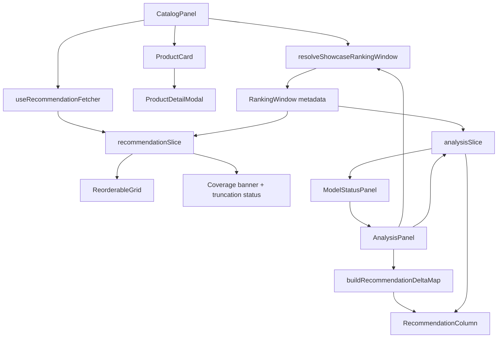

# M14 — Catalog Score Visibility & Cart-Aware Showcase — Design

**Spec**: `.specs/features/m14-catalog-score-visibility-cart-aware-showcase/spec.md`  
**Status**: Approved  
**Related ADRs**:

- `adr-047-explicit-ranking-window-metadata.md`
- `adr-048-explicit-cart-snapshot-clearing.md`

**Testing**:

- `.specs/codebase/frontend/TESTING.md`

---

## Architecture Overview

M14 preserves the current split between catalog ordering and analysis snapshots, but removes the legacy implicit top-10 behavior by introducing an explicit ranking window shared by both surfaces:

1. `CatalogPanel` keeps filters and semantic search local, because they only matter inside the catalog surface.
2. `useRecommendationFetcher` evolves from a fixed `limit: 10` helper into a coverage-aware fetcher that accepts a ranking window derived from catalog size and coverage mode.
3. `recommendationSlice` remains the canonical source for the currently ordered catalog, but now also stores coverage metadata and a request key so ordered mode can invalidate when the visible catalog session changes.
4. `AnalysisPanel` reuses the same ranking-window resolver for `Com IA`, `Com Carrinho`, and `Pos-Efetivar`, so all comparisons share the same depth and truncation contract.
5. `analysisSlice` stops using `captureCartAware([])` as a proxy for "cart was cleared"; instead it models cart clearing explicitly so `Com Carrinho` can disappear while `Pos-Efetivar` stays visible.
6. `RecommendationColumn` stays presentational and receives comparison metadata (`previous rank`, `current rank`, `score delta`, `new`, `fora do ranking`, `sem mudança`) precomputed by `AnalysisPanel`.
7. `ProductDetailModal` stays on the existing dialog/focus-management path, but receives the same score/context block as the card when ordered mode is active.



---

## Code Reuse Analysis

### Existing Components to Leverage

| Component | Location | How to Use |
|---|---|---|
| `CatalogPanel`, `ProductFilters`, `SemanticSearchBar` | `frontend/components/catalog/` | Keep catalog filters/search local; only extend the ordering toolbar with coverage state and explicit truncation messaging. |
| `useRecommendationFetcher`, `recommendationSlice` | `frontend/lib/hooks/useRecommendationFetcher.ts`, `frontend/store/recommendationSlice.ts` | Reuse the existing ordered-mode/store path, but add `requestedLimit`, `coverageMode`, `coverageMeta`, and a stable request key instead of the current `cachedForClientId` shortcut. |
| `ReorderableGrid` | `frontend/components/ReorderableGrid/ReorderableGrid.tsx` | Keep FLIP-based reordering and `data-testid="reorderable-item"`; only feed it a fuller score map and a loading/truncation status outside the grid. |
| `ScoreBadge` | `frontend/components/catalog/ScoreBadge.tsx` | Keep the current badge/tooltip primitive for catalog cards and analysis rows; update copy to Portuguese and allow a compact detail-mode variant in the modal if needed. |
| `ProductCard`, `ProductDetailModal` | `frontend/components/catalog/` | Preserve current category/supplier badges and inject score context without introducing a second product-summary component. |
| `AnalysisPanel`, `RecommendationColumn` | `frontend/components/recommendations/AnalysisPanel.tsx`, `frontend/components/analysis/RecommendationColumn.tsx` | Keep orchestration in `AnalysisPanel` and presentation in `RecommendationColumn`, following ADR-030 from M11. |
| `analysisSlice` | `frontend/store/analysisSlice.ts` | Reuse the existing discriminated union, but extend snapshots with ranking-window metadata and explicit cart clearing semantics. |
| `cartSlice`, `ModelStatusPanel`, `useModelStatus` | `frontend/store/cartSlice.ts`, `frontend/components/retrain/ModelStatusPanel.tsx`, `frontend/lib/hooks/useModelStatus.ts` | Reuse the M13 cart and post-checkout lifecycle; M14 only consumes those states to keep `Com Carrinho` reactive and `Pos-Efetivar` legible. |
| Existing E2E suite | `frontend/e2e/tests/` | Reuse `m13-cart-async-retrain.spec.ts` as the main flow and migrate legacy `Demo` specs/selectors to cart vocabulary instead of inventing a second showcase spec family. |

### Integration Points

| System | Integration Method |
|---|---|
| Frontend catalog ordering -> ai-service | `POST /api/proxy/recommend` with explicit `limit` derived from ranking-window resolver, never hard-coded `10`. |
| Frontend cart-aware snapshot -> ai-service | `POST /api/proxy/recommend/from-cart` with the same ranking-window limit used by `Com IA`. |
| Frontend post-checkout snapshot -> ai-service | `AnalysisPanel` refetches `POST /api/proxy/recommend` after `useModelStatus` observes promotion, reusing the same ranking-window resolver. |
| Frontend product detail | `ProductDetailModal` receives current score metadata from the already loaded `scoreMap`; it must not trigger a second recommendation fetch. |
| Frontend persisted UI state | Existing Zustand `persist` + `skipHydration` remains unchanged; M14 does not add new persisted fields beyond M13, but it must keep comparison state compatible with manual rehydration. |

---

## Design Gaps Confirmed By Code Review

| Gap | Current evidence | M14 design response |
|---|---|---|
| Catalog ordering is still implicitly top-10. | `useRecommendationFetcher.ts` posts `{ clientId, limit: 10 }`; `CatalogPanel` derives `scoreMap` only from `recommendations`. | Replace fixed limit with an explicit ranking window and coverage metadata. |
| Analysis snapshots still compare top-10 lists only. | `AnalysisPanel.tsx` uses `limit: 10` for both baseline and cart-aware snapshots. | Reuse the same ranking window resolver for all analysis phases. |
| Clearing the cart cannot return the showcase to baseline cleanly. | `AnalysisPanel.tsx` calls `captureCartAware(selectedClient.id, [])`, and `analysisSlice.ts` turns that into an empty `cart` snapshot. | Introduce `clearCartAware(clientId)` and allow `postCheckout` to exist without a current cart snapshot. |
| Catalog ordered mode can reuse stale data for the same client. | `useRecommendationFetcher.ts` short-circuits on `cachedForClientId === clientId` and just toggles `ordered`. | Replace client-only cache key with a request key that includes coverage mode and catalog session signature. |
| Showcase columns do not explain what moved. | `RecommendationColumn.tsx` renders only rank, name, and score badge. | Add delta metadata per row and a second text line with category/supplier context. |
| Product detail lacks score context. | `ProductDetailModal.tsx` shows category and supplier only. | Surface the same ordered-mode score summary inside the modal without changing the dialog pattern. |
| Legacy `Demo` semantics still leak into tests and store composition. | `frontend/e2e/tests/m11-ai-learning-showcase.spec.ts`, `frontend/e2e/tests/m9a-demo-buy.spec.ts`, `frontend/store/index.ts`. | Keep legacy demo flows explicitly isolated as advanced/legacy and migrate the principal E2E journey to cart vocabulary. |

---

## Components

### Catalog Score Coverage

- **Purpose**: Make ordered mode cover the whole relevant catalog window instead of only the previous top-10.
- **Location**:
  - `frontend/lib/hooks/useRecommendationFetcher.ts`
  - `frontend/store/recommendationSlice.ts`
  - `frontend/components/catalog/CatalogPanel.tsx`
  - `frontend/lib/showcase/ranking-window.ts` (new helper)
- **Interfaces**:
  - `resolveShowcaseRankingWindow({ totalCatalogItems, mode }): RankingWindow`
  - `fetch(clientId: string, options: { window: RankingWindow; requestKey: string }): Promise<void>`
  - `coverageMeta: { requestedLimit, receivedCount, totalCatalogItems, truncated, mode }`
- **Dependencies**: `recommendationSlice`, selected client, catalog dataset size, ordered toggle.
- **Reuses**: Existing `apiFetch`, recommendation proxy route, `ReorderableGrid`, `ScoreBadge`.
- **Notes**:
  - Default `full` mode uses a cap sized for the current dataset (`100` today, configurable later) and is expected to cover the seeded project data without manual toggles.
  - If the catalog exceeds the full-mode cap, the UI surfaces truncation explicitly and offers `diagnostic` mode instead of silently reverting to top-10.
  - The request key is derived from `clientId + mode + totalCatalogItems + searchStateKind`; local filter values do not need to live in Zustand.

### Coverage Banner And Diagnostic Mode

- **Purpose**: Communicate how much of the catalog received scores and when truncation is happening.
- **Location**:
  - `frontend/components/catalog/CatalogPanel.tsx`
  - `frontend/components/catalog/CoverageStatusBanner.tsx` (new)
- **Interfaces**:
  - `CoverageStatusBanner({ ordered, loading, coverageMeta, onEnableDiagnostic })`
- **Dependencies**: ranking-window metadata from `recommendationSlice`.
- **Reuses**: Existing badge/button styling patterns from catalog toolbar and `CartSummaryBar`.
- **Notes**:
  - Banner appears only while ordered mode is active.
  - Copy example: `78 de 134 produtos receberam score nesta janela. Alguns itens ficaram fora do ranking atual.`
  - If semantic search results are active, the banner explains that M14 coverage applies to the filtered catalog grid, not the semantic-search result ranking.

### Analysis Snapshot Orchestration

- **Purpose**: Keep `Com IA`, `Com Carrinho`, and `Pos-Efetivar` aligned on the same ranking window while allowing the cart snapshot to appear and disappear independently.
- **Location**:
  - `frontend/components/recommendations/AnalysisPanel.tsx`
  - `frontend/store/analysisSlice.ts`
  - `frontend/lib/showcase/ranking-window.ts`
- **Interfaces**:
  - `captureInitial(clientId, recs, window)`
  - `captureCartAware(clientId, recs, window)`
  - `clearCartAware(clientId)`
  - `captureRetrained(clientId, recs, window)`
- **Dependencies**: selected client, `cartSlice`, `useModelStatus`.
- **Reuses**: Existing snapshot/timestamp structure, `seededShuffle`, `ModelStatusPanel`.
- **Notes**:
  - Empty cart triggers `clearCartAware(clientId)`, not a synthetic empty recommendation list.
  - When `postCheckout` already exists, clearing the cart removes only the current `Com Carrinho` snapshot and keeps the last confirmed `Pos-Efetivar`.
  - A changed ranking window invalidates any existing comparison session and starts a fresh `Com IA` capture to avoid false deltas.

### Recommendation Deltas

- **Purpose**: Show what changed between adjacent showcase phases without overloading the row hierarchy.
- **Location**:
  - `frontend/components/analysis/RecommendationColumn.tsx`
  - `frontend/components/analysis/RecommendationDeltaBadge.tsx` (new)
  - `frontend/lib/showcase/deltas.ts` (new pure helper)
- **Interfaces**:
  - `buildRecommendationDeltaMap(previous: Snapshot | null, current: Snapshot | null): Record<string, RecommendationDelta>`
  - `RecommendationColumn({ recommendations, deltaByProductId, metadataLine, ... })`
- **Dependencies**: `product.id`, ranking-window metadata, current and previous snapshots.
- **Reuses**: Existing `RecommendationColumn` presentational boundary and `ScoreBadge`.
- **Notes**:
  - Delta is always computed against the immediately previous phase: `Com IA -> Com Carrinho`, `Com Carrinho -> Pos-Efetivar`.
  - Row layout becomes two lines: product name + score badge on the first line, `supplier · category` plus delta pill on the second line.
  - Supported delta states: `subiu`, `caiu`, `sem mudança`, `novo`, `fora do ranking`.

### Product Context Preservation

- **Purpose**: Keep supplier/category visible in every part of the showcase so similar items remain distinguishable.
- **Location**:
  - `frontend/components/catalog/ProductCard.tsx`
  - `frontend/components/catalog/ProductDetailModal.tsx`
  - `frontend/components/analysis/RecommendationColumn.tsx`
- **Interfaces**:
  - `scoreBadge?: ScoreBadgeProps`
  - `metadataLine?: string`
- **Dependencies**: recommendation score map and existing `product.category` / `product.supplier`.
- **Reuses**: Existing category/supplier badges and dialog composition.
- **Notes**:
  - `ProductCard` keeps category + supplier badges as-is and changes only the badge stacking to prevent score/cart collisions.
  - `ProductDetailModal` adds a compact ordered-mode summary block (`Score final`, `Neural`, `Semântico`) when score metadata exists.
  - `RecommendationColumn` shows category/supplier as muted text, not full badges, to keep information hierarchy compact.

### Vocabulary And E2E Migration

- **Purpose**: Finish the principal-flow migration from demo language to cart language without deleting legacy instructor-only paths.
- **Location**:
  - `frontend/e2e/tests/m13-cart-async-retrain.spec.ts`
  - `frontend/e2e/tests/m11-ai-learning-showcase.spec.ts`
  - `frontend/e2e/tests/m9a-demo-buy.spec.ts`
  - `frontend/store/index.ts`
- **Interfaces**:
  - Principal-flow selectors use `cart-*`, `main-tab-*`, `model-status-*`, `pos-efetivar`.
- **Dependencies**: current Playwright suite, legacy demo slice.
- **Reuses**: existing `data-testid` conventions already present in M13.
- **Notes**:
  - Principal-flow E2E coverage moves to cart semantics only.
  - Legacy demo scenarios, if retained, must be clearly labeled `legacy`/`advanced` and stop defining the acceptance path for M14.

---

## Data Models

### Ranking Window

```ts
type CoverageMode = 'full' | 'diagnostic';

interface RankingWindow {
  requestedLimit: number;
  totalCatalogItems: number;
  mode: CoverageMode;
  truncated: boolean;
}

interface CoverageMeta extends RankingWindow {
  receivedCount: number;
  requestKey: string;
}
```

### Showcase Snapshot

```ts
type Snapshot = {
  recommendations: RecommendationResult[];
  capturedAt: string;
  window: RankingWindow;
};

type AnalysisState =
  | { phase: 'empty' }
  | { phase: 'initial'; clientId: string; initial: Snapshot }
  | { phase: 'cart'; clientId: string; initial: Snapshot; cart: Snapshot }
  | {
      phase: 'postCheckout';
      clientId: string;
      initial: Snapshot;
      cart: Snapshot | null;
      postCheckout: Snapshot;
    };
```

### Recommendation Delta

```ts
type RecommendationDelta =
  | { kind: 'moved'; previousRank: number; currentRank: number; scoreDelta: number }
  | { kind: 'unchanged'; previousRank: number; currentRank: number; scoreDelta: 0 }
  | { kind: 'new'; currentRank: number }
  | { kind: 'outOfWindow'; previousRank: number };
```

---

## Error Handling Strategy

| Scenario | Behavior |
|---|---|
| Ordered-mode fetch fails | Keep unordered catalog, clear stale `coverageMeta`, show toast, and do not leave stale score badges visible. |
| Ordered-mode fetch resolves with fewer rows than requested | Treat as explicit truncation via `coverageMeta.truncated`; show banner instead of silently hiding badges. |
| User changes client while ordered mode is active | Clear ordered recommendations, coverage metadata, analysis snapshots, and cart state for the previous client through the existing store hooks. |
| User empties the cart after `Com Carrinho` exists | Call `clearCartAware(clientId)` so the column returns to baseline instead of rendering an empty captured snapshot. |
| User empties the cart after `Pos-Efetivar` exists | Preserve `postCheckout`, clear only the current cart snapshot, and mark delta rows that depend on `Com Carrinho` as unavailable until a new cart session starts. |
| Ranking window changes mid-session | Reset the analysis session and recapture `Com IA` using the new window to avoid comparing mismatched caps. |
| Ordered mode is toggled while semantic search results are active | Show explicit explanatory copy that M14 coverage targets the filtered catalog grid, not semantic-search ranking, and avoid implying full-catalog score coverage for search results. |
| Product detail opens before ordered recommendations are ready | Modal renders existing detail content only; score summary appears only if score metadata already exists. |

---

## Tech Decisions

| Decision | Rationale |
|---|---|
| Shared `RankingWindow` contract for catalog and analysis | Prevents the same `top-10` regression from reappearing in one surface while the other evolves. |
| Keep catalog filters/search local to `CatalogPanel` | There is no evidence that other surfaces need filter state; moving it to Zustand would be anticipatory abstraction. |
| Replace `cachedForClientId` with request-key invalidation | Same-client cache reuse is currently too coarse for coverage mode and session changes. |
| Explicit `clearCartAware()` action | Distinguishes "empty cart" from "non-empty cart returned zero recommendations", which the current `captureCartAware([])` cannot model correctly. |
| Recommendation delta computed in a pure helper and rendered by a small presentational badge | Keeps `RecommendationColumn` composable and testable, aligned with current M11 boundaries. |
| Two-line recommendation rows in analysis | Preserves hierarchy: product name stays primary, score stays visible, and context/delta become secondary rather than competing badges. |
| `ProductDetailModal` receives existing score context instead of fetching separately | Avoids extra I/O and keeps modal behavior predictable under the current dialog pattern. |
| Reduced-motion fallback removes movement but keeps state visibility | Matches current `motion-safe` conventions and external accessibility guidance: keep state communication, not decorative motion. |

---

## Interaction States

| Component | State | Trigger | Visual |
|-----------|-------|---------|--------|
| `Catalog ordered mode` | idle | `ordered === false` | Primary button `✨ Ordenar por IA`; no score badges; no coverage banner |
| `Catalog ordered mode` | loading | Fetch started for current ranking window | Spinner in CTA, badges hidden until fresh coverage returns, coverage banner shows loading copy |
| `Catalog ordered mode` | ready-full | Fetch succeeds and `truncated === false` | All currently relevant cards with score badge; banner confirms total scored |
| `Catalog ordered mode` | ready-truncated | Fetch succeeds and `truncated === true` | Cards with available scores plus warning banner and `modo diagnóstico` action |
| `Catalog ordered mode` | error | Fetch fails | Ordering toggles back off, toast shown, no stale badges |
| `CoverageStatusBanner` | hidden | `ordered === false` | No banner rendered |
| `CoverageStatusBanner` | informative | Ordered and not truncated | Muted info row with `N produtos pontuados` |
| `CoverageStatusBanner` | warning | Ordered and truncated | Amber row with `pontuados vs fora da cobertura` and diagnostic CTA |
| `RecommendationColumn` | empty | Snapshot absent for that phase | Existing dashed/empty state message |
| `RecommendationColumn` | loading | Phase fetch in progress | Existing skeleton rows, no stale deltas |
| `RecommendationColumn` | populated | Snapshot present | Two-line rows with rank, name, score, metadata, and delta badge where applicable |
| `ProductDetailModal` | detail-only | Modal open without score metadata | Existing description/category/supplier content only |
| `ProductDetailModal` | detail-with-score | Modal open while ordered score exists | Existing content plus compact score summary block |

---

## Animation Spec

| Animation | Property | Duration | Easing | Reduced-motion fallback |
|-----------|----------|----------|--------|------------------------|
| Catalog reorder | `transform` | 250ms | `ease-in-out` | Keep instant reorder, no transform transition |
| Score badge reveal | `opacity` | 180ms | `ease-out` | Show immediately |
| Coverage banner appear/disappear | `opacity` | 200ms | `ease-out` | Show/hide immediately |
| Delta badge emphasis on changed rows | `opacity`, `transform: translateY(-1px)` | 220ms | `ease-out` | Static badge with no movement |
| Modal score-summary reveal | `opacity` | 150ms | `ease-out` | Render instantly |

All motion stays on `transform` and `opacity` only; no width/height/top/left animation is introduced.

---

## Accessibility Checklist

| Component | Keyboard nav | Focus management | ARIA | Mobile |
|-----------|-------------|-----------------|------|--------|
| `Catalog ordered mode` | `Enter`/`Space` toggles ordering and diagnostic action | Focus stays on the triggering button after fetch state changes | `aria-pressed` on order toggle; `aria-disabled` when no client or incompatible view | Buttons remain `min-h-[44px]`; banner wraps without horizontal scroll |
| `CoverageStatusBanner` | CTA reachable by Tab only when actionable | No focus shift on passive updates | `role="status"` for informative/warning copy so truncation/loading is announced politely | Banner stacks text and CTA vertically below `sm` |
| `RecommendationColumn` | Non-interactive rows remain outside tab order | No focus movement on snapshot refresh | `role="list"` retained; delta badges use readable labels such as `subiu da posição 6 para 2` | Two-line rows maintain 44px minimum touch/read target |
| `ProductDetailModal` | Existing dialog keyboard support preserved; tooltip remains hover/focus accessible | Dialog keeps current open/close focus return behavior | Score summary uses plain text plus tooltip labels in Portuguese; no extra hidden interactive controls | Summary block fits below metadata without overflow |
| `Diagnostic mode toggle` | Reachable after truncation banner, not hidden behind hover only | Returns focus to toggle after mode switch completes | `aria-controls` can point to coverage summary region if a collapsible explanation is used | Toggle stays visible in toolbar/banner, not in a tooltip-only affordance |

---

## Alternatives Discarded

| Node | Approach | Eliminated in | Reason |
|------|----------|---------------|--------|
| A | Move catalog filters, coverage mode, ordered state, and analysis orchestration into one global showcase store | Phase 3 | Over-couples local catalog UI to the analysis flow and expands persisted/hydrated state without evidence of reuse |
| C | Keep ad-hoc local fetches and per-component implicit caps | Phase 2 | Repeats the exact failure mode of the current code: cap divergence, stale cache reuse, and unreadable deltas |

---

## Committee Findings Applied

| Finding | Persona | How incorporated |
|---------|---------|-----------------|
| The design must make ranking depth explicit instead of inferring it from list length | Principal Software Architect | Added `RankingWindow` / `CoverageMeta` and shared resolver across catalog and analysis |
| Same-client cache reuse is too coarse and will create stale ordered sessions | Staff Engineering | Replaced client-only cache assumption with request-key invalidation in the design |
| Empty-cart reset needs its own state transition, not an empty snapshot overload | QA Staff | Added `clearCartAware(clientId)` and `postCheckout.cart: Snapshot | null` |
| Every phase change must have immediate feedback and a recoverable path | Staff Product Engineer | Defined loading/warning/error states for ordered mode and explicit banner/status messaging |
| New information must not compete with the product name or score hierarchy | Staff UI Designer | Kept deltas/context on a muted second line instead of adding more top-row badges |
| Truncation and ranking-window changes must never generate false comparisons | QA Staff + Staff Engineering | Analysis resets when the ranking window changes; delta helper depends on the same window contract |
| Motion must remain composited and respect reduced-motion preferences | Staff UI Designer + Staff Product Engineer | Animation spec restricts motion to `transform`/`opacity` and defines no-motion fallbacks |

