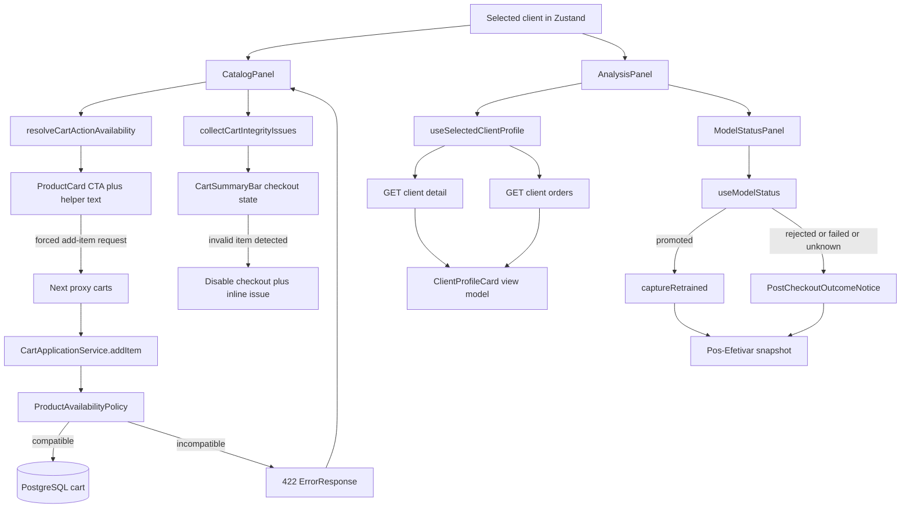

# M15 - Cart Integrity & Comparative UX - Design

**Spec**: `.specs/features/m15-cart-integrity-comparative-ux/spec.md`  
**Status**: Approved  
**Related ADRs**:

- `adr-049-cart-country-compatibility-at-cart-boundary.md`
- `adr-050-transient-selected-client-profile-enrichment.md`
- `adr-051-post-checkout-outcome-notice-without-synthetic-snapshot.md`

**Testing anchors**:

- `api-service/src/test/java/com/smartmarketplace/service/CartApplicationServiceTest.java`
- `frontend/e2e/tests/m13-cart-async-retrain.spec.ts`

---

## Architecture Overview

M15 keeps the current `CatalogPanel -> CartApplicationService -> OrderApplicationService` and `AnalysisPanel -> ModelStatusPanel` boundaries, but closes the remaining credibility gaps with thin orchestration layers instead of a new global UX framework:

1. `api-service` anticipates country compatibility from checkout to add-item through a shared product-availability policy and returns `422` `ErrorResponse` for semantic cart rejections before persistence.
2. `frontend` derives proactive cart CTA states and checkout blockers from the already loaded `selectedClient.country` plus `product.countries`, while still treating backend responses as the source of truth when data is stale.
3. Selected-client enrichment stays transient: `AnalysisPanel` composes `GET /api/v1/clients/{id}` and `GET /api/v1/clients/{id}/orders` through a dedicated hook/view model instead of mutating the persisted `selectedClient` object.
4. `ModelStatusPanel` remains the canonical async learning surface, and `Pos-Efetivar` gains a local outcome notice for `rejected` / `failed` / `unknown` so the column stops looking broken when no new promoted snapshot exists.
5. `RecommendationColumn` and `ClientProfileCard` stay presentational; new feature logic lives in pure helpers and thin orchestration hooks so M15 fits the project's current component boundaries.



---

## Code Reuse Analysis

### Existing Components to Leverage

| Component | Location | How to Use |
|---|---|---|
| `ProductRepository.findByIdWithDetails()` and `findAllByIdWithCountries()` | `api-service/src/main/java/com/smartmarketplace/repository/ProductRepository.java` | Reuse the existing country-loading queries so add-item and checkout validate against the same `Product.countries` data instead of introducing cart-specific projections. |
| `OrderApplicationService.createOrder()` | `api-service/src/main/java/com/smartmarketplace/service/OrderApplicationService.java` | Keep checkout delegated to the current order ground-truth path; M15 only anticipates the same invariant earlier at add-item time. |
| `GlobalExceptionHandler`, `CartEmptyException`, `ErrorResponse` | `api-service/src/main/java/com/smartmarketplace/exception/` | Reuse the current exception-to-`ErrorResponse` mapping style and add a sibling semantic cart exception mapped to `422`. |
| `apiFetch()` | `frontend/lib/fetch-wrapper.ts` | Reuse exact backend `body.message` propagation and optional `signal` support instead of inventing a second error transport. |
| `CatalogPanel`, `ProductCard`, `CartSummaryBar` | `frontend/components/catalog/`, `frontend/components/cart/` | Keep orchestration in `CatalogPanel`, keep `ProductCard`/`CartSummaryBar` presentational, and inject new cart-integrity helpers through props instead of store-wide UI state. |
| `ClientController.getClient()` and `getClientOrders()` | `api-service/src/main/java/com/smartmarketplace/controller/ClientController.java` | Reuse the existing client detail and order-history endpoints; M15 does not need a new backend enrichment endpoint. |
| `useAppStore` persisted subset | `frontend/store/index.ts` | Reuse the current `partialize` boundary and avoid persisting transient profile loading/error/request state, matching the existing store discipline. |
| `AnalysisPanel`, `ModelStatusPanel`, `useModelStatus` | `frontend/components/recommendations/AnalysisPanel.tsx`, `frontend/components/retrain/ModelStatusPanel.tsx`, `frontend/lib/hooks/useModelStatus.ts` | Keep `ModelStatusPanel` as the async anchor, and add column-specific outcome feedback locally in `AnalysisPanel` without changing the model-status source of truth. |

### Integration Points

| System | Integration Method |
|---|---|
| Frontend add-to-cart -> api-service | `POST /api/proxy/carts/{clientId}/items` forwards to `POST /api/v1/carts/{clientId}/items`; semantic incompatibility returns `422 ErrorResponse` and the frontend reuses the exact message. |
| Frontend cart integrity -> local product data | `CatalogPanel` reuses `allProducts` / `productsById` as the client-side eligibility source for proactive CTA disablement and invalid-cart checkout blocking. |
| Frontend selected-client profile -> api-service | `useSelectedClientProfile` issues `GET /api/v1/clients/{id}` and `GET /api/v1/clients/{id}/orders?size=10` in parallel and derives the card view model locally. |
| Frontend post-checkout column -> model status | `AnalysisPanel` keeps promotion capture on `currentVersion` changes and derives `PostCheckoutOutcomeNotice` from the same `panelState` / `lastDecision` source used by `ModelStatusPanel`. |

---

## Design Gaps Confirmed By Code Review

| Gap | Current evidence | M15 design response |
|---|---|---|
| Add-item accepts incompatible products. | `CartApplicationService.addItem()` loads `productRepository.findById(...)` and never checks `product.getCountries()` against the client country. | Add a shared backend availability policy plus a cart-specific semantic exception before cart persistence. |
| Cart CTA disablement only models "no selected client". | `CatalogPanel.renderItem()` sets `cartActionDisabledReason` only to `Selecione um cliente para usar o carrinho`. | Introduce a pure availability helper that distinguishes `no-client` from `country-incompatible` and provides explicit helper copy for both. |
| Selected client is persisted with fake zeros and no recent products. | `ClientSelectorDropdown.toClient()` hardcodes `totalOrders: 0` and `recentProducts: []`, and `selectedClient` is persisted in `useAppStore`. | Keep persisted selection lightweight and overlay transient enrichment in a dedicated hook/view model. |
| `ClientProfileCard` cannot represent loading, partial failure, `totalSpent`, or `lastOrderAt`. | Current props accept only `Client`, and the card renders zeros / empty list as if they were final data. | Expand the card into a presentational state machine driven by `useSelectedClientProfile`, with explicit `loading`, `ready`, `empty`, `partial`, and `unavailable` states. |
| `Pos-Efetivar` only gets populated on promotion, leaving ambiguous empty UI for rejected/failed/unknown. | `AnalysisPanel` captures post-checkout recommendations only when `modelStatus.panelState === 'promoted'`, while `RecommendationColumn` keeps a generic empty message. | Keep capture promotion-only, but add a local `PostCheckoutOutcomeNotice` and state-specific empty copy tied to the same status source. |
| Add-to-cart failures collapse into a generic toast. | `handleAddToCart()` catches all errors and shows `Erro ao adicionar item no carrinho`, without cart reconciliation. | Reuse exact `ApiError.message`, clear loading, and refetch `getCart(clientId)` on semantic rejection so stale frontend state is reconciled to the backend. |

---

## Components

### Cart Country Compatibility Guard

- **Purpose**: Reject incompatible add-item requests before cart persistence and keep country-availability semantics aligned with checkout.
- **Location**:
  - `api-service/src/main/java/com/smartmarketplace/service/CartApplicationService.java`
  - `api-service/src/main/java/com/smartmarketplace/service/OrderApplicationService.java`
  - `api-service/src/main/java/com/smartmarketplace/repository/ProductRepository.java`
  - `api-service/src/main/java/com/smartmarketplace/service/ProductAvailabilityPolicy.java` (new)
  - `api-service/src/main/java/com/smartmarketplace/exception/CartItemUnavailableException.java` (new)
  - `api-service/src/main/java/com/smartmarketplace/exception/GlobalExceptionHandler.java`
- **Interfaces**:
  - `void ProductAvailabilityPolicy.assertAvailableForClientCountry(Client client, Product product)`
  - `void ProductAvailabilityPolicy.assertAllAvailableForClientCountry(Client client, List<Product> products)`
  - `CartDTO addItem(UUID clientId, AddCartItemRequest request)`
- **Dependencies**: `ClientRepository.findByIdWithCountry`, `ProductRepository.findByIdWithDetails`, `ErrorResponse`.
- **Reuses**: Current `OrderApplicationService` order-validation boundary and the existing `422` mapping precedent from `CartEmptyException`.
- **Notes**:
  - `addItem()` must load the product with countries and call the shared policy before the cart is created or mutated.
  - `checkout()` keeps delegating to `OrderApplicationService.createOrder()`; the same policy is reused there so add-item and checkout never drift.
  - `CartItemUnavailableException` returns `422` with the standard `ErrorResponse` contract because the request is syntactically valid but semantically invalid for that client/product pair.

### Cart Integrity Scan And Checkout Blocker

- **Purpose**: Prevent user-visible invalid cart states in the catalog and block legacy/manual invalid carts before checkout when the frontend has enough metadata to know they are incompatible.
- **Location**:
  - `frontend/lib/cart-integrity.ts` (new pure helper)
  - `frontend/components/catalog/CatalogPanel.tsx`
  - `frontend/components/catalog/ProductCard.tsx`
  - `frontend/components/cart/CartSummaryBar.tsx`
- **Interfaces**:
  - `resolveCartActionAvailability(selectedClient, product): CartActionAvailability`
  - `collectCartIntegrityIssues(cart, productsById, clientCountry): CartIntegrityIssue[]`
  - `CartSummaryBar({ cart, productsById, checkoutPending, checkoutError, integrityIssues, onClear, onCheckout })`
- **Dependencies**: `selectedClient.country`, `product.countries`, `cartByClient`, `productsById`.
- **Reuses**: Existing `cartActionDisabledReason` prop, current `checkoutError` inline slot, and `apiFetch` error propagation.
- **Notes**:
  - `CatalogPanel` uses the helper to distinguish `no-client` vs. `country-incompatible` without adding a new badge near score/category/supplier badges.
  - `ProductCard` keeps the current button placement but adds CTA-adjacent helper text plus `aria-describedby` when disabled so the reason is explicit on desktop and touch.
  - `CartSummaryBar` disables checkout when one or more explicit incompatibility issues are known from local product metadata and renders an inline issue summary naming the offending items.
  - If a cart item lacks local product metadata, the UI must not false-block checkout; in that case the backend remains the only source of truth and any rejection is surfaced through the existing error slot.
  - On semantic add-item rejection, the frontend shows the exact server message, clears the button loading state, and refetches `getCart(clientId)` to reconcile any stale client-side assumptions.

### Selected Client Profile Enrichment

- **Purpose**: Replace placeholder-zero client profile rendering with real purchase summary and recent products while keeping selection state stable and recoverable.
- **Location**:
  - `frontend/lib/adapters/clients.ts` (new)
  - `frontend/lib/hooks/useSelectedClientProfile.ts` (new)
  - `frontend/components/recommendations/AnalysisPanel.tsx`
  - `frontend/components/client/ClientProfileCard.tsx`
- **Interfaces**:
  - `getClientDetail(clientId: string): Promise<ClientDetailResponse>`
  - `getClientOrders(clientId: string, size?: number): Promise<OrderHistoryResponse>`
  - `useSelectedClientProfile(selectedClient): ClientProfileViewModel`
- **Dependencies**: `apiFetch`, `useSelectedClient`, React effect cleanup, existing client endpoints.
- **Reuses**: Current persisted `selectedClient` identity/segment/country boundary and the project's existing `cancelled`-flag effect style already used in `AnalysisPanel`.
- **Notes**:
  - Fetch detail and order history in parallel via `Promise.allSettled` so partial success stays visible.
  - Derive up to five unique recent products from newest-first orders; use `size=10` to reduce the chance that repeated products hide newer variety.
  - Do not persist profile loading/error/request metadata in Zustand; rehydrated sessions should briefly load the card again rather than hydrate stale placeholders or stale errors.
  - Stale responses must be discarded with a request token / cleanup guard so a fast client switch never overwrites the currently selected client.

### Post-Checkout Comparative Outcome Notice

- **Purpose**: Explain why `Pos-Efetivar` is empty or unchanged after terminal non-promotion outcomes without inventing a fake recommendation capture.
- **Location**:
  - `frontend/components/recommendations/AnalysisPanel.tsx`
  - `frontend/components/retrain/ModelStatusPanel.tsx`
  - `frontend/components/analysis/PostCheckoutOutcomeNotice.tsx` (new)
  - `frontend/lib/showcase/post-checkout-outcome.ts` (new pure helper)
- **Interfaces**:
  - `buildPostCheckoutOutcome(panelState, modelStatus, hasPostCheckoutSnapshot): PostCheckoutOutcomeNotice | null`
  - `PostCheckoutOutcomeNotice({ outcome })`
- **Dependencies**: `useModelStatus`, `lastDecision`, `currentVersion`, `RecommendationColumn`.
- **Reuses**: Existing `#pos-efetivar` anchor, `captureRetrained()` logic, and `ModelStatusPanel` as the primary async status anchor.
- **Notes**:
  - `AnalysisPanel` continues to fetch `Pos-Efetivar` only when `panelState === 'promoted'`; non-promoted terminal states do not create a synthetic snapshot.
  - For `rejected`, `failed`, and `unknown`, render a notice above the `Pos-Efetivar` column and swap the empty-state copy to explain the visual consequence directly in the column.
  - `ModelStatusPanel` copy must explicitly reference what the evaluator should expect in `Pos-Efetivar`, so the panel and the column stay complementary instead of contradictory.
  - `RecommendationColumn` remains presentational; feature-specific branching stays in `AnalysisPanel` and a small helper/notice component.

---

## Interaction States

| Component | State | Trigger | Visual |
|-----------|-------|---------|--------|
| `ProductCard` cart action | `disabled_no_client` | No selected client | Disabled CTA plus helper text `Selecione um cliente para usar o carrinho`. |
| `ProductCard` cart action | `disabled_country_incompatible` | Selected client country not present in `product.countries` | Disabled CTA plus helper text such as `Indisponivel para clientes BR`. |
| `ProductCard` cart action | `server_rejected_reconciled` | Backend rejects a forced/stale add-item request | Exact backend message surfaced in toast or inline feedback, then cart refetched. |
| `CartSummaryBar` | `integrity_blocked` | Cart contains one or more explicit incompatible items | Checkout CTA disabled, inline issue summary visible, issue chips tinted with warning styling. |
| `ClientProfileCard` | `loading` | Selected client changed and profile enrichment is in flight | Skeleton/placeholder layout, no fake zeros rendered as final data. |
| `ClientProfileCard` | `empty` | Detail and orders succeeded but there is no order history | Real zero stats plus empty-copy `Sem pedidos registrados`. |
| `ClientProfileCard` | `partial` | One enrichment request failed and the other succeeded | Available sections rendered, missing section replaced by local warning text. |
| `ClientProfileCard` | `unavailable` | Both enrichment requests failed | Base client identity stays visible, card shows compact fallback warning, rest of the showcase keeps working. |
| `ModelStatusPanel` | `promoted_copy` | `panelState === 'promoted'` after post-checkout retrain | Evaluator-oriented title and description explain that `Pos-Efetivar` now reflects the new active model version. |
| `ModelStatusPanel` | `rejected_copy` | `panelState === 'rejected'` after post-checkout retrain | Title and description state that the current model was kept and surface the rejection reason from `lastDecision`. |
| `ModelStatusPanel` | `failed_copy` | `panelState === 'failed'` after post-checkout retrain | Title and description explain that no new post-checkout snapshot was applied and active recommendations remain from the previous model. |
| `ModelStatusPanel` | `unknown_copy` | `panelState === 'unknown'` after timeout | Neutral title and description avoid implying success or failure; refresh CTA stays coherent with the checkout narrative. |
| `ModelStatusPanel` | `manual_secondary` | Manual / advanced retrain controls visible | Controls remain clearly labeled as secondary or diagnostic, outside the principal `Com Carrinho -> Pos-Efetivar` flow. |
| `Pos-Efetivar` wrapper | `rejected_notice` | `panelState === 'rejected'` and no promoted snapshot exists | Amber notice explains that the current model was kept and a visible ranking change may not occur. |
| `Pos-Efetivar` wrapper | `failed_notice` | `panelState === 'failed'` and no promoted snapshot exists | Red notice explains that no new post-checkout snapshot was applied. |
| `Pos-Efetivar` wrapper | `unknown_notice` | `panelState === 'unknown'` and no promoted snapshot exists | Neutral notice explains that capture is still pending confirmation and points to manual refresh. |

---

## Accessibility Checklist

| Component | Keyboard nav | Focus management | ARIA | Mobile |
|-----------|-------------|-----------------|------|--------|
| `ProductCard` cart CTA | Disabled CTA remains focusable only when actionable; helper text does not require hover to be discovered | Failed add-item attempts keep focus on the triggering button | Disabled reason bound with `aria-describedby`; busy state keeps `aria-busy` | Helper text remains visible under the CTA, not only in a `title` tooltip |
| `CartSummaryBar` integrity issues | Checkout and clear remain reachable in normal order | When checkout becomes blocked by integrity issues, focus stays on the triggering surface and the issue summary is announced | Issue summary uses `role="status"` or `aria-live="polite"`; warning is not color-only | Summary stacks above or below controls without hiding the disabled CTA |
| `ClientProfileCard` loading/fallback | Card stays out of tab order except for any explicit retry action added later | Client switch does not steal focus from the selector | Loading can expose `aria-busy`; fallback copy is readable plain text | Skeleton/fallback layout stays readable in one column |
| `PostCheckoutOutcomeNotice` | Notice is non-interactive unless `unknown` adds a refresh CTA | The promoted scroll target remains `#pos-efetivar`; non-promoted states should not force-scroll | Notice uses `role="status"` so the outcome is announced when it appears | Notice wraps above the column and does not push the status panel off-screen |

---

## Data Models

### API Service

```java
class ProductAvailabilityPolicy {
    void assertAvailableForClientCountry(Client client, Product product);
    void assertAllAvailableForClientCountry(Client client, List<Product> products);
}

class CartItemUnavailableException extends RuntimeException {
    CartItemUnavailableException(String message) {}
}
```

`ProductAvailabilityPolicy` is a small domain policy, not a new transport abstraction. Its only job is to keep cart add-item and order checkout aligned on the same availability rule and message semantics.

### Frontend

```ts
type CartActionAvailability =
  | { kind: 'enabled' }
  | { kind: 'no-client'; message: string }
  | { kind: 'country-incompatible'; message: string; availableCountries: string[] };

interface CartIntegrityIssue {
  productId: string;
  productName: string;
  message: string;
}

type ClientProfileLoadState = 'loading' | 'ready' | 'empty' | 'partial' | 'unavailable';

interface ClientProfileViewModel {
  status: ClientProfileLoadState;
  baseClient: Client;
  totalOrders: number | null;
  totalSpent: number | null;
  lastOrderAt: string | null;
  recentProducts: ProductSummary[];
  warnings: string[];
}

type PostCheckoutOutcomeNotice =
  | { kind: 'rejected'; title: string; description: string }
  | { kind: 'failed'; title: string; description: string }
  | { kind: 'unknown'; title: string; description: string };
```

`ClientProfileViewModel` is intentionally separate from the persisted `selectedClient` object so loading/error/request state never leaks into store hydration or unrelated catalog/cart flows.

---

## Error Handling Strategy

| Error Scenario | Handling | User Impact |
|---|---|---|
| Add-item request is syntactically valid but incompatible with the client country | `CartItemUnavailableException` -> `422 ErrorResponse` with explicit product/country message | CTA stays blocked when the frontend can predict it; forced/stale requests still return a non-generic message |
| Frontend predicts compatibility but backend rejects due to stale data | Reuse `ApiError.message`, clear button loading, then refetch `getCart(clientId)` | Backend remains source of truth and the cart UI is reconciled without ghost state |
| Existing cart contains incompatible item from legacy/manual divergence | Client-side `collectCartIntegrityIssues()` disables checkout when product metadata is known; backend checkout validation remains the fallback guard | Evaluator sees a clear blocker before checkout when possible, and still gets an explicit error if the blocker is only detected on the server |
| Client detail succeeds but order history fails | `Promise.allSettled` yields `partial` profile state | Card keeps real stats, recent-products section shows local fallback warning, rest of the showcase stays usable |
| Order history succeeds but client detail fails | `Promise.allSettled` yields `partial` profile state | Recent products stay visible, totals/date area shows fallback warning instead of fake zeros |
| Both profile-enrichment calls fail | Keep base selected client, render `unavailable` fallback state only in the card | Catalog, cart, analysis, and checkout continue to work |
| User switches clients while enrichment is in flight | Cleanup/request token ignores stale responses | Previous client responses never overwrite the current card |
| Retrain ends in `rejected`, `failed`, or `unknown` | Do not synthesize a new `Pos-Efetivar` snapshot; render `PostCheckoutOutcomeNotice` and aligned panel copy | Non-promotion outcomes stop looking like a broken or forgotten column |

---

## Tech Decisions

| Decision | Choice | Rationale |
|---|---|---|
| Country-rule owner | Shared `ProductAvailabilityPolicy` in `api-service`, plus frontend derived helper for proactive UX only | Backend remains the source of truth, while the frontend gets a pure, reusable predictor for CTA and checkout states |
| Add-item rejection status | `422 ErrorResponse` via `CartItemUnavailableException` | The request is structurally valid but semantically invalid for that client/product combination, and the project already uses `422` for cart semantic errors |
| Disabled reason placement | CTA-adjacent helper text, not a new top-of-card badge | Keeps the reason explicit without competing with score, supplier, category, or in-cart badges |
| Checkout blocker for invalid cart items | Derive from `cart + productsById + selectedClient.country`; fall back to backend when metadata is missing | Prevents known-bad checkouts without introducing a new cart-inspection endpoint |
| Profile enrichment scope | Dedicated transient hook/view model, not persisted `selectedClient` mutation | Avoids hydration drift, stale loading/error state, and unrelated store coupling |
| Enrichment request fan-out | Parallel `GET /clients/{id}` and `GET /clients/{id}/orders?size=10` | Reuses existing endpoints, supports partial success, and avoids new backend aggregation contracts |
| Recent-products derivation | Flatten newest-first orders into up to five unique products | Keeps the API unchanged while making the card feel real instead of placeholder-driven |
| Stale-response handling | React cleanup/request-token pattern aligned with current codebase effects | Matches current frontend conventions and React guidance for race avoidance |
| Post-checkout non-promotion UX | Local `PostCheckoutOutcomeNotice` in `#pos-efetivar`, no synthetic snapshot | Keeps comparison semantics honest while making the empty column understandable |
| Comparative copy ownership | `ModelStatusPanel` explains governance; `Pos-Efetivar` notice explains column consequence | Avoids duplicated paragraphs while making both surfaces coherent |

---

## Risks And Mitigations

| Risk | Mitigation |
|---|---|
| `productsById` may not cover every cart item if the seeded dataset grows beyond the current `size=100` preload. | Only block checkout proactively for explicit known incompatibilities; when metadata is missing, let backend checkout validation decide and surface the exact error. |
| Profile enrichment can briefly flicker on reload because the selected client is persisted but enrichment is not. | This is intentional; render a short loading state instead of hydrating fake zeros or stale warning state. |
| Two parallel profile requests can produce asymmetric success and make the card feel inconsistent. | Model `partial` explicitly and keep section-level fallback copy local to the card instead of failing the whole client context. |
| Add-item and checkout messages could drift if the rule is implemented twice. | Centralize the country rule in `ProductAvailabilityPolicy` and reuse it from both add-item and checkout paths. |
| `Pos-Efetivar` notice and `ModelStatusPanel` copy can diverge over time. | Derive both from the same outcome helper inputs (`panelState`, `lastDecision`, `currentVersion`) and keep wording changes in one place. |
| Introducing a generic feature flag or permissive mode here would weaken the MVP story. | Keep M15 strict by default and do not introduce bypass flags in this design. |

---

## Alternatives Discarded

| Node | Approach | Eliminated in | Reason |
|---|---|---|---|
| B | Centralize cart eligibility, selected-client enrichment, and post-checkout outcome UX in a new global Zustand slice | Phase 3 | It increases persisted/hydrated coupling, makes transient request state global, and does not fit the existing pattern of keeping feature orchestration local to `CatalogPanel` / `AnalysisPanel`. |
| C | Push richer UX contracts into new backend endpoints and DTOs for cart integrity, enriched client profile, and post-checkout notices | Phase 2 | It adds API churn and server-side presentation coupling even though the current endpoints plus local pure helpers already expose enough data to satisfy the spec. |

---

## Committee Findings Applied

| Finding | Persona | How incorporated |
|---|---|---|
| Keep selected-client enrichment transient and outside the persisted `selectedClient` object. | Principal Software Architect; Staff Engineering | Added `useSelectedClientProfile` plus `ClientProfileViewModel`, with no new persisted fields in Zustand. |
| Reuse a shared backend country-availability policy instead of duplicating rule strings between add-item and checkout. | Principal Software Architect; QA Staff | Added `ProductAvailabilityPolicy` as the single owner of the country-compatibility invariant. |
| Forced/stale add-item failures must reconcile frontend state back to the backend, not just show a generic toast. | Staff Engineering; QA Staff | Design now requires exact `ApiError.message` reuse plus `getCart(clientId)` refresh on semantic rejection. |
| Do not fabricate a `Pos-Efetivar` snapshot for rejected/failed/unknown outcomes. | Principal Software Architect; QA Staff | Kept capture promotion-only and added `PostCheckoutOutcomeNotice` above the column instead. |
| Make invalid-CTA and invalid-cart reasons explicit in surfaces that work on keyboard and touch, not hover-only. | QA Staff; Principal Software Architect | Added CTA-adjacent helper text, `aria-describedby`, and inline cart issue summaries instead of tooltip-only explanations. |

---

## Verification Strategy

M15 verification stays inside the project's existing test surfaces and does not introduce a new frontend unit/component framework.

1. **Backend unit tests (`api-service`)**
   - Extend `CartApplicationServiceTest` for: country-mismatch rejection on `addItem()` via `ProductAvailabilityPolicy`, cart immutability on rejection, and explicit upsert behavior preserved for compatible products.
   - Add `ProductAvailabilityPolicyTest` covering `assertAvailableForClientCountry` and `assertAllAvailableForClientCountry` so the shared invariant is exercised independently from the cart pipeline.
   - Extend `OrderApplicationServiceTest` only where shared error-message alignment or defense-in-depth behavior changes materially.

2. **Backend integration tests (`api-service`)**
   - Extend `CartControllerIT` for: `POST /carts/{clientId}/items` country-mismatch returning `422 ErrorResponse` with the standard contract, compatible add-item success, and checkout rejection when the cart contains an incompatible legacy item.

3. **Frontend Playwright (`frontend`)**
   - Reuse `frontend/e2e/tests/m13-cart-async-retrain.spec.ts` for the principal real-stack flow: proactive disabled reasons, checkout blocking, post-checkout `promoted` capture, and panel copy alignment.
   - Add a focused M15 Playwright spec only if mocked `rejected` / `failed` / `unknown` branches and enrichment partial-failure paths make the existing `m13` file too noisy. Stay within the existing Playwright setup.

4. **No new frontend unit/component stack**
   - Do not introduce Vitest/Jest/Testing Library as part of M15. The repo does not currently ship that stack, and the highest-value regression coverage for this milestone is the existing E2E journey plus backend rule tests.

5. **Feature gate commands**
   - `api-service`: `./mvnw verify`
   - `frontend`: `npm run lint && npm run build && npm run test:e2e`

---

## Requirement Traceability

| Requirement | Design anchor | Primary verification |
|---|---|---|
| `INTEG-01` | Cart Country Compatibility Guard: `addItem()` calls `ProductAvailabilityPolicy.assertAvailableForClientCountry()` before persistence | `CartApplicationServiceTest` + `CartControllerIT` |
| `INTEG-02` | Policy throws `CartItemUnavailableException` before `cartRepository.save()`, leaving the active cart untouched | `CartApplicationServiceTest` |
| `INTEG-03` | Compatible products keep the existing `addItem()` happy path | `CartControllerIT` |
| `INTEG-04` | Existing upsert quantity semantics remain after the policy check | `CartApplicationServiceTest` |
| `INTEG-05` | Cart Integrity Scan: `resolveCartActionAvailability()` distinguishes `country-incompatible` and disables the CTA proactively | Playwright principal cart flow |
| `INTEG-06` | `ProductCard` renders CTA-adjacent helper text bound via `aria-describedby` | Playwright principal cart flow |
| `INTEG-07` | `CartActionAvailability` discriminated union keeps `no-client` distinct from `country-incompatible` | Playwright + UI review |
| `INTEG-08` | `apiFetch()` propagates `body.message`; `CatalogPanel.handleAddToCart()` surfaces the exact backend message and refreshes the cart | `CartControllerIT` + Playwright stale-path assertion |
| `INTEG-09` | `collectCartIntegrityIssues()` blocks `CartSummaryBar` checkout; backend `OrderApplicationService` remains the late safety net | `CartApplicationServiceTest` + `CartControllerIT` |
| `INTEG-10` | Backend stays source of truth; frontend reconciles via `getCart(clientId)` after semantic rejection | Playwright stale-path assertion |
| `INTEG-11` | `useSelectedClientProfile` issues `GET /api/v1/clients/{id}` on selection change | Playwright client-history flow |
| `INTEG-12` | `useSelectedClientProfile` issues `GET /api/v1/clients/{id}/orders?size=10` in parallel | Playwright client-history flow |
| `INTEG-13` | `ClientProfileCard` `loading` state replaces placeholder zeros | Playwright client-history flow |
| `INTEG-14` | `ClientProfileViewModel` carries `totalOrders`, `totalSpent`, `lastOrderAt` | Playwright client-history flow |
| `INTEG-15` | View model derives up to 5 unique recent products from newest-first orders | Playwright client-history flow |
| `INTEG-16` | `empty` state renders real zero stats and explicit "no orders" copy | Playwright seeded empty-history client |
| `INTEG-17` | `partial` state via `Promise.allSettled` keeps the rest of the showcase usable | Dedicated Playwright mocked branch if needed |
| `INTEG-18` | `unavailable` state keeps base selected client; only the card body degrades | Dedicated Playwright mocked branch if needed |
| `INTEG-19` | Request-token / cleanup guard discards stale enrichment responses | Dedicated Playwright rapid-switch scenario |
| `INTEG-20` | `ClientProfileCard` `ready` state renders metrics and recent products consistently | Playwright client-history flow |
| `INTEG-21` | `ModelStatusPanel` `*_copy` interaction states use evaluator-oriented title/description | Playwright post-checkout flow |
| `INTEG-22` | `promoted_copy` explains that `Pos-Efetivar` now reflects the new active version | Existing `m13` Playwright promoted branch |
| `INTEG-23` | `rejected_copy` explains current model retention and surfaces `lastDecision` reason | Playwright mocked/non-promoted branch |
| `INTEG-24` | `PostCheckoutOutcomeNotice` `rejected_notice` makes the reused current model explicit beside the column | Playwright mocked/non-promoted branch |
| `INTEG-25` | `failed_copy` + `failed_notice` explain absence of new post-checkout snapshot | Playwright mocked/non-promoted branch |
| `INTEG-26` | `unknown_copy` + `unknown_notice` keep the refresh CTA coherent with the checkout narrative | Existing `m13` unknown branch or focused Playwright branch |
| `INTEG-27` | `ModelStatusPanel` `manual_secondary` interaction state keeps advanced retrain clearly secondary | Playwright advanced-panel assertion |
| `INTEG-28` | `Comparative copy ownership` tech decision keeps wording aligned with `Com Carrinho -> Pos-Efetivar` | UI review + Playwright text assertions |
| `INTEG-29` | `buildPostCheckoutOutcome()` derives copy that disambiguates "no visible change" from a UI bug | Playwright rejected/failed text assertions |
| `INTEG-30` | `ModelStatusPanel` + `PostCheckoutOutcomeNotice` + column empty copy together explain the outcome without logs | Playwright end-to-end and mocked terminal-state branches |

**Total:** 30 requisitos | P1: 30

