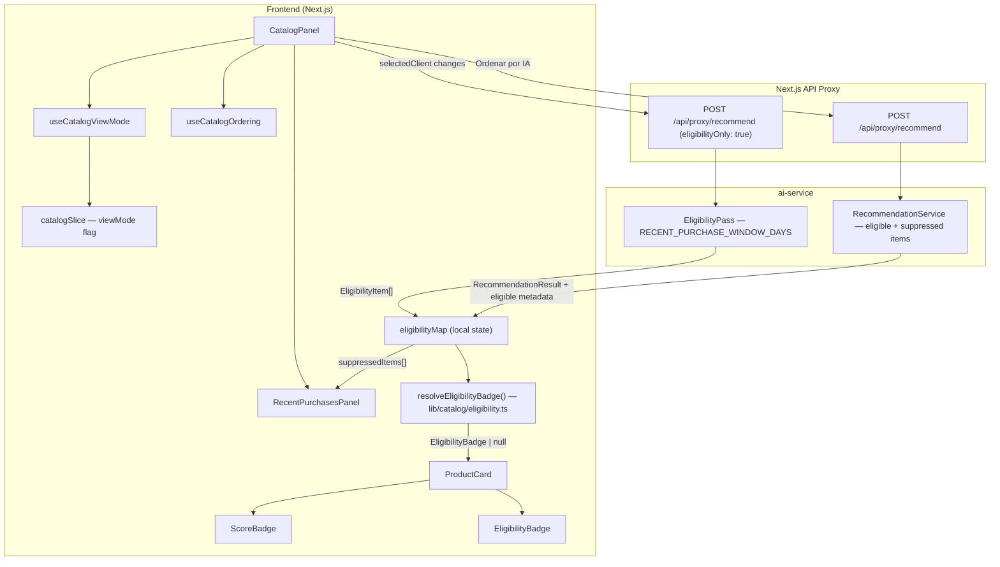
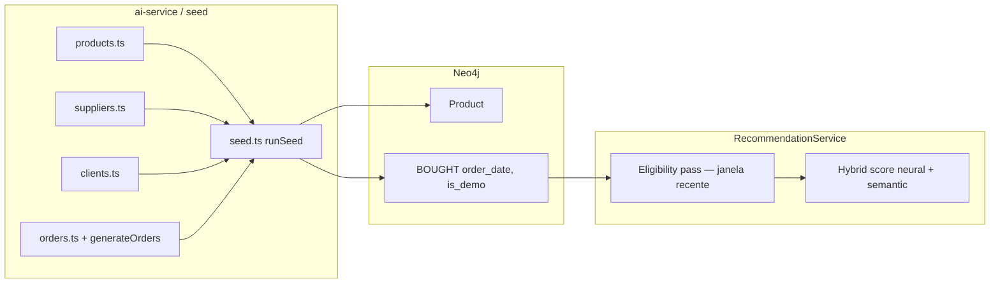

# Design — M16: Neural-First Didactic Ranking & Catalog Density

**Status**: Approved
**Date**: 2026-04-29
**Spec**: [spec.md](./spec.md)

**ADRs — Part I (Design Complex UI):** [ADR-055](./adr-055-eligibility-enriched-recommendation-contract.md), [ADR-056](./adr-056-view-mode-zustand-flag-catalog-view-mode-hook.md), [ADR-057](./adr-057-resolve-eligibility-badge-pure-function.md), [ADR-058](./adr-058-early-eligibility-prefetch-on-client-select.md)

**ADRs — Part II (Design Complex — dados & ai-service):** [ADR-059](./adr-059-seed-density-monolithic-extension.md), [ADR-060](./adr-060-recent-suppression-neo4j-order-date.md), [ADR-061](./adr-061-checkout-sync-persiste-order-date-em-bought.md)

**Estrutura deste documento:** **§ Part I** cobre interface (fluxo *Design Complex UI*). **§ Part II** cobre densidade do seed, camada de elegibilidade no `ai-service` / Neo4j e re-baseline de métricas (fluxo *Design Complex* padrão), exigências do M16 que não estavam detalhadas na primeira rodada.

---

## Part I — Design Complex UI (frontend)

## Architecture Overview



**Key invariants:**
- `eligibilityMap` is the single source of truth for badge display and `RecentPurchasesPanel` — fed by both the pre-fetch (eligibility-only) and the full recommend response.
- `scoreBadge` and `eligibilityBadge` are mutually exclusive on `ProductCard`: when `resolveEligibilityBadge()` returns non-null, `scoreBadge` is not passed.
- `viewMode` lives in Zustand `catalogSlice`; `ordered` (scores available) lives in `useCatalogOrdering` — two orthogonal flags that can both be true simultaneously.

---

## Code Reuse Analysis

| Existing artifact | Reuse in M16 | Change required |
|---|---|---|
| `ProductCard.tsx` | Extend with `eligibilityBadge?: EligibilityBadge \| null` prop | Add eligibility badge rendering; suppress `scoreBadge` when eligibility badge present |
| `ScoreBadge.tsx` | Reused as-is | No change |
| `useCatalogOrdering` | Reused; `viewMode` does NOT go here | No change to hook |
| `catalogSlice` (Zustand) | Add `viewMode: 'vitrine' \| 'ranking'` flag | One new field + `setViewMode` + `resetViewMode` actions |
| `clientSlice.setSelectedClient` | Extend to call `resetViewMode()` | One line added |
| `ReorderableGrid` | Reused as-is for AI-ordered grid | No change |
| `CoverageStatusBanner` | Reused; may receive `viewMode` for context-sensitive copy | Minor prop extension optional |
| `adaptRecommendations()` in `lib/adapters/recommend.ts` | Extend to map `eligible`, `reason`, `suppressionUntil` fields defensively | Null-safe field mapping added |
| `ClientProfileCard` / `useSelectedClientProfile` | Not reused for eligibility — different semantic (`recentProducts` ≠ window-suppressed) | No change |
| `PostCheckoutOutcomeNotice.tsx` | Reused for "o que mudou no modelo" surface (NFD-22..26) | Extend copy/sections for model vs filter attribution |

---

## Components

### New Components

#### `RecentPurchasesPanel`
**Location:** `frontend/components/catalog/RecentPurchasesPanel.tsx`
**Purpose:** Shows products purchased within the suppression window, with last purchase date and return-to-ranking date. Fulfills NFD-15, NFD-16.

**Props:**
```ts
interface RecentPurchasesPanelProps {
  suppressedItems: SuppressedItem[];  // from eligibilityMap, reason === 'recently_purchased'
  loading: boolean;
  clientName?: string;
}
interface SuppressedItem {
  productId: string;
  productName: string;
  purchasedAt: string;        // ISO date
  suppressionUntil: string;   // ISO date — from server
}
```

**States:** loading (skeleton), empty (explicit "nenhuma compra recente" message), populated (list).

#### `EligibilityBadge`
**Location:** `frontend/components/catalog/EligibilityBadge.tsx`
**Purpose:** Renders a colored badge for an ineligible product reason. Fulfills NFD-13, NFD-14, NFD-18.

**Props:**
```ts
interface EligibilityBadgeProps {
  label: string;
  variant: 'amber' | 'gray' | 'blue';  // recently_purchased=amber, no_country=gray, no_embedding=gray, in_cart=blue
  suppressionUntil?: string;            // shown in tooltip when present
}
```

#### `CatalogModeToggle`
**Location:** `frontend/components/catalog/CatalogModeToggle.tsx`
**Purpose:** Toggle button between `Modo Vitrine` and `Modo Ranking IA`. Outline style (secondary) to differentiate from primary blue "✨ Ordenar por IA" button. Fulfills NFD-10, NFD-11, NFD-12.

**Props:**
```ts
interface CatalogModeToggleProps {
  viewMode: 'vitrine' | 'ranking';
  onToggle: () => void;
  disabled?: boolean;          // disabled when no client selected
}
```

### Modified Components

#### `ProductCard`
**New prop:** `eligibilityBadge?: EligibilityBadge | null`
**Change:** When `eligibilityBadge` is non-null, render `<EligibilityBadge>` in place of `<ScoreBadge>`; `scoreBadge` prop is ignored. Apply `opacity-60` + `ring-1 ring-amber-200` to the top badge area only (not the full card) for `recently_purchased` items in `Modo Ranking IA`. No change to cart action area.

**In `Modo Ranking IA`:** Ineligible cards rendered below ranked cards get `data-ineligible="true"` attribute for E2E selectors and `motion-safe:transition-opacity duration-200` on badge group.

#### `CatalogPanel`
**New state:**
```ts
const [eligibilityMap, setEligibilityMap] = useState<Map<string, EligibilityItem>>(new Map());
const [eligibilityLoading, setEligibilityLoading] = useState(false);
```

**New `useEffect`:** fires on `selectedClient` change, runs `fetchEligibility(clientId)` in parallel with `getCart(clientId)`.

**Updated `renderItem`:** calls `resolveEligibilityBadge(product.id, eligibilityMap, cartProductIds)` and passes result as `eligibilityBadge`; passes `scoreBadge` only when `eligibilityBadge === null`.

**New rendering section:** `RecentPurchasesPanel` rendered above the grid when `selectedClient` is set, fed from `eligibilityMap` filtered to `reason === 'recently_purchased'`.

**Toolbar update:** `CatalogModeToggle` added alongside existing "✨ Ordenar por IA" button.

**Ranking mode grid:** in `viewMode === 'ranking'` + `ordered`, `ReorderableGrid` renders eligible items first (sorted by score), ineligible items after with visual separator ("Fora do ranking nesta janela").

#### `PostCheckoutOutcomeNotice`
**Change:** Add section "O que mudou no modelo" that explicitly attributes ranking shifts to neural behavior vs filter changes (NFD-22..26). New `attributionMode: 'model' | 'filters' | 'both'` prop; "filtros aplicados" separated from "mudança do modelo" in copy.

### Unchanged Components

`ScoreBadge`, `ReorderableGrid`, `CoverageStatusBanner`, `CartSummaryBar`, `SemanticSearchBar`, `ProductFilters`, `ModelStatusPanel`, `AnalysisPanel`, `RecommendationColumn` — all reused without structural changes.

---

## New Utilities

### `lib/catalog/eligibility.ts`

```ts
// Pure functions — fully unit-testable without component mounting

export interface EligibilityItem {
  eligible: boolean;
  reason: 'recently_purchased' | 'no_country' | 'no_embedding' | 'eligible';
  suppressionUntil: string | null;
}

export interface EligibilityBadge {
  label: string;
  variant: 'amber' | 'gray' | 'blue';
  suppressionUntil?: string;
}

// Precedence: in_cart > recently_purchased > no_country > no_embedding > eligible (null)
export function resolveEligibilityBadge(
  productId: string,
  eligibilityMap: Map<string, EligibilityItem>,
  cartProductIds: Set<string>
): EligibilityBadge | null

export function filterSuppressedItems(
  eligibilityMap: Map<string, EligibilityItem>,
  allProducts: Product[]
): SuppressedItem[]
```

---

## Data Models

### Extended `RecommendationResult` (frontend type)

```ts
// Additions to lib/types.ts
export interface EligibilityItem {
  eligible: boolean;
  reason: 'recently_purchased' | 'no_country' | 'no_embedding' | 'eligible';
  suppressionUntil: string | null;
}

export interface RecommendationResult {
  product: Product;
  finalScore: number;
  neuralScore?: number;
  semanticScore?: number;
  matchReason: 'semantic' | 'neural' | 'hybrid';
  // NEW — optional, backward-compatible
  eligible?: boolean;
  eligibilityReason?: string;
  suppressionUntil?: string | null;
}
```

### `catalogSlice` additions

```ts
// Additions to catalogSlice
viewMode: 'vitrine' | 'ranking';       // default: 'vitrine'
setViewMode: (mode: 'vitrine' | 'ranking') => void;
resetViewMode: () => void;             // called by clientSlice on client change
```

### AI Service contract extension (for ai-service design phase)

The `POST /recommend` response body gains per-item fields:
```json
{
  "recommendations": [
    {
      "productId": "...",
      "finalScore": 0.87,
      "neuralScore": 0.91,
      "semanticScore": 0.79,
      "matchReason": "hybrid",
      "eligible": true,
      "eligibilityReason": "eligible",
      "suppressionUntil": null
    },
    {
      "productId": "...",
      "finalScore": null,
      "neuralScore": null,
      "semanticScore": null,
      "matchReason": null,
      "eligible": false,
      "eligibilityReason": "recently_purchased",
      "suppressionUntil": "2026-05-06T00:00:00.000Z"
    }
  ]
}
```

Ineligible items appear at the end of the array with `eligible: false` and null scores. The AI service `getCandidateProducts` applies `RECENT_PURCHASE_WINDOW_DAYS` (env, default `7`) using confirmed order dates only — not cart items, not `is_demo` edges (NFD-05).

---

## Error Handling Strategy

| Failure | Behavior |
|---|---|
| `fetchEligibility` fails | `eligibilityMap` stays empty (`new Map()`); no badges shown; `RecentPurchasesPanel` shows empty state; no crash |
| `fetchEligibility` times out | Same as failure — graceful degradation |
| `adaptRecommendations` receives response without eligibility fields | Treats all items as `eligible: true`; backward compatible |
| `viewMode === 'ranking'` but `eligibilityMap` is empty | Shows all items as eligible without suppression grouping; no crash |
| Zero eligible items in `Modo Ranking IA` | Grid shows only ineligible group with "Nenhum item elegível para o ranking nesta janela" header (NFD-07) |

---

## Tech Decisions

| Decision | Choice | Rationale |
|---|---|---|
| Eligibility metadata delivery | Embedded in recommend response (ADR-055) | Avoids race condition; reuses existing proxy route |
| viewMode state | Zustand `catalogSlice` flag (ADR-056) | Survives component unmount; resets on client change without prop drilling |
| Badge precedence | `resolveEligibilityBadge()` pure function (ADR-057) | Unit-testable; single canonical source of truth for precedence |
| Early eligibility data | Pre-fetch on client select, parallel with cart (ADR-058) | Enables vitrine-mode badges without requiring AI trigger |
| Suppressed card visual | `opacity-60` + `ring-1 ring-amber-200` on badge area only | Differentiates from cart-disabled treatment; keeps product info readable |
| Reduced motion | `motion-safe:transition-opacity` on badge group | Respects `prefers-reduced-motion` without disabling the feature |

---

## Interaction States

| Component | State | Trigger | Visual |
|-----------|-------|---------|--------|
| `RecentPurchasesPanel` | loading | `eligibilityLoading === true` | Skeleton rows (2–3) |
| `RecentPurchasesPanel` | empty | `loading=false`, zero suppressed items | "Nenhuma compra recente nesta janela" gray text |
| `RecentPurchasesPanel` | populated | `loading=false`, ≥1 suppressed item | List of product name + last purchased date + return date |
| `CatalogModeToggle` | vitrine (default) | initial / client change | Outline button "🗂 Modo Vitrine" — not pressed |
| `CatalogModeToggle` | ranking | click | Filled button "📊 Modo Ranking IA" — `aria-pressed=true` |
| `CatalogModeToggle` | disabled | no client selected | `opacity-50 cursor-not-allowed` |
| `ProductCard` (eligible, ranking mode) | scored | `eligibilityBadge=null` + `scoreBadge` set | `ScoreBadge` shown, full opacity |
| `ProductCard` (suppressed, ranking mode) | ineligible | `eligibilityBadge` non-null | `EligibilityBadge` shown, `opacity-60 ring-1 ring-amber-200` on badge area |
| `ProductCard` (suppressed, vitrine mode) | badge only | `eligibilityBadge` non-null | `EligibilityBadge` shown, full card opacity (vitrine = informational, not degraded) |
| `ReorderableGrid` ineligible section | separator visible | `viewMode==='ranking'` + ≥1 ineligible | "—— Fora do ranking nesta janela ——" gray divider line |
| `ReorderableGrid` zero eligible | empty ranked section | all items ineligible | "Nenhum item elegível para o ranking nesta janela" header replaces ranked section |

---

## Animation Spec

| Animation | Property | Duration | Easing | Reduced-motion fallback |
|-----------|----------|----------|--------|------------------------|
| Badge group appear (vitrine→ranking) | `opacity` 0→1 | 200ms | `ease-out` | Instant (no transition without `motion-safe`) |
| Badge group disappear (ranking→vitrine) | `opacity` 1→0 | 200ms | `ease-in` | Instant |
| Card reorder (AI sort, existing FLIP) | `transform` | 500ms | `ease-in-out` | Instant (existing ADR-017 behavior preserved) |
| Ineligible card treatment appear | `opacity` on badge area | 200ms | `ease-out` | Instant |
| `RecentPurchasesPanel` mount | No animation | — | — | — |

Implementation: badge group classes: `motion-safe:transition-opacity motion-safe:duration-200`. No new animation libraries; CSS-only.

---

## Accessibility Checklist

| Component | Keyboard nav | Focus management | ARIA | Mobile |
|-----------|-------------|-----------------|------|--------|
| `CatalogModeToggle` | `Tab` to focus, `Enter`/`Space` to toggle | Focus stays on toggle after activation | `aria-pressed={viewMode==='ranking'}`, `aria-label="Alternar entre Modo Vitrine e Modo Ranking IA"` | Touch target ≥44×44px; full width on mobile |
| `EligibilityBadge` with tooltip | `Tab` focusable when `suppressionUntil` present | — | `role="status"`, `aria-label` with full reason text including date | Tap shows tooltip; min touch target inherited from badge padding |
| `RecentPurchasesPanel` item | Not focusable (presentational list) | — | `role="list"`, `role="listitem"` per item | Scrollable if list overflows; 1-column layout |
| `ProductCard` ineligible in ranking mode | Cart button remains `Tab`-reachable | — | `data-ineligible="true"` for E2E; `aria-label` on card updated to include eligibility reason | Full card visible; badge readable at small viewport |

---

## Alternatives Discarded

| Node | Approach | Eliminated in | Reason |
|------|----------|---------------|--------|
| B | New `catalogViewSlice` + separate `/recommend/eligibility` endpoint | Phase 2 | Rule of Three violation (single-consumer abstraction); race condition risk (two parallel calls can diverge); double HTTP overhead |
| C | Local `viewMode` state + `ClientProfileViewModel` for `RecentPurchasesPanel` | Phase 2 | Semantic mismatch: `recentProducts` in profile = "ever bought", not "bought in suppression window"; local state destroyed on tab navigation |

---

## Committee Findings Applied

| Finding | Persona | How incorporated |
|---------|---------|-----------------|
| Suppressed products must not show `scoreBadge` | Staff Product Engineer + QA Staff (non-negotiable) | `renderItem` calls `resolveEligibilityBadge()` first; passes `scoreBadge` only when result is `null` |
| `prefers-reduced-motion` for badge transitions | Staff Product Engineer + Staff UI Designer (non-negotiable) | All badge transition classes wrapped in `motion-safe:` prefix |
| SRP: `viewMode` not in `useCatalogOrdering` | Principal Architect (advisory) | `useCatalogViewMode` companion hook reading from `catalogSlice.viewMode`; `useCatalogOrdering` unchanged |
| Suppression display strings computed in adapter | Staff Engineering (advisory) | `adaptRecommendations()` derives human-readable "X dias" string from `suppressionUntil` ISO date; no `Date.now()` in render |
| Client change resets `viewMode` | QA Staff (advisory) | `clientSlice.setSelectedClient` calls `resetViewMode()`; documented in ADR-056 |
| Badge precedence as pure function | QA Staff (advisory) | `resolveEligibilityBadge()` in `lib/catalog/eligibility.ts`; documented in ADR-057 |
| Mode toggle in outline/secondary style | Staff UI Designer (advisory) | `CatalogModeToggle` uses `border border-gray-300 bg-white` vs blue primary for AI sort button |
| Suppressed card: `opacity-60 + ring-1 ring-amber-200` on badge area only | Staff UI Designer (advisory) | Applied to `hasTopBadge` container div only; card body (name, price, supplier) remains full opacity |
| `eligibilityLoading` skeleton in `RecentPurchasesPanel` | Staff Product Engineer (advisory) | `loading` prop → `<Skeleton>` rows; prevents "empty" misinterpretation during pre-fetch |
| Early eligibility pre-fetch parallel with cart | Staff Engineering (advisory) | `useEffect` on `selectedClient` fires `fetchEligibility` + `getCart` in parallel; documented in ADR-058 |

---

## Part II — Design Complex: seed sintético, ai-service (elegibilidade) e métricas

Esta secção aplica o fluxo **design-complex.md** (ToT → Red Team → Self-Consistency → Comité 3 personas → ADRs) às frentes do M16 **fora** da UI: densidade de catálogo (NFD-27..33), supressão temporal no backend (NFD-01..09 alinhados ao grafo), e re-baseline (NFD-34..38).

### Phase 1 — ToT Divergence (tensões específicas)

| Tensão | Origem no spec |
|--------|------------------|
| Densidade vs tempo de cold start | Seed maior ⇒ mais embeddings + treino mais longo; deve manter `docker compose up` reprodutível |
| Fonte da recência de compra | `RECENT_PURCHASE_WINDOW_DAYS` precisa de datas por compra confirmada — Postgres vs Neo4j |
| Uniformização vs viés pedagógico | `orders.ts` quase uniforme hoje vs viés `segment × category` exigido |

| Node | Approach | Failure point | Cost |
|------|----------|---------------|------|
| A | Estender arrays em `seed/data/*.ts` + `generateOrders()` com funções puras auxiliares no mesmo diretório; supressão recente via Cypher em `BOUGHT.order_date` (já setado no seed) | Arquivos `products.ts`/`orders.ts` ficam longos | low |
| B | Gerador de seed em JSON externo + import em runtime | Quebra tipagem e fluxo atual; passo extra no boot | high |
| C | Chamar api-service a cada `/recommend` para datas de pedido | Latência e falha no hot path; acoplamento desnecessário | high |

**Rule of Three / CUPID (inline):** A não introduz novo bounded context (exempt: contrato de elegibilidade já planeado). B viola composição com `runSeed` actual. C acopla camadas sem ganho — eliminado.

### Phase 2 — Red Team

| Node | Risk | Vector | Severity |
|------|------|--------|----------|
| A | Mesmo MERGE `BOUGHT` por `item_id` pode gerar múltiplas datas por produto se compras repetidas — precisa `max(order_date)` por `(client, product)` na query de supressão | data consistency | Medium |
| A | Seed ~125 produtos aumenta tempo de `embeddings/generate` no cold start | I/O | Medium |
| B | Script externo não validado pelo TypeScript do repo | rollback | High |
| C | Latência HTTP + disponibilidade api-service em cada recomendação | I/O | High |

### Phase 3 — Self-Consistency Convergence

```
Winning node: A
Approach: Monolithic seed extension + Neo4j-first suppression usando BOUGHT.order_date e env RECENT_PURCHASE_WINDOW_DAYS
Why it wins over B: B quebra o pipeline tipado e o verifyCounts sem ganho arquitectónico
Why it wins over C: C adiciona latência e ponto de falha no hot path; o grafo já tem order_date
Key trade-off accepted: Ficheiros de seed mais longos e cold start um pouco mais pesado — aceite pelo valor didático (NFD-27..31)
Path 1 verdict: A — menor severidade agregada após mitigação (max(order_date), monitorização de tempo de boot)
Path 2 verdict: A — alinha com ADR-059, ADR-060 e com código actual (`seed.ts` já persiste order_date em BOUGHT)
```

### Phase 4 — Committee Review (3 personas)

| Persona | Finding | Severity | Proposed improvement |
|---------|---------|----------|---------------------|
| Principal Software Architect | Supressão e ranking devem permanecer em camadas distintas: primeiro elegibilidade (filtro), depois score híbrido sem alterar pesos | Low | `RecommendationService` orquestra: (1) lista de candidatos elegíveis para score (2) lista suprimida com metadados para resposta completa |
| Staff Engineering | `getCandidateProducts` hoje exclui todos os `purchasedIds`; M16 deve substituir por exclusão só de compras dentro da janela + manter exclusão vitalícia opcionalmente só onde spec exija — na prática: candidatos = país + embedding − {recentes} | Medium | Novo método ou parâmetro `recentPurchaseCutoff` derivado de `env` |
| QA Staff | Testes Vitest em `RecommendationService` / repositório devem cobrir: produto comprado há 1 dia (suprimido), há 10 dias (elegível), múltiplas compras do mesmo SKU | Medium | Fixtures Neo4j ou mocks de session com `order_date` variado |

**Self-consistency:** Staff Engineering + QA convergem na necessidade de testes com `order_date` — **non-negotiable:** cenários de supressão cobertos por teste automatizado antes de merge.

### Architecture Overview — Part II



### Code Reuse Analysis — Part II (ai-service)

| Artifact | Reuse | Change |
|----------|-------|--------|
| `Neo4jRepository.getCandidateProducts` | Base para candidatos por país | Excluir apenas compras **recentes** (não todo o histórico); expor ou derivar conjunto suprimido com razões |
| `Neo4jRepository.getPurchasedProductIds` | Hoje retorna todos os BOUGHT não-demo | Evoluir para `getRecentPurchasesForRanking()` ou filtro interno com cutoff |
| `RecommendationService.recommend` / `recommendFromCart` | Orquestração existente | Após candidatos: calcular scores só para elegíveis; anexar itens suprimidos ao payload de resposta |
| `config/env.ts` | Padrão existente | `RECENT_PURCHASE_WINDOW_DAYS` (default `7`) |
| `seed.ts` | MERGE BOUGHT com `order_date` | Manter; validar que contagens PG/Neo4j continuam a bater após mais produtos/pedidos |
| `ModelTrainer` / `training-utils.ts` | Treino e métricas | Re-baseline `precisionAt5` documentado em README ou `.specs/project/STATE.md` após novo seed |

### Seed density — entregáveis (NFD-27..33)

| Entregável | Critério spec | Notas de implementação |
|------------|---------------|-------------------------|
| Total de SKUs | Piso ~85, alvo preferido ~125 | Documentar contagem final em comentário no topo de `products.ts` |
| `beverages` + `food` | 20–25 cada | Expandir descrições para não colapsar embeddings em duplicatas |
| Suppliers | > 3 | Novos UUIDs em `suppliers.ts`; referência em produtos |
| Pedidos | Viés `segment × category`, recompra | Refactor incremental de `generateOrders()` sem alterar invariantes de `verifyCounts` |
| Disponibilidade por país | Reduzir “falso vazio” regional | Revisar `available_in` ao adicionar SKUs |
| Reprodutibilidade | `docker compose up` limpo | Reexecutar verificação cold start; documentar tempo esperado se ultrapassar `start_period` actual |

### Métricas — re-baseline (NFD-34..38)

| Item | Acção |
|------|--------|
| `precisionAt5` | Registrar novo baseline após seed estável (tabela em README ou STATE.md) |
| `recall@10`, `nDCG@10` | Métricas auxiliares — scripts ou logs existentes em `ModelTrainer`; não substituem gate de promoção |
| `SOFT_NEGATIVE_SIM_THRESHOLD`, `negativeSamplingRatio` | Reavaliar após distribuição de embeddings mais densa; documentar rationale se mudar |
| Gate principal | Continua `precisionAt5` até decisão de comité |

### Error Handling Strategy — Part II

| Failure | Behavior |
|---------|----------|
| `order_date` ausente num edge `BOUGHT` legado | Tratar como **fora** da janela recente OU inelegível conservador — escolha única documentada no PR + teste |
| Seed verification falha após expansão | Bloquear merge até PG/Neo4j alinhados |
| Cold start excede healthcheck | Ajustar `start_period` / documentação apenas se medição real justificar |

### Alternatives Discarded — Part II

| Node | Approach | Eliminated in | Reason |
|------|----------|---------------|--------|
| B | JSON seed gerado externamente | Phase 2 | Alta severidade: regressão de DX e verifyCounts |
| C | Datas de pedido só via api-service em cada recommend | Phase 2 | Alta severidade latência/I/O; grafo já tem `order_date` |

### Committee Findings Applied — Part II

| Finding | Persona | How incorporated |
|---------|---------|------------------|
| Testes automatizados para `order_date` / janela | Staff Engineering + QA (non-negotiable) | Plano de testes em `RecommendationService` / Neo4jRepository com cenários de supressão |
| Separação elegibilidade vs ranking | Principal Architect | ADR-060 + orquestração em `RecommendationService` |
| Seed monolítico estendido | Staff Engineering (fitness ao repo) | ADR-059 |

---

## Requirements Traceability

| Req ID | Design artifact that covers it |
|---|---|
| NFD-01 | `ai-service`: `getCandidateProducts` uses `RECENT_PURCHASE_WINDOW_DAYS`; `RecommendationService` contract |
| NFD-02 | `ai-service` response includes ineligible items with `eligible: false`; `CatalogPanel` renders them in both modes |
| NFD-03 | `RecommendationResult` extended with `eligible`, `eligibilityReason`, `suppressionUntil`; `adaptRecommendations()` maps them |
| NFD-04 | Window expiry is a server-side date comparison; next pre-fetch after window expires returns `eligible: true` |
| NFD-05 | AI service uses confirmed order dates only (no cart, no `is_demo`) — backend design constraint documented here |
| NFD-06 | `resolveEligibilityBadge()` handles all reason types; `EligibilityBadge` renders distinct copy per reason |
| NFD-07 | Zero eligible items: `ReorderableGrid` shows "Nenhum item elegível" header; grid not empty |
| NFD-08 | `resolveEligibilityBadge()` precedence order: `in_cart > recently_purchased > no_country > no_embedding` |
| NFD-09 | `finalScore` untouched; no boost logic added — enforced by ADR-055 contract |
| NFD-10 | `CatalogModeToggle` component; `useCatalogViewMode` hook |
| NFD-11 | `viewMode === 'vitrine'`: `ReorderableGrid` renders all items; no filtering |
| NFD-12 | `viewMode === 'ranking'` + `ordered`: eligible items sorted at top; ineligible below separator |
| NFD-13 | `EligibilityBadge` on `ProductCard` in both modes |
| NFD-14 | `resolveEligibilityBadge()` covers `no_country`, `no_embedding`, `in_cart` variants |
| NFD-15 | `RecentPurchasesPanel` fed from pre-fetch eligibility data; populated on client select |
| NFD-16 | `RecentPurchasesPanel` empty state: explicit "Nenhuma compra recente nesta janela" message |
| NFD-17 | `clientSlice.setSelectedClient` resets `viewMode` + clears `eligibilityMap` (re-fetch fires) |
| NFD-18 | `eligibilityBadge` and `scoreBadge` mutually exclusive in `ProductCard.renderItem` |
| NFD-19 | `ProductDetailModal` receives `eligibilityBadge` — eligibility visible in detail surface |
| NFD-20 | `finalScore` = `neuralScore * weight + semanticScore * weight` — no change; enforced by AI service |
| NFD-21 | No boost props added to recommendation call; `PostCheckoutOutcomeNotice` attributes ranking to model, not to rules |
| NFD-22 | `PostCheckoutOutcomeNotice` extended with "O que mudou no modelo" vs "Filtros aplicados" sections |
| NFD-23 | `PostCheckoutOutcomeNotice` copy attributes `promoted/rejected/failed` to orders/version/deltas |
| NFD-24 | `EligibilityBadge` with `recently_purchased` reason shown as operational filter, not model rejection |
| NFD-25 | "O que mudou no modelo" section explicitly states: "Afinidade de categoria emerge do comportamento neural" |
| NFD-26 | `PostCheckoutOutcomeNotice` state `no_change` shows "Nenhuma mudança detectada no modelo" without fabricating uplift |
| NFD-27 | Part II: ADR-059; expansão de `products.ts` até piso ~85 SKUs | 
| NFD-28 | Part II: 20–25 SKUs em `beverages` e `food` cada em `products.ts` |
| NFD-29 | Part II: mais de 3 suppliers em `suppliers.ts` + referências nos produtos |
| NFD-30 | Part II: `orders.ts` / `generateOrders()` com viés segment×category e recompra |
| NFD-31 | Part II: validação qualitativa — após 3–4 compras na mesma categoria ainda há candidatos inéditos no país |
| NFD-32 | Part II: descrições e `available_in` diversos para semântica e cobertura geográfica |
| NFD-33 | Part II: `verifyCounts` + cold start reprodutível; ajustar docs/compose só se medido |
| NFD-34 | Part II: novo baseline `precisionAt5` documentado pós-seed |
| NFD-35 | Part II: `recall@10` / `nDCG@10` como métricas auxiliares |
| NFD-36 | Part II: revisão de `SOFT_NEGATIVE_SIM_THRESHOLD` e `negativeSamplingRatio` com rationale |
| NFD-37 | Part II: gate de promoção continua `precisionAt5` |
| NFD-38 | Part II: evidência final quantitativa + observação qualitativa do ranking |
