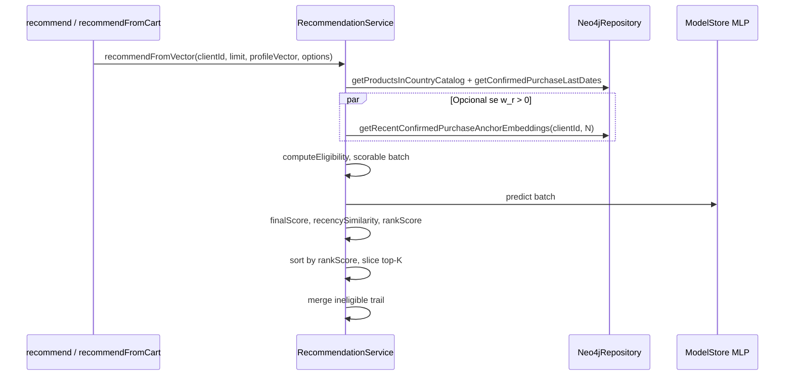
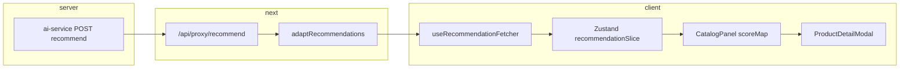
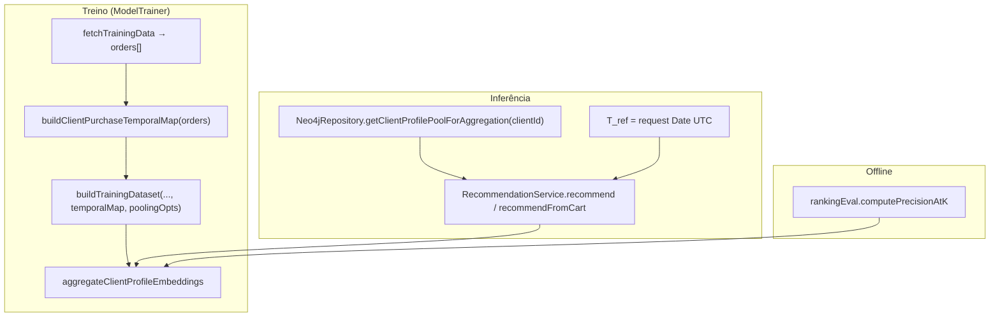

# M17 — Design técnico (recência em fases + transparência de score)

**Escopo:** Fase 1 ([spec.md](./spec.md), [ADR-062](./adr-062-phased-recency-ranking-signals.md)) + fatia **ADR-063** (decomposição na API e modal) + **Fase 2** *design* ([§13](#13-m17-p2--design-complex-pooling-treinoinferência), [ADR-065](./adr-065-m17-p2-shared-profile-pooling-and-temporal-alignment.md); implementação pendente).  
**Data:** 2026-04-30 (P1 núcleo), 2026-05-01 (ADR-063)  
**Estado:** **P1 + ADR-063/064 implementados** (§1–§7, §11–§12). **P2:** [§13](#13-m17-p2--design-complex-pooling-treinoinferência) *Approved* (design complex 2026-05-01) + [ADR-065](./adr-065-m17-p2-shared-profile-pooling-and-temporal-alignment.md). **Pendente implementação:** P2 (tarefas a regenerar), **P3** (atenção). **Tarefas P1:** [tasks.md](./tasks.md) — concluídas.

### Estado de implementação (actualizado 2026-05-01)

| Secção design | Âmbito | Estado |
|---------------|--------|--------|
| §1–§7 | P1 núcleo ADR-062 (`ai-service`) | **Implementado** — env, Neo4j âncoras, `RecommendationService`, tipos, testes, README, `STATE.md` |
| §11 | Envelope `rankingConfig` + termos por item (ADR-063) | **Implementado** no `ai-service` (`RecommendEnvelope`, serialização em `routes/recommend.ts`) |
| §12 | UI / Zustand / proxy | **Implementado** — `adaptRecommendations`, rotas proxy, `recommendationSlice`, `ProductDetailModal`, `CatalogPanel` |
| §13 | P2 pooling treino+inferência | **Design Approved** — ver secção; [ADR-065](./adr-065-m17-p2-shared-profile-pooling-and-temporal-alignment.md) |

---

## 1. Resumo executivo

P1 aplica um **re-ranking** apenas entre candidatos já **elegíveis** (pós-M16: carrinho, `recently_purchased`, `no_embedding` excluídos antes do batch neural). O **`finalScore`** permanece **exclusivamente** `NEURAL_WEIGHT * neuralScore + SEMANTIC_WEIGHT * semanticScore`. Um segundo escalar, **`rankScore`**, ordena o top-K interno; com peso `0`, a ordenação entre elegíveis coincide com a ordenação por `finalScore` atual.

**Complexidade principal:** as âncoras exigem **ordem temporal explícita** por compra confirmada com `order_date`, alinhada à supressão M16. O método existente `getClientPurchasedEmbeddings` **não** garante ordem nem correlaciona produto ↔ data; **não** serve como fonte de âncoras.

---

## 2. Contratos numéricos

### 2.1 `finalScore` (inalterado, PRS-01)

Para cada candidato elegível com embedding:

\[
\texttt{finalScore} = w_n \cdot \texttt{neuralScore} + w_s \cdot \texttt{semanticScore}
\]

com \(w_n = \texttt{NEURAL\_WEIGHT}\), \(w_s = \texttt{SEMANTIC\_WEIGHT}\) (env existentes).

### 2.2 Similaridade de recência (PRS-04)

- **Âncoras:** vetores `number[]` (mesma dimensão que embeddings de catálogo), derivados só de compras **confirmadas** (`BOUGHT`, `coalesce(r.is_demo, false) = false`), com **`r.order_date IS NOT NULL`** (mesmo critério temporal que [getConfirmedPurchaseLastDates](../../ai-service/src/repositories/Neo4jRepository.ts)), produto com **`p.embedding IS NOT NULL`**.
- **Agregação multi-âncora (default):** para cada candidato,

\[
\texttt{recencySimilarity} = \max_{k=1..K} \cos(\texttt{candidateEmbedding}, \texttt{anchor}_k)
\]

com \(K \le \texttt{RECENCY\_ANCHOR\_COUNT}\) (env abaixo). **Não** introduzir média em P1 salvo ADR futuro; spec fixa máximo até decisão contrária.

- Se \(K = 0\) (sem âncoras utilizáveis): \(\texttt{recencySimilarity} = 0\) para todos os elegíveis (PRS-06).

### 2.3 `rankScore` e ordenação (PRS-02, PRS-05)

Seja \(w_r = \texttt{RECENCY\_RERANK\_WEIGHT}\).

\[
\texttt{rankScore} = \texttt{finalScore} + w_r \cdot \texttt{recencySimilarity}
\]

**Regras:**

- **`finalScore` não** inclui termo de recência (expressão aritmética separada).
- Ordenação dos **elegíveis pontuados pelo MLP** (lista `scored` antes do slice): chave primária **`rankScore` descendente**; desempate **determinístico** (PRS implícito em edge cases / spec linha 103):
  - secundário: **`finalScore` descendente** (estabilidade face ao legado quando \(w_r=0\) ou `recencySimilarity` igual);
  - terciário: **`sku` ascendente** lexicográfico (ou `id` se preferência única — **decisão:** `sku` por legibilidade operacional; documentar na implementação).

Com \(w_r = 0\): \(\texttt{rankScore} = \texttt{finalScore}\); empates resolvem-se como hoje **mais** desempate `sku` (comportamento pode diferir ligeiramente do passado só onde havia empate exato em `finalScore`; aceite para determinismo).

---

## 3. Variáveis de ambiente (ortogonais, ADR-062)

| Nome canónico | Tipo | Default | Validação (preferência spec PRS-10) |
|---------------|------|---------|-------------------------------------|
| `RECENCY_RERANK_WEIGHT` | float | `0` | Se definido: deve ser finito e **≥ 0**. **Negativo ou NaN → falha de arranque** com mensagem explícita. Ausente ⇒ `0`. |
| `RECENCY_ANCHOR_COUNT` | int | `1` | Se definido: inteiro **≥ 1** (cap razoável opcional, ex. 10). Inválido ⇒ falha de arranque ou clamp documentado — **decisão:** falha de arranque se `< 1` ou não finito; cap superior **10** para evitar consultas pesadas. |

Log de arranque (nível `info`): imprimir `RECENCY_RERANK_WEIGHT` e `RECENCY_ANCHOR_COUNT` efectivos, como já feito para pesos híbridos.

`.env.example`: documentar ambas (success criteria spec).

---

## 4. Dados: novo método Neo4j (âncoras)

### 4.1 Problema

`getClientPurchasedEmbeddings` executa `MATCH ... RETURN p.embedding` **sem** `ORDER BY` nem `order_date`, e **sem** `productId`. Não há garantia de “última compra com embedding”.

### 4.2 Assinatura proposta

`Neo4jRepository.getRecentConfirmedPurchaseAnchorEmbeddings(clientId: string, limit: number): Promise<number[][]>`

- **Semântica:** produtos distintos comprados pelo cliente em relações `BOUGHT` não-demo, com `order_date` não nulo e `embedding` não nulo; por produto, `lastPurchase = max(datetime(toString(r.order_date)))` (coerente com M16); ordenar por `lastPurchase` **DESC**; devolver os primeiros `limit` embeddings **nessa ordem** (mais recente primeiro).
- **Vazio:** `[]` se não houver linhas (boost neutro).

### 4.3 Cypher (implementação)

Alinhar tipos datetime com `getConfirmedPurchaseLastDates` (`datetime(toString(r.order_date))`).

```cypher
MATCH (:Client {id: $id})-[r:BOUGHT]->(p:Product)
WHERE coalesce(r.is_demo, false) = false
  AND r.order_date IS NOT NULL
  AND p.embedding IS NOT NULL
WITH p.id AS productId, p.embedding AS embedding,
     max(datetime(toString(r.order_date))) AS lastPurchase
ORDER BY lastPurchase DESC, productId ASC
LIMIT $limit
RETURN embedding AS embedding
```

Uma linha por produto (agregação por `productId`); `LIMIT` aplica-se após ordenação global por `lastPurchase` descendente. Mapear cada record para `embedding` como `number[]`.

**Nota:** empate temporal ⇒ desempate estável `productId ASC`.

---

## 5. Fluxo em `RecommendationService.recommendFromVector`



**Passos:**

1. Carregar catálogo + `lastPurchaseMap` (existente).
2. Se `w_r > 0`: carregar âncoras com `getRecentConfirmedPurchaseAnchorEmbeddings(clientId, N)`; senão, não chamar Neo4j extra (optimização: peso `0` ⇒ zero queries âncora).
3. Construir `scorable`, neural batch, `finalScore` / `matchReason` (existente).
4. Para cada item em `scorable`, se `w_r > 0` e âncoras não vazias: `recencySimilarity = max cosine`; senão `0`.
5. `rankScore = finalScore + w_r * recencySimilarity`.
6. `sort` com chaves acima; `slice(0, cappedLimit)`.
7. `toRecommendationItem` estendido para incluir campos opcionais de resposta (secção 6).

**`recommend` vs `recommendFromCart` (PRS-08):** âncoras **só** de `clientId` (compras confirmadas). Carrinho altera apenas `profileVector` e `cartIds` para elegibilidade — mesma função de âncora e mesma fórmula.

---

## 6. Contrato API / tipos (PRS-09)

Estender `RecommendationResult` com campos **opcionais** (`number | null` ou omitidos quando peso 0):

| Campo | Quando preencher | Semântica |
|-------|------------------|-----------|
| `recencySimilarity` | `w_r > 0` e elegível com scores | Valor usado no termo de boost; `null` para inelegíveis ou quando peso 0 (evitar ruído). |
| `rankScore` | `w_r > 0` e elegível com scores | Valor usado na ordenação; com `w_r = 0` pode ser omitido ou igual a `finalScore` — **decisão:** omitir ou `null` com peso 0 para JSON mais limpo; com `w_r > 0` sempre preencher para elegíveis no bloco rankeado. |

**Compatibilidade:** clientes que ignoram campos novos permanecem válidos. Documentar no README do `ai-service` se algum consumidor depender só de `finalScore` para ordenação: com boost ativo, a **ordem** segue `rankScore`.

---

## 7. Matriz de testes sugeridos

| Cenário | Expectativa |
|---------|-------------|
| `RECENCY_RERANK_WEIGHT=0` | Ordem elegíveis = ordenação por `finalScore` desc + desempate `sku` (comparação com baseline ou snapshot). |
| Dois SKUs, `finalScore` quase iguais, âncora mais próxima de um | Com `w_r > 0`, ordem inverte ou ajusta conforme cosseno; `finalScore` idêntico por SKU vs run com peso 0. |
| Cliente sem compras com embedding / query vazia | `recencySimilarity = 0`, ordem = só `finalScore`. |
| Produto `recently_purchased` | Continua fora de `scorable`; nunca recebe boost. |
| Env inválido (`-1`, `NaN`) | Processo termina no arranque com erro claro. |

---

## 8. Rastreio PRS (P1)

| ID | Coberto em |
|----|------------|
| PRS-01 | §2.1 |
| PRS-02 | §2.3 + §7 |
| PRS-03 | §3, §4 (N produtos por recência de compra) |
| PRS-04 | §2.2 |
| PRS-05 | §2.3 |
| PRS-06 | §2.2 |
| PRS-07 | §1, §5 (só `scorable`) |
| PRS-08 | §5 |
| PRS-09 | §6 |
| PRS-10 | §3 |
| PRS-16–PRS-22 | [§11](#11-adr-063--decomposição-de-score-api--modal) |

---

## 9. Fora deste design (legado desta secção)

- **P2** passou a estar especificado em [§13](#13-m17-p2--design-complex-pooling-treinoinferência).
- **P3** — atenção temporal sobre sequência de pedidos: fora de P2; `design` dedicado quando priorizado ([spec](./spec.md)).
- Modo `mean` para **agregação de cossenos multi-âncora** P1 (não confundir com pooling de perfil P2): permanece **máximo** até ADR futuro.

---

## 10. Próximo passo workflow

**`execute` P1+ADR:** ~~T1–T11~~ **concluído** ([tasks.md](./tasks.md)). **Seguinte:** **`tasks`** para **P2** (nova série T*) → **`execute`** P2; depois **P3** quando priorizado no [spec](./spec.md).

---

## 11. ADR-063 — Decomposição de score (API + modal)

**Fonte:** [ADR-063](./adr-063-score-breakdown-api-and-product-detail-modal.md). **Decisão:** Opção A — metadados de ranking no envelope HTTP + UI alinhada; **não** duplicar pesos só no `NEXT_PUBLIC_*` como fonte primária.

### 11.1 Envelope de resposta (`rankingConfig`)

Em `POST /api/v1/recommend` e `POST /api/v1/recommend/from-cart`, além do array de itens, serializar um objecto **`rankingConfig`** no **mesmo nível** que a lista (irmão de `recommendations` / nome canónico já usado pelo `ai-service` — alinhar implementação ao handler existente):

| Campo | Tipo | Semântica |
|--------|------|------------|
| `neuralWeight` | `number` | Valor efectivo `NEURAL_WEIGHT` do processo |
| `semanticWeight` | `number` | Valor efectivo `SEMANTIC_WEIGHT` do processo |
| `recencyRerankWeight` | `number` | Valor efectivo `RECENCY_RERANK_WEIGHT` (inclui `0`) |

**Compatibilidade:** clientes antigos ignoram `rankingConfig`. Campos numéricos finitos; sem `NaN`.

### 11.2 Item — campos existentes + opcionais ADR-063

Manter [§6](#6-contrato-api--tipos-prs-09): `finalScore`, `neuralScore`, `semanticScore`, `recencySimilarity`, `rankScore` conforme `w_r`.

**Opcional (preferência de implementação):** por item, quando útil para UI sem duplicar fórmulas no cliente:

| Campo | Semântica |
|-------|------------|
| `hybridNeuralTerm` | `neuralWeight × neuralScore` (mesmo arredondamento que o servidor usar internamente, se aplicável) |
| `hybridSemanticTerm` | `semanticWeight × semanticScore` |
| `recencyBoostTerm` | `recencyRerankWeight × recencySimilarity` |

Se omitidos, o **frontend** calcula com `rankingConfig` + scores brutos; **não** inferir `recencyRerankWeight` apenas por `(rankScore − finalScore) / recencySimilarity` como única fonte (casos `recencySimilarity = 0` e arredondamento).

### 11.3 Proxy Next.js (`/api/proxy/recommend`)

Hoje o handler faz `adaptRecommendations(data)` e responde `{ results, isFallback }`, **descartando** o resto do JSON upstream. Para PRS-17:

- Extrair `rankingConfig` (e quaisquer chaves de nível-resposta acordadas) **antes** ou **depois** do adapter.
- Responder p.ex. `{ results, isFallback, rankingConfig }` com `rankingConfig` opcional se ausente.

O adapter (`adaptRecommendations`) **pode** aceitar o objecto completo e devolver `{ results, isFallback, rankingConfig }` para um único ponto de parse.

### 11.4 Estado e `scoreMap` (frontend)

- O slice/hook de recomendações SHALL guardar `rankingConfig` junto com `results`.
- `CatalogPanel` ao construir `scoreMap` SHALL fundir por `product.id` não só `finalScore` / `neuralScore` / `semanticScore` / `rankScore`, mas também `recencySimilarity` e, se existirem, termos pré-calculados — tipo do mapa alargado (ver implementação).
- Ordenação na grelha já usa `rankScore ?? finalScore` onde aplicável; o modal SHALL **explicar** essa chave quando `recencyRerankWeight > 0`.

### 11.5 `ProductDetailModal` — copy e testes

Secção “RESUMO DO SCORE ATUAL” (ou título equivalente):

- Percentagem ou escala de `finalScore` como híbrido **puro** (só rede + semântico ponderados; o valor percentual **não** inclui o boost de recência na ordenação).
- Linhas numéricas: contribuição neural e semântica **em pontos** (via termos servidor ou `rankingConfig`).
- Recência na ordenação: `recencySimilarity`, `recencyBoostTerm` ou equivalente, incremento `rankScore − finalScore`, e `rankScore` com rótulo “ordenação (rankScore)”.
- Envolver bloco explicável em `data-testid="product-detail-score-summary"` (PRS-22).

### 11.6 Rastreio PRS (ADR-063)

| ID | Coberto em |
|----|------------|
| PRS-16 | §11.1 |
| PRS-17 | §11.3, §11.4 |
| PRS-18 | §11.5 |
| PRS-19 | §11.1, §11.3 (proibir opção B como única fonte) |
| PRS-20 | §11.2 |
| PRS-21 | §11.3 (fallback sem config), spec edge cases |
| PRS-22 | §11.5 |

---

## 12. Complex UI design (ADR-063) — TLC `design-complex-ui`

**Trigger:** comando *design complex UI* sobre a fatia ADR-063 já especificada. **Modo:** automático (sem gate `approve`). **Pré-voo:** [spec.md](./spec.md) (PRS-16–22), [.specs/codebase/frontend/ARCHITECTURE.md](../../codebase/frontend/ARCHITECTURE.md), [CONVENTIONS.md](../../codebase/frontend/CONVENTIONS.md), [CONCERNS.md](../../codebase/frontend/CONCERNS.md). **Nota de verificação:** o catálogo usa **`useRecommendations` → Zustand** (`recommendationSlice` + `useRecommendationFetcher`), não só o `RecommendationContext` legado — o desenho UI alinha-se ao Zustand.

### 12.1 Phase 1 — ToT divergence (nós)

| Node | Approach | Failure point | Cost |
|------|----------|---------------|------|
| **A** | `rankingConfig` no **Zustand** `recommendationSlice`, limpo com `clearRecommendations`; `adaptRecommendations` devolve `{ results, isFallback, rankingConfig }`; `scoreMap` alarga tipo; modal recebe prop agregada `scoreBreakdown`. | Assinatura `setRecommendations` muda → todos os call-sites a actualizar. | medium |
| **B** | `rankingConfig` só em **estado local** do `CatalogPanel` após fetch. | Dessincronia com troca de cliente / `clearRecommendations`; outro consumidor não vê pesos. | low short-term, **high** lifecycle |
| **C** | **Novo slice** Zustand `rankingConfigSlice` isolado. | Duas escritas por request; mais boilerplate; sem evidência de reutilização multi-feature (Rule of Three). | medium |

**Rule of Three / CUPID:** A — reutiliza padrão actual de fetch→store; C — antecipa abstração sem segunda feature consumidora; B — compõe mal com `clearRecommendations`.

### 12.2 Phase 2 — Red team (resumo)

| Node | Risk | Vector | Severity |
|------|------|--------|----------|
| A | Regressão em call-sites do `setRecommendations` | data consistency | Medium |
| B | Stale `rankingConfig` após `clearRecommendations` omitido no painel | data consistency | **High** |
| C | Estado duplicado entre slices | race / mental model | Medium |
| A/B | Modal sem `aria-describedby` para bloco denso de números | accessibility | Low (mitigar com estrutura semântica + títulos) |
| *Todos* | Sem testes unitários no repo (C-F02) | regression | Medium (mitigar: teste adapter + testid E2E) |

### 12.3 Phase 3 — Convergência (duas trilhas)

```
Winning node: A
Approach: Estender o slice e o adapter existentes; propagar `rankingConfig` e campos por item até `scoreMap` e `ProductDetailModal`.
Why it wins over B: B falha no ciclo de vida global e no risco C-F01 (cliente vs recomendações).
Why it wins over C: C introduz slice paralelo sem justificação de reutilização.
Key trade-off accepted: tocar na assinatura `setRecommendations` / fetcher (diff maior, comportamento mais correcto).
Path 1 verdict: A — menor severidade agregada após mitigação de call-sites.
Path 2 verdict: A — alinha com [.specs/codebase/frontend/ARCHITECTURE.md](../../codebase/frontend/ARCHITECTURE.md) (Zustand como estado de recomendações efectivo).
```

### 12.4 Phase 4 — Comité (5 personas) — findings

| Persona | Finding | Severity | Proposed improvement |
|---------|---------|----------|----------------------|
| Principal Software Architect | `rankingConfig` deve limpar-se **atomicamente** com recomendações no mesmo `set` Zustand. | High | Aceite [ADR-064](./adr-064-rankingconfig-zustand-recommendation-slice.md). |
| Staff Engineering | Proxy deve repassar `rankingConfig` antes do parse para não perder chaves. | Medium | T8 em [tasks.md](./tasks.md); teste de route handler. |
| QA Staff | C-F02: sem Vitest dedicado ao adapter; regressão do adapter é menos visível. | Low | **Opcional:** Vitest `adaptRecommendations` (débito C-F02; fora do fecho M17 P1+ADR). |
| Staff Product Engineer | Modal denso: leitura e **Escape** para fechar (Radix Dialog). | Low | Manter `Dialog`; garantir título único e hierarquia de cabeçalhos no bloco de score. |
| Staff UI Designer | Evitar animar `height` ao expandir linhas de score; respeitar **reduced motion**. | Medium | Só `opacity`/`transform` se houver reveal; fallback instantâneo. |

**2+ personas (non-negotiable):** (1) limpeza atómica Architect + Staff Eng → ADR-064; (2) reduced-motion UI Designer + QA → §12.10.

### 12.5 Architecture overview (UI + dados)



### 12.6 Code reuse analysis

- **Reutilizar:** `components/ui/dialog` (shadcn), `ProductDetailModal` existente (`data-testid` já presente), `adaptRecommendations`, `useRecommendationFetcher`, `recommendationSlice`.
- **Novo (pequeno):** tipo `RankingConfig` em `lib/types.ts`; função pura `buildScoreBreakdownView(rankingConfig, item)` em `lib/` (opcional) para manter SRP no modal; ou campos pré-calculados do servidor para evitar duplicar fórmula.
- **Não introduzir:** biblioteca de animação nova; segundo store global.

### 12.7 Components

| Component | Responsabilidade |
|-----------|------------------|
| `ProductDetailModal` | Orquestra secções; passa dados ao bloco de score; estados de presença/ausência de `rankingConfig`. |
| `ProductDetailScoreSummary` (opcional extrair) | Apresentação só do bloco azul: híbrido em pontos, recência, `rankScore`; facilita teste isolado. |
| `CatalogPanel` | Constrói `scoreMap` com campos alargados + lê `rankingConfig` do hook. |

### 12.8 Data models (UI)

- **`RankingConfig`:** `{ neuralWeight: number; semanticWeight: number; recencyRerankWeight: number }`.
- **Entrada do modal:** `scoreSummary` alargado (extends `ScoreBadgeProps`) com `recencySimilarity?`, `rankScore?`, termos opcionais `hybridNeuralTerm?`, etc.; **`rankingConfig`** passado como prop separada **ou** embutido no mapa por produto — **decisão:** prop ao nível do `CatalogPanel` lida `rankingConfig` do store **uma vez** por render de modal (mesmo para todos os itens da resposta), evitando repetir no `Map` por SKU.

### 12.9 Error handling strategy (UI)

- **`rankingConfig` ausente:** mostrar apenas `finalScore` + brutos; texto curto “Pesos runtime indisponíveis nesta versão do serviço” (PRS-21).
- **`recencyRerankWeight === 0`:** omitir subsecção de boost ou mostrar “Recência inactiva (`w_r=0`)”.
- **Erro de rede:** já tratado pelo fetcher/painel; modal não abre score sem `scoreSummary`.

### 12.10 Tech decisions

| Decisão | Escolha | ADR |
|---------|---------|-----|
| Onde persiste `rankingConfig` | Zustand `recommendationSlice` | [ADR-064](./adr-064-rankingconfig-zustand-recommendation-slice.md) |
| Fórmula no cliente | Preferir termos servidor; senão `rankingConfig ×` brutos | ADR-063 |
| Testes estáveis | `data-testid="product-detail-score-summary"` (já no código) | PRS-22 |

### 12.11 Interaction states

| Component | State | Trigger | Visual |
|-----------|-------|---------|--------|
| `ProductDetailModal` | idle | produto seleccionado | Dialog aberto, conteúdo estável |
| `ProductDetailModal` | score partial | sem `rankingConfig`, com scores | Grid 3 colunas actual; aviso discreto |
| `ProductDetailModal` | score full | `rankingConfig` + boost activo | Secções: híbrido (pontos), recência na ordenação, `rankScore` |
| `ProductDetailModal` | fechamento | Escape / overlay click | Radix anima saída (se theme); foco regressa |

### 12.12 Animation spec

| Animation | Property | Duration | Easing | Reduced-motion fallback |
|-----------|----------|----------|--------|-------------------------|
| Dialog enter/exit | opacity + transform (Radix default) | ~200ms | theme | `prefers-reduced-motion: reduce` → duração 0 ou `motion-reduce:` Tailwind |
| Score block reveal (opcional) | opacity only | 200ms | ease-out | sem animação; conteúdo instantâneo |

### 12.13 Accessibility checklist

| Component | Keyboard nav | Focus management | ARIA | Mobile |
|-----------|-------------|-----------------|------|--------|
| `ProductDetailModal` | Tab dentro do dialog; **Escape** fecha | Radix focus trap | `role="dialog"` via shadcn; bloco elegibilidade já `role="status"` | `max-w-lg` + grid que colapsa a 1 coluna em `<sm` se necessário (`grid-cols-1 sm:grid-cols-3`) |
| Score summary | Tab através de links se existirem | N/A | Região com título visível “Resumo do score actual”; números com `aria-labelledby` opcional | targets ≥44px em toggles externos ao bloco |

### 12.14 Alternatives discarded

| Node | Approach | Eliminated in | Reason |
|------|----------|---------------|--------|
| B | Estado local só `CatalogPanel` | Phase 2 | High severity dessincronia / C-F01 |
| C | Slice Zustand isolado | Phase 1 | Rule of Three; duplicação de request state |

### 12.15 Committee findings applied

| Finding | Persona | How incorporated |
|---------|---------|------------------|
| Limpeza atómica `rankingConfig` + lista | Architect + Staff Eng | [ADR-064](./adr-064-rankingconfig-zustand-recommendation-slice.md); `clearRecommendations` zera ambos |
| Reduced motion | UI + QA | §12.12 |
| Teste adapter / E2E testid | QA | T11 [tasks.md](./tasks.md) (doc + critérios); `data-testid` existente; Vitest adapter **opcional** (C-F02) |
| Evitar layout-thrash no reveal | UI Designer | §12.12 só `opacity` se reveal manual |

### 12.16 Ligações

- [ADR-063](./adr-063-score-breakdown-api-and-product-detail-modal.md) — decisão produto/API.  
- [ADR-064](./adr-064-rankingconfig-zustand-recommendation-slice.md) — decisão frontend de estado.

---

## 13. M17 P2 — Design Complex (pooling treino+inferência)

**Trigger:** comando *design complex* sobre **Fase 2** do [spec](./spec.md) (PRS-11–13, PRS-23–29). **Modo:** automático (sem `approve`). **Pré-voo:** spec P2, [ADR-062](./adr-062-phased-recency-ranking-signals.md), [.specs/codebase/ai-service/ARCHITECTURE.md](../../codebase/ai-service/ARCHITECTURE.md), [CONVENTIONS.md](../../codebase/ai-service/CONVENTIONS.md), [CONCERNS.md](../../codebase/ai-service/CONCERNS.md), [TESTING.md](../../codebase/ai-service/TESTING.md). **Estado desta secção:** **Approved** (2026-05-01). **ADR:** [ADR-065](./adr-065-m17-p2-shared-profile-pooling-and-temporal-alignment.md).

**Tensões arquitecturais (específicas desta fatia):** (1) mesma matemática de perfil em **duas fontes de dados** (snapshot `orders` no treino vs Neo4j na inferência); (2) **três cópias** actuais de `meanPooling` (`RecommendationService`, `training-utils`, `rankingEval`); (3) coexistência **P1+P2** sem alterar `finalScore`/`rankScore` (PRS-28); (4) limite TF.js — vector de perfil calculado **antes** de `tf.tidy` (mantém-se).

### 13.1 Phase 1 — ToT divergence

| Node | Approach | Failure point | Cost |
|------|----------|---------------|------|
| **A** | Módulo `clientProfileAggregation` com `aggregateClientProfileEmbeddings`; treino alimenta entradas `(e_i, \Delta_i)` derivadas de `orders` + `T_ref^(c)`; inferência de Neo4j `(e_i, t_i)` + `T_ref` = *now*; `rankingEval` importa o mesmo. | Refactor transversal + novo Cypher; regressão se `mean` off-by-epsilon. | medium |
| **B** | Implementar `exp` só em `RecommendationService`; `buildTrainingDataset` mantém média até “fase seguinte”. | Gradiente desalinhado do runtime; viola PRS-12 e PRS-11; métricas `precisionAtK` enganosas. | **high** |
| **C** | Pooling ponderado só em Cypher (APOC/`reduce`); TS só lê vector final. | Treino não partilha query; duplica semântica temporal; quebra PRS-12. | **high** |

**Rule of Three:** A consolida repetição real (3× `meanPooling`); B/C não. **CUPID-D:** A usa vocabulário de domínio (perfil, compra confirmada, idade); C acopla a tecnologia Neo4j no treino. **CUPID-C:** A compõe com `ModelTrainer` + `RecommendationService` existentes via imports; B não compõe com avaliação offline.

### 13.2 Phase 2 — Red team

| Node | Risk | Vector | Severity |
|------|------|--------|----------|
| A | Cliente com histórico muito grande: custo CPU \(O(N \cdot d)\) por request antes do MLP | scalability | Medium |
| A | Nova query Neo4j sem testes automatizados (C-A02) | I/O / regression | Medium |
| A | Erro off-by-one em `T_ref^(c)` vs última linha de `orders` | data consistency | Medium |
| B | Skew treino vs produção | data consistency | **High** |
| C | Dois lugares para alterar fórmula em releases futuros | rollback / consistency | **High** |

**Rule of Three:** B depende de duplicação conceitual sem contrato — rejeitado. **CUPID-U:** C mistura storage com regra de negócio de agregação — rejeitado como nó principal.

### 13.3 Phase 3 — Self-consistency convergence

```
Winning node: A
Approach: Um módulo puro de agregação + entradas temporais explícitas no treino + Neo4j com (embedding, lastPurchase) na inferência; rankingEval reutiliza a mesma função.
Why it wins over B: B tem severidade High em consistência de dados e viola PRS-12.
Why it wins over C: C não pode executar o mesmo caminho no treino baseado em API snapshot.
Key trade-off accepted: diff maior em vários ficheiros em troca de uma única fonte de verdade numérica.
Path 1 verdict: A — menor custo de falha agregado após mitigação de testes e validação de env.
Path 2 verdict: A — alinha com [ARCHITECTURE.md](../../codebase/ai-service/ARCHITECTURE.md) (serviços finos + utils; sem Cypher no treino).
```

### 13.4 Phase 4 — Committee review

| Persona | Finding | Severity | Proposed improvement |
|---------|---------|----------|----------------------|
| Principal Software Architect | Eliminar as três cópias de `meanPooling`; agregação é **domínio reutilizável**, não detalhe de `RecommendationService`. | Medium | Novo módulo + imports; `meanPooling` export legado pode delegar para `aggregate` modo `mean` durante migração ou remover após grep. |
| Staff Engineering | `computePrecisionAtK` deve usar a **mesma** agregação que o treino quando P2 `exp` estiver activo, senão métricas mentem. | High | Passar modo/H para `rankingEval` ou ler `ENV` só em boundary de teste; preferir injecção explícita de opções em funções puras para testes determinísticos. |
| QA Staff | C-A02: query Neo4j nova para perfil temporal sem cobertura. | Medium | Planejar teste de integração Testcontainers **ou** contract test de mapeamento TS puro com fixtures `(e,t)` + golden vector (PRS-11/12). |
| Principal Software Architect | `buildTrainingDataset` não deve depender de `process.env` escondido para meia-vida; alinhar a `ENV` validado em `env.ts`. | Medium | Parâmetro `ProfilePoolingRuntime` injectado em `buildTrainingDataset` options ou argumento derivado de `ENV` no `ModelTrainer`. |
| Staff Engineering | Concorrência TF.js (C-A01) inalterada; agregação permanece antes de `tf.tidy`. | Low | Documentar em §13.7. |

**2+ personas (não negociável):** (1) Architect + Staff Eng — **uma função partilhada** + **rankingEval alinhado**; (2) QA + Architect — **plano de teste** para query/mapa temporal.

**High severity:** *computePrecisionAtK vs treino* — incorporado em §13.6 e ADR-065.

### 13.5 Architecture overview (P2)



### 13.6 Code reuse analysis

- **Novo:** `src/profile/clientProfileAggregation.ts` (nome final alinhado ao código) — tipos `ProfilePoolEntry { embedding: number[]; purchaseIso: string }` ou `deltaDays` pré-calculado no boundary; função `aggregateClientProfileEmbeddings(entries, mode, halfLifeDays, tRefUtc)`.
- **Reutilizar:** `normalizeOrderDateFromApi` ([`training-data-fetch.ts`](../../../ai-service/src/services/training-data-fetch.ts)); critério BOUGHT + `order_date` alinhado a `getConfirmedPurchaseLastDates` / âncoras P1.
- **Refactor:** Remover `meanPooling` duplicado de `training-utils.ts` e `rankingEval.ts`; `RecommendationService` deixa de exportar `meanPooling` ou reexporta wrapper fino sobre o módulo partilhado (decisão de implementação: **preferir** import único para PRS-12).
- **Neo4j:** Novo método devolve lista de `{ embedding, lastPurchaseIso }` por `productId` com `ORDER BY lastPurchase DESC, productId ASC` (PRS-26); **sem `LIMIT`** — pool completo de compras com embedding (spec); espelha agregação por `t_i = max(order_date)` por SKU.

### 13.7 Components

| Peça | Responsabilidade |
|------|------------------|
| `clientProfileAggregation` | Pesos `mean` vs `exp`; normalização \(\sum w_i\); edge \(\Delta<0\) → 0 + log opcional; entrada vazia → erro ao chamador (preserva `ClientNoPurchaseHistoryError` em recommend). |
| `ModelTrainer` | Construir mapa temporal a partir de `orders`; passar opções de pooling para `buildTrainingDataset`; manter `syncNeo4j` como hoje. |
| `buildTrainingDataset` | Aceitar estrutura com datas por `(clientId, productId)` ou lista derivada; calcular `T_ref^(c)` por cliente; chamar `aggregateClientProfileEmbeddings`. |
| `Neo4jRepository` | Query de pool de perfil com datas; não substituir `getClientPurchasedEmbeddings` sem migração — **preferência:** novo método + trocar call-sites de perfil para o novo quando P2 estiver activo ou sempre retornando datas (útil para `mean`). |
| `RecommendationService` | `recommend`: `tRef = new Date()`; `recommendFromCart`: união histórico + carrinho com \(\Delta=0\) (PRS-27); P1 `rankScore` inalterado (PRS-28). |

### 13.8 Data models & fórmulas

Canónicas alinhadas ao [spec P2](./spec.md):

- \(t_i\): ISO UTC por `productId` = max `order_date` confirmado.
- \(T_{\mathrm{ref}}\) inferência: `Date` da requisição em UTC comparável.
- \(T_{\mathrm{ref}}^{\,(c)}\) treino: máximo das datas normalizadas do cliente no snapshot `orders`.
- Modo `exp`: \(w_i = \exp(-\Delta_i / \tau)\), \(\tau = H/\ln 2\), \(\mathbf p = \sum w_i \mathbf e_i / \sum w_i\). Modo `mean`: \(\mathbf p\) igual à média actual (PRS-11).

### 13.9 Variáveis de ambiente (P2)

| Nome canónico | Default | Validação |
|---------------|---------|-----------|
| `PROFILE_POOLING_MODE` | `mean` | `mean` \| `exp` (strings canónicas); inválido → falha arranque. |
| `PROFILE_POOLING_HALF_LIFE_DAYS` | `30` | Usado só se `exp`; finito, `> 0`; caso contrário falha arranque (PRS-25). |

Log de arranque: imprimir valores efectivos (como outros envs M17).

### 13.10 Error handling strategy

- Pool vazio após filtros: mesmo comportamento actual (`ClientNoPurchaseHistoryError` em recommend; treino: skip cliente).
- `t_i > T_ref`: \(\Delta_i = 0\), `logger?.warn` opcional (spec edge cases).
- Valores env inválidos: falha no arranque (consistente com PRS-10).

### 13.11 `rankingConfig` opcional (PRS-29)

Extensão **opcional** no mesmo objecto: `profilePoolingMode`, `profilePoolingHalfLifeDays` (nomes camelCase espelhando runtime). UI **não** obrigatória na primeira entrega P2.

### 13.12 Matriz de testes (P2)

| Cenário | Expectativa |
|---------|---------------|
| `PROFILE_POOLING_MODE=mean` | Vector de perfil = média legada dentro de \(\varepsilon\) float32 (PRS-11). |
| Mesmo conjunto `(e_i, \Delta_i)` em treino e teste unitário | Vector idêntico byte-a-byte ou \(\varepsilon\) documentado (PRS-12). |
| `recommendFromCart` só carrinho | Pool só embeddings carrinho, \(\Delta=0\); um item ⇒ perfil = esse embedding. |
| P1 `w_r>0` + P2 `exp` | `finalScore`/`rankScore` inalterados na definição (PRS-28). |
| `npm run lint && npm run build && npm test` | Gate Build [TESTING.md](../../codebase/ai-service/TESTING.md); baseline métrica PRS-13 em STATE/release note. |

### 13.13 Rastreio PRS (P2)

| ID | Coberto em |
|----|------------|
| PRS-11 | §13.8, §13.12 |
| PRS-12 | §13.5, §13.6, ADR-065 |
| PRS-13 | §13.12 (STATE / release) |
| PRS-23–24 | §13.5, §13.7 |
| PRS-25 | §13.9 |
| PRS-26 | §13.6 |
| PRS-27 | §13.7 |
| PRS-28 | §13.7 + [ADR-062](./adr-062-phased-recency-ranking-signals.md) |
| PRS-29 | §13.11 |

### 13.14 Alternatives discarded

| Node | Approach | Eliminated in | Reason |
|------|----------|---------------|--------|
| B | `exp` só inferência | Phase 2 | High severity skew treino/prod |
| C | Pooling só Cypher | Phase 2 | Treino não partilha caminho; viola PRS-12 |

### 13.15 Committee findings applied

| Finding | Persona | How incorporated |
|---------|---------|------------------|
| Uma função + eliminar triplicação | Architect | §13.6, ADR-065 |
| `rankingEval` alinhado ao treino | Staff Eng | §13.4, §13.5 fluxo eval |
| Plano de teste para Neo4j novo / fixtures | QA + Architect | §13.12; mitigar C-A02 |
| Pooling opts não escondidos em `process.env` dentro de util pura | Architect | §13.7 `buildTrainingDataset` parâmetros |

### 13.16 Ligações

- [ADR-065](./adr-065-m17-p2-shared-profile-pooling-and-temporal-alignment.md) — decisão agregação + temporal.  
- [spec P2](./spec.md) — requisitos PRS-11–13, PRS-23–29.
