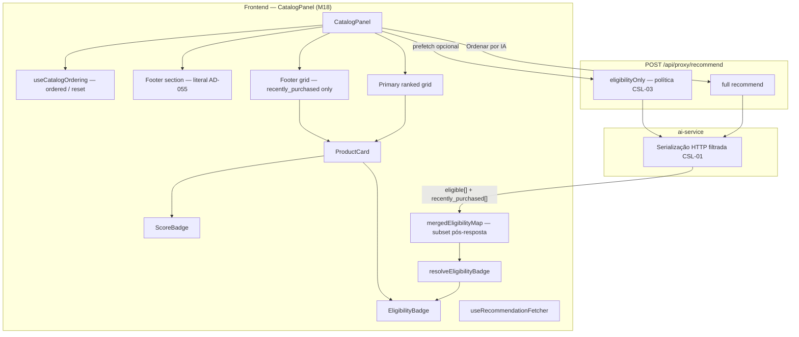
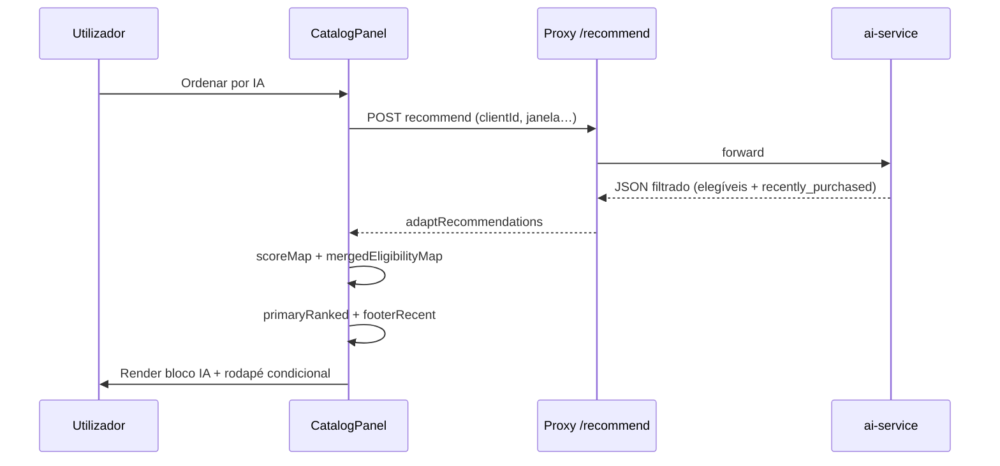

# Design — M18: Catálogo simplificado & contrato AD-055 (Design Complex UI)

**Status:** Draft for implementation  
**Date:** 2026-04-30  
**Spec:** [spec.md](./spec.md)  
**Delta sobre:** [M16 design](../m16-neural-first-didactic-ranking-catalog-density/design.md) Part I  

**ADRs a fechar na implementação:** [ADR-055](../m16-neural-first-didactic-ranking-catalog-density/adr-055-eligibility-enriched-recommendation-contract.md), [ADR-056](../m16-neural-first-didactic-ranking-catalog-density/adr-056-view-mode-zustand-flag-catalog-view-mode-hook.md), [ADR-058](../m16-neural-first-didactic-ranking-catalog-density/adr-058-early-eligibility-prefetch-on-client-select.md)

---

## 1. Resumo executivo

M18 **simplifica** a superfície do catálogo: uma única narrativa em vez de dois modos globais (`vitrine` / `ranking`). O utilizador vê sempre o **catálogo filtrado** (fonte existente de produtos); **«Ordenar por IA»** passa a significar *«mostrar ranking IA + rodapé de compras recentes na mesma vista»*, sem toggle nem painel lateral.

| Antes (M16) | Depois (M18) |
|-------------|--------------|
| `CatalogModeToggle` + `viewMode` em Zustand | Removidos (`CSL-06`) |
| `RecentPurchasesPanel` acima do grid | Removido (`CSL-05`); mesma informação só no **rodapé** pós-IA |
| Rodapé «—— Fora do ranking…——» entre elegíveis e **todos** os inelegíveis visíveis no catálogo | Rodapé só com **`recently_purchased`** devolvidos no payload (`CSL-07`) |
| Resposta `POST /recommend` com inelegíveis `no_embedding` / `in_cart` | Omissão HTTP (`CSL-01`); cartão continua a usar `getCart` para CTAs |

---

## 2. Arquitectura UI (alvo)



**Invariantes M18:**

1. **`ordered === true`** (e recomendação carregada, sem busca semântica activa) activa o **layout em duas zonas**: bloco principal ranqueado + bloco rodapé condicional.
2. **Não existe** `viewMode`: o ramo visual único substitui `rankingModeActive` atual (`ordered && … && viewMode === 'ranking'`).
3. **`ProductCard` no rodapé** (`recently_purchased`): cumpre **NFD-18 / CSL-09** — sem `scoreBadge`; `eligibilityBadge` âmbar mantém-se.
4. **Pré-IA**: grade = `displayedProducts` (filtros / catálogo); badges `no_embedding` / `in_cart` **só se** dados existirem (prefetch alinhado ou outra fonte); sem invenção de motivos.

---

## 3. Máquina de estados (experiência)

```mermaid
stateDiagram-v2
  [*] --> CatalogIdle: página carrega
  CatalogIdle --> CatalogIdle: filtros / pesquisa semântica
  CatalogIdle --> AIOrdering: clique «Ordenar por IA» (cliente seleccionado)
  AIOrdering --> CatalogRanked: HTTP 200 + payload válido
  AIOrdering --> CatalogIdle: erro → mensagem; ordered não assume ranking falso
  CatalogRanked --> CatalogIdle: «Ordenação original» / reset cliente / checkout que limpa reco
  note right of CatalogRanked
    Vista única:
    [Elegíveis ranqueados]
    opcional: «—— Fora do ranking nesta janela ——»
    [recently_purchased]
  end note
```



---

## 4. Layout da vista complexa (pós-«Ordenar por IA»)

Ordem vertical **fixa** dentro do `CatalogPanel`:

```
┌─────────────────────────────────────────────────────────────┐
│ ProductFilters + SemanticSearchBar                          │
├─────────────────────────────────────────────────────────────┤
│ [✨ Ordenar por IA]  ou  [✕ Ordenação original]   (sem toggle) │
├─────────────────────────────────────────────────────────────┤
│ CoverageStatusBanner                                        │
├─────────────────────────────────────────────────────────────┤
│ CartSummaryBar                                              │
├─────────────────────────────────────────────────────────────┤
│ (opcional) aviso zero elegíveis — copy alinhada CSL + edge  │
├─────────────────────────────────────────────────────────────┤
│ ▼ BLOCO PRINCIPAL — apenas produtos elegíveis com score IA   │
│   ReorderableGrid (ordenados por finalScore / M17 rankScore) │
├─────────────────────────────────────────────────────────────┤
│ ▼ SEPARADOR — só se length(recently_purchased) > 0           │
│   «—— Fora do ranking nesta janela ——»                       │
│   (centrado, text-xs text-gray-400 — pode extrair componente  │
│    `RankingFooterHeading` para testid estável)               │
├─────────────────────────────────────────────────────────────┤
│ ▼ RODAPÉ — apenas cards recently_purchased                    │
│   ReorderableGrid sem scores; eligibilityBadge + NFD-18       │
└─────────────────────────────────────────────────────────────┘
```

**Regras de visibilidade do separador (`CSL-07` ac‑3):**

- Se **não** houver `recently_purchased` na janela → **omitir** linha e grid do rodapé (sem cabeçalho órfão).

**Pesquisa semântica (`searchResults !== null`):**

- Comportamento actual preservado: não forçar layout duplo; recomendações / `ordered` seguem regras existentes de `useCatalogOrdering` (sem expandir escopo M18 além do especificado).

---

## 5. Construção das listas de produtos (lógica)

Substituir o par `eligibleGridProducts` / `ineligibleGridProducts` que particiona **todo** o catálogo visível por:

| Lista | Fonte de verdade | Ordenação |
|-------|------------------|-----------|
| **primaryRanked** | Intersecção de `displayedProducts` com IDs elegíveis **presentes** na resposta filtrada + `scoreMap` | `finalScore` desc (e semântica M17 quando activa) |
| **footerRecent** | Produtos com `eligibilityReason === 'recently_purchased'` na resposta (ou equivalente em `mergedEligibilityMap` **após** merge só com linhas admitidas pelo HTTP) | Ordem do array servidor **ou** ordem estável documentada em `tasks.md` |

**Produtos do catálogo API omitidos do JSON** (`no_embedding`, `in_cart`):

- **Não** entram no bloco principal nem no rodapé **via** recomendação.
- **Não** há obrigação M18 de mostrar uma terceira faixa «resto do catálogo» após IA; permanecem acessíveis ao voltar a **«Ordenação original»** ou por navegação pré-IA (comportamento explícito para E2E).

**Zero elegíveis (`CSL-05` / edge spec):**

- Manter alerta existente (`catalog-zero-eligible-ranking`) com copy revista: remover referência a «vitrine» se deixar de existir o conceito na UI; focar «nenhum elegível nesta janela» + rodapé só com recentes se existirem.

---

## 6. Componentes e ficheiros

### 6.1 Remover ou deixar de montar

| Artefacto | Acção |
|-----------|--------|
| `CatalogModeToggle.tsx` | Remover import e ficheiro se sem outros consumidores |
| `RecentPurchasesPanel.tsx` | Remover do fluxo; ficheiro removível após grep limpo |
| `useCatalogViewMode.ts` | Remover (`CSL-06` ac‑3) |
| `catalogSlice.viewMode`, `setViewMode`, `resetViewMode` | Remover; `clientSlice` deixa de chamar `resetViewMode` |

### 6.2 Novo ou extraído (opcional, preferência por legibilidade)

| Artefacto | Responsabilidade |
|-----------|-------------------|
| `RankingFooterHeading.tsx` | Renderiza exactamente `—— Fora do ranking nesta janela ——`; `data-testid="catalog-ranking-footer-heading"` |
| `selectCatalogRankingSections.ts` (pure) | Dado `displayedProducts`, `recommendations` adaptadas, `scoreMap`, devolve `{ primaryRanked, footerRecent }` — facilita testes unitários |

Se a lógica couber em `CatalogPanel` sem explosão de linhas, `tasks.md` pode optar por inline + testes no hook de ordenação.

### 6.3 Reutilização

| Componente | Notas |
|----------|--------|
| `ProductCard` | Igual; `ineligibleRanking` / variantes só para rodapé recente sem score |
| `ReorderableGrid` | Dois blocos como hoje M16, mas segundo bloco **filtrado** |
| `CoverageStatusBanner` | Sem dependência de `viewMode`; revisar copy se mencionar «modos» |
| `EligibilityBadge` / `resolveEligibilityBadge` | Mantém precedência carrinho; para `in_cart`, dados vêm do cart não do payload recommend |

---

## 7. Dados: prefetch & `eligibilityOnly` (`CSL-03`)

**Problema:** Prefetch actual pode preencher `no_embedding` / `in_cart` para badges pré-IA; AD-055 no cliente não deve reintroduzir «mapa completo» sem decisão explícita.

**Decisão de design (recomendada):**

- Alinhar **`eligibilityOnly`** à **mesma política de omissão** que `POST /recommend` para serialização HTTP (`CSL-01`), devolvendo apenas linhas necessárias para datas de supressão **se** ainda forem necessárias — ou contrato mínimo documentado no `ai-service` README.
- **Alternativa** aceite no spec: remover prefetch se a UX mínima não precisar de badges pré-IA; documentar em ADR-058 *Amended*.

---

## 8. Acessibilidade & testes

- **Separador rodapé:** elemento texto semântico (`p` ou `div role="separator"` com `aria-label` descriptivo opcional); copy literal PT fixa (spec).
- **Focus:** ordem de tabulação = bloco principal primeiro, depois rodapé (ordem DOM natural).
- **`data-testid`:** `catalog-order-ai`, `catalog-order-reset`, `catalog-zero-eligible-ranking`, `catalog-ranking-footer-heading`, cards recentes reutilizam testids existentes onde possível.
- **E2E** [`m16-catalog-modes`](../../../frontend/e2e/tests/m16-catalog-modes.spec.ts): renomear ou dividir ficheiro se `m18-catalog-ad055` for mais claro; cenários deve cobrir ausência de toggle/painel, presenza condicional do rodapé, ordem elegíveis → recentes.

---

## 9. Rastreio CSL → design

| ID | Cobertura neste design |
|----|-------------------------|
| CSL-05 | §6.1 — painel removido |
| CSL-06 | §2, §6.1 — sem `viewMode` |
| CSL-07 | §4, §5 — layout + regra omitir secção vazia |
| CSL-08 | Máquina de estados §3 + reset `clientSlice` (sem `viewMode`) |
| CSL-09 | §2, §6.3 — cards rodapé sem score |
| CSL-01..04 | Contrato backend + prefetch §7 (detalhe API em tasks / ADR-055) |

---

## 10. Diagrama de sequência — «Ordenar por IA» feliz



---

## 11. Non-goals (reiteração)

- Reintroduzir toggle ou painel M16 sem novo ADR.
- Terceira secção «todos os outros inelegíveis do catálogo» após IA.
- i18n do literal do rodapé (melhoria futura).

---

**Tasks:** [tasks.md](./tasks.md) (T1…T9). **Próximo passo workflow:** `execute` → actualizar ADRs e README conforme [spec § Verificação](./spec.md).
