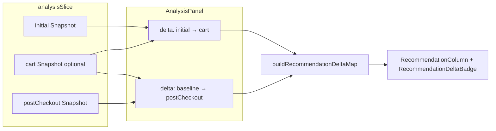

# M19 — Pos-Efetivar showcase (deltas & baseline) — Design UI complexo

**Spec:** [spec.md](./spec.md) · **ADR:** [ADR-065](./adr-065-post-checkout-column-deltas-baseline.md) · **PE-04:** [ADR-066](./adr-066-pe-04-showcase-delta-score-metric.md) (*Accepted*)  
**Metodologia:** [design-complex-ui.md](../../../../.cursor/skills/tlc-spec-driven/references/design-complex-ui.md) · Modo **default** (sem gate `approve`)

**Status:** Approved  
**Data:** 2026-05-01

---

## Documento de síntese — Phases 1–3 (ToT → Red Team → Convergência)

### Phase 1 — ToT divergence

**Tensões específicas:** (1) onde guardar o baseline cart-aware imutável vs confiar em `cartSnapshotStale`; (2) métrica numérica da pill vs ordem M17; (3) como comunicar «sem deltas» sem segunda hierarquia visual.

| Node | Approach | Failure point | Cost |
|------|----------|---------------|------|
| A | Novo campo `cartBaselineForDiff` no Zustand, preenchido no checkout | dois campos (`cart` + baseline) a manter coerentes em todas as transições | medium |
| B | **Invariantes sobre fluxo actual:** `markCartSnapshotStale` + não chamar `clearCartAware` em carrinho vazio com stale; endurecer `postCheckout` para não perder referência sem cópia extra | novo código que quebre invariante sem teste → baseline `null` outra vez | low |
| C | `useRef` em `AnalysisPanel` com cópia profunda do último snapshot cart-aware | ref perdida / desincronizada com persist ou mudança de cliente; duplica lógica já no slice | medium |

**Rule of Three / CUPID (inline):** A introduz estado novo sem ter duplicado o mesmo padrão noutro slice — **justificado só se B falhar** em QA. **CUPID-D:** nomes devem falar em «baseline pré-checkout», não em «ref». **CUPID-C:** B compõe com `RecommendationColumn` + `buildRecommendationDeltaMap` existentes.

### Phase 2 — Red team

| Node | Risk | Vector | Severity |
|------|------|--------|----------|
| A | Estado forkado entre `analysis.cart` e baseline | data consistency | Medium |
| B | Carrinho vazio sem `markCartSnapshotStale` (novo fluxo UI) | race / ordem de efeitos | Medium |
| B | `clearCartAware` em `postCheckout` com carrinho vazio e stale já limpo | data consistency | High |
| C | Remount da árvore ao mudar tab cliente | hydration / estado ref | Medium |
| C | — | accessibility — baseline errado sem `aria-live` | Medium |

**Eliminação:** C candidato a corte — severidade média sem mitigação forte vs store; **A** reserva se **B** não cobrir todos os caminhos testados.

### Phase 3 — Self-consistency convergence

```
Winning node: B
Approach: Preservar baseline via política ADR-048 + invariantes no slice/callers antes de acrescentar campo persistente novo.
Why it wins over A: Menor superfície de estado e alinhamento ao código e comentários já presentes em AnalysisPanel (carrinho vazio + stale).
Why it wins over C: Fonte única no Zustand evita duplicar verdade entre ref e store.
Key trade-off accepted: Se um fluxo futuro esvaziar carrinho sem stale, ainda pode haver `cart === null`; nesse caso activar **fallback A** ou UX PE-03 obrigatória.
Path 1 verdict: B — menor custo acumulado de falhas se testes cobrirem `clearCartAware`/`postCheckout`.
Path 2 verdict: B — encaixa em `CONVENTIONS.md` (Zustand slice, sem novo padrão).
```

---

## Phase 4 — Committee review (5 personas)

| Persona | Finding | Severity | Proposed improvement |
|---------|---------|----------|---------------------|
| Principal Software Architect | `buildRecommendationDeltaMap` deve permanecer função pura; selector PE-04 injectável — DIP | Medium | Parâmetro opcional ou wrapper fino em `deltas.ts`, sem bifurcar badges |
| Staff Engineering | `captureRetrained` com `phase === 'initial'` produz `cart: null` — diff vazio | High | Garantir captura `cart` antes de promoção ou baseline dedicado (fallback A) |
| QA Staff | Sem Vitest no repo — regressões só E2E lentos ([C-F02](../../../.specs/codebase/frontend/CONCERNS.md)) | Medium | Priorizar E2E `data-testid` para estados PE-03; unitários `deltas.ts` quando harness existir |
| Staff Product Engineer | Lista com recomendações mas `deltaByProductId === {}` parece «bug» | High | Faixa `aria-live="polite"` ou texto secundário na coluna Pos-Efetivar distinguindo baseline ausente vs janela diferente |
| Staff UI Designer | `RecommendationColumn` já usa `motion-safe:` e opacidade — não animar novos banners com propriedades de layout | Low | Novo aviso: só `opacity`/cor de fundo subtil; `prefers-reduced-motion` herdado |

**Self-consistency:** Duas personas apontam **degradação explícita quando há linhas mas não há deltas** → **non-negotiable** (Product Eng + QA via UX didática).

**High severity:** Staff Engineering sobre `cart: null` → incorporado em § Error handling + baseline fallback.

---

## Architecture Overview

O fluxo mantém **uma torre de snapshots** no cliente; só o **par** passado a `buildRecommendationDeltaMap` muda por coluna.



---

## Code reuse analysis

| Artefacto | Reuso |
|-----------|--------|
| [`RecommendationColumn`](../../../frontend/components/analysis/RecommendationColumn.tsx) | Props existentes (`deltaByProductId`, `emptyMessage`, `stale`, `badge`) — estender com **opcional** `deltaDegradedReason?: 'no_baseline' \| 'window_mismatch'` ou mensagem derivada no pai para não proliferar variantes. |
| [`RecommendationDeltaBadge`](../../../frontend/components/analysis/RecommendationDeltaBadge.tsx) | Sem mudança de API se o Δ vier já calculado; se PE-04 mudar labels numéricos, só texto/`aria-label`. |
| [`buildRecommendationDeltaMap`](../../../frontend/lib/showcase/deltas.ts) | Extensão mínima (selector de score) conforme [ADR-066](./adr-066-pe-04-showcase-delta-score-metric.md). |
| [`analysisSlice`](../../../frontend/store/analysisSlice.ts) | Preferir **B** primeiro; tocar `captureRetrained` / `clearCartAware` apenas com testes de regressão. |

---

## Components

| Componente | Alteração prevista |
|------------|-------------------|
| `AnalysisPanel` | Calcular `postCheckoutDeltaPrevious` = `cartBaselineForDiff ?? cartSnapshot` se implementado fallback A; senão manter `cartSnapshot`; derivar **motivo** quando `hasItems && Object.keys(delta).length === 0`. |
| `RecommendationColumn` | Props opcionais: **aviso compacto** sob header ou acima da lista quando degradado (1 linha, `text-xs`, não competir com título). |
| `PostCheckoutOutcomeNotice` | Sem mudança obrigatória — outcome já cobre promoção/rejeição; aviso de baseline é **complementar** à coluna. |

---

## Data models

| Modelo | Campo / tipo | Notas |
|--------|----------------|-------|
| `AnalysisState` (`postCheckout`) | `cart: Snapshot \| null` | Invariante alvo: `null` só quando baseline imutável existe doutra forma ou UX PE-03 activa. |
| `RecommendationDelta` | `scoreDelta: number` | Semântica segue selector PE-04 ([ADR-066](./adr-066-pe-04-showcase-delta-score-metric.md)). |
| Opcional futuro | `cartBaselineForDiff?: Snapshot` | Só se **B** falhar em QA — não modelar até decisão registada em tasks T2. |

---

## Error handling strategy

| Situação | Comportamento UX | Teste |
|----------|------------------|-------|
| `previous` ou `current` `null` em `buildRecommendationDeltaMap` | `{}` (actual); **adicionar** copy PE-03 na coluna Pos-Efetivar | E2E estado forçado ou integração slice |
| `!hasSameRankingWindow` | `{}`; copy opcional «janela de ranking alterada» (nice-to-have spec) | Manual / E2E se estável |
| `captureRetrained` desde `initial` | `cart: null` — **corrigir fluxo** ou baseline fallback | Unit/E2E conforme [tasks](./tasks.md) |
| Carrinho vazio após checkout **sem** stale | Risco de `clearCartAware` — **bloquear** com invariante ou ordem: sempre `markCartSnapshotStale` antes de esvaziar UI | Regression |

---

## Métrica Δscore (PE-04)

**Decisão de produto:** **Opção B** — em `buildRecommendationDeltaMap`, o valor usado para comparar scores entre snapshots é **`rankScore ?? finalScore`** por recomendação. Se `rankScore` estiver ausente (M17 inactivo ou payload legado), mantém-se o comportamento equivalente a **só `finalScore`**.

**Invariante:** continua a existir **um único** motor de diff (`deltas.ts`); não há segunda implementação por coluna.

---

## Tech decisions

| ID | Decisão | Fundamento |
|----|---------|------------|
| TD-1 | **Baseline primeiro via Node B** | Menor diff; alinhado ADR-048 |
| TD-2 | **PE-04 (M19):** **opção B** — `rankScore ?? finalScore` para `scoreDelta` quando `rankScore` existe no payload ([ADR-066](./adr-066-pe-04-showcase-delta-score-metric.md)) | Paridade com a grelha quando M17 re-ranqueia por recência |
| TD-3 | **Degradação visível** obrigatória quando há itens sem deltas (finding comité) | PE-03 |
| TD-4 | **Sem novas animações de layout** para avisos | Staff UI Designer — usar tipografia/cor já existentes |

---

## Interaction states

| Component | State | Trigger | Visual |
|-----------|-------|---------|--------|
| Coluna Pos-Efetivar | idle / lista | recomendações carregadas, deltas calculados | Lista + pills habituais |
| Coluna Pos-Efetivar | degradado — sem baseline | `postCheckout` preenchido, `previous` efectivo null | Lista **sem** pills; faixa ou texto `text-xs` «Baseline «Com Carrinho» indisponível para comparar.» + opcional `aria-live="polite"` |
| Coluna Pos-Efetivar | degradado — janela | `!hasSameRankingWindow` | Igual ou copy «Recapture com a mesma janela de ranking» (nice-to-have) |
| Coluna Pos-Efetivar | loading | `postCheckoutLoading` | Skeletons existentes |
| `RecommendationDeltaBadge` | success | delta por SKU | Sem mudança estrutural |

---

## Animation spec

| Animation | Property | Duration | Easing | Reduced-motion fallback |
|-----------|----------|----------|--------|-------------------------|
| Lista Pos-Efetivar aparece | `opacity` | 300ms | `ease-out` | Já em `RecommendationColumn` (`motion-safe:`) — **sem nova animação** para aviso PE-03 |
| Badges delta | `opacity` | 200ms | `ease-out` | Existente em `RecommendationDeltaBadge` |

---

## Accessibility checklist

| Component | Keyboard nav | Focus management | ARIA | Mobile |
|-----------|--------------|------------------|------|--------|
| Coluna Pos-Efetivar | N/A (lista só leitura) | Sem mudança de foco por aviso estático | Região de aviso com `role="status"` ou texto visível próximo ao `aria-label` da coluna (`RecommendationColumn` já usa `aria-label` na lista) | `min-h-[44px]` já nos itens; aviso não deve reduzir touch targets |

---

## Alternatives discarded

| Node | Approach | Eliminated in | Reason |
|------|----------|---------------|--------|
| A | `cartBaselineForDiff` persistente | Phase 3 (primário) | Reserva — só se Node B não passar QA |
| C | Baseline só em `useRef` | Phase 2 | Duplica verdade; frágil a remount |

---

## Committee findings applied

| Finding | Persona | How incorporated |
|---------|---------|------------------|
| Degradação explícita lista+deltas vazios | Product Eng + QA | § Interaction states + § Error handling |
| `cart: null` em `captureRetrained` desde initial | Staff Engineering | § Error handling + invariante/tarefa T2 |
| Sem layout-thrash em novos avisos | Staff UI Designer | § Animation spec + TD-4 |
| Paridade DIP em `deltas.ts` | Architect | § Code reuse + ADR-066 |
| E2E primeiro sem Vitest | QA | § Error handling test matrix + [tasks](./tasks.md) T5 |

---

## Referências de código

- [`AnalysisPanel.tsx`](../../../frontend/components/recommendations/AnalysisPanel.tsx) — derivação de snapshots e memos de delta.
- [`analysisSlice.ts`](../../../frontend/store/analysisSlice.ts) — `captureRetrained`, `clearCartAware`.
- [`deltas.ts`](../../../frontend/lib/showcase/deltas.ts) — mapa de deltas e `finalScore`.

---

## Output checklist (design-complex-ui)

- [x] 3 nós ToT + Red Team + convergência bicameral
- [x] 5 personas + findings non-negotiable incorporados
- [x] Secções Interaction States, Animation Spec, Accessibility Checklist, Alternatives Discarded, Committee Findings Applied
- [x] ADR não óbvio: [ADR-066](./adr-066-pe-04-showcase-delta-score-metric.md) (*Accepted*)
