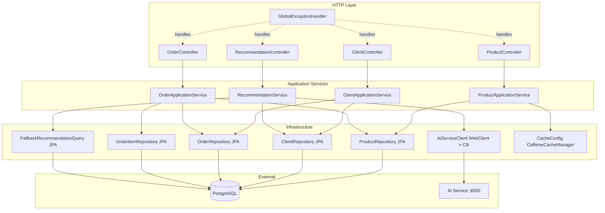

# M2 — API Service Design

**Status**: Approved
**Date**: 2026-04-23
**Spec**: [spec.md](spec.md)
**ADRs**: [ADR-001](adr-001-layered-application-services.md) · [ADR-002](adr-002-ai-service-client-split.md) · [ADR-003](adr-003-caffeine-cache-programmatic.md)

---

## Architecture Overview



**Request flow — recommendation happy path:**
`GET /api/v1/recommend/{clientId}` → `RecommendationController` → `RecommendationService` (validates client) → `AiServiceClient` (POST /recommend, 3 s timeout, CB) → maps response → returns `RecommendationResponseDTO(degraded=false)`.

**Request flow — recommendation degraded:**
Circuit breaker open or AI returns 5xx/timeout → `AiServiceClient` returns `Optional.empty()` → `RecommendationService` calls `FallbackRecommendationQuery` (cached 1 min per country) → returns `RecommendationResponseDTO(degraded=true, items[matchReason=fallback])`.

---

## Package Layout

```
com.smartmarketplace/
├── controller/
│   ├── ProductController.java
│   ├── ClientController.java
│   ├── OrderController.java
│   └── RecommendationController.java
├── service/
│   ├── ProductApplicationService.java
│   ├── ClientApplicationService.java
│   ├── OrderApplicationService.java
│   └── RecommendationService.java
├── repository/
│   ├── ProductRepository.java
│   ├── ClientRepository.java
│   ├── OrderRepository.java
│   ├── OrderItemRepository.java
│   └── FallbackRecommendationQuery.java
├── dto/
│   ├── ProductSummaryDTO.java
│   ├── ProductDetailDTO.java
│   ├── ClientSummaryDTO.java
│   ├── ClientDetailDTO.java
│   ├── PurchaseSummaryDTO.java
│   ├── OrderDTO.java
│   ├── OrderItemDTO.java
│   ├── CreateProductRequest.java
│   ├── CreateOrderRequest.java
│   ├── RecommendationResponseDTO.java
│   ├── RecommendationItemDTO.java
│   ├── PagedResponse.java
│   └── ErrorResponse.java
├── entity/
│   ├── Product.java
│   ├── Client.java
│   ├── Order.java
│   ├── OrderItem.java
│   ├── Supplier.java
│   └── Country.java
├── config/
│   ├── CacheConfig.java
│   ├── CacheNames.java
│   ├── AiServiceConfig.java
│   └── WebClientConfig.java
├── exception/
│   ├── ResourceNotFoundException.java
│   ├── BusinessRuleException.java
│   └── GlobalExceptionHandler.java
└── ApiServiceApplication.java
```

---

## Code Reuse Analysis

| Existing artifact | Reused in M2 | Notes |
|---|---|---|
| `ApiServiceApplication.java` | Yes — unchanged | Main class, Spring Boot entry point |
| `application.properties` | Extended | Add AI service URL, Caffeine spec, Resilience4j config, Logback JSON, Micrometer |
| `pom.xml` | Extended | Add Caffeine, Resilience4j, WebClient (reactor-netty), Logback JSON encoder, Micrometer Prometheus |
| PostgreSQL schema (from M1 infra) | Consumed via JPA entities | `spring.jpa.hibernate.ddl-auto=none` already set — entities map to existing tables |

No reusable domain logic exists yet — skeleton only.

---

## Components

### Controllers

All controllers are `@RestController` at `/api/v1`. They:
- Accept and validate request parameters with Bean Validation (`@Valid`, `@Min`, `@Max`)
- Delegate 100% to Application Services
- Return `ResponseEntity<T>` with explicit HTTP status codes
- Are annotated with springdoc `@Operation`, `@ApiResponse` for OpenAPI generation

**Pagination:** All list endpoints accept `@RequestParam(defaultValue="0") int page` and `@RequestParam(defaultValue="20") @Max(100) int size`. Validation: `page < 0` → 400.

### ProductApplicationService

```
createProduct(CreateProductRequest) → ProductDetailDTO
  1. Validate category enum (400 if unknown)
  2. Validate supplierId exists (400)
  3. Validate country codes all exist (400)
  4. Validate no duplicate country codes in request (400)
  5. Validate price > 0, description ≥ 30 chars (400)
  @Transactional: persist Product + product_countries links
  @CacheEvict(value=CacheNames.CATALOG_LIST, allEntries=true)
  Return ProductDetailDTO

listProducts(page, size, category, country, supplier, search) → PagedResponse<ProductSummaryDTO>
  @Cacheable(value=CacheNames.CATALOG_LIST, key=SpEL 6-dim key)
  Delegate to ProductRepository.findWithFilters(Specification, Pageable)
  Map Page<Product> → PagedResponse<ProductSummaryDTO>

getProduct(UUID id) → ProductDetailDTO
  ProductRepository.findById(id).orElseThrow ResourceNotFoundException
```

### ClientApplicationService

```
listClients(page, size) → PagedResponse<ClientSummaryDTO>
  Delegate to ClientRepository.findAll(Pageable)

getClient(UUID id) → ClientDetailDTO
  ClientRepository.findById(id).orElseThrow ResourceNotFoundException
  Compute purchaseSummary: totalOrders, totalItems, totalSpent, lastOrderAt
  via OrderRepository.findPurchaseSummaryByClientId(id) (single query with aggregates)

listClientOrders(UUID clientId, page, size) → PagedResponse<OrderDTO>
  ClientRepository.existsById(clientId) — 404 if missing
  OrderRepository.findByClientIdOrderByOrderDateDesc(clientId, Pageable)
  Fetch order_items eagerly (JOIN FETCH in JPQL)
```

### OrderApplicationService

```
createOrder(CreateOrderRequest) → OrderDTO
  Pre-validation (before transaction):
    1. clientId exists → 404
    2. No duplicate productIds in request → 400
    3. Fetch all products for requested productIds in one IN query
    4. Unknown productIds → 404
    5. Fetch all product_countries for those productIds in one IN query
    6. Any product not available in client's country → 400
  @Transactional:
    7. Compute total = sum(product.price * item.quantity)
    8. Persist Order
    9. Persist OrderItems
    10. Return OrderDTO
```

### RecommendationService

```
recommend(UUID clientId, int limit) → RecommendationResponseDTO
  1. clientId exists → 404
  2. Fetch client.countryCode
  3. AiServiceClient.recommend(clientId, limit) → Optional<List<RecommendationItemDTO>>
  4. If present: return RecommendationResponseDTO(degraded=false, items)
  5. If empty: FallbackRecommendationQuery.topSelling(countryCode, clientId, limit)
     → RecommendationResponseDTO(degraded=true, items[matchReason=fallback])
```

### AiServiceClient

```
recommend(UUID clientId, int limit) → Optional<List<RecommendationItemDTO>>
  @CircuitBreaker(name="aiService", fallbackMethod="emptyFallback")
  WebClient POST ${ai.service.base-url}/recommend
    connectTimeout: ${ai.service.timeout.connect:1000}ms
    responseTimeout: ${ai.service.timeout.response:3}s
  On success: deserialize and return Optional.of(items)
  fallbackMethod emptyFallback(Throwable): return Optional.empty()
```

### FallbackRecommendationQuery

```
topSelling(String countryCode, UUID clientId, int limit) → List<RecommendationItemDTO>
  @Cacheable(value=CacheNames.FALLBACK_RECOMMENDATIONS, key="#countryCode")
  JPQL:
    SELECT p FROM Product p
    JOIN p.countries c
    WHERE c.code = :countryCode
    AND p.id NOT IN (
      SELECT oi.product.id FROM OrderItem oi
      WHERE oi.order.client.id = :clientId
    )
    ORDER BY (subquery: order_items count for product) DESC
    LIMIT :limit
  Returns items with matchReason=fallback
```

### GlobalExceptionHandler (`@RestControllerAdvice`)

| Exception | HTTP Status |
|---|---|
| `ResourceNotFoundException` | 404 |
| `BusinessRuleException` | 400 |
| `DataIntegrityViolationException` (duplicate sku) | 409 |
| `MethodArgumentNotValidException` | 400 |
| `ConstraintViolationException` | 400 |
| `Throwable` (catch-all) | 500 |

All responses use `ErrorResponse { timestamp, status, error, message, path, traceId }`. `traceId` injected from `MDC.get("traceId")` (Logback MDC populated by a `TraceIdFilter` servlet filter on every request).

---

## Data Models

### JPA Entities (mapped to existing M1 schema)

**Product**
```java
@Entity @Table(name="products")
UUID id, String sku, String name, String description,
String category, BigDecimal price, LocalDateTime createdAt
@ManyToOne Supplier supplier
@ManyToMany @JoinTable("product_countries") Set<Country> countries
```

**Client**
```java
@Entity @Table(name="clients")
UUID id, String name, String segment
@ManyToOne Country country
```

**Order**
```java
@Entity @Table(name="orders")
UUID id, LocalDateTime orderDate, BigDecimal total
@ManyToOne Client client
@OneToMany(cascade=ALL) List<OrderItem> items
```

**OrderItem**
```java
@Entity @Table(name="order_items")
UUID id, int quantity, BigDecimal unitPrice
@ManyToOne Order order
@ManyToOne Product product
```

### DTOs

**PagedResponse<T>**
```json
{ "items": [], "page": 0, "size": 20, "totalItems": 0, "totalPages": 0 }
```

**ProductSummaryDTO**
```json
{ "id", "sku", "name", "category", "price", "supplierName", "availableCountries": [] }
```

**ProductDetailDTO** — extends summary + `"description"`, `"supplierId"`, `"createdAt"`

**ClientDetailDTO**
```json
{ "id", "name", "segment", "countryCode",
  "purchaseSummary": { "totalOrders", "totalItems", "totalSpent", "lastOrderAt" } }
```

**OrderDTO**
```json
{ "id", "orderDate", "total",
  "items": [{ "productId", "productName", "quantity", "unitPrice" }] }
```

**RecommendationResponseDTO**
```json
{ "clientId", "degraded": false,
  "items": [{ "id", "name", "category", "price", "score", "matchReason" }] }
```

**ErrorResponse**
```json
{ "timestamp", "status", "error", "message", "path", "traceId" }
```

---

## Error Handling Strategy

1. **Validation errors** — Bean Validation annotations on request DTOs + `@Valid` on controller parameters. `GlobalExceptionHandler` catches `MethodArgumentNotValidException` and returns 400 with field-level details.
2. **Business rule errors** — Application Services throw `BusinessRuleException(message)` for domain violations (country mismatch, duplicate productId in order, etc.).
3. **Not found** — `ResourceNotFoundException(entity, id)` → 404.
4. **Duplicate key (sku)** — `DataIntegrityViolationException` from JPA → caught in `GlobalExceptionHandler` → 409.
5. **Trace correlation** — `TraceIdFilter` generates a UUID `traceId` per request, stores in `MDC`, adds to response header `X-Trace-Id`, and includes in `ErrorResponse.traceId`. Logback JSON appender emits `traceId` from MDC on every log line.
6. **Downstream failure** — `AiServiceClient` fallback returns `Optional.empty()`; `RecommendationService` handles gracefully — never propagates exception to controller.

---

## Observability

### Spring Actuator endpoints
- `/actuator/health` — DB health indicator auto-configured
- `/actuator/info` — `spring.application.name`, version from `pom.xml`
- `/actuator/metrics` — full Micrometer registry

### Micrometer metrics
| Metric | Type | Tags |
|---|---|---|
| `http.server.requests` | Timer | method, uri, status (auto via Spring MVC) |
| `cache.gets` | Counter | cache=catalogList, result=hit/miss (Caffeine recordStats) |
| `cache.gets` | Counter | cache=fallbackRecommendations |
| `ai.service.call.duration` | Timer | outcome=success/fallback (custom in `AiServiceClient`) |
| `recommendation.latency` | Timer | degraded=true/false (custom in `RecommendationService`) |

### Logback JSON
Logback JSON encoder (`net.logstash.logback:logstash-logback-encoder`) outputs structured JSON logs:
```json
{ "@timestamp", "level", "logger", "message", "traceId", "method", "path", "status", "duration_ms" }
```

---

## Tech Decisions

| Decision | Choice | Reason |
|---|---|---|
| HTTP client for AI service | Spring WebClient (reactor-netty) | Non-blocking; already on classpath via `spring-boot-starter-web` in reactive mode; integrates with Resilience4j `@CircuitBreaker` |
| Circuit breaker | Resilience4j | Spring Boot 3.x standard; integrates with Actuator metrics |
| In-memory cache | Caffeine | Spring Boot default recommendation; `recordStats()` feeds Micrometer without extra config |
| OpenAPI | springdoc-openapi 2.5.0 | Already in `pom.xml`; generates `/v3/api-docs` and `/swagger-ui.html` out of the box |
| JPA filter strategy | Spring Data Specifications | Composable predicates for AND-semantics multi-filter on products |
| Pagination | Spring Data `Pageable` + `Page<T>` | Maps directly to `PagedResponse<T>` DTO; consistent across all list endpoints |
| Structured logging | logstash-logback-encoder | JSON logs without a log agent; MDC-based traceId is idiomatic in Spring |

---

## Alternatives Discarded

| Node | Approach | Eliminated in | Reason |
|------|----------|---------------|--------|
| A | Annotation-mixed service beans with Resilience4j on same class | Phase 2 | High severity: self-invocation bypasses AOP proxy — fallback never fires |
| B | Hexagonal ports+adapters | Phase 3 | Rule of Three violation — 8+ interfaces with zero second-implementation evidence; rejected by both convergence paths |

---

## Committee Findings Applied

| Finding | Persona | How incorporated |
|---------|---------|-----------------|
| `RecommendationClient` mixes HTTP + fallback domain query | Principal Architect + Staff Engineering (non-negotiable) | Split into `AiServiceClient` (HTTP + CB) and `RecommendationService` (orchestration); `FallbackRecommendationQuery` extracted as separate JPA-backed bean |
| WebClient missing timeout — High severity | Staff Engineering (non-negotiable) | `AiServiceClient` configures `connectTimeout` (1 s) and `responseTimeout` (3 s) via `@Value`-injected properties `ai.service.timeout.connect` and `ai.service.timeout.response` |
| `createProduct` SRP — eviction + validation + persistence in one method | Principal Architect | `@CacheEvict(allEntries=true)` placed at method level; validation extracted to private `validateCreateProductRequest()` inside same service class — acceptable colocation given no evidence of reuse |
| N+1 country checks in `POST /orders` | Staff Engineering | Pre-fetch all `product_countries` for requested productIds in a single IN query before transaction |
| Fallback query slow on circuit-open | Staff Engineering | `FallbackRecommendationQuery.topSelling` cached at `cache=fallbackRecommendations`, TTL=1 min, keyed by `countryCode` |
| Duplicate `sku` concurrent write | QA Staff | `@Column(unique=true)` on `Product.sku`; `DataIntegrityViolationException` → 409 in `GlobalExceptionHandler` |
| Duplicate `productId` in order request | QA Staff | Explicit check in `OrderApplicationService` before transaction; returns 400 |
| Cache key collision risk | QA Staff | SpEL key documented explicitly in design; `CacheNames` constants prevent magic strings |
| Package layout undefined — controller may import entities | Principal Architect | Package layout fully specified in this design; enforced by convention (no enforcement tooling in M2; Checkstyle in M6) |
