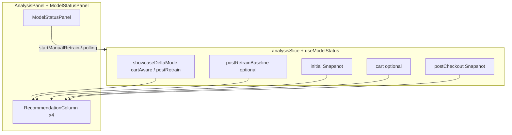

# M20 — Retreino manual, métricas, showcase Pos-Retreino — Design (UI complexo)

**Spec:** [spec.md](./spec.md) · **ADR-067:** [adr-067-manual-retrain-metrics-showcase-pos-retreino.md](./adr-067-manual-retrain-metrics-showcase-pos-retreino.md) · **ADR-068:** [adr-068-post-retrain-baseline-snapshot-in-analysis-slice.md](./adr-068-post-retrain-baseline-snapshot-in-analysis-slice.md) · **ADR-069:** [adr-069-reiniciar-vs-limpar-showcase-copy.md](./adr-069-reiniciar-vs-limpar-showcase-copy.md)  
**Metodologia:** [design-complex-ui.md](../../../../.cursor/skills/tlc-spec-driven/references/design-complex-ui.md) · Modo **default** (sem gate `approve`)

**Status:** Approved  
**Data:** 2026-05-01

---

## Documento de síntese — Phases 1–3 (ToT → Red Team → Convergência)

### Phase 1 — ToT divergence

**Tensões:** (1) onde congelar o snapshot **Com IA** pré-promoção sem corrida com `fetchRecs`; (2) `ModelStatusPanel`: estado local (`advancedOpen`) vs estender `useModelStatus` com `trainingSource`; (3) convivência M19 (delta cart→pós) vs M20 (delta Com IA→pós) sem duplicar colunas.

| Node | Approach | Failure point | Cost |
|------|----------|---------------|------|
| A | Campo `postRetrainBaseline` no `analysisSlice`, preenchido na mesma mutação que aplica `postCheckout` após promoção | mais um ramo em `resetAnalysis` / mudança de cliente | medium |
| B | Confiar em `initial` lido no `useEffect` imediatamente antes de `captureRetrained` | `initial` ou janela mudam antes do `set`; re-render intermédio | high |
| C | Segundo store Zustand `showcaseRetrainSlice` isolado | duplica invariantes ADR-048; acoplamento Analysis↔hook | high |

**Rule of Three:** C introduz módulo novo sem repetição no codebase — **rejeitar**. **CUPID-D:** nomes `postRetrainBaseline` / `showcaseDeltaMode` falam em domínio didáctico, não em endpoint. **CUPID-C:** A compõe com `buildRecommendationDeltaMap`, `RecommendationColumn`, `useModelStatus`.

### Phase 2 — Red team

| Node | Risk | Vector | Severity |
|------|------|--------|----------|
| A | Transição incorrecta se `captureRetrained` for chamado sem baseline definido | data consistency | Medium |
| A | Esquecer limpar baseline em `resetAnalysis` | regression | Medium |
| B | `initial` já não reflecte o que o utilizador viu em Com IA | race condition | High |
| B | — | accessibility — deltas mentirosos sem aviso | High |
| C | Dois hooks a subscrever no `AnalysisPanel` | render performance | Medium |
| C | — | hydration — estado órfão ao trocar tab Next | Low |

**Vetores UI:** **Render** — memorizar maps de delta por modo, não recalcular em cada tick de polling. **A11y** — métricas novas com `aria-live="polite"` por região, não página inteira. **Hydration** — Zustand sem `persist` para estes campos (evitar flash). **Mobile** — grelha 4 colunas já `grid-cols-1 lg:grid-cols-4`; botões manter `min-h-[44px]`.

**Eliminação:** B e C fora na Phase 3 (B High sem mitigação melhor que A; C Rule of Three + custo).

### Phase 3 — Self-consistency convergence

```
Winning node: A
Approach: Congelar baseline Com IA pré-promoção no slice (`postRetrainBaseline`) na mutação atómica com `postCheckout`, e seleccionar o par de deltas via modo showcase.
Why it wins over B: Elimina janela de corrida entre efeitos e fetch assíncrono.
Why it wins over C: Uma fonte de verdade, alinhada a M19/ADR-048 e a CONVENTIONS (Zustand slice).
Key trade-off accepted: `AnalysisState` fica mais largo; migração cuidadosa em todos os `set` do slice.
Path 1 verdict: A — menor severidade agregada após mitigações de reset/cliente.
Path 2 verdict: A — encaixa em `frontend/store/analysisSlice.ts` e em padrões M19 documentados.
```

---

## Phase 4 — Committee review (5 personas)

| Persona | Finding | Severity | Proposed improvement |
|---------|---------|----------|---------------------|
| Principal Software Architect | `AnalysisPanel` não deve ramificar quatro variantes de delta inline — extrair selector ou `useMemo` nomeado por modo | Medium | `selectPostRetrainDeltaMap(state)` ou função pura em `lib/showcase/` |
| Staff Engineering | Polling `useModelStatus` a 2s pode disparar múltiplas capturas se `lastCapturedVersionRef` falhar | Medium | Manter ref + alinhar a `clearAwaitingRetrain`; teste de regressão |
| QA Staff | Dois botões «reiniciar» semanticamente distintos sem `data-testid` causam E2E frágeis | High | ADR-069: testids dedicados + copy única |
| Staff Product Engineer | Retreino manual primário exige CTA acima da dobra em desktop e ordem de tab lógica (título → estado → acção → avançado) | Medium | Reordenar blocos; manual antes do toggle avançado |
| Staff Product Engineer | Estados de métricas do job (loading/empty/error) sem spec visual | Medium | Secção métricas com skeleton explícito |
| Staff UI Designer | Barra `motion-safe:animate-pulse` já OK; novas faixas de métricas não devem animar `width` | Low | Usar `opacity` ou texto estático |
| Staff UI Designer | Hierarquia: métricas não podem competir com o cartão de estado principal | Low | `text-xs`, fundo neutro |
| QA Staff | `prefers-reduced-motion` para scroll suave opcional | Low | `behavior: 'smooth'` só com `matchMedia` ou aceitar advisory |

**Self-consistency (2+ personas):** conflito **Reiniciar** vs reset total → **non-negotiable** (QA + Product) → **ADR-069**.

**High severity:** rótulos/testids ambíguos — incorporado em ADR-069 e § Components.

---

## Architecture Overview



- **Backend** (fora do âmbito detalhado deste UI design mas ligado): `GET /model/status` e job terminal expõem métricas — o painel consome DTO existente estendido (ver tasks T067-*).
- **Modo showcase:** `showcaseDeltaMode` definido por variável de ambiente espelhada no proxy ou por constante de build de demo documentada; quando `postRetrain`, deltas da última coluna = `buildRecommendationDeltaMap(postRetrainBaseline, postCheckout)`; quando `cartAware`, mantém-se `buildRecommendationDeltaMap(cart, postCheckout)` (M19).

---

## Code Reuse Analysis

| Asset | Reuso |
|-------|--------|
| `buildRecommendationDeltaMap` | Inalterado na assinatura; só mudam os argumentos por modo |
| `RecommendationColumn` | Props existentes (`deltaByProductId`, `deltaEmptyDegraded`, `loading`) |
| `PostCheckoutOutcomeNotice` | Copy actualizada Pos-Retreino; mesma máquina de `buildPostCheckoutOutcome` com textos por `trainingSource` se necessário |
| `useModelStatus` | Estender com `trainingSource: 'checkout' \| 'manual' \| null` derivado de `awaitingForOrderId` / novo flag opcional no store |
| `ModelStatusPanel` | Reestruturar layout; manter `aria-expanded` no avançado |
| `analysisSlice` | Novos campos + acção `applyPostRetrainToInitial` (nome interno) para «Fixar novo normal» |

---

## Components

| Componente | Alteração |
|------------|-----------|
| `ModelStatusPanel` | Bloco **primário**: estado + CTA retreino manual + link métricas; bloco **secundário**: toggle diagnóstico (opcionalmente colapsado por defeito em demo manual); copy Pos-Retreino; distinção checkout vs manual no `aria-live` |
| `AnalysisPanel` | Modo delta; título coluna «Pós retreino» / `id` ancora `pos-retreino`; botões ADR-069; opcional ocultar «Com Carrinho» via prop ou env |
| Novo (opcional) | `TrainingMetricsSummary.tsx` — apresenta campos do DTO; sem lógica de negócio |

---

## Data Models (UI-relevante)

- **`AnalysisState` (extensão):** `showcaseDeltaMode: 'cartAware' | 'postRetrain'`; `postRetrainBaseline: Snapshot | null` (só modo postRetrain); transição `applyPostRetrainToInitial`: `initial ← postCheckout`, `postCheckout` limpo ou fase regressa a `initial`, `postRetrainBaseline ← null`.
- **`UseModelStatusResult`:** `trainingSource`, opcionalmente `lastJobMetrics` mapeado a partir de `ModelStatusResponse`.

---

## Error Handling Strategy

- Falha `fetchRecs` na captura pós-promoção: manter `panelState === 'promoted'` mas `postCheckoutLoading` false + mensagem na coluna (já padrão); não limpar `postRetrainBaseline` se já congelado.
- `postRetrainBaseline` ausente com `postCheckout` preenchido: mostrar `deltaEmptyDegraded === 'no_baseline'` com copy específica «Comparação indisponível».
- Desalinhamento env api/ai: mensagem no painel só documental + testes (PR-067-12).

---

## Tech Decisions

| Decisão | Onde |
|---------|------|
| Baseline imutável no slice | [ADR-068](./adr-068-post-retrain-baseline-snapshot-in-analysis-slice.md) |
| Dois controlos de fim de fluxo | [ADR-069](./adr-069-reiniciar-vs-limpar-showcase-copy.md) |
| Sem nova biblioteca de animação | Tailwind + `motion-safe:` existente |
| Métricas | Render condicional a partir de campos opcionais no DTO; sem fetch extra se status já incluir |

---

## Interaction States

| Component | State | Trigger | Visual |
|-----------|-------|---------|--------|
| `ModelStatusPanel` | idle | Sem await e sem último erro terminal | Copy «próximo passo» conforme `trainingSource` esperado (manual vs checkout) |
| `ModelStatusPanel` | training | `awaitingRetrainSince != null` ou polling activo | Barra pulse azul; `aria-live` com orderId se checkout |
| `ModelStatusPanel` | promoted | Versão mudou / último resultado promoted | CTA scroll para coluna Pos-Retreino |
| `ModelStatusPanel` | rejected / failed / unknown | Igual ao actual | Mantém cores âmbar/vermelho/cinza |
| `ModelStatusPanel` | manual loading | `startManualRetrain` em curso | Botão disabled + texto «A enfileirar…» |
| `TrainingMetricsSummary` | idle | Job terminal com payload | Tabela compacta loss/accuracy/P@5/duração |
| `TrainingMetricsSummary` | loading | Após train, antes do primeiro status | Skeleton 2–3 linhas |
| `TrainingMetricsSummary` | error | Status sem métricas ou parse falhou | Texto discreto + «Recarregar» |
| `AnalysisPanel` — «Fixar novo normal» | disabled | `phase !== 'postCheckout'` ou sem `postCheckout` | `aria-disabled` + tooltip |
| `AnalysisPanel` — «Limpar showcase» | pressed | click | Reset total (confirmar se spec exigir; default sem modal) |

---

## Animation Spec

| Animation | Property | Duration | Easing | Reduced-motion fallback |
|-----------|----------|----------|--------|-------------------------|
| Barra estado training | opacity (pulse Tailwind) | CSS default | pulse | `motion-reduce:opacity-100` sem animação |
| Scroll para coluna | `scrollIntoView` | browser | smooth | `behavior: 'auto'` quando `prefers-reduced-motion: reduce` |
| Hover botões | background-color | 150ms | default tailwind | sem mudança funcional |
| Skeleton métricas | pulse opcional | — | — | `motion-reduce:animate-none` |

---

## Accessibility Checklist

| Component | Keyboard nav | Focus management | ARIA | Mobile |
|-----------|-------------|------------------|------|--------|
| `ModelStatusPanel` | Tab através título → CTA manual → toggle avançado → CTA secundários | Não usar modal; foco mantém-se no toggle ao expandir painel | `aria-expanded` + `aria-controls` no avançado; região métricas com `aria-live="polite"` limitada | Touch 44px (já presente) |
| «Fixar novo normal» | Tab + Enter | Após click, mover foco opcional para coluna «Com IA» (`tabIndex=-1` temporário) se testes o validarem | `aria-label` explícito | Full width em &lt;lg se empilhado |
| `TrainingMetricsSummary` | Tab através de links | — | `role="region"` + `aria-labelledby` | Scroll horizontal evitado (stack vertical) |

---

## Alternatives Discarded

| Node | Approach | Eliminated in | Reason |
|------|----------|---------------|--------|
| B | baseline só via `initial` no efeito | Phase 2 / Phase 3 | Corrida High entre async e estado |
| C | slice isolado para showcase | Phase 1 / Phase 2 | Rule of Three + duplicação de invariantes |

---

## Committee Findings Applied

| Finding | Persona | How incorporated |
|---------|---------|------------------|
| Dois controlos semanticamente distintos | QA + Staff Product | [ADR-069](./adr-069-reiniciar-vs-limpar-showcase-copy.md); § Interaction States |
| Extrair lógica de selecção de delta | Principal Architect | § Code Reuse — selector/`useMemo` nomeado |
| Métricas sem animar layout | Staff UI | § Animation Spec |
| CTA manual acima da dobra | Staff Product | § Components — reordenação `ModelStatusPanel` |

---

## Output checklist (design-complex-ui)

- [x] 3 ToT nodes + Rule of Three + CUPID-D/C
- [x] Red team completo + vetores UI
- [x] Convergência Path 1 + Path 2
- [x] Cinco personas com tabela obrigatória
- [x] Findings 2+ incorporados (ADR-069)
- [x] High severity tratado (rótulos/testids)
- [x] ADRs 068–069 para decisões não óbvias
- [x] Secções Interaction States + Animation Spec + Accessibility + tabelas finais
- [x] Status Approved
