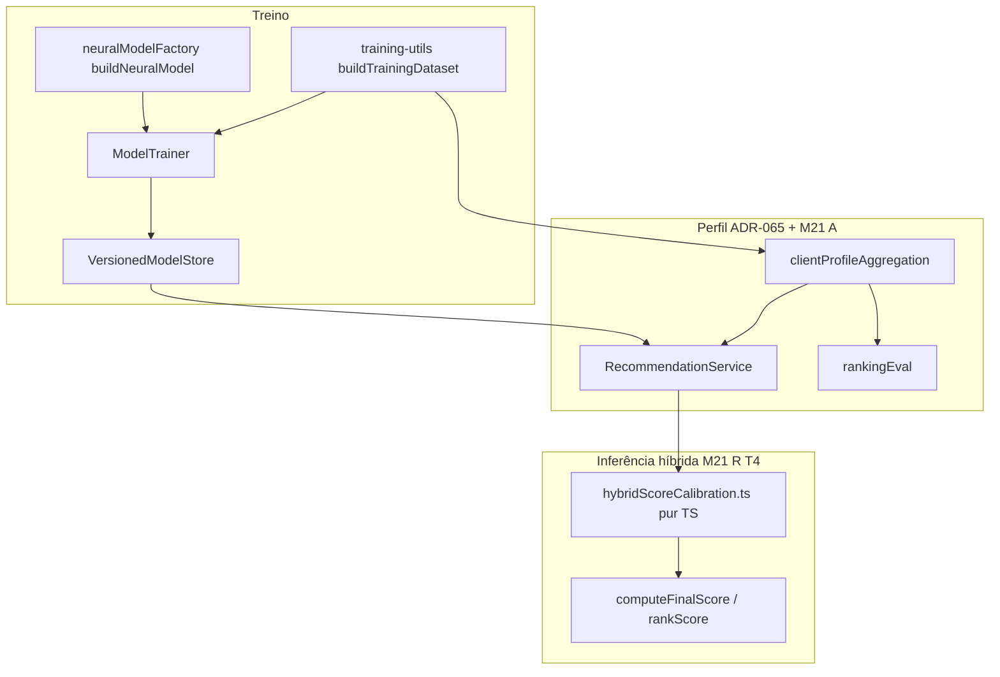

# M21 — Design complex (ranking, perfil, fusão híbrida)

**Spec:** [spec.md](./spec.md)  
**ADR canónico (prioridades):** [ADR-070](./adr-070-m21-committee-priorities-and-m17-p3-deferral.md)  
**ADR (cabeça + fusão pura):** [ADR-071](./adr-071-m21-neural-head-and-pure-fusion-boundary.md)  
**Tasks:** [tasks.md](./tasks.md)  
**Status:** **Approved** (Design complex, 2026-05-01) · modo automático (sem gate `approve`)

---

## Resumo executivo

M21 acrescenta seis faixas incrementais (**T1 → A → T2 → R → T4 → T3**) no **`ai-service`**, cada uma **desligável por env** com defaults **legacy** idênticos ao comportamento pré-M21. O desenho vencedor **extrai funções puras** onde o spec exige isolamento (fusão dinâmica, temperatura) e **estende** módulos existentes (`neuralModelFactory`, `training-utils`, `clientProfileAggregation`, `ModelTrainer`, `RecommendationService`) sem registry genérico. Compatibilidade de artefacto neural sob pairwise segue **ADR-071**.

---

## Phase 1 — ToT divergence (tensões → nós)

|Tensão|Descrição|
|------|---------|
|**τ1**| Loss pairwise vs artefacto BCE+sigmoid existente e cargas antigas.|
|**τ2**| Atenção leve no perfil vs regra ADR-065 (uma função, quatro call sites).|
|**τ3**| Heurísticas R/T4 vs contenção TF.js e testabilidade.|

| Node | Approach | Failure point | Cost |
|------|----------|---------------|------|
| **A** | Só flags inline nos ficheiros actuais, sem novos módulos | Difícil testar fusão/temperatura; `RecommendationService` inchado | medium |
| **B** | Estender factory/trainer/perfil + **módulo puramente TS** para pesos dinâmicos e temperatura ([ADR-071](./adr-071-m21-neural-head-and-pure-fusion-boundary.md)) | Mais ficheiros pequenos | low |
| **C** | Registry plugável de estratégias (loss/profile/fusion) | Complexidade anticipada sem 3ª repetição no codebase | high |

**Rule of Three / CUPID:** **C** falta evidência de repetição — descartado como direcção. **B** compõe com `aggregateClientProfileEmbeddings` e `computeFinalScore` existentes.

---

## Phase 2 — Red team

| Node | Risk | Vector | Severity |
|------|------|--------|----------|
| **A** | Regressão híbrida não coberta por testes focados | Coverage / rollback | Medium |
| **A** | Escondido dentro de `tf.tidy()` | Composição / leak tensores | Medium |
| **B** | Metadata de modelo mal alinhada ao loader | Data consistency | Medium |
| **C** | Over-engineering atrasa T1 | Maintainability | High |

**CUPID-U:** **B** mantém responsabilidades por ficheiro (loss ≠ fusão ≠ perfil).

---

## Phase 3 — Self-consistency convergence

```
Winning node: B
Approach: Estender componentes brownfield + helpers TS puros para R/T4 e matrix de cabeça neural conforme ADR-071.
Why it wins over A: Testes Vitest alinhados ao spec (M21-09/M21-11) sem inflar tf.tidy.
Why it wins over C: Evita abstracção genérica sem terceira variante no código.
Key trade-off accepted: Mais um ou dois ficheiros em `src/ml/` para fusão/temperatura.
Path 1 verdict: B — menor severidade agregada no red team.
Path 2 verdict: B — coincide com injecção via `index.ts` e padrões em ARCHITECTURE.md ai-service.
```

---

## Phase 4 — Committee review (findings)

| Persona | Finding | Severity | Proposed improvement |
|---------|---------|----------|---------------------|
| Principal Software Architect | Separar fusão dinâmica do MLP reforça SRP e ADR-071 | Medium | Módulo pur TS + `RecommendationService` só orquestra |
| Principal Software Architect | Cabeça linear vs sigmoid exige contrato de serialização explícito | Medium | Manifest / erro de load documentado |
| Staff Engineering | TF.js global já é gargalo concorrente ([C-A01](../../codebase/ai-service/CONCERNS.md)); não aumentar trabalho dentro de `predict` sem necessidade | Medium | R/T4 fora de TF; documentar latência pairwise |
| Staff Engineering | Heurística R deve ter limites nos pesos efectivos | Low | Clamp documentado (ex. min/max sobre convex combo) |
| QA Staff | Quatro call sites do perfil (A) são risco de drift | High | Checklist + teste que falha se imports divergirem |
| QA Staff | `precisionAt5` gate precisa do mesmo split/protocolo | Medium | Repetir contrato M20 nos README/checklist T21-7 |

**Non-negotiable (≥2 personas):** fusão R/T4 em TS puro; contrato explícito cabeça/artefacto; testes anti-drift nos call sites do perfil.

---

## Phase 5 — Entregável (este documento + ADR-071)

[ADR-071](./adr-071-m21-neural-head-and-pure-fusion-boundary.md) regista decisões de cabeça neural e fronteira de fusão. **ADR-070** mantém ordem T1→…→T3 e relação com M17 P3.

---

## Architecture overview



---

## Code reuse analysis

| Área | Reutilizar | Evitar |
|------|------------|--------|
| Env / DI | `src/config/env.ts`, composition root `src/index.ts` | Novos singletons globais |
| Perfil | `ProfilePoolingRuntime`, `aggregateClientProfileEmbeddings`, `deltaDaysUtc` | Segunda implementação de atenção só para treino |
| Métricas | `computePrecisionAtK` / `rankingEval.ts`, `binaryClassificationMetrics` | Métricas divergentes entre jobs |
| Modelo | `VersionedModelStore`, padrão load em `RecommendationService` | Carregar modelo pairwise com cabeça errada sem erro |
| TF boundary | Regra ADR-008: I/O async antes de `tf.tidy()` | async dentro de `tf.tidy()` |

---

## Components

| Track | Responsabilidade | Ficheiros prováveis (ai-service) |
|-------|------------------|----------------------------------|
| **T1** | Selecção loss; dataset pares/labels; cabeça neural consistente | `ModelTrainer.ts`, `neuralModelFactory.ts`, `training-utils.ts`, novos testes |
| **T3** | Combinação BCE + pairwise | Mesmos + coeficientes env |
| **A** | Modo agregação tipo atenção leve / pesos normalizados sobre `ProfilePoolEntry[]` | `clientProfileAggregation.ts`, chamadas em `training-utils`, `RecommendationService`, `rankingEval` |
| **T2** | Amostragem negativos | `training-utils.ts` (ou helper dedicado importado por este) |
| **R** | Mapa `(neuralW, semanticW, contexto cliente)` → pesos efectivos clampados | Novo `src/ml/hybridScoreCalibration.ts` (nome final na T21-4), `RecommendationService.ts` |
| **T4** | `temperature` no ramo neural **antes** da fusão documentada | Mesmo módulo ou função adjacente; `RecommendationService.ts` |
| **Cross** | README env matrix, `.env.example`, manifest modelo | `ai-service/README.md`, `VersionedModelStore` / metadata conforme T21-1 |

### Ordem de aplicação do score (inferência)

1. `neuralScoreRaw` via `model.predict` (dentro de `tf.tidy()` onde aplicável).  
2. **T4:** `neuralScore = calibrateNeural(neuralScoreRaw, temperature)`.  
3. **Fusão estática ou R:** `(wN, wS) = effectiveHybridWeights(...)`.  
4. `finalScore = wN * neuralScore + wS * semanticScore` (equivalente actual a `computeFinalScore`).  
5. Termos M17 recency / `rankScore` inalterados na ordem já documentada no serviço.

---

## Data models

| Dado | Notas |
|------|------|
| Tensor de treino BCE | Mantém `[batch, 1]` labels 0/1; última camada sigmoid. |
| Tensor pairwise | Formato documentado na implementação T21-1 (pares ou batch compatível TF.js); labels ou máscaras conforme loss escolhida. |
| Metadata artefacto | Campo textual ou ficheiro lado a lado ao SavedModel: `neuralHead: bce_sigmoid \| pairwise_linear` (valores exemplificativos — consolidar na T21-1). |
| `ProfilePoolEntry[]` | Já definido; atenção leve pode usar pesos derivados de `deltaDays` + parâmetros env (τ, janela). |

---

## Error handling strategy

| Cenário | Comportamento |
|---------|----------------|
| Env legacy desconhecido | Fail-fast no startup (`env.ts`), padrão actual do serviço. |
| Modelo com cabeça incompatível | Erro explícito ao load/predict; rollback para symlink anterior + `NEURAL_LOSS_MODE=bce`. |
| `precisionAt5` abaixo do gate | Não promover candidato; política M9/M20. |
| Pool de perfil vazio | Continua a lançar como hoje (`aggregateClientProfileEmbeddings`). |

---

## Tech decisions

1. **Defaults legacy únicos** — uma linha de env por técnica com valor que reproduce pré-M21 ([ADR-070](./adr-070-m21-committee-priorities-and-m17-p3-deferral.md)).  
2. **ADR-071** — cabeça neural parametrizada por modo de loss; R/T4 puramente TS.  
3. **Sem M17 P3** neste milestone — atenção **leve** só no estado do utilizador (track A), não Transformer no MLP.  
4. **Naming env** — consolidar na primeira tarefa que toca cada eixo; proposta base:

| Área | Env | Valores | Default legacy |
|------|-----|---------|----------------|
| T1 / T3 | `NEURAL_LOSS_MODE` | `bce` · `pairwise` · `bce_pairwise` | `bce` |
| T3 coeficientes | Ex.: `NEURAL_LOSS_BCE_WEIGHT`, `NEURAL_LOSS_PAIRWISE_WEIGHT` | floats ≥ 0 | valores que colapsam para modo único conforme implementação |
| T2 | `NEGATIVE_SAMPLING_MODE` | `legacy` · `hard` | `legacy` |
| A | Estender `PROFILE_POOLING_MODE` **ou** flag auxiliar documentada | Ex.: `mean` · `exp` · `attention_light` | modo actual do deploy |
| R | `HYBRID_FUSION_MODE` | `static` · `dynamic` | `static` |
| T4 | `NEURAL_SCORE_TEMPERATURE` | float ≥ ε | `1` |

Reutilizar `NEURAL_WEIGHT`, `SEMANTIC_WEIGHT`, `PROFILE_POOLING_HALF_LIFE_DAYS` quando a semântica for a mesma.

---

## Verification

| Nível | Comando / artefacto |
|-------|---------------------|
| Gate pacote | `cd ai-service && npm test` ([TESTING.md](../../codebase/ai-service/TESTING.md)) |
| Regressão legacy | Suite existente `ModelTrainer` / `training-utils` / `recommend` sem alteração de defaults |
| Gate produto | `precisionAt5` mesmo protocolo antes/depois da promoção |
| Docs | Tabela env completa em `ai-service/README.md` (T21-7) |

---

## Alternatives discarded

| Node | Approach | Eliminated in | Reason |
|------|----------|---------------|--------|
| **A** | Só patches inline sem módulos de fusão | Phase 3 | Pior testabilidade e maior risco de violar M21-10/M21-12 |
| **C** | Registry estratégias plugáveis | Phase 2 | Rule of Three / custo desproporcional ao demo |

---

## Committee findings applied

| Finding | Persona | How incorporated |
|---------|---------|------------------|
| Fusão R/T4 fora do MLP e preferencialmente fora de TF | Architect + Staff | [ADR-071](./adr-071-m21-neural-head-and-pure-fusion-boundary.md), secção Components |
| Contrato cabeça/artefacto explícito | Architect + QA | ADR-071 + Error handling + Data models metadata |
| Anti-drift quatro call sites perfil | QA (+ Architect) | Track A: mesma API em treino, `/recommend`, cart, `rankingEval`; testes obrigatórios em tasks |
| Limites pesos dinâmicos | Staff | Tech decisions implícito via clamp em helper puro (T21-4) |
| Protocolo `precisionAt5` alinhado M20 | QA | Verification + T21-7 checklist |

---

## Traceability

| Reqs | Design anchor |
|------|----------------|
| M21-01 — M21-03 | ADR-071, Components T1/T3, `neuralModelFactory` |
| M21-04 — M21-06 | Components A, `clientProfileAggregation` |
| M21-07 — M21-08 | Components T2 |
| M21-09 — M21-10 | ADR-071, Components R, `hybridScoreCalibration` |
| M21-11 — M21-12 | Components T4, ordem de aplicação do score |
| M21-13 — M21-14 | `NEURAL_LOSS_MODE` + pesos termos |
| M21-15 — M21-16 | Verification, README; secção Phase 5 + ADR-070 |

---

## Relação com M20 (política de treino)

M21 define **como** treinar e inferir (cabeça, pooling, fusão) após existir massa de dados; **não** define **quando** enfileirar o treino MLP. A acumulação de compras e o retreino manual com métricas (showcase **Pos-Retreino**) estão em **[M20 / ADR-067](../m20-manual-retrain-metrics-pos-retreino/adr-067-manual-retrain-metrics-showcase-pos-retreino.md)**. Variável partilhada com o `api-service`: `CHECKOUT_ENQUEUE_TRAINING` (default **false** — sync Neo4j no checkout sem enqueue automático).

---

## Referências

- [ARCHITECTURE.md — ai-service](../../codebase/ai-service/ARCHITECTURE.md)
- [CONCERNS.md — ai-service](../../codebase/ai-service/CONCERNS.md)
- [TESTING.md — ai-service](../../codebase/ai-service/TESTING.md)
- [ADR-065](../m17-phased-recency-ranking-signals/adr-065-m17-p2-shared-profile-pooling-and-temporal-alignment.md)

---

## Output checklist (design complex)

- [x] 3 ToT nodes + Rule of Three / CUPID inline  
- [x] Red team completo  
- [x] Self-consistency Path 1 + Path 2  
- [x] Três personas + findings; non-negotiables aplicados  
- [x] ADR não óbvio: **ADR-071**  
- [x] `design.md`: Alternatives Discarded + Committee Findings Applied  
- [x] Status **Approved**
