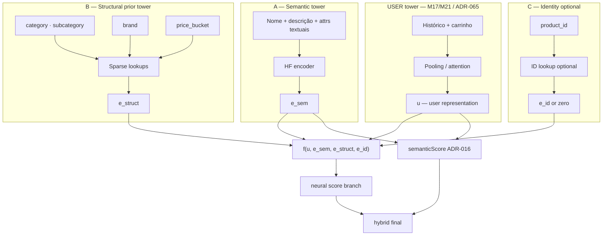

# ADR-074: Milestone M22 — representação de item em três vias (semântica, prior estrutural, memorização ID) + utilizador

**Status:** Accepted (revisão comité 2026-05-02)  
**Date:** 2026-05-02

## Context

O pipeline actual concatena **perfil do utilizador** (agregação de embeddings de compras, M17/M21) com **um único embedding denso de produto** (HF) num MLP. Ajustes de **temperatura de pooling** e **janela temporal** (M21) melhoram a promoção precoce de marcas/categorias **novas para o utilizador**, mas empurram o modelo para «última compra dominante», indesejável semanticamente.

A primeira redacção desta ADR falava em **«sparse tower»** genérica (brand, category, product id num mesmo saco). Na prática de **RecSys em larga escala**, misturar **prior de mercado / estrutura de catálogo** (categoria, marca, bucket de preço) com **memorização por SKU** (`product_id`) na **mesma projeção esparsa** prejudica **separabilidade**: o modelo não distingue bem *«similar por texto»* vs *«popular nesta categoria»* vs *«este SKU específico já foi comprado»*, e a generalização para cold start de **marca/categoria** fica mais ruidosa.

## Comité — parecer sobre o refinamento solicitado (2026-05-02)

**Pedido do proponente:** decompor a representação de **item** em **três componentes** (torre semântica HF; torre de **prior estrutural** esparsa; embedding opcional de **ID** só para memorização), impor **separação** entre eles, definir **fusão explícita** com a **user tower**, e manter **M21 como baseline**, **M22 modular com flags**, **Precision@5** como gate.

| Papel | Parecer | Voto |
|-------|---------|------|
| **Arquitectura de software** | A fronteira *semântico / catálogo / SKU* mapeia-se a **módulos e tabelas de embedding distintos**, versionáveis e testáveis; reduz acoplamento e facilita rollback por flag. | **Aprovar** |
| **Staff engineering (serving + dados)** | Exige **dois vocabulários + manifesto** (prior vs ID), não um único «sparse blob»; custo aceitável se **um extractor TS** alimenta treino e inferência. `subcategory` / `price_bucket` podem ser **derivados** no ETL se o grafo não os tiver ainda. | **Aprovar** (com nota operacional) |
| **QA** | Critérios de aceite ficam mais **falsificáveis**: testes podem fixar só prior, só ID, só HF, combinações; **M22 off** mantém regressão **M22-07**. | **Aprovar** |
| **Prof.ª/e Doutor(a) em Deep Learning (RecSys)** | Separar **conteúdo textual** (HF) de **covariáveis de catálogo** e de **memorização por item** reproduz o *inductive bias* de modelos tipo **DLRM / ranking em dois estágios**: *dense features* de texto ≠ *sparse categorical* ≠ *item-id memorization*. Melhora **cold start** em marca/categoria sem forçar o ID a «explicar» a estrutura do mercado. | **Aprovar** |
| **Prof.ª/e Doutor(a) em Eng. de IA aplicada (RecSys alto desempenho)** | Alinha com **pipelines industriais** (retrieval two-tower + ranker com side features). **Precision@5** continua gate; **M21** intocado como baseline reduz risco de regressão. Documentar **price_bucket** (bins estáveis) evita leakage de preço contínuo. | **Aprovar** |

**Veredito unânime:** **APROVADO** o refinamento; a redacção anterior da ADR que agregava brand/category/id numa única «sparse tower» fica **supersedida** por esta secção.

---

## Decision

M22 permanece milestone **distinto** de **M21** (M21 = baseline; sem revogar M17 P3). A arquitectura alvo de **item** é **decomposta explicitamente** em três componentes; o **score** deriva de uma **função de fusão explícita** (implementação faseada, sempre atrás de **feature flags**, default = **pré-M22**).

### 1. Três componentes de representação de **item**

| Componente | Nome | Conteúdo | Papel |
|------------|------|-----------|--------|
| **A** | **Semantic tower (dense / HF)** | Texto do produto (nome, descrição, atributos textuais semânticos) via modelo de embeddings existente. | Similaridade de **conteúdo**; cold start quando há texto rico. |
| **B** | **Structural prior tower (sparse)** | Sinais de **mercado / catálogo**: **brand** (fornecedor), **category**, **subcategory** (quando existir ou derivável), **price bucket** (preço discretizado — política de bins documentada em tasks). **Não** inclui `product_id`. | **Prior global** e estrutura do catálogo; generalização marca/categoria **sem** confundir com SKU. |
| **C** | **Optional identity embedding (ID-level)** | Lookup opcional por **`product_id`** (ou hash estável com OOV). | **Memorização** de interacções por SKU; **desligável** por env quando se quer forçar generalização só por A+B. |

### 2. Requisitos de separação (normativos)

1. **Structural prior (B)** e **identity (C)** **SHALL NOT** partilhar a **mesma** tabela de embedding nem a **mesma** camada linear de projeção «genérica» — são **dois conjuntos de lookups + projeções** (ou duas stacks claras no manifesto).
2. **Semantic (A)** **SHALL** permanecer **isolado** da lógica de prior de mercado: o vector HF **não** é produzido misturando brand/category/price na mesma pipeline que gera o embedding de frase (pré-MLP). *Fusão* com B/C ocorre **só** na etapa acordada de **fusão de score / MLP**, não dentro do encoder HF.
3. **ID embedding (C)** **SHALL** ser tratado como **mecanismo de memorização** apenas (documentação + manifesto); **não** substitui nem duplica o papel de **B** como «feature estrutural» de catálogo.

### 3. User tower e fusão de score

- **User tower:** sequência de interacções + mecanismo de atenção / pooling (**M21 / ADR-065**), produzindo representação de utilizador **u** (ex. vector **p** 384d actual ou extensão documentada).
- **Função de score (conceito):** o ramo **neural** do ranking **SHALL** ser derivável de uma função explícita **f** que combina, no mínimo conceptualmente:

  **f(u, e_sem, e_struct, e_id_opt)** — onde **e_sem** vem de (A), **e_struct** de (B), **e_id_opt** de (C) ou zero vector quando C está desligado.

  A forma concreta (concatenação, produto interno multi-cabeça, MLP sobre concatenação, etc.) **fica para `tasks.md`**, mas **não** pode colapsar B e C num único vector esparsa sem documentação que prove a separação.

- O **híbrido existente** ([ADR-016](../m4-neural-recommendation/adr-016-hybrid-score-weight-calibration.md)) — **semanticScore** por cosine entre perfil e **e_sem** — **pode** coexistir; pesos e documentação de operador **SHALL** ser actualizados se a fusão final mudar.

### 4. Motivação (aceite pelo comité)

- Melhor **cold start** para categorias e marcas **novas para o utilizador** via **B** sem obrigar histórico denso.
- Reduzir dependência excessiva de **histórico** só para «activar» ranking relevante (menos pressão em temperatura/janela agressivas).
- **Separar** similaridade **semântica** (A), **prior de mercado** (B) e **memorização** (C).

### 5. Compatibilidade

- **M21** permanece **baseline**; defaults de env **SHALL** reproduzir comportamento **pré-M22** quando M22 desligado.
- **M22** **SHALL** ser **modular** (flags por componente A/B/C onde fizer sentido, mínimo: master M22 off + granularidade em tasks) com **rollback** via `VersionedModelStore` + env.
- **Precision@5** (mesmo protocolo M20/M21) **permanece** gate de promoção.

---

## Architecture (visão lógica)

---

## Alternatives considered

- **Só M21 + knobs** — não resolve decomposição item-level; mantém trade-off última compra vs cold start.
- **Uma única «sparse tower»** (brand+category+product_id agregados) — **rejeitada** após revisão comité: viola separabilidade B vs C e confunde prior de mercado com memorização.
- **Concatenar tudo no MLP sem fronteiras** — menor número de módulos, mas pior testabilidade e pior narrativa operacional.

## Consequences

- **Manifesto / sidecar** M22 deve declarar **vocabulários e dimensões separados** para (B) e (C), política OOV, e bins de **price_bucket**.
- **Extractor TS único** continua recomendado, mas com **sub-APIs claras**: `toSemanticInput`, `toStructuralIndices`, `toIdIndex` (nomes indicativos) para não misturar responsabilidades no código.
- Possível necessidade de **campos derivados** (`subcategory`, `price_bucket`) no pipeline de dados se ainda não existirem no seed — tarefa de dados, não bloqueante para aceitar a ADR.

## References

- [ADR-016](../m4-neural-recommendation/adr-016-hybrid-score-weight-calibration.md) — híbrido neural + semântico.
- [ADR-065](../m17-phased-recency-ranking-signals/adr-065-m17-p2-shared-profile-pooling-and-temporal-alignment.md) — alinhamento treino/inferência do **perfil**; mesmo princípio para **composição de item**.
- [ADR-070](../m21-ranking-evolution-committee-decisions/adr-070-m21-committee-priorities-and-m17-p3-deferral.md) — fronteira M21 / M17 P3.
- [spec.md](./spec.md) · [design.md](./design.md)
