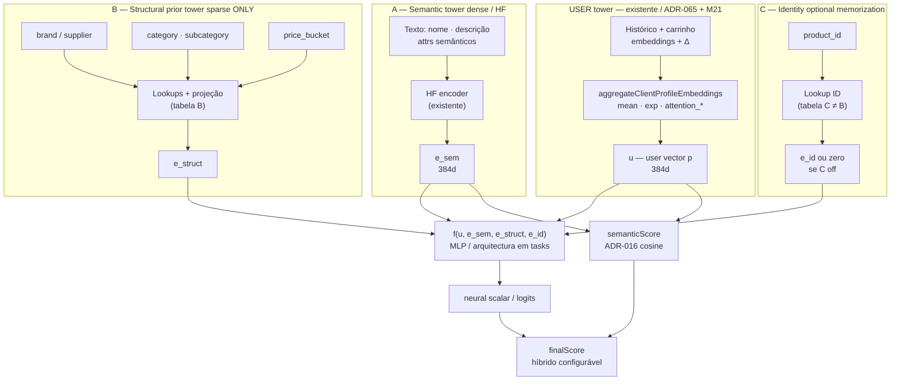

# M22 — Design: item em três vias (semântica, prior estrutural, ID opcional) + user tower

**Status:** Approved (alinhado a ADR-074 revisão comité 2026-05-02)  
**Data:** 2026-05-02 · **Actualizado:** Design complex Fases 1–3 (2.ª passagem, 2026-05-02) — convergência com ADR-074 A/B/C; flags B/C; riscos  
**ADR:** [ADR-074](./adr-074-m22-milestone-hybrid-sparse-item-tower.md)

---

## Architecture overview



**Responsabilidades (não misturar):**

| Via | Responsabilidade | O que **não** faz |
|-----|------------------|-------------------|
| **A — Semantic (HF)** | Representar **conteúdo textual** para similaridade e sinal denso no MLP. | Não codifica prior de popularidade por categoria nem memorização por SKU dentro do encoder. |
| **B — Structural prior** | Captar **estrutura de catálogo + mercado** (marca, categorias, faixa de preço). | **Não** inclui `product_id`; não substitui o texto em A. |
| **C — Identity (opcional)** | **Memorizar** interacções específicas ao SKU. | Não assume papel de «feature de catálogo»; lookups **separados** de B. |

**Relação com o monolith actual:** hoje só existe **A** no ramo neural de item (+ híbrido ADR-016). M22 acrescenta **B** e opcionalmente **C** com **fusão explícita** `f` antes do score neural final.

---

## Pré-voo (brownfield)

- **Carregado:** [spec.md](./spec.md), [ADR-074](./adr-074-m22-milestone-hybrid-sparse-item-tower.md), [ai-service ARCHITECTURE](../../codebase/ai-service/ARCHITECTURE.md) (composição root, `RecommendationService`, TF `tf.tidy`).
- **`.specs/codebase/{CONVENTIONS,CONCERNS}.md`** na raiz agregada: **não presentes**; convénio inferido de M21/ADR-071 e `ai-service/README.md`.

---

## Design complex — Fases 1 a 3 (2.ª passagem, pós ADR-074)

### Tensões actuais

- **Correctness vs escopo:** três vias + manifest duplo aumentam superfície de falha treino/inferência.
- **Dados:** `subcategory` / `price_bucket` podem ser **derivados** — alinhamento com fonte de verdade do catálogo.
- **Operação:** operadores precisam de **rollback** previsível sem matriz enorme de envs inválidos.

### Fase 1 — ToT (3 nós)

| Node | Approach | Failure point | Cost |
|------|----------|---------------|------|
| **A** | **ADR-074 literal:** A/B/C disjuntos; **f(u, e_sem, e_struct, e_id)**; HF sem misturar B/C no encoder; manifest com vocabulários B e C separados. | Complexidade de primeira entrega; mais testes. | medium |
| **B** | Partilhar **uma** camada linear de projeção entre embeddings de B e de C após lookups separados (menos parâmetros). | Colapsa o que **M22-08** proíbe (projeção indiferenciada); semântica de memorização vs prior estrutural confunde-se. | **high** |
| **C** | Inferir **categoria** só a partir de texto (NER / keywords) em vez de campos de catálogo para **B**. | Drift face ao grafo; viola espírito de **M22-02** (prior de mercado alinhado ao catálogo). | **high** |

- **A:** CUPID-D — *semantic / structural / identity* são vocabulários de domínio; CUPID-C — encaixa em `ModelTrainer`, `neuralModelFactory`, `VersionedModelStore`.
- **B:** CUPID-D — nome «partilhado» esconde papéis diferentes; CUPID-C — frágil para testes de regressão M22-08.
- **C:** CUPID-D — mistura *content* e *catalog prior*; CUPID-C — duplica sinal de **A** de forma não controlada.

### Fase 2 — Red team

| Node | Risk | Vector | Severity |
|------|------|--------|----------|
| A | Desvio treino↔inferência se extractor ou manifest divergirem | data consistency | **High** |
| A | Manifest parcial (só B) com C activo | rollback / estado inválido | Medium |
| B | Violação de **M22-08** em produção silenciosa | regression | **High** |
| C | Categorias «inventadas» vs PostgreSQL/Neo4j | data consistency | **High** |

- **A:** CUPID-U — sim, com sub-módulos (extractor, B-graph, C-graph, **f**).
- **B/C:** CUPID-U — nós inválidos como arquitectura alvo.

**Mitigação do High em A:** extractor TS **único** + testes co-localizados + gate **M22-07**; política manifest em falta → **M22 off** (ver *Error handling*).

### Fase 3 — Convergência

```
Winning node: A
Approach: Implementar M22 conforme ADR-074: três vias A/B/C, tabelas B≠C, fusão explícita f, semântica HF isolada até f.
Why it wins over B: B quebra a separação normativa B vs C; não é admissível face ao spec.
Why it wins over C: C desancora prior estrutural do catálogo; prejudica cold start controlado por marca/categoria.
Key trade-off accepted: Mais parâmetros e manifesto vs separabilidade e testabilidade exigidas pelo milestone.
Path 1 verdict: A — B e C têm severidade alta sem mitigação aceitável no âmbito M22.
Path 2 verdict: A — tasks T22-2…T22-6 já seguem o nó A; desvio seria retrabalho.
```

**Nota de entrega:** a **ordem de implementação** pode **ordenar** B antes de C no código (valor zero para **e_id** até C estar pronto) sem mudar a arquitectura alvo **A** — é tactica de PR, não um nó ToT separado.

---

## Modelo de feature flags (recomendado)

| Camada | Propósito |
|--------|-----------|
| **Master** `M22_ENABLED` (nome final em `env.ts`) | Quando **off**, comportamento **pré-M22** integral (**M22-01**, **M22-07**). |
| **Sub-flag** `M22_STRUCTURAL` (B) | Activa lookups + **e_struct**; pode ser **on** com C **off** (memorização por SKU desligada). |
| **Sub-flag** `M22_IDENTITY` (C) | Activa **e_id**; **SHOULD** exigir B **on** (ou fail-fast no startup) para evitar configurações sem sentido de produto — matriz exacta em `tasks.md` / README. |

Defaults: tudo **off** até promoção. Nomes finais são **T22-1**.

---

## Code reuse analysis

| Componente | Reuso |
|------------|--------|
| `clientProfileAggregation.ts` | Fonte única de **u**; M22 não altera M21 salvo task explícita. |
| `neuralModelFactory` / `ModelTrainer` | Extensão com **duas** stacks esparsas (B e C) + manifest; **ADR-071** para cabeça / sidecars. |
| `RecommendationService` | Orquestra **semanticScore** (A vs perfil) + **f** + híbrido; fusão **documentada**. |
| `VersionedModelStore` | Versão M22 com vocabulários B e C **separados** + rollback. |
| Extractor TS | **Um** módulo com funções **separadas** para inputs de A, índices de B, índice de C (evita misturar no código o que a ADR proíbe no modelo). |

---

## Components (para tasks)

1. **`itemRepresentationInputs`** (nome indicativo) — TS puro: produto → `{ textForHF, structuralKeys, idKey }` sem cruzar B com C na mesma estrutura opaca.
2. **TF subgraph B** — apenas features de **B**; tabela de embeddings **B**.
3. **TF subgraph C** — opcional; tabela **C** disjoint de B.
4. **Fusão `f`** — documentada no manifesto (forma de combinar u, e_sem, e_struct, e_id).
5. **Eval** — `precisionAt5`; testes por flag (A só, A+B, A+B+C).

---

## Data models

- **A:** inalterado conceptualmente — texto a partir de Neo4j/API.
- **B:** `category`, `subcategory` (opcional / derivado), `supplier`/brand, `price_bucket` (derivado de `price` com bins versionados).
- **C:** `product_id` + política OOV (bucket ou hash) **independente** de B.
- **Vocabulários:** serializados com o modelo; **dois** para sparse (B e C) no manifesto M22.

---

## Error handling strategy

- **Manifest incompleto / só B sem C:** C off → **e_id = 0**; comportamento documentado.
- **Sub-flags:** combinação inválida (ex. C **on** sem B se a política escolhida for fail-fast) → erro claro no **startup** do `ai-service` ou matriz documentada no README (**T22-1**).
- **M22 master off:** ramo pré-M22; **M22-07** regressão.
- **TF.js:** ADR-008 — I/O antes de `tf.tidy()`.

---

## Tech decisions

| Decisão | Escolha | Notas |
|---------|---------|--------|
| Framework | TF.js existente | Fase 1 sem novo runtime. |
| Forma de `f` | TBD em tasks | Ex.: concat + MLP; documentar dimensões. |
| Híbrido ADR-016 | Manter cosine em **e_sem** | Pesos podem recalibrar-se empiricamente. |
| Código | Extractor **único**, sub-APIs A/B/C | Alinha a ADR-074 *Consequences* e ADR-065 no eixo item. |
| Flags | Master **M22 off** + sub-flags B / C conforme secção acima | Rollback previsível; evita explosão de estados inválidos com validação no startup. |
| `price_bucket` | Bins estáveis + documentados | Evita leakage; versão de bins no manifesto. |

---

## Alternatives discarded

| Abordagem | Motivo |
|-----------|--------|
| Uma só torre esparsa brand+category+product_id | Rejeitada pelo comité: viola separação B/C e semântica vs memorização. |
| Só knobs M21 | Não cumpre objectivo M22. |
| MLP monolítico sem fronteiras A/B/C | Dificulta testes e operação. |

---

## Histórico — Convergência Design complex

- **1.ª passagem (2026-05-02):** ToT sem Rule of Three; **nó A** (multi-via item); ADR comité aprova A/B/C; extractor único + sub-APIs.
- **2.ª passagem (2026-05-02):** Revalidação pós ADR-074 — **nó A** mantém-se; nós ToT **anti-padrão** rejeitados (projeção linear partilhada B/C; categoria só por texto). Acrescentados: **flags** master + B + C, mitigação treino/inferência, política de sub-flags inválidas (*Error handling*). Detalhe completo: secção **Design complex — Fases 1 a 3 (2.ª passagem)** acima.

---

## Committee findings applied (resumo)

| Finding | Incorporação |
|---------|--------------|
| Separar prior estrutural de memorização ID | Diagrama + Components + ADR-074 §2 |
| HF isolado de lógica de mercado no encoder | Secção Responsabilidades + ADR-074 §2.2 |
| f(u, e_sem, e_struct, e_id) explícita | Diagrama + ADR-074 §3 |
| Flags + Precision@5 + M21 baseline | ADR-074 §5; spec M22-01, M22-07 |
| 2.ª passagem Design complex: nó A, flags B/C, fail-fast sub-flags | Secções *Design complex 2.ª passagem*, *Modelo de feature flags*, *Error handling* |

---

## References

- [spec.md](./spec.md)
- [Google Cloud — Scaling deep retrieval (Two Towers)](https://cloud.google.com/blog/products/ai-machine-learning/scaling-deep-retrieval-tensorflow-two-towers-architecture)
- Naumov et al., *Deep Learning Recommendation Model* (DLRM) — referência conceptual denso + múltiplos esparsos.
