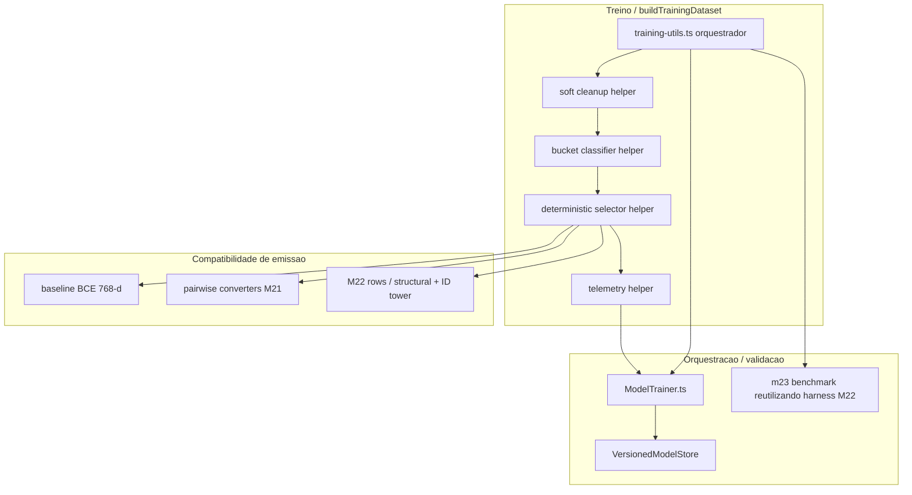

# M23 - Design complex (negative sampling soft + hard para ranking)

**Spec:** [spec.md](./spec.md)  
**RFC canonica:** [rfc.md](./rfc.md)  
**Tasks:** [tasks.md](./tasks.md)  
**Status:** **Approved + Executed/Verified** (Design complex + implementation sync, 2026-05-04) · modo automatico (sem gate `approve`)

---

## Resumo executivo

M23 redesenha apenas a fase de negative sampling do treino, sem trocar a arquitetura base do `ai-service`. O caminho vencedor mantem `training-utils.ts` como orquestrador brownfield, preserva o modo `legacy` como default e extrai apenas helpers pequenos e puros para `soft cleanup`, classificacao por buckets, selecao deterministica e telemetria minima. O modo novo `stratified` deixa de excluir pares por regra ampla `category + supplierName` ou por threshold semantico baixo e passa a operar em cinco fases: `soft cleanup` restrito a equivalencia real, bucketizacao `hard/medium/easy`, selecao alvo `1 hard + 2 medium + 1 easy`, emissao do dataset compativel com BCE/pairwise/M22 e benchmark-rollout contra o baseline `legacy`.

A principal decisao tecnica e normativa e esta: hard negatives deixam de ser tratados como ruido a excluir e passam a ser o primeiro sinal de treino quando existirem. Isso vale especialmente para casos intra-categoria e para cenarios com ID tower/M22 ativa, onde remover semelhantes favoreceria memorizacao cega em vez de generalizacao.

---

## Phase 1 - ToT divergence (tensoes -> nos)

| Tensao | Descricao |
|------|-----------|
| **t1** | Corrigir falso negativo sem voltar ao erro oposto de excluir substitutos reais demais. |
| **t2** | Reaproveitar `training-utils.ts` e `ModelTrainer.ts` sem criar um mini-framework de sampling prematuro. |
| **t3** | Garantir que o novo sampler alimente tanto o baseline 768-d quanto o modo estrutural M22/ID tower com o mesmo contrato. |
| **t4** | Tornar benchmark e rollout comparaveis com `legacy` sem acoplar telemetria e metricas ao caminho de inferencia. |

| Node | Approach | Failure point | Cost |
|------|----------|---------------|------|
| **A** | Reescrever tudo inline em `training-utils.ts` com condicionais por modo | Ficheiro cresce demais, dificulta testes focados de bucket/fallback | medium |
| **B** | Manter `training-utils.ts` como orquestrador e extrair helpers puros pequenos adjacentes | Mais 2-4 ficheiros pequenos para manter | low |
| **C** | Criar pipeline/registry generico de sampling com estrategias plugaveis | Over-engineering sem terceira estrategia real no codebase | high |

**Rule of Three / CUPID:** **C** nao tem evidencia de repeticao suficiente. **A** entrega rapido, mas mistura policy, telemetria e compatibilidade M22 no mesmo fluxo. **B** vence porque separa regras de negocio do sampler em unidades testaveis sem abandonar o padrao brownfield do `ai-service`.

---

## Phase 2 - Red team

| Node | Risk | Vector | Severity |
|------|------|--------|----------|
| **A** | Regressao silenciosa do modo `legacy` | Comparabilidade / rollback | High |
| **A** | Fallbacks e thresholds espalhados em loops aninhados | Legibilidade / drift | Medium |
| **B** | Helpers demais com contratos inconsistentes | Coesao | Low |
| **B** | Telemetria virar API publica cedo demais | Scope creep | Medium |
| **C** | Entrega atrasar por abstracao especulativa | Maintainability / delivery | High |
| **C** | Registry esconder regras normativas de hard negatives | Correctness | High |

**CUPID-U:** **B** mantem responsabilidade clara por ficheiro: `training-utils.ts` continua a montar o dataset; helpers classificam, selecionam e relatam; `ModelTrainer.ts` e benchmark so consomem o resultado e a telemetria agregada.

---

## Phase 3 - Self-consistency convergence

```
Winning node: B
Approach: Orquestracao brownfield em training-utils + helpers puros pequenos para soft cleanup, buckets, fallback e telemetria.
Why it wins over A: Mantem testabilidade de regras M23-01..M23-15 sem inflar o loop principal de buildTrainingDataset.
Why it wins over C: Evita framework generico antes de existir uma terceira familia de sampler.
Key trade-off accepted: Introduzir alguns tipos auxiliares internos e uma camada minima de metadata do sampling.
Path 1 verdict: B - menor severidade agregada no red team.
Path 2 verdict: B - coincide com composition root atual, com M22 e com o benchmark existente em src/benchmark.
```

---

## Phase 4 - Committee review (findings)

| Persona | Finding | Severity | Proposed improvement |
|---------|---------|----------|----------------------|
| Professora com PhD em Deep Learning, com enfase em sistemas de classificacao | Threshold semantico unico para exclusao produz colapso de sinal em ranking; pares semanticamente proximos devem migrar para aprendizagem contrastiva, nao para descarte | High | Fixar `SOFT_NEGATIVE_MAX_SIM` apenas para quase-duplicatas e tornar prioridade de hard negatives normativa no modo `stratified` |
| Professora com PhD em Deep Learning, com enfase em sistemas de classificacao | Fallbacks nao deterministas distorcem comparacao offline e dificultam atribuicao causal de ganho/regressao | High | Ordenacao deterministica por bucket com desempate estavel (`similarity`, sinais estruturais, `productId`) e seed reprodutivel por run |
| Professor com Doutorado em Engenharia de IA Aplicada, com enfase em sistemas de recomendacao | Excluir intra-categoria por regra global contradiz o problema real de recomendacao, onde a decisao util e entre substitutos e concorrentes proximos | High | Tratar `same category + supplier/brand quando disponivel` como fonte primaria de hard negatives, nao como exclusao |
| Professor com Doutorado em Engenharia de IA Aplicada, com enfase em sistemas de recomendacao | Se a ID tower estiver ativa e o dataset perder negativos intra-categoria, o modelo aprende memorizacao e perde generalizacao em cold start | High | Tornar preservacao de intra-categoria um guardrail explicito quando `identityEnabled` estiver ativo e registrar ausencias em telemetria |
| Staff AI Architect | O benchmark M23 nao deve duplicar toda a infraestrutura M22; deve reutilizar o harness e acrescentar eixo `samplingMode` | Medium | Novo benchmark M23 reutiliza o protocolo de `m22ArchBenchmark.ts` e adiciona comparacao `legacy` vs `stratified` no mesmo dataset/protocolo |
| QA Staff | Sem tabela de rastreabilidade por requisito e estrategia de verificacao, thresholds e fallback viram detalhes implicitos e regressao passa despercebida | High | Fechar `design.md` com matriz `M23-01..M23-22`, riscos cobertos, verificacao e rollout gate |

**Non-negotiable (>= 2 personas):** hard negatives sao sinal prioritario, nao opcional; o benchmark deve ser deterministicamente reproduzivel por seed/configuracao; quando M22/ID tower estiver ativo, negativos intra-categoria devem ser preservados quando existirem e sua ausencia deve ficar visivel em telemetria.

---

## Phase 5 - Entregavel (este documento + RFC-M23-NS-001)

A [RFC M23](./rfc.md) fixa a direcao estrategica: soft cleanup minimo, buckets por dificuldade, prioridade normativa para hard negatives, fallback deterministico e rollout com flag. Este `design.md` traduz essa decisao em arquitetura brownfield para `ai-service`, definindo contratos internos, componentes, riscos e verificacao antes de abrir `tasks.md`.

---

## Architecture overview



---

## Code reuse analysis

| Area | Reutilizar | Evitar |
|------|------------|--------|
| Dataset build | `buildTrainingDataset`, `seedFromClientIds`, `rowForProduct` | Segunda implementacao paralela do dataset para M23 |
| Compat pairwise | `bceLabelsToPairwiseRows`, `m22BceLabelsToPairwiseRows` | Novo conversor pairwise so para sampler estratificado |
| M22 / ID tower | `buildM22IndexMaps`, manifesto M22, `identityEnabled` | Regras especiais de sampling enterradas dentro do manifesto |
| Benchmark | `m22ArchBenchmark.ts`, `benchmarkShared.ts`, `computePrecisionAtK*` | Script isolado sem partilha de protocolo e seeds |
| Startup / env | `src/config/env.ts`, defaults legacy e composition root atual | Flags escondidas em `process.env` no meio do loop de treino |

---

## Components

| Componente | Responsabilidade | Ficheiros provaveis |
|------------|------------------|---------------------|
| **Sampler orchestrator** | Escolher entre `legacy` e `stratified`, montar positivos/negativos e emitir dataset final | `src/services/training-utils.ts` |
| **Soft cleanup helper** | Excluir apenas equivalencias reais antes da bucketizacao | Helper puro adjacente a `training-utils.ts` |
| **Bucket classifier helper** | Calcular `cosine`, sinais estruturais e `bucketReason` (`hard/medium/easy`) | Helper puro adjacente a `training-utils.ts` |
| **Deterministic selector helper** | Aplicar alvo `1 hard + 2 medium + 1 easy`, fallback explicito e desempate estavel | Helper puro adjacente a `training-utils.ts` |
| **Telemetry helper** | Agregar contagens por bucket, fallback, cobertura intra-categoria e modo de sampling por run | Helper puro adjacente a `training-utils.ts` |
| **Training orchestrator** | Persistir metadata de treino/logs e acionar avaliacao offline | `src/services/ModelTrainer.ts` |
| **Benchmark / rollout harness** | Comparar `legacy` vs `stratified` no mesmo protocolo, inclusive cenarios M22/ID tower | Novo benchmark M23 reaproveitando `src/benchmark/m22ArchBenchmark.ts` |

### Ordem da pipeline de dados

1. `training-utils.ts` recebe clientes, produtos, embeddings, `temporal` e opcional M22 exatamente como hoje.
2. O modo `legacy` preserva o comportamento pre-M23 para comparabilidade e rollback.
3. O modo `stratified` executa `soft cleanup` minimo sobre o pool elegivel.
4. Cada candidato sobrevivente recebe bucket e razao de bucket.
5. O seletor deterministico busca `1 hard + 2 medium + 1 easy`, aplica fallback explicito e agrega telemetria.
6. O emissor final mantem o mesmo contrato de saida do dataset baseline ou M22; os conversores pairwise continuam a operar sobre labels/rows ja ordenados.

### Politica de soft cleanup

`soft cleanup` em M23 nao replica a exclusao ampla atual. A exclusao fica limitada aos seguintes casos:

1. `same product_id` do positivo.
2. Mesma familia de SKU, quando for possivel derivar um `skuFamilyKey` confiavel a partir de `sku`.
3. Variacoes triviais explicitamente documentadas e estreitas, por exemplo o mesmo item com diferenca apenas de unidade/packaging suportada por regra deterministica e bounded; heuristica aberta/fuzzy fica fora.
4. `cosine > SOFT_NEGATIVE_MAX_SIM` com default inicial `0.92`.

Se `skuFamilyKey`, `brand` ou outro metadata estrutural nao existir, o helper apenas ignora esse sinal; nao amplia o escopo de exclusao.

### Classificacao por bucket

Depois do `soft cleanup`, cada candidato recebe um `bucket` e uma `bucketReason`:

- `hard`: `cosine` em `0.70-0.92` ou `same category` com sinal adicional de proximidade (`supplierName` e, quando existir no payload futuro, `brand`).
- `medium`: `cosine` em `0.40-0.70`, ou candidatos semanticamente moderados que nao atendem criterio hard.
- `easy`: `cosine < 0.40`.

Regras estruturais prevalecem sobre a antiga exclusao: `same category + supplierName` deixa de significar "nao usar" e passa a significar "candidato prioritario a hard", salvo se o item tiver sido removido no `soft cleanup` por equivalencia real.

### Selecao deterministica e fallback

Cada bucket e ordenado deterministicamente por:

1. prioridade estrutural (`same category + supplier/brand` antes dos demais),
2. proximidade semantica apropriada ao bucket,
3. `productId` ascendente como desempate estavel.

Politica alvo por positivo em `ratio=4`:

1. preencher `1` slot hard;
2. preencher `2` slots medium;
3. preencher `1` slot easy.

Fallback explicito:

1. se faltar `hard`, promover o candidato de maior similaridade do bucket `medium`;
2. se ainda faltar slot, usar o proximo candidato mais proximo disponivel, registando o motivo na telemetria;
3. se faltar `medium`, consumir primeiro remanescente de `hard`, depois `easy`, preservando ordenacao deterministica;
4. se faltar `easy`, consumir o candidato restante de menor dificuldade disponivel (`medium`, depois `hard`) sem duplicar item.

Isso preserva a norma da RFC: sempre que houver hard elegivel, pelo menos um hard negative deve aparecer por positivo.

### Compatibilidade com BCE, pairwise e M22/ID tower

M23 atua antes da serializacao do dataset. O que muda e a composicao dos negativos; o formato final continua o mesmo:

- baseline BCE continua a emitir `inputVectors` 768-d;
- pairwise continua a usar `bceLabelsToPairwiseRows` e `m22BceLabelsToPairwiseRows` sem protocolo novo;
- M22 continua a produzir `M22ScoreRow[]` via `rowForProduct`, sem duplicar extractor estrutural.

Quando `m22.manifest.identityEnabled` estiver ativo, o seletor adiciona um guardrail: se houver candidatos intra-categoria apos `soft cleanup`, pelo menos um deles deve sobreviver entre os negativos escolhidos. O objetivo nao e favorecer `product_id`, e sim impedir que a ID tower memorize o positivo sem contraste local.

---

## Data models

| Dado | Notas |
|------|------|
| `NegativeSamplingMode` | `legacy | stratified`; default `legacy`. |
| `StratifiedNegativeCandidate` | Estrutura interna com `product`, `cosine`, `bucket`, `bucketReason`, `sameCategory`, `sameSupplier`, `sameBrand?`, `excludedBySoftCleanup?`. |
| `NegativeSamplingConfig` | `softNegativeMaxSim`, limites `hard/medium`, alvo por bucket e `seed`; ratio alvo de M23 permanece `4` nesta milestone. |
| `NegativeSamplingTelemetry` | Contadores por bucket, promocoes de fallback, `hardAvailable`, `hardSelected`, `intraCategoryAvailable`, `intraCategorySelected`, `mode`, `seed`. |
| `TrainingDatasetBuildResult` | Mantem shapes atuais do baseline/M22; pode carregar metadata opcional de sampling para logs/benchmark sem alterar rows/labels. |

---

## Error handling strategy

| Cenario | Comportamento |
|---------|----------------|
| `NEGATIVE_SAMPLING_MODE` invalido | Fail-fast no startup/env parsing; default `legacy` continua unico caminho de rollback rapido |
| Thresholds incoerentes (`soft <= hard`, ranges invertidas) | Fail-fast antes do treino/benchmark |
| `skuFamilyKey` ou `brand` indisponivel | Degradacao graciosa: helper ignora o sinal e segue com os dados suportados |
| Nenhum hard negative elegivel | Aplicar fallback para o melhor `medium`, registrar evento em telemetria |
| Nenhum intra-categoria disponivel com ID tower ativa | Nao falha o treino; registra warning/telemetria para analise de risco |
| Benchmark sem ganho consistente ou com alta variancia | Rollout bloqueado; permanecer em `legacy` e preservar baseline `model/version` |

---

## Tech decisions

1. **Brownfield first:** `training-utils.ts` continua ponto unico de orquestracao do dataset; helpers pequenos e puros isolam policy sem introduzir registry.
2. **Legacy como default e referencia de rollback:** `NEGATIVE_SAMPLING_MODE=legacy` reproduz o comportamento pre-M23 e e obrigatorio no benchmark lado a lado.
3. **Soft cleanup minimo:** substituir `SOFT_NEGATIVE_SIM_THRESHOLD` amplo por `SOFT_NEGATIVE_MAX_SIM` com default inicial `0.92`; pares abaixo disso so saem por equivalencia estrutural real.
4. **Buckets normativos:** `hard=0.70-0.92`, `medium=0.40-0.70`, `easy<0.40` ate calibracao posterior.
5. **Hard negatives prioritarios:** no modo `stratified`, `same category + supplier/brand` e fonte de hard negatives, nao filtro global.
6. **Compatibilidade M22:** manifest e `rowForProduct` permanecem inalterados; a estrategia de sampling decide apenas quais candidatos entram no dataset.
7. **Telemetria minima por run:** o sampler deve emitir pelo menos composicao dos buckets, uso de fallback, cobertura intra-categoria e `seed/config`.

### Proposta de envs M23

| Area | Env | Valores / exemplo | Default |
|------|-----|-------------------|---------|
| Gate principal | `NEGATIVE_SAMPLING_MODE` | `legacy` / `stratified` | `legacy` |
| Soft cleanup | `SOFT_NEGATIVE_MAX_SIM` | float `0 < x < 1` | `0.92` |
| Hard range | `HARD_NEGATIVE_MIN_SIM` | float | `0.70` |
| Medium range | `MEDIUM_NEGATIVE_MIN_SIM` | float | `0.40` |
| Benchmark | `M23_BENCHMARK_RUNS` | inteiro `>= 2` | `2` |

`negativeSamplingRatio=4` permanece fixado no milestone para evitar configuracao em excesso; o design de M23 governa a composicao `1/2/1`, nao um sampler arbitrario para qualquer ratio.

---

## Verification

| Nivel | Comando / artefacto |
|-------|----------------------|
| Unit | Fixtures sinteticas para `soft cleanup`, buckets, ordenacao deterministica e fallback por bucket |
| Dataset compat | Testes de `training-utils` cobrindo baseline BCE, pairwise e M22/ID tower com `legacy` e `stratified` |
| Trainer / benchmark | Benchmark M23 com `legacy` vs `stratified`, mesmo protocolo e pelo menos `2` runs por configuracao |
| Package gate | `cd ai-service && npm run verify` ([TESTING.md](../../codebase/ai-service/TESTING.md)) |
| Rollout gate | Relatorio offline com `precisionAtK`, `NDCG@K`, `MRR`, `pairwise accuracy within category`, top-N/cold-start e telemetria de buckets |
| Operator docs | Playbook de ativacao, rollback e leitura dos indicadores de risco/qualidade |

### Benchmark e rollout flow

1. Reusar o harness de benchmark inspirado em `m22ArchBenchmark.ts`, adicionando eixo `samplingMode=legacy|stratified`.
2. Rodar cada configuracao pelo menos `2` vezes no mesmo protocolo, com seeds documentadas.
3. Comparar metricas de ranking (`NDCG@K`, `MRR`, top-N apos primeira interacao/proxy) e uma metrica intra-categoria (`pairwise accuracy within category` ou equivalente documentado).
4. Repetir tambem cenarios M22 sem ID e com ID para verificar se a estrategia estratificada melhora ranking sem colapsar para memorizacao.
5. So promover `stratified` quando o ganho for consistente e o baseline `legacy` permanecer disponivel para rollback imediato.

---

## Alternatives discarded

| Node | Approach | Eliminated in | Reason |
|------|----------|---------------|--------|
| **A** | Reescrever policy toda inline em `training-utils.ts` | Phase 3 | Pior legibilidade, mais risco de drift entre legacy/stratified e menor testabilidade focal |
| **C** | Registry/pipeline generico de sampling | Phase 2 | Rule of Three nao satisfeita; abstrai cedo demais um problema com apenas dois modos reais |

---

## Committee findings applied

| Finding | Persona | How incorporated |
|---------|---------|------------------|
| Hard negatives devem migrar de "falso negativo suspeito" para "sinal prioritario" | Professora PhD em Deep Learning + Professor Doutorado em Engenharia de IA Aplicada | Buckets normativos, fallback explicito e regra contra exclusao intra-categoria ampla |
| Comparabilidade exige seed e desempate estaveis | Professora PhD em Deep Learning | Selecao deterministica, telemetria de `seed` e benchmark multi-run no mesmo protocolo |
| Recomendacao real exige contraste entre substitutos proximos | Professor Doutorado em Engenharia de IA Aplicada | `same category + supplier/brand` promovido a hard candidate em vez de filtro |
| ID tower precisa contraste local para evitar memorizacao | Professor Doutorado em Engenharia de IA Aplicada + Staff AI Architect | Guardrail de preservacao intra-categoria quando `identityEnabled` estiver ativo |
| Benchmark nao deve divergir do padrao M22 | Staff AI Architect | Reuso do harness/metricas do benchmark existente com novo eixo `samplingMode` |
| Requisitos precisam de verificacao explicita | QA Staff | Matriz `M23-01..M23-22`, secao Verification e rollout gate documentado |

---

## Traceability

| Req | Design anchor | Risk handled | Verification / rollout anchor |
|-----|---------------|--------------|-------------------------------|
| **M23-01** | `SOFT_NEGATIVE_MAX_SIM` em `NegativeSamplingConfig` / env table | Threshold implcito ou divergente por run | Unit de env + startup validation |
| **M23-02** | `soft cleanup` por `same product_id` | Falso negativo por duplicata exata | Fixture com positivo e mesmo `product_id` removido |
| **M23-03** | `skuFamilyKey` quando suportado | Quase-duplicata persistir como hard indevido | Fixture com mesma familia SKU e fallback quando metadata falta |
| **M23-04** | Lista fechada de variacoes triviais documentadas no `soft cleanup` | Heuristica fuzzy ampliar exclusao | Unit focado em exemplos permitidos e proibidos |
| **M23-05** | `soft cleanup` minimo + degradacao graciosa | Exclusao excessiva quando metadata nao existe | Fixture com falta de metadata e candidato mantido |
| **M23-06** | `NEGATIVE_SAMPLING_MODE=legacy|stratified` | Sem rollback operacional | Teste de modo + rollout flag default `legacy` |
| **M23-07** | Seletor alvo `1 hard + 2 medium + 1 easy` | Dataset sem distribuicao controlada | Unit com buckets completos e assert da composicao |
| **M23-08** | Ordem de selecao por bucket prioriza `hard` | Treino continuar enviesado para casos faceis | Fixture com buckets mistos e verificacao da ordem |
| **M23-09** | Regra "at least one hard when available" | Hard disponivel mas nao amostrado | Unit com hard disponivel e assert de presenca obrigatoria |
| **M23-10** | Fallback hard -> melhor medium | Falha de ratio em pools incompletos | Fixture sem hard e com medium ordenado por similaridade |
| **M23-11** | `same category + supplier/brand` como hard candidate | Exclusao global de concorrentes uteis | Teste de nao exclusao no modo `stratified` |
| **M23-12** | Thresholds default por bucket em `NegativeSamplingConfig` | Calibracao ad hoc nao rastreavel | Teste de classificacao por faixas limiar |
| **M23-13** | `seedFromClientIds` + ordenacao/determinismo | Benchmark irreproduzivel | Teste repetido com mesma seed e mesmo output |
| **M23-14** | `NegativeSamplingTelemetry` agregada por run | Falta de visibilidade sobre composicao/fallback | Assert sobre contadores e artefacto de benchmark |
| **M23-15** | Guardrail intra-categoria quando `identityEnabled` | ID tower memorizar sem contraste | Cenarios M22 com/sem identidade no benchmark |
| **M23-16** | Benchmark M23 com metricas de ranking alem de `precisionAtK` | Decisao baseada em metrica insuficiente | Relatorio offline com `NDCG@K`, `MRR`, metrica intra-categoria |
| **M23-17** | Slice cold start / top-N apos 1a interacao | Ganho offline nao refletir recomendacao inicial | Benchmark com cold-start metric ou proxy documentado |
| **M23-18** | Minimo `2` runs por configuracao | Variancia mascarar regressao | Benchmark multi-run com seeds documentadas |
| **M23-19** | Flag gate + baseline `model/version` preservado | Rollout sem rollback claro | Playbook de ativacao/rollback e comparacao contra baseline |
| **M23-20** | Documentacao operador no rollout flow | Operador ligar modo sem ler sinais de risco | Checklist/playbook em docs do `ai-service` |
| **M23-21** | Header e Phase 5 referenciam RFC canonica | Design se descolar da decisao aprovada | Validacao documental antes de abrir `tasks.md` |
| **M23-22** | Compatibilidade explicita com M21/M22, sem revogacao | M23 conflitar com milestones existentes | Secoes de code reuse, compat M22 e rollout legacy-first |

---

## Relacao com M22

M22 adicionou vias estruturais e identidade opcionais ao item tower; M23 nao altera esse extractor nem o manifesto. A intersecao entre ambos esta no sampling: quando a identidade esta ativa, M23 protege a generalizacao mantendo negativos intra-categoria sempre que existirem. Em outras palavras, M22 decide **como representar** o item; M23 decide **quais contrastes o modelo ve durante o treino**.

---

## Referencias

- [ARCHITECTURE.md - ai-service](../../codebase/ai-service/ARCHITECTURE.md)
- [TESTING.md - ai-service](../../codebase/ai-service/TESTING.md)
- [M21 design](../m21-ranking-evolution-committee-decisions/design.md)
- [M22 spec](../m22-hybrid-dual-item-tower-cold-start/spec.md)
- [RFC M23](./rfc.md)

---

## Output checklist (design complex)

- [x] 3 nos ToT + Rule of Three / CUPID inline  
- [x] Red team completo  
- [x] Self-consistency Path 1 + Path 2  
- [x] Committee review com personas academicas e non-negotiables aplicados  
- [x] Architecture overview + code reuse + components  
- [x] Data models + error handling + tech decisions  
- [x] Verification + alternatives discarded + committee findings applied  
- [x] Traceability `M23-01..M23-22`  
