# M24 - Design complex (hardening relacional e query performance do `api-service`)

**Spec:** [spec.md](./spec.md)  
**RFC canonica:** [rfc.md](./rfc.md)  
**Tasks:** [tasks.md](./tasks.md)  
**Status:** **Approved** (Design complex, 2026-05-05) · modo automatico (sem gate `approve`)

---

## Resumo executivo

M24 endurece o caminho relacional do `api-service` sem alterar contratos publicos. A decisao central e manter o desenho brownfield do projeto, mas trocar leituras "entity-first e lazy-mapping" por tres estrategias diferentes conforme o tipo de dado:

1. **Catalogo (`Product`)**: pagina primeiro, hidrata depois, preservando a ordem da pagina. Isso evita `JOIN FETCH` com colecao paginada, que seria fragil e arriscado.
2. **Clientes (`Client`)**: usar projeção de DTO na listagem, porque a pagina precisa apenas de campos simples e um `countryCode`.
3. **Pedidos (`Order`)**: pagina ids, depois hidrata `items` e `product` em lote, agrupando de volta em memoria.

Em paralelo, o `FallbackRecommendationQuery` continua funcional em JDBC, mas passa a depender de indices explicitos no `schema` para manter custo previsivel. O milestone nao troca a semantica de recomendacao; apenas elimina amplificacao relacional e alinha o schema ao padrao real de acesso.

---

## Phase 1 - ToT divergence (tensoes -> nos)

| Tensão | Descrição |
|------|-----------|
| **t1** | Eliminar N+1 sem introduzir `JOIN FETCH` paginado em colecao, que tende a degradar paginação e duplicar linhas. |
| **t2** | Reutilizar repositórios e DTOs actuais sem criar uma segunda camada de leitura paralela ou query builder genérico prematuro. |
| **t3** | Manter compatibilidade funcional de listagens e detalhe, sem mudar payloads ou contratos de paginação. |
| **t4** | Validar melhoria real com contagem de queries e `EXPLAIN ANALYZE`, sem depender de otimismo no review visual do código. |

| Node | Approach | Failure point | Cost |
|------|----------|---------------|------|
| **A** | Resolver tudo com `JOIN FETCH` / `@EntityGraph` direto nas queries paginadas | Coleções paginadas podem duplicar linhas, quebrar paginação e criar comportamento dependente do provider | medium |
| **B** | Estratégia hibrida: projeção para `Client`, pagina-ids+hidratação para `Product` e `Order`, índices em schema, validação por query count | Exige alguns helpers de leitura e ordem de reagrupamento em memória | low |
| **C** | Reescrever a leitura critica em SQL nativo/CTE para tudo | Duplica lógica, aumenta custo de manutenção e afasta o milestone do brownfield actual | high |

**Rule of Three / CUPID:** **C** nao tem evidencia de repetição suficiente e empurra o milestone para uma mini-reescrita. **A** parece simples, mas falha exatamente onde M24 tem maior risco: paginação + coleções. **B** vence porque separa cada tipo de leitura no mecanismo que melhor lhe serve, mantendo os contratos públicos intactos.

---

## Phase 2 - Red team

| Node | Risk | Vector | Severity |
|------|------|--------|----------|
| **A** | `JOIN FETCH` com paginação de colecao gera resultados inconsistentes ou duplicados | Correctness / pagination | High |
| **A** | `EntityGraph` mascara o problema mas nao resolve custo de colecao em massa | Performance | High |
| **B** | Pagina-ids + hidratação exige reordenação em memoria e um pouco mais de código | Maintainability | Medium |
| **B** | Projecao de DTO para clientes pode gerar drift se o shape do contrato mudar | Contract alignment | Low |
| **C** | SQL nativo espalha dialect/alias/field names e dificulta evolução | Maintainability / portability | High |
| **C** | Query rewrite total pode esconder a causa raiz em vez de corrigi-la | Scope creep | High |

**CUPID-U:** **B** mantém uma responsabilidade clara por fluxo:
- `ProductApplicationService` orquestra paginação + hidratação
- `ClientApplicationService` usa projeção para a listagem
- `OrderRepository` ganha leitura em lote para `items/product`
- `FallbackRecommendationQuery` permanece em JDBC, mas com schema suportando o caminho

---

## Phase 3 - Self-consistency convergence

```
Winning node: B
Approach: leitura especializada por caso de uso, com pagina-ids+hidratação para coleções, projeção para listagem simples e schema ajustado para o fallback.
Why it wins over A: evita fetch join em colecao paginada, que e precisamente o ponto perigoso do milestone.
Why it wins over C: preserva o brownfield e evita duplicar o contrato de leitura em SQL nativo.
Key trade-off accepted: introduzir dois helpers de reordenação/agrupamento em memoria e alguns metodos de repositorio novos.
Path 1 verdict: B - menor severidade agregada no red team.
Path 2 verdict: B - mais aderente aos repositorios e DTOs já existentes no `api-service`.
```

---

## Phase 4 - Committee review (findings)

| Persona | Finding | Severity | Proposed improvement |
|---------|---------|----------|----------------------|
| Principal Software Architect | `JOIN FETCH` em colecao com paginação e uma fonte conhecida de comportamento subtil | High | Usar pagina-ids + hidratação para `Product` e `Order`; reservar fetch join apenas para detalhe por id |
| Staff Backend Engineer | Projecao de DTO evita N+1 na listagem de clientes com o menor custo | Medium | Usar `Page<ClientSummaryDTO>` directo no repositório ou query equivalente |
| DBA / Performance Engineer | O fallback depende mais de indices corretos do que de otimização micro da query | High | Aplicar `orders(client_id, order_date desc)` e `product_countries(country_code, product_id)` com evidência de plano |
| QA Staff | Precisamos de uma métrica repetível de queries e nao só de "parece melhor" | High | Adicionar teste de integração com contagem de statements e baseline controlado |
| Staff AI Architect | O milestone deve ficar limitado a hardening relacional e nao virar uma limpeza geral de persistencia | Medium | Manter o escopo apenas nas rotas e querys descritas na RFC |

**Non-negotiable (>= 2 personas):** nao usar `JOIN FETCH` paginado para colecao; validar com query count real; manter o fallback funcionalmente inalterado enquanto o schema recebe índices.

---

## Phase 5 - Entregavel (este documento + RFC-M24-REL-001)

A [RFC M24](./rfc.md) fixa o objectivo: reduzir N+1, endurecer indexacao e prever custo do fallback. Este `design.md` traduz isso para um plano tecnico concreto no `api-service`, mantendo o desenho brownfield e limitando o risco de regressao.

---

## Architecture overview

```mermaid
flowchart TB
  subgraph catalog [Catalogo]
    P1[ProductApplicationService.listProducts]
    PR[ProductRepository]
    PH[page ids + hydration helper]
    PD[ProductSummaryDTO]
    P1 --> PH --> PR
    PH --> PD
  end

  subgraph clients [Clientes]
    C1[ClientApplicationService.listClients]
    CR[ClientRepository]
    CP[ClientSummaryDTO projection]
    C1 --> CR --> CP
  end

  subgraph orders [Pedidos]
    O1[ClientApplicationService.listClientOrders]
    OR[OrderRepository]
    OH[order ids + hydration helper]
    OD[OrderDTO / OrderItemDTO]
    O1 --> OH --> OR
    OH --> OD
  end

  subgraph fallback [Fallback relacional]
    FQ[FallbackRecommendationQuery JDBC]
    DB[(PostgreSQL)]
    FQ --> DB
  end

  subgraph validation [Validacao]
    IT[Testcontainers IT]
    QS[query count helper]
    EX[EXPLAIN ANALYZE evidence]
    IT --> QS
    IT --> EX
  end
```



---

## Code reuse analysis

| Area | Reutilizar | Evitar |
|------|------------|--------|
| Detalhe de produto | `findByIdWithDetails(id)` | Repetir fetch-join complexo para a listagem paginada |
| Listagem de clientes | `ClientSummaryDTO` e `ClientRepository` | Montar `ClientSummaryDTO` via lazy entity graph |
| Orders detalhe/lista | `OrderDTO`, `OrderItemDTO`, `findPurchaseSummaryByClientId` | `Page<Order>` seguido de navegação lazy em `items.product` |
| Catálogo batch | `findAllByIdWithCountries(ids)` | Criar segunda árvore de DTOs ou native query para a paginação |
| Fallback | `FallbackRecommendationQuery` actual | Reescrever o SQL funcional sem necessidade |
| Schema | `infra/postgres/init.sql` | Dependência de indexação implícita ou de tuning manual por ambiente |

---

## Components

| Componente | Responsabilidade | Ficheiros provaveis |
|------------|------------------|---------------------|
| **Product page loader** | Buscar pagina base, hidratar os produtos por ids e manter a ordem da pagina | `ProductApplicationService.java`, `ProductRepository.java` |
| **Client projection query** | Listar clientes já em DTO, com `countryCode` vindo de join simples | `ClientRepository.java`, `ClientApplicationService.java` |
| **Order page loader** | Buscar ids do pedido paginado, hidratar `items` e `product` em lote, reagrupar resultado | `OrderRepository.java`, `ClientApplicationService.java` |
| **Fallback query support** | Manter SQL do fallback e garantir que o schema o suporta de forma previsivel | `FallbackRecommendationQuery.java`, `infra/postgres/init.sql` |
| **Query-count validation** | Medir statements executados por rota e garantir que os limites nao crescem por item | `src/test/java/com/smartmarketplace/...` |

### Ordem da pipeline de dados

#### 1) `listProducts()`

1. Aplicar os filtros actuais (`category`, `country`, `supplier`, `search`) na query de paginação.
2. Obter primeiro a pagina de ids/seleção base.
3. Hidratar os produtos por ids usando `findAllByIdWithCountries(ids)`.
4. Reordenar os resultados em memoria de acordo com a pagina original.
5. Mapear para `ProductSummaryDTO` sem tocar em associações lazy.

#### 2) `listClients()`

1. Substituir o carregamento entity-first por uma query de projeção.
2. Fazer `join` simples com `country`.
3. Retornar `Page<ClientSummaryDTO>` directamente, mantendo count query da paginação.

#### 3) `listClientOrders()`

1. Validar a existência do cliente.
2. Buscar a pagina de ids de `Order` por `clientId` e `orderDate desc`.
3. Hidratar em lote os pedidos com `items` e `items.product`.
4. Reagrupar o resultado por order id e reconstruir a ordem da pagina.
5. Mapear para `OrderDTO` sem navegação lazy adicional.

#### 4) `FallbackRecommendationQuery`

1. Manter a semantica actual das queries `topSelling` e `topSellingForCart`.
2. Adicionar índices para os filtros e joins que já existem.
3. Validar com `EXPLAIN ANALYZE` se o plano de execução se tornou mais previsível.

---

## Data models

| Dado | Notas |
|------|------|
| `Page<UUID>` para ids | Estrutura intermediária para paginação de `Product` e `Order` antes da hidratação. |
| `Map<UUID, Product>` / `Map<UUID, Order>` | Usado para reordenar resultados sem perder a ordem da pagina original. |
| `ClientSummaryDTO` projection | Deve ser produzido directamente no repositório para eliminar mapeamento lazy na listagem. |
| `QueryCountSnapshot` | Estrutura de teste, não de produção, para capturar statements por rota. |
| `EXPLAIN ANALYZE` output | Evidência operacional para os índices e o fallback. |

---

## Error handling strategy

| Cenário | Comportamento |
|---------|----------------|
| Pagina de ids vazia | Retornar pagina vazia sem hidratação extra. |
| Hidratação retorna menos entidades do que ids | Logar inconsistência e devolver apenas os itens encontrados, preservando a paginação original sempre que possivel. |
| Cliente inexistente em `listClientOrders()` | Manter `ResourceNotFoundException` actual. |
| DTO projection falha por contrato inconsistente | Falhar no build/teste, nao em runtime silencioso. |
| Índice sugerido não melhora o plano | Documentar a decisão com base no `EXPLAIN`, nao manter índice por hipótese. |
| Fallback query sem ganho claro de plano | Manter semântica e concentrar a melhoria no schema, nao em reescrita desnecessaria. |

---

## Tech decisions

1. **Product list em duas etapas** — paginação e hidratação separadas para evitar `JOIN FETCH` em coleção com pagina.
2. **Client list via projection** — o caso é simples o suficiente para sair do entity graph e ir directo ao DTO.
3. **Order list em duas etapas** — navegar `items.product` em `Page<Order>` puro é precisamente o padrão que causa N+1.
4. **Fallback com schema-first hardening** — a query já existe; o ganho real virá da indexação ajustada ao acesso.
5. **Sem mudança de contrato** — os endpoints continuam com o mesmo shape funcional e a mesma semântica de negócio.

### Proposta de apoio de repositório

| Area | Nova/ajustada API | Valor |
|------|-------------------|-------|
| Product list | `findPageIds(spec, pageable)` ou helper equivalente | Retorna ids ordenados para hidratação posterior |
| Product batch | `findAllByIdWithCountries(ids)` | Reutiliza fetch-join já existente no repo |
| Client list | query de projeção `Page<ClientSummaryDTO>` | Remove mapeamento lazy do service |
| Order list | `findPageIdsByClientIdOrderByOrderDateDesc(clientId, pageable)` + `findAllByIdWithItemsAndProduct(ids)` | Permite paginação estável e hidratação em lote |

---

## Verification

| Nível | Comando / artefacto |
|-------|---------------------|
| Gate pacote | `cd api-service && ./mvnw verify` |
| Query count | Teste de integração com contagem de statements por rota |
| Regressão funcional | Testes existentes de service/controller continuam verdes |
| Schema | `infra/postgres/init.sql` com índices adicionados e revisão por `EXPLAIN ANALYZE` |
| Fallback | Evidência de plano e semântica preservada nas duas queries do `FallbackRecommendationQuery` |

---

## Alternatives discarded

| Node | Approach | Eliminated in | Reason |
|------|----------|---------------|--------|
| **A** | `JOIN FETCH` / `@EntityGraph` directo em todas as listagens | Phase 1 | Fragiliza paginação e cola o design ao comportamento do provider |
| **C** | Reescrever o caminho relacional todo em SQL nativo | Phase 2 | Aumenta acoplamento e distancia o milestone do brownfield |

---

## Committee findings applied

| Finding | Persona | How incorporated |
|---------|---------|------------------|
| Coleções paginadas não devem depender de fetch join directo | Principal Architect | Product/Order usam paginação em ids + hidratação em lote |
| Listagens simples devem favorecer projeção de DTO | Staff Backend | `listClients()` sai do entity-first e entra em query de projeção |
| Índice certo vale mais do que tuning manual disperso | DBA / Performance Engineer | Schema recebe índices explícitos para `orders` e `product_countries` |
| Performance só conta com evidência repetível | QA Staff | Verificação por query count + `EXPLAIN ANALYZE` |
| Escopo do milestone deve permanecer cirúrgico | Staff AI Architect | Sem reescrita da persistência ou novas features de domínio |

---

## Traceability

| Reqs | Design anchor |
|------|----------------|
| M24-01 — M24-04 | Product page loader + `findAllByIdWithCountries(ids)` |
| M24-05 — M24-08 | Client projection query + `getClient()` inalterado |
| M24-09 — M24-13 | Schema / fallback support + verification by `EXPLAIN ANALYZE` |
| M24-14 — M24-15 | Query-count validation + contract compatibility |
| M24-16 | RFC canónica e escopo limitado |

---

## Relação com o código existente

O desenho respeita os pontos já presentes no `api-service`:

- `ProductRepository.findByIdWithDetails()` continua útil para detalhe, mas não e reutilizado na listagem paginada.
- `ProductRepository.findAllByIdWithCountries(ids)` ja existe e encaixa no batch load do catálogo.
- `ClientRepository.findByIdWithCountry()` continua a servir o detalhe do cliente.
- `OrderRepository.findPurchaseSummaryByClientId()` permanece o resumo agregado do detalhe.
- `FallbackRecommendationQuery` fica como a unica implementação de fallback relacional, só com o schema endurecido ao redor.

---

## Output checklist (design complex)

- [x] 3 ToT nodes + Rule of Three / CUPID inline
- [x] Red team completo
- [x] Self-consistency Path 1 + Path 2
- [x] Três personas + findings; non-negotiables aplicados
- [x] Arquitetura documentada com Mermaid
- [x] `design.md`: Alternatives Discarded + Committee Findings Applied
