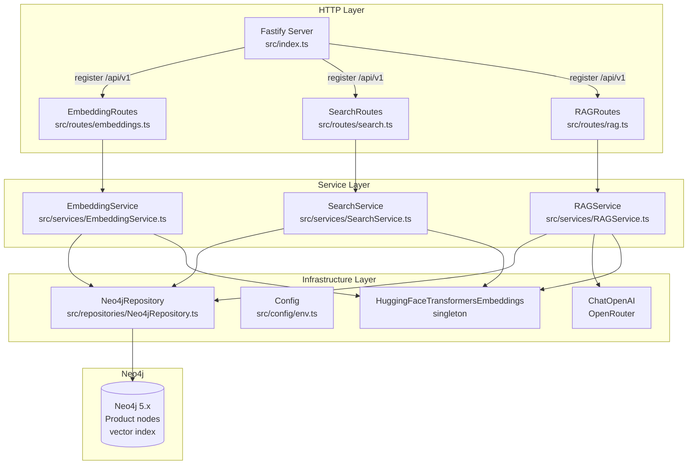

# M3 — AI Service Design

**Spec**: `.specs/features/m3-ai-service/spec.md`
**Status**: Approved
**Date**: 2026-04-23
**Method**: Design Complex (ToT Divergence → Red Team → Self-Consistency → Committee Review)

---

## Architecture Overview

O AI Service é um servidor Fastify com três domínios funcionais independentes: geração de embeddings, busca semântica e RAG pipeline. A separação em serviços de domínio garante que cada responsabilidade possa ser testada, estendida (M4) e substituída de forma isolada.



**Fluxo de startup:**
```
1. Validar env vars obrigatórias (NEO4J_URI, NEO4J_USER, NEO4J_PASSWORD)
2. Instanciar neo4j Driver (singleton)
3. EmbeddingService.init() → HuggingFaceTransformersEmbeddings warm-up (download modelo se necessário)
4. Setar flag modelReady = true
5. fastify.listen() → servidor aceita tráfego
```

**Endpoints:**
| Method | Path | Service | Req IDs |
|--------|------|---------|---------|
| GET | /health | inline (liveness) | M3-02, M3-05 |
| GET | /ready | inline (readiness) | M3-02 |
| POST | /api/v1/embeddings/generate | EmbeddingService | M3-06..M3-13 |
| POST | /api/v1/search/semantic | SearchService | M3-14..M3-21 |
| POST | /api/v1/rag/query | RAGService | M3-22..M3-29 |

---

## Code Reuse Analysis

### Existing Components to Leverage

| Component | Location | How to Use |
|-----------|----------|------------|
| `neo4j-driver` direto | `src/seed/seed.ts` | Mesmo padrão de driver + session; extrair para `Neo4jRepository` |
| `HuggingFaceTransformersEmbeddings` | `exemplo-13/src/index.ts` | Importar de `@langchain/community/embeddings/huggingface_transformers`; usar como singleton |
| `ChatOpenAI` com OpenRouter | `exemplo-13/src/index.ts` | `new ChatOpenAI({ openAIApiKey, configuration: { baseURL: openrouter.url } })` |
| `RunnableSequence` + `ChatPromptTemplate` | `exemplo-13/src/ai.ts` | Base do RAG chain no `RAGService` |
| `similaritySearchWithScore` + threshold 0.5 | `exemplo-13/src/ai.ts:47` | Reutilizar exatamente o mesmo padrão de filtro |
| Produtos seedados com propriedade `embedding` | `src/seed/seed.ts` | Nós `Product` existentes no Neo4j — pipeline grafa `embedding` float[] diretamente sobre eles |

### Integration Points

| System | Integration Method |
|--------|--------------------|
| Neo4j | `neo4j-driver` com driver singleton; sessions abertas por operação com `try/finally` |
| OpenRouter | `@langchain/openai` `ChatOpenAI` com `baseURL: https://openrouter.ai/api/v1` |
| `@xenova/transformers` | `HuggingFaceTransformersEmbeddings` warm-up no startup; embedding via `.embedQuery()` |
| api-service (Spring Boot) | HTTP REST; consome `/api/v1/search/semantic` e `/api/v1/rag/query` |

---

## Components

### Config (`src/config/env.ts`)

- **Purpose**: Lê e valida todas as variáveis de ambiente; exporta objeto `ENV` imutável
- **Location**: `src/config/env.ts`
- **Interfaces**:
  - `ENV.NEO4J_URI: string`
  - `ENV.NEO4J_USER: string`
  - `ENV.NEO4J_PASSWORD: string`
  - `ENV.OPENROUTER_API_KEY: string | undefined`
  - `ENV.PORT: number` (default: 3001)
  - `ENV.NLP_MODEL: string` (default: `sentence-transformers/all-MiniLM-L6-v2`)
- **Rules**: Se `NEO4J_URI`, `NEO4J_USER` ou `NEO4J_PASSWORD` ausentes → logar aviso (não crash). Se `OPENROUTER_API_KEY` ausente → não crash no startup; `/api/v1/rag/query` retorna 503 em tempo de request.
- **Reuses**: —

### Neo4jRepository (`src/repositories/Neo4jRepository.ts`)

- **Purpose**: Encapsula todo acesso ao Neo4j; isola Cypher do resto da aplicação
- **Location**: `src/repositories/Neo4jRepository.ts`
- **Interfaces**:
  - `constructor(driver: Driver)`
  - `async getProductsWithoutEmbedding(): Promise<Product[]>` — `MATCH (p:Product) WHERE p.embedding IS NULL RETURN p`
  - `async setProductEmbedding(id: string, embedding: number[]): Promise<void>` — `MATCH (p:Product {id: $id}) SET p.embedding = $embedding`
  - `async createVectorIndex(): Promise<void>` — `CREATE VECTOR INDEX product_embeddings IF NOT EXISTS FOR (p:Product) ON (p.embedding) OPTIONS { indexConfig: { 'vector.dimensions': 384, 'vector.similarity_function': 'cosine' } }`
  - `async vectorSearch(embedding: number[], limit: number, filters?: SearchFilters): Promise<SearchResult[]>` — query Cypher com `db.index.vector.queryNodes` + cláusulas WHERE condicionais
  - `async close(): Promise<void>`
- **Dependencies**: `neo4j-driver` Driver (singleton injetado)
- **Reuses**: Padrão de session + `try/finally` do `seed.ts`

**Query Cypher dinâmica para vector search (sem interpolação raw):**
```typescript
const whereClauses: string[] = ['score > 0.5']
const params: Record<string, unknown> = { embedding, limit }

if (filters?.country) {
  whereClauses.push('EXISTS { (p)-[:AVAILABLE_IN]->(:Country {code: $country}) }')
  params.country = filters.country
}
if (filters?.category) {
  whereClauses.push('EXISTS { (p)-[:BELONGS_TO]->(:Category {name: $category}) }')
  params.category = filters.category
}

const cypher = `
  CALL db.index.vector.queryNodes('product_embeddings', $limit, $embedding)
  YIELD node AS p, score
  WHERE ${whereClauses.join(' AND ')}
  RETURN p.id AS id, p.name AS name, p.description AS description,
         p.category AS category, p.price AS price, p.sku AS sku, score
  ORDER BY score DESC
`
```

### EmbeddingService (`src/services/EmbeddingService.ts`)

- **Purpose**: Gerencia o modelo de embedding (singleton + warm-up) e o pipeline de geração em batch
- **Location**: `src/services/EmbeddingService.ts`
- **Interfaces**:
  - `async init(): Promise<void>` — inicializa `HuggingFaceTransformersEmbeddings` e executa embed de string vazia para forçar download do modelo; seta `this.modelReady = true`
  - `get isReady(): boolean`
  - `async generateEmbeddings(repo: Neo4jRepository): Promise<{ generated: number; skipped: number; indexCreated: boolean }>` — respeita mutex `isGenerating`; processa em batches de 10 (M3-13); idempotente (M3-08); loga a cada 10 (M3-09)
  - `async embedText(text: string): Promise<number[]>` — usado por `SearchService` e `RAGService`
- **Dependencies**: `@langchain/community/embeddings/huggingface_transformers`, `Neo4jRepository`
- **Mutex**: `private isGenerating = false` — segundo request retorna 409

### SearchService (`src/services/SearchService.ts`)

- **Purpose**: Busca semântica via vector similarity no Neo4j
- **Location**: `src/services/SearchService.ts`
- **Interfaces**:
  - `async semanticSearch(query: string, limit: number, filters?: SearchFilters): Promise<SearchResult[]>`
- **Dependencies**: `EmbeddingService`, `Neo4jRepository`
- **Rules**: Valida que model está ready antes de executar (retorna 503 se não). Verifica se vector index existe (M3-21). Limita `limit` a 50 (edge case spec).

### RAGService (`src/services/RAGService.ts`)

- **Purpose**: Pipeline completo RAG: embed → vector search → contexto → LLM → resposta estruturada
- **Location**: `src/services/RAGService.ts`
- **Interfaces**:
  - `async query(userQuery: string): Promise<{ answer: string; sources: Source[] }>`
- **Dependencies**: `EmbeddingService`, `Neo4jRepository`, `ChatOpenAI`
- **Pipeline**:
  1. `embedText(query)` → vector
  2. `repo.vectorSearch(vector, topK=5)` → products com score > 0.5
  3. Se `sources.length === 0` → retorna resposta padrão sem chamar LLM (M3-27)
  4. Formata contexto: `- [name] (SKU: sku, Categoria: category, Preço: R$ price): description`
  5. `ChatPromptTemplate` → instrui resposta em pt-BR ou en (detecta idioma da query) + apenas contexto fornecido
  6. `RunnableSequence` → invoke → `StringOutputParser` → `answer`
  7. Retorna `{ answer, sources: [{ id, name, score }] }`
- **Error handling**: LLM timeout/rate limit → HTTP 502 com `sources` incluídos (M3-29)

### Routes (`src/routes/`)

- **Purpose**: Handlers HTTP finos — validação de request, delegação ao serviço, serialização de response
- **Location**: `src/routes/embeddings.ts`, `src/routes/search.ts`, `src/routes/rag.ts`
- **Pattern**: `fastify.register(plugin, { prefix: '/api/v1' })` — cada arquivo exporta uma função plugin Fastify
- **Reuses**: Padrão de plugin do Fastify (nativo à lib)

### Entry Point (`src/index.ts`)

- **Purpose**: Orquestra startup: config → driver → services init → rotas → listen
- **Location**: `src/index.ts`
- **Startup order**:
  ```typescript
  const driver = neo4j.driver(ENV.NEO4J_URI, neo4j.auth.basic(ENV.NEO4J_USER, ENV.NEO4J_PASSWORD))
  const repo = new Neo4jRepository(driver)
  const embeddingService = new EmbeddingService(ENV.NLP_MODEL)
  await embeddingService.init() // warm-up; modelReady = true após este await
  const searchService = new SearchService(embeddingService, repo)
  const ragService = new RAGService(embeddingService, repo, ENV.OPENROUTER_API_KEY, ENV.NLP_MODEL)
  // registrar rotas
  await fastify.listen({ port: ENV.PORT, host: '0.0.0.0' })
  ```

---

## Data Models

### Product (Neo4j Node — existente + extensão)

```typescript
interface Product {
  id: string
  name: string
  description: string
  category: string
  price: number
  sku: string
  embedding?: number[] // adicionado pelo EmbeddingService (384 dims, float[])
}
```

**Nota**: `embedding` é grafado diretamente no nó `Product` existente via `SET p.embedding = $embedding`. O schema LangChain (`Chunk` node) não é usado.

### SearchResult

```typescript
interface SearchResult {
  id: string
  name: string
  description: string
  category: string
  price: number
  sku: string
  score: number // cosine similarity, range [0, 1]
}
```

### RAGResponse

```typescript
interface RAGResponse {
  answer: string
  sources: Array<{ id: string; name: string; score: number }>
}
```

### SearchFilters

```typescript
interface SearchFilters {
  country?: string // código ISO: 'BR', 'MX', etc.
  category?: string // 'beverages', 'food', etc.
}
```

---

## Error Handling Strategy

| Error Scenario | Handling | User Impact |
|----------------|----------|-------------|
| NEO4J_URI/USER/PASSWORD ausentes | Log warning no startup; lazy connect | Endpoints que usam Neo4j retornam 503 em runtime |
| Neo4j offline durante request | `try/catch` no repository; throw `Neo4jUnavailableError` | HTTP 503 com `"Neo4j unavailable"` |
| Vector index não existe em `/search/semantic` | Check antes da query; throw `IndexNotFoundError` | HTTP 503 com `"Embedding index not found. Run POST /api/v1/embeddings/generate first."` |
| `OPENROUTER_API_KEY` ausente em `/rag/query` | Check no `RAGService` antes de invocar LLM | HTTP 503 com `"LLM not configured. Set OPENROUTER_API_KEY env var."` |
| LLM timeout ou rate limit | `try/catch` no `RunnableSequence`; retornar sources recuperados | HTTP 502 com mensagem de erro + `sources` do Neo4j |
| `EmbeddingService` não ready | `isReady` check nas rotas que dependem do modelo | HTTP 503 com `"Model loading. Retry in a few seconds."` |
| `/embeddings/generate` já em execução | Mutex `isGenerating` | HTTP 409 com `"Generation already in progress"` |
| Query vazia em `/search/semantic` | Validação de request na rota | HTTP 400 com `"query is required and must be non-empty"` |
| `limit` < 1 | Validação de request na rota | HTTP 400 |
| `limit` > 50 | Cap no `SearchService` | `limit` truncado a 50, sem erro |
| Query > 1000 chars em `/rag/query` | Truncado para 1000 antes de embedar | Transparente para o cliente |

---

## Tech Decisions

| Decision | Choice | Rationale |
|----------|--------|-----------|
| Neo4j acesso | `neo4j-driver` direto (não `Neo4jVectorStore`) | Controle total sobre nós `Product` existentes; idempotência por propriedade `embedding IS NULL`; criação do index com nome correto `product_embeddings` |
| Embedding model lifecycle | Singleton com warm-up no startup | Evita latência de 30-60s no primeiro request; modelo baixado uma vez |
| Liveness vs. Readiness | `/health` (liveness — HTTP up) + `/ready` (readiness — modelo ready) | Permite que Docker veja o container como up enquanto o modelo carrega; api-service pode usar `/ready` para esperar |
| Fastify routes | `fastify.register(plugin, { prefix: '/api/v1' })` | Isola contexto por grupo de rotas; permite prefixos sem repetição; idiomático para Fastify |
| Cypher dinâmico | Concatenação de cláusulas parametrizadas (não string interpolation) | Previne Cypher injection; mantém params tipados |
| `isGenerating` mutex | Flag booleana em memória | Suficiente para MVP single-instance; documentado como limitação para deploy multi-instância |

---

## Alternatives Discarded

| Node | Approach | Eliminated in | Reason |
|------|----------|---------------|--------|
| B | `Neo4jVectorStore.fromExistingGraph` unificado para embeddings e RAG | Phase 2 | High severity: `addDocuments` cria nós `Chunk` com schema LangChain, não grava `embedding` em `Product` nodes existentes; M3-08 e M3-10 ficam impossíveis de cumprir |
| A | `neo4j-driver` raw em cada rota sem repositório; LangChain só no RAG | Phase 2 + Phase 3 | High severity: Cypher duplicado em múltiplas rotas garante inconsistência; CUPID-U violado; Node C resolve o mesmo problema com abstração adequada |

---

## Committee Findings Applied

| Finding | Persona | How incorporated |
|---------|---------|-----------------|
| Estrutura de diretórios obrigatória antes de qualquer endpoint | Principal SW Architect (High) | `src/routes/`, `src/services/`, `src/repositories/`, `src/config/` definidos como estrutura canônica no design |
| Neo4j driver deve ser singleton com sessions por operação e `try/finally` | Principal SW Architect (High) + Staff Engineering (High) | `Neo4jRepository` recebe driver no constructor; cada método abre session, executa, fecha em `try/finally` |
| Model warm-up antes de `fastify.listen()` | Staff Engineering (High) | `await embeddingService.init()` na sequência de startup antes do listen; flag `modelReady` |
| Separar `/health` (liveness) de `/ready` (readiness) | QA Staff (Medium) + Staff Engineering (convergente) | Dois endpoints distintos documentados; Docker usa `/health`; api-service pode usar `/ready` |
| Cypher dinâmico via params, não interpolação | QA Staff (Low) | `Neo4jRepository.vectorSearch` usa concatenação de cláusulas parametrizadas, exemplo documentado no design |
| Mutex `isGenerating` para runs concorrentes | Staff Engineering (Medium) | `EmbeddingService.isGenerating` flag; retorna 409 se já em execução |

---

## Directory Structure (ai-service)

```
ai-service/
├── src/
│   ├── config/
│   │   └── env.ts              # ENV object + validação de vars
│   ├── repositories/
│   │   └── Neo4jRepository.ts  # Todo acesso Cypher centralizado
│   ├── services/
│   │   ├── EmbeddingService.ts # Singleton modelo + pipeline de geração
│   │   ├── SearchService.ts    # Busca semântica
│   │   └── RAGService.ts       # RAG pipeline completo
│   ├── routes/
│   │   ├── embeddings.ts       # POST /api/v1/embeddings/generate
│   │   ├── search.ts           # POST /api/v1/search/semantic
│   │   └── rag.ts              # POST /api/v1/rag/query
│   ├── types/
│   │   └── index.ts            # Interfaces compartilhadas (Product, SearchResult, etc.)
│   ├── seed/                   # Existente — não alterado
│   │   └── ...
│   └── index.ts                # Startup orchestration
├── Dockerfile                  # Multi-stage (já existe — revisar para incluir dist/)
├── package.json
└── tsconfig.json
```
