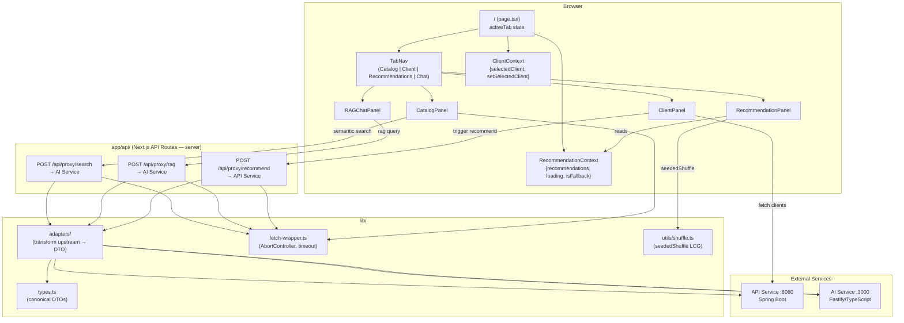

# M5 Frontend — Design

**Status**: Approved
**Date**: 2026-04-24

---

## Architecture Overview



---

## Code Reuse Analysis

| Existing artifact | Reused by M5 | Notes |
|---|---|---|
| `frontend/next.config.js` (`output: standalone`) | All components | No change needed |
| `frontend/app/layout.tsx` | Wrap with providers | Add `ClientProvider` + `RecommendationProvider` |
| Tailwind CSS (already configured) | All UI components | No reinstall needed |
| No shared lib/ exists yet | — | Created new in M5 |

**shadcn/ui**: not yet installed. Install during Execute:
```bash
npx shadcn-ui@latest init  # in frontend/
npx shadcn-ui@latest add card badge tooltip dialog skeleton
```
Components to import: `Card`, `CardContent`, `Badge`, `Tooltip`, `TooltipContent`, `TooltipTrigger`, `Dialog`, `DialogContent`, `Skeleton`.

---

## Components

### Context Providers

| File | Exports | Consumes |
|---|---|---|
| `lib/contexts/ClientContext.tsx` | `ClientProvider`, `useClient` | — |
| `lib/contexts/RecommendationContext.tsx` | `RecommendationProvider`, `useRecommendations` | — |

**`ClientContext` state shape:**
```ts
interface ClientContextValue {
  selectedClient: Client | null;
  setSelectedClient: (client: Client | null) => void;
}
```

**`RecommendationContext` state shape:**
```ts
interface RecommendationContextValue {
  recommendations: RecommendationResult[];
  loading: boolean;
  isFallback: boolean;
  setRecommendations: (recs: RecommendationResult[], isFallback: boolean) => void;
  setLoading: (v: boolean) => void;
  clearRecommendations: () => void;
}
```

---

### Page & Navigation

| File | Role |
|---|---|
| `app/page.tsx` | Root page; owns `activeTab` state; renders `TabNav` + active panel |
| `app/layout.tsx` | Wraps `<ClientProvider><RecommendationProvider>{children}</RecommendationProvider></ClientProvider>` |
| `components/layout/TabNav.tsx` | 4-tab nav bar; emits `onTabChange`; receives `activeTab` |
| `components/layout/Header.tsx` | Logo, project name, service health badges (API + AI); polls every 30s with `clearInterval` cleanup |
| `components/layout/ServiceStatusBadge.tsx` | Green/red badge per service; receives `status: 'up'|'down'|'unknown'` |

---

### Catalog Panel

| File | Role |
|---|---|
| `components/catalog/CatalogPanel.tsx` | Fetches all products on mount (`GET /api/v1/products?size=100`); owns filter state; renders grid |
| `components/catalog/ProductGrid.tsx` | Renders `ProductCard[]`; receives filtered products array |
| `components/catalog/ProductCard.tsx` | Card with category icon, name, badges, price; `similarityScore?: number` optional prop |
| `components/catalog/ProductFilters.tsx` | Category / country / supplier dropdowns; emits filter state upward |
| `components/catalog/SemanticSearchBar.tsx` | Input + submit; calls `POST /api/proxy/search`; uses `AbortController`; emits results upward |
| `components/catalog/ProductDetailModal.tsx` | shadcn `Dialog`; receives `product: ProductDetail | null`; closes on `null` |
| `components/catalog/CategoryIcon.tsx` | Renders emoji per category: `beverages→🥤 food→🍎 personal_care→🧴 cleaning→🧹 snacks→🍿` |

**Filter logic:** client-side. `CatalogPanel` maintains `allProducts` + `filteredProducts`. Semantic search replaces `filteredProducts` with ranked results (no merging with filter state — search and filter are mutually exclusive; clearing search restores filters).

---

### Client Profile Panel

| File | Role |
|---|---|
| `components/client/ClientPanel.tsx` | Fetches all clients on mount; owns dropdown selection; dispatches to `ClientContext` and `RecommendationContext` |
| `components/client/ClientSelector.tsx` | shadcn `Select`; displays `name (country)` |
| `components/client/ClientProfileCard.tsx` | Segment, country 🏳, total orders, last 5 products bought |
| `components/client/RecommendButton.tsx` | "Obter Recomendações"; calls `POST /api/proxy/recommend`; sets `RecommendationContext.loading` + `recommendations` |

**On client change**: calls `RecommendationContext.clearRecommendations()` before setting new client in `ClientContext` (M5-15).

---

### Recommendation Panel

| File | Role |
|---|---|
| `components/recommendations/RecommendationPanel.tsx` | Reads `RecommendationContext`; renders two columns |
| `components/recommendations/RecommendedColumn.tsx` | "Com IA" column — ranked order, score badges, tooltips |
| `components/recommendations/ShuffledColumn.tsx` | "Sem IA" column — `seededShuffle(recs, clientId)` via `useMemo` |
| `components/recommendations/RecommendationCard.tsx` | Product name, finalScore, matchReason badge; accepts optional `showScore: boolean` |
| `components/recommendations/ScoreTooltip.tsx` | shadcn `Tooltip`; displays `neuralScore ?? 'N/A'` and `semanticScore ?? 'N/A'` |
| `components/recommendations/FallbackBanner.tsx` | Rendered when `isFallback === true`; "Fallback — Top Sellers" banner |
| `components/recommendations/EmptyState.tsx` | Rendered when `recommendations.length === 0 && !loading`; instruction text |
| `components/recommendations/RecommendationSkeleton.tsx` | 10 skeleton cards during loading |

---

### RAG Chat Panel

| File | Role |
|---|---|
| `components/chat/RAGChatPanel.tsx` | Owns `messages: Message[]` state; renders chat history + input |
| `components/chat/ChatMessage.tsx` | User bubble (right) or AI bubble (left) with timestamp |
| `components/chat/ContextChunks.tsx` | Collapsible `<details>` section with retrieved product chunks + similarity score |
| `components/chat/ChatInput.tsx` | Textarea + send button; `AbortController` on submit; emits on Enter (no Shift) |
| `components/chat/ExamplePrompts.tsx` | 3 clickable prompt chips; on click: fills input + auto-submits |

**Auto-scroll**: `RAGChatPanel` holds a `messagesEndRef = useRef<HTMLDivElement>(null)` and calls `messagesEndRef.current?.scrollIntoView({ behavior: 'smooth' })` in a `useEffect` with `[messages]` dependency.

---

### Lib Layer

| File | Role |
|---|---|
| `lib/types.ts` | All canonical DTOs: `Client`, `Product`, `ProductDetail`, `SearchResult`, `RecommendationResult`, `RagResponse`, `RagChunk`, `Message` |
| `lib/adapters/search.ts` | Transforms AI Service `/search/semantic` response → `SearchResult[]` |
| `lib/adapters/recommend.ts` | Transforms API Service `/recommend` response → `RecommendationResult[]` + `isFallback` |
| `lib/adapters/rag.ts` | Transforms AI Service `/rag/query` response → `RagResponse` |
| `lib/fetch-wrapper.ts` | `apiFetch(url, options, signal?)` — handles `AbortError`, timeout (60s for RAG), JSON parse, typed error |
| `lib/utils/shuffle.ts` | `seededShuffle<T>(arr: T[], seed: string): T[]` — LCG implementation (ADR-004) |
| `lib/hooks/useServiceHealth.ts` | Polls `/actuator/health` and `/ready`; `clearInterval` on unmount; returns `{ apiStatus, aiStatus }` |

---

### API Routes

| File | Upstream | Method |
|---|---|---|
| `app/api/proxy/search/route.ts` | `POST http://ai-service:3000/api/v1/search/semantic` | POST |
| `app/api/proxy/rag/route.ts` | `POST http://ai-service:3000/api/v1/rag/query` | POST |
| `app/api/proxy/recommend/route.ts` | `POST http://api-service:8080/api/v1/recommend` | POST |

All routes read upstream URLs from `process.env.API_SERVICE_URL` and `process.env.AI_SERVICE_URL` (defaulting to localhost for dev). Each route calls `lib/fetch-wrapper.ts` server-side, maps response through the adapter, and returns the DTO as `NextResponse.json(dto)`.

---

## Data Models

```ts
// lib/types.ts

export interface Client {
  id: string;
  name: string;
  segment: string;
  country: string;
  totalOrders: number;
  recentProducts: ProductSummary[];
}

export interface ProductSummary {
  id: string;
  name: string;
  category: string;
}

export interface Product {
  id: string;
  name: string;
  category: string;
  supplier: string;
  countries: string[];
  price: number;
  sku: string;
  similarityScore?: number; // present when returned by semantic search
}

export interface ProductDetail extends Product {
  description: string;
}

export interface SearchResult {
  product: Product;
  score: number;
}

export interface RecommendationResult {
  product: Product;
  finalScore: number;
  neuralScore?: number;
  semanticScore?: number;
  matchReason: 'semantic' | 'neural' | 'hybrid';
}

export interface RagChunk {
  productName: string;
  score: number;
  excerpt: string;
}

export interface RagResponse {
  answer: string;
  chunks: RagChunk[];
  durationMs: number;
}

export interface Message {
  id: string;
  role: 'user' | 'assistant';
  content: string;
  timestamp: Date;
  chunks?: RagChunk[]; // present on assistant messages
  isError?: boolean;
}

export type ServiceStatus = 'up' | 'down' | 'unknown';
```

---

## Error Handling Strategy

| Scenario | Behavior | Implementation |
|---|---|---|
| API Service offline | Banner in `Header`; Catalog still loads (not via API proxy); Client panel shows error state | `useServiceHealth` sets `apiStatus: 'down'`; `Header` renders `ServiceStatusBadge` |
| AI Service offline | Semantic search disabled (inline message); RAG Chat disabled (inline message) | `aiStatus: 'down'` from health hook; components check and render disabled state |
| Semantic search returns 0 results | "Nenhum produto encontrado para sua busca" (M5-08) | `CatalogPanel` checks `results.length === 0` |
| Semantic search error | Inline error below search bar; does not affect grid | `SemanticSearchBar` catches and renders error message |
| RAG error | Error bubble in chat (M5-26) | `RAGChatPanel` pushes `{ role: 'assistant', isError: true, content: errorMessage }` |
| Recommendation model untrained | Warning banner in `RecommendationPanel` | `RecommendationResult[]` empty + API response includes `modelStatus: 'untrained'`; panel renders specific message |
| Request cancelled (double-submit) | Previous request aborted; new request fires | `AbortController` per fetch call in `SemanticSearchBar` and `ChatInput` |
| RAG latency > 15s | Loading state remains visible; no timeout | `fetch-wrapper.ts` RAG timeout set to 90s (Mistral 7B free tier) |
| Empty search submit | No API call | `SemanticSearchBar` validates `query.trim().length > 0` before calling |

---

## Tech Decisions

| Decision | Choice | Rationale |
|---|---|---|
| UI component library | shadcn/ui (install in Execute) | Provides Card, Badge, Tooltip, Dialog, Skeleton without runtime overhead; Tailwind-native |
| Global state | 2 React Contexts | Spec-mandated; contexts are the right scope for selectedClient + recommendations sharing |
| HTTP client | Native `fetch` | Spec-mandated; no Axios needed for this scope |
| CORS resolution | Next.js API Routes proxy | Only approach that doesn't require modifying M3 AI Service |
| Shuffle stability | Seeded LCG + useMemo | No external dep; O(n) at n≤10; demo-grade entropy sufficient |
| shadcn/ui init | `--style default --base-color slate --css-variables` | Neutral palette suited to a B2B demo |

---

## File Structure

```
frontend/
├── app/
│   ├── api/
│   │   └── proxy/
│   │       ├── search/route.ts
│   │       ├── rag/route.ts
│   │       └── recommend/route.ts
│   ├── layout.tsx          (updated: adds providers + shadcn globals)
│   └── page.tsx            (updated: tab navigation + panel mounting)
├── components/
│   ├── layout/
│   │   ├── Header.tsx
│   │   ├── TabNav.tsx
│   │   └── ServiceStatusBadge.tsx
│   ├── catalog/
│   │   ├── CatalogPanel.tsx
│   │   ├── ProductGrid.tsx
│   │   ├── ProductCard.tsx
│   │   ├── ProductFilters.tsx
│   │   ├── SemanticSearchBar.tsx
│   │   ├── ProductDetailModal.tsx
│   │   └── CategoryIcon.tsx
│   ├── client/
│   │   ├── ClientPanel.tsx
│   │   ├── ClientSelector.tsx
│   │   ├── ClientProfileCard.tsx
│   │   └── RecommendButton.tsx
│   ├── recommendations/
│   │   ├── RecommendationPanel.tsx
│   │   ├── RecommendedColumn.tsx
│   │   ├── ShuffledColumn.tsx
│   │   ├── RecommendationCard.tsx
│   │   ├── ScoreTooltip.tsx
│   │   ├── FallbackBanner.tsx
│   │   ├── EmptyState.tsx
│   │   └── RecommendationSkeleton.tsx
│   └── chat/
│       ├── RAGChatPanel.tsx
│       ├── ChatMessage.tsx
│       ├── ContextChunks.tsx
│       ├── ChatInput.tsx
│       └── ExamplePrompts.tsx
├── lib/
│   ├── types.ts
│   ├── fetch-wrapper.ts
│   ├── adapters/
│   │   ├── search.ts
│   │   ├── recommend.ts
│   │   └── rag.ts
│   ├── contexts/
│   │   ├── ClientContext.tsx
│   │   └── RecommendationContext.tsx
│   ├── hooks/
│   │   └── useServiceHealth.ts
│   └── utils/
│       └── shuffle.ts
├── package.json
├── next.config.js
└── Dockerfile
```

---

## Alternatives Discarded

| Node | Approach | Eliminated in | Reason |
|------|----------|---------------|--------|
| B | App Router segment routing with URL-persisted client state | Phase 2 | 2× High severity: route remount wipes recommendations (M5-29 violated); recommendation array not serializable to URL |
| C | Single-page tabs with `useReducer` + memoized selectors | Phase 3 | Rule of Three: memoized selectors have no codebase evidence and are unjustified at ≤5 state fields; Node A wins on both reasoning paths |

---

## Committee Findings Applied

| Finding | Persona | How incorporated |
|---------|---------|-----------------|
| Single context mixes domain + UI state; causes unnecessary re-renders | Principal Software Architect | Split into `ClientContext` and `RecommendationContext` (ADR-002); Catalog + Chat never re-render on recommendation load |
| API Routes should be typed adapters, not pass-through | Principal Software Architect | `lib/adapters/` with typed functions per upstream; components only import from `lib/types.ts` (ADR-003) |
| shadcn/ui install decision must be made in Design | Principal Software Architect | Decided: install `shadcn/ui` with specific components; `npx shadcn-ui@latest add card badge tooltip dialog skeleton` |
| Double-submit fires two in-flight requests to AI Service | Staff Engineering | `AbortController` in `lib/fetch-wrapper.ts`; `SemanticSearchBar` and `ChatInput` cancel previous request before new submission |
| Health check interval not cleaned up on unmount | Staff Engineering | `useServiceHealth` uses `useEffect` with `return () => clearInterval(id)` cleanup |
| "Sem IA" column re-shuffles on every parent re-render | Staff Engineering + QA Staff | `seededShuffle` via `useMemo([recommendations, clientId])` + LCG implementation (ADR-004) |
| `isFallback` must be modeled, not inferred | QA Staff | `RecommendationContext` has first-class `isFallback: boolean`; adapter extracts it from API response (ADR-002) |
| Tooltip must handle absent neuralScore / semanticScore | QA Staff | `ScoreTooltip` renders `neuralScore ?? 'N/A'` and `semanticScore ?? 'N/A'` |
| Auto-scroll must fire in useEffect after messages state update | QA Staff | `RAGChatPanel` uses `useEffect([messages])` + `ref.current?.scrollIntoView` |
