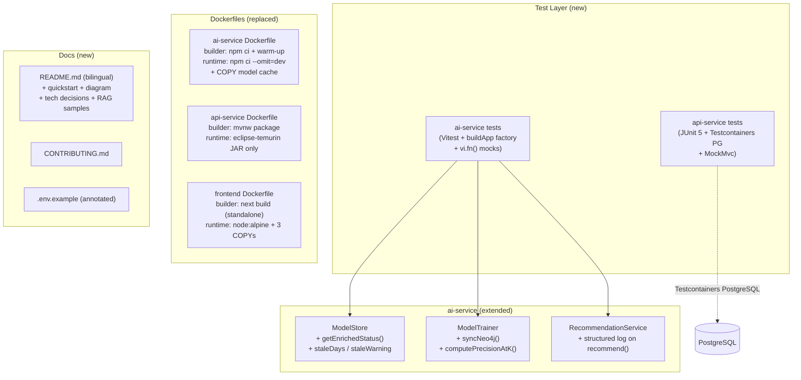

# M6 — Quality & Publication: Design

**Status**: Approved
**Date**: 2026-04-25
**Spec**: [spec.md](spec.md)
**ADRs**: [ADR-009](adr-009-vitest-di-mocking-strategy.md) · [ADR-010](adr-010-xenova-model-prebake-builder-stage.md) · [ADR-011](adr-011-nextjs-standalone-dockerfile.md)

---

## Architecture Overview

M6 has no new runtime services. It adds a test layer, enriches two existing services (`ModelStore`, `ModelTrainer`), and replaces naive Dockerfiles with multi-stage builds.



---

## Code Reuse Analysis

| Component | Status | Notes |
|-----------|--------|-------|
| `ModelStore` | Extend | Add `getEnrichedStatus(nowFn?)` method; add `syncedAt?: string`, `precisionAt5?: number` to `TrainingMetadata` and `TrainingStatus` |
| `ModelTrainer.train()` | Extend | Extract `syncNeo4j()` (private) and `computePrecisionAtK()` (private) from training loop; `train()` calls both |
| `RecommendationService.recommend()` | Extend | Add structured log after scoring; no interface change |
| `Neo4jRepository` | Extend | Add `syncBoughtRelationships(orders)` method (MERGE Cypher); add `getClientPurchasedIds()` if not already present |
| `buildApp` factory | New (test-only) | Mirrors `src/index.ts` wiring; accepts `AppDeps` interface; not shipped in production |
| All Dockerfiles | Replace | api-service, ai-service, frontend — multi-stage rewrites |
| `docker-compose.yml` | Extend | Add `ai-model-data` named volume mounted at `/tmp/model` in `ai-service` |
| `src/types/index.ts` | Extend | Add `staleDays`, `staleWarning`, `syncedAt`, `precisionAt5` to `TrainingStatus`; extend `TrainingResult` |

---

## Components

### 1. `ModelStore` — getEnrichedStatus()

**Purpose**: Compute `staleDays` and `staleWarning` at read time (not stored), expose `syncedAt` and `precisionAt5` stored at training time.

```
getEnrichedStatus(nowFn?: () => Date): EnrichedTrainingStatus
  - reads this.status
  - if status === 'trained' && trainedAt:
      staleDays = Math.floor((nowFn() - Date(trainedAt)) / ms_per_day)
      staleWarning = staleDays >= 7 ? `Model trained ${staleDays} days ago — consider retraining` : undefined
  - else: staleDays = null, staleWarning = undefined
  - returns { ...this.status, staleDays, staleWarning }
```

`nowFn` defaults to `() => new Date()`. Tests inject a fixed date to control the 7-day threshold.

**Type extension** (src/types/index.ts):
```typescript
interface TrainingStatus {
  // existing fields...
  staleDays?: number | null
  staleWarning?: string
  syncedAt?: string
  precisionAt5?: number
}

interface TrainingMetadata {
  // existing fields...
  syncedAt?: string
  precisionAt5?: number
}

interface TrainingResult {
  // existing fields...
  syncedAt: string
  precisionAt5: number
}
```

---

### 2. `ModelTrainer` — syncNeo4j() + computePrecisionAtK()

**syncNeo4j(orders, products)** (private):
- Iterates all orders from the already-fetched training data
- For each `(clientId, productId)` pair in order items where `productEmbeddingMap.has(productId)`:
  - Runs `MERGE (:Client {id: $clientId})-[:BOUGHT]->(:Product {id: $productId})`
- Products without embeddings: log warning `[Sync] skipping productId — no embedding`
- After loop: log `[Sync] N relationships created, M already existed, K skipped (no embedding)`
- Returns `{ syncedAt: string }`

Called from `train()` after `fetchTrainingData` and before the training loop.

**computePrecisionAtK(clients, products, orders, productEmbeddingMap, model, K=5)** (private):
- For each client with ≥1 purchase: build client profile vector (mean pooling)
- Run `model.predict(batchMatrix)` over all candidate products (products NOT purchased by client)
- Take top-K predicted products; count how many are in the actual validation set (held-out 20% of client's purchases)
- `precisionAtK = (clients with ≥1 correct in top-K) / total_clients` (approximate; deterministic)
- Disposes tensors via `tf.tidy()`
- Returns `precisionAt5: number`

Called from `train()` after `model.fit()` completes, before `model.save()`.

**Updated `train()` return** adds `syncedAt` and `precisionAt5` to `TrainingResult`.

---

### 3. `Neo4jRepository` — syncBoughtRelationships()

```typescript
async syncBoughtRelationships(
  edges: Array<{ clientId: string; productId: string }>
): Promise<{ created: number; existed: number; skipped: number }>
```

Cypher:
```cypher
UNWIND $edges AS edge
MATCH (c:Client {id: edge.clientId})
MATCH (p:Product {id: edge.productId})
MERGE (c)-[r:BOUGHT]->(p)
ON CREATE SET r.synced = true
RETURN count(r) AS total, sum(CASE WHEN r.synced THEN 1 ELSE 0 END) AS created
```

Returns created/existed counts. Caller computes `skipped` from input list minus total.

---

### 4. `RecommendationService` — structured log

After scoring, before sorting/slicing, emit one `fastify.log.info()` call (logger injected via constructor or accepted from route):

```json
{
  "clientId": "...",
  "country": "...",
  "resultsCount": 8,
  "avgFinalScore": 0.74,
  "matchReasonDistribution": { "neural": 3, "semantic": 2, "hybrid": 3 }
}
```

Empty recommendation path logs `{ "clientId": "...", "reason": "no_candidates" }`.

**Injection**: add `logger: FastifyBaseLogger` parameter to `RecommendationService` constructor. `index.ts` passes `fastify.log`. Test injects `{ info: vi.fn(), warn: vi.fn(), error: vi.fn() }`.

---

### 5. AI Service Test Structure (Vitest + buildApp factory)

```
ai-service/
└── src/
    └── tests/
        ├── helpers/
        │   ├── buildApp.ts        ← factory: AppDeps → FastifyInstance
        │   └── fixtures.ts        ← typed mock responses matching src/types/index.ts
        ├── recommend.test.ts      ← M6-08, M6-11, M6-12
        ├── rag.test.ts            ← M6-09
        ├── search.test.ts         ← M6-10
        └── model.test.ts          ← M6-07, M6-13, staleDays, staleWarning
```

**AppDeps interface** (in `helpers/buildApp.ts`):
```typescript
interface AppDeps {
  neo4jRepo: Partial<Neo4jRepository>
  embeddingService: Partial<EmbeddingService>
  modelStore: Partial<ModelStore>
  modelTrainer: Partial<ModelTrainer>
  recommendationService: Partial<RecommendationService>
  ragService: Partial<RAGService>
  searchService: Partial<SearchService>
}
```

Each test file creates a `vi.fn()`-based partial mock for the deps it exercises. `buildApp` registers the same routes as `index.ts` but uses injected deps.

**Score combination unit test** (M6-12): pure function `computeFinalScore(neuralScore, semanticScore, neuralWeight, semanticWeight)` extracted from `RecommendationService` and tested with `toBeCloseTo(expected, 5)`.

---

### 6. API Service Test Structure (JUnit 5 + Testcontainers)

```
api-service/src/test/
├── java/com/smartmarketplace/
│   ├── service/
│   │   ├── ProductApplicationServiceTest.java   ← M6-03 (unit, Mockito)
│   │   ├── ClientApplicationServiceTest.java    ← M6-03
│   │   ├── OrderApplicationServiceTest.java     ← M6-03
│   │   └── RecommendationServiceTest.java       ← M6-03
│   └── controller/
│       ├── ProductControllerIT.java             ← M6-04, M6-05, M6-06 (MockMvc + Testcontainers)
│       ├── ClientControllerIT.java              ← M6-04, M6-05
│       └── OrderControllerIT.java               ← M6-04, M6-05
└── resources/
    └── test-data.sql                            ← @Sql baseline seed
```

**Testcontainers setup**: one `@Container` PostgreSQL at the `@SpringBootTest` class level; `@DynamicPropertySource` overrides `spring.datasource.*`; `@Transactional` on each test method for rollback isolation.

**JaCoCo**: configured in `pom.xml` with `<minimum>0.70</minimum>` for `*Service` classes; `./mvnw verify` produces HTML report in `target/site/jacoco/`.

---

### 7. Dockerfile Multi-Stage Designs

**api-service Dockerfile:**
```
FROM eclipse-temurin:21-jdk AS builder
WORKDIR /app
COPY mvnw pom.xml ./
COPY .mvn .mvn
RUN ./mvnw dependency:go-offline -q
COPY src src
RUN ./mvnw package -DskipTests -q

FROM eclipse-temurin:21-jre AS runtime
WORKDIR /app
COPY --from=builder /app/target/*.jar app.jar
ENTRYPOINT ["java", "-jar", "app.jar"]
```

**ai-service Dockerfile** (ADR-010):
```
FROM node:20-alpine AS builder
WORKDIR /app
COPY package*.json ./
RUN npm ci
COPY . .
RUN node scripts/prebake-model.js     # triggers @xenova download into node_modules/.cache
RUN npm run build                     # tsc → dist/

FROM node:20-alpine AS runtime
WORKDIR /app
COPY package*.json ./
RUN npm ci --omit=dev
COPY --from=builder /app/node_modules/.cache ./node_modules/.cache
COPY --from=builder /app/dist ./dist
CMD ["node", "dist/index.js"]
```

**frontend Dockerfile** (ADR-011):
```
FROM node:20-alpine AS builder
WORKDIR /app
COPY package*.json ./
RUN npm ci
COPY . .
RUN npm run build      # next build with output: 'standalone'

FROM node:20-alpine AS runtime
WORKDIR /app
ENV HOSTNAME=0.0.0.0
COPY --from=builder /app/.next/standalone ./
COPY --from=builder /app/.next/static ./.next/static
COPY --from=builder /app/public ./public
CMD ["node", "server.js"]
```

---

### 8. docker-compose.yml additions

```yaml
volumes:
  ai-model-data:

services:
  ai-service:
    volumes:
      - ai-model-data:/tmp/model
```

---

### 9. README Structure

Bilingual sections (pt-BR first, en second) or `README.md` (pt-BR) + `README-en.md` (en). Decision: single file with bilingual headings is simpler for GitHub rendering.

Sections:
1. Title + badge + one-liner (M6-14)
2. Architecture diagram — Mermaid (M6-16, M6-30..M6-32)
3. Quickstart — 5 commands (M6-15)
4. Tech decisions — TypeScript, Java, Neo4j (M6-17, D-001..D-003)
5. API reference + curl examples + Swagger link (M6-18)
6. Sample RAG queries with real output (M6-19, M6-33..M6-35)
7. Model training + staleDays observability (M6-43, M6-44)
8. English version (M6-20)

---

## Data Models

### TrainingStatus (extended)
```typescript
interface TrainingStatus {
  status: 'untrained' | 'training' | 'trained'
  trainedAt?: string
  startedAt?: string
  progress?: string
  finalLoss?: number
  finalAccuracy?: number
  trainingSamples?: number
  staleDays?: number | null      // new: null when untrained
  staleWarning?: string          // new: present when staleDays >= 7
  syncedAt?: string              // new: ISO timestamp of last Neo4j sync
  precisionAt5?: number          // new: from last training run
}
```

### TrainingResult (extended)
```typescript
interface TrainingResult {
  status: 'trained'
  epochs: number
  finalLoss: number
  finalAccuracy: number
  trainingSamples: number
  durationMs: number
  syncedAt: string        // new
  precisionAt5: number    // new
}
```

---

## Error Handling Strategy

| Scenario | Handler | HTTP |
|----------|---------|------|
| `ModelNotTrainedError` | `recommend.ts` route | 503 |
| `Neo4jUnavailableError` | `recommend.ts`, `rag.ts`, `search.ts` routes | 503 |
| `syncNeo4j` Neo4j failure | caught in `train()`, logged as warning, training continues | — (non-fatal) |
| `computePrecisionAtK` error | caught in `train()`, `precisionAt5` set to `null`, training result still returned | — (non-fatal) |
| Testcontainers PostgreSQL startup failure | JUnit 5 `@BeforeAll` fails fast, test suite aborted with clear error | — |
| `next build` fails (missing `output: 'standalone'`) | Docker build fails at COPY step with explicit error | — |

---

## Tech Decisions

| Decision | Choice | Rationale |
|----------|--------|-----------|
| Test framework — AI Service | Vitest | Already in `package.json` (M3 tooling); ESM-native; fast; integrates with existing TypeScript config |
| Test framework — API Service | JUnit 5 + Testcontainers | Spring Boot 3.3 default; Testcontainers PostgreSQL gives real JDBC behavior without mocking |
| Mocking strategy — AI Service | DI constructor injection + `vi.fn()` (ADR-009) | Matches existing DI pattern; per-case state control; no path coupling |
| Docker model pre-bake — AI Service | Builder stage warm-up script (ADR-010) | Eliminates cold-start download; satisfies 5-command quickstart requirement |
| Frontend Dockerfile | Next.js standalone output (ADR-011) | Reduces image from >1GB to <400MB; officially recommended by Next.js 14 |
| staleDays computation | Computed at read time in `getEnrichedStatus()` | Avoids clock drift in stored state; testable via injected `nowFn` |
| Neo4j sync placement | Before training loop in `ModelTrainer.train()` (M6-45) | Ensures training data and graph are consistent; single entry point for observability |
| Precision@K computation | After `model.fit()`, before `model.save()` | Reuses training data already in memory; no extra I/O |

---

## Alternatives Discarded

| Node | Approach | Eliminated in | Reason |
|------|----------|---------------|--------|
| B | `vi.mock()` path-based module mocking | Phase 2 | High: silently breaks after refactors; module-level scope prevents per-case state; Rule of Three violation |
| C | Testcontainers-node with real Neo4j | Phase 2 | High: cold start violates < 3 min SLA; stopping container for 503 test is flaky in CI; Rule of Three violation |

---

## Committee Findings Applied

| Finding | Persona | How incorporated |
|---------|---------|-----------------|
| `ModelStore` mixing computed and stored state (SRP) | Principal SW Architect + Staff Engineering | Added `getEnrichedStatus(nowFn?)` that computes `staleDays`/`staleWarning` at read time; `syncedAt`/`precisionAt5` stored in `TrainingMetadata` |
| `ModelTrainer.train()` SRP — sync + P@K in training loop | Principal SW Architect + Staff Engineering | Extracted `syncNeo4j()` and `computePrecisionAtK()` as private methods; `train()` delegates to both |
| `buildApp` factory needs typed `AppDeps` interface | Staff Engineering + QA Staff | `AppDeps` TypeScript interface defined in `helpers/buildApp.ts`; factory signature enforces completeness at compile time |
| Clock injection for `staleDays` 7-day threshold test | QA Staff (advisory) | `getEnrichedStatus(nowFn?: () => Date)` accepts optional clock; default `() => new Date()` |
| Neo4j sync idempotency test (run twice, same count) | QA Staff (advisory) | Added to `model.test.ts` test plan: assert edge count unchanged on second sync call |
