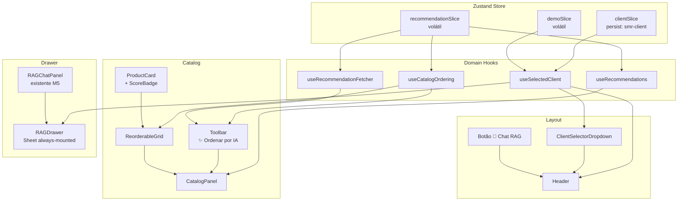

# M8 — UX Journey Refactor — Design

**Status**: Approved
**Date**: 2026-04-26
**Spec**: [spec.md](spec.md)
**ADRs**: [ADR-017](adr-017-flip-animation-without-flushsync.md) · [ADR-018](adr-018-rag-drawer-always-mounted.md) · [ADR-019](adr-019-zustand-slices-domain-hooks.md)

---

## Architecture Overview



---

## Code Reuse Analysis

| Existing asset | Reused by | Change needed |
|----------------|-----------|---------------|
| `RAGChatPanel` (M5) | `RAGDrawer` | Zero — renderizado como filho do Sheet sem modificação |
| `ProductCard` (M5) | `ReorderableGrid` via `renderItem` prop | Adicionar prop `scoreBadge?: ScoreBadgeProps` |
| `ClientProfileCard` (M5) | `ClientPanel` (P2) | Zero — leitura de `useSelectedClient()` em vez de Context |
| `RecommendationPanel` (M5) | M8 P2 | Leitura de `useRecommendations()` em vez de Context |
| `ScoreTooltip` (M5) | `ScoreBadge` novo componente | Reutiliza a lógica de formatação de scores |
| `@radix-ui/react-dialog` (M5) | `Sheet` (shadcn) | Já instalado — Sheet usa como peer dep |
| `apiFetch` / `lib/fetch-wrapper.ts` | `useRecommendationFetcher` | Zero |

---

## Components

### Novos componentes

| Componente | Localização | Responsabilidade |
|-----------|-------------|-----------------|
| `useAppStore` | `store/index.ts` | Hook unificado que reexporta os três slices |
| `clientSlice` | `store/clientSlice.ts` | Estado do cliente selecionado com `persist` |
| `recommendationSlice` | `store/recommendationSlice.ts` | Estado de recomendações + cache por clientId (1 entrada) + `loading` + `ordered` |
| `demoSlice` | `store/demoSlice.ts` | Estado volátil de compras demo + `chatHistory: Message[]` |
| `useSelectedClient` | `lib/hooks/useSelectedClient.ts` | Abstração sobre `useAppStore` para acesso ao cliente |
| `useRecommendations` | `lib/hooks/useRecommendations.ts` | Abstração sobre slice de recomendações |
| `useCatalogOrdering` | `lib/hooks/useCatalogOrdering.ts` | `ordered`, `toggle`, `reset` para o catálogo |
| `useRecommendationFetcher` | `lib/hooks/useRecommendationFetcher.ts` | Orquestra fetch + escrita no slice + guarda `loading` no slice |
| `ClientSelectorDropdown` | `components/layout/ClientSelectorDropdown.tsx` | Dropdown de clientes na navbar com badge de país |
| `ReorderableGrid` | `components/ReorderableGrid/ReorderableGrid.tsx` | Grid genérico com FLIP animation (prevPositionsRef pattern) |
| `ScoreBadge` | `components/catalog/ScoreBadge.tsx` | Badge "XX% match" com tooltip breakdown + cor semântica |
| `RAGDrawer` | `components/chat/RAGDrawer.tsx` | Sheet always-mounted que contém `RAGChatPanel` |

### Componentes modificados

| Componente | Mudança |
|-----------|---------|
| `Header` | Adiciona `<ClientSelectorDropdown>` + botão "💬 Chat RAG" + `<RAGDrawer>` (always-mounted) |
| `CatalogPanel` | Adiciona toolbar com `useCatalogOrdering`; troca `ProductGrid` por `<ReorderableGrid>` |
| `ProductCard` | Aceita `scoreBadge?: ScoreBadgeProps` opcional |
| `ClientPanel` | Remove dropdown e botão; lê `useSelectedClient()` |
| `RecommendationPanel` | Lê `useRecommendations()` (hook novo) + adiciona banner instrução quando vazio |
| `layout.tsx` | Remove `<ClientProvider>` e `<RecommendationProvider>` |

---

## Data Models

### `recommendationSlice` state shape

```typescript
interface RecommendationSlice {
  recommendations: RecommendationResult[];
  loading: boolean;
  isFallback: boolean;
  ordered: boolean;
  cachedForClientId: string | null;
  setRecommendations: (recs: RecommendationResult[], isFallback: boolean, clientId: string) => void;
  setLoading: (v: boolean) => void;
  setOrdered: (v: boolean) => void;
  clearRecommendations: () => void;
}
```

### `clientSlice` state shape

```typescript
interface ClientSlice {
  selectedClient: Client | null;
  setSelectedClient: (client: Client | null) => void;
  clearSelectedClient: () => void;
}
```

### `demoSlice` state shape

```typescript
interface DemoSlice {
  demoBoughtByClient: Record<string, string[]>;
  chatHistory: Message[];
  addDemoBought: (clientId: string, productId: string) => void;
  removeDemoBought: (clientId: string, productId: string) => void;
  clearDemoForClient: (clientId: string) => void;
  setChatHistory: (messages: Message[]) => void;
}
```

### `ReorderableGrid` props

```typescript
interface ReorderableGridProps<T> {
  items: T[];
  getKey: (item: T) => string;
  getScore: (item: T) => number | undefined;
  renderItem: (item: T) => React.ReactNode;
  ordered: boolean;
}
```

---

## Error Handling Strategy

| Cenário | Componente | Comportamento |
|---------|-----------|---------------|
| Fetch de clientes falha | `ClientSelectorDropdown` | `try/catch` no `useEffect`; exibe "Clientes indisponíveis" inline; sem ErrorBoundary global |
| Fetch de recomendações falha | `useRecommendationFetcher` | `setLoading(false)`; toast vermelho via `sonner` ou estado de erro no slice |
| `RAGChatPanel` erro de LLM | Existente M5 | Comportamento preservado; toast "Aguardando LLM..." se > 10s |
| `ReorderableGrid` com array vazio | `ReorderableGrid` | Renderiza slot vazio; `EmptyState` tratado pelo componente pai (`CatalogPanel`) |
| API Service offline durante fetch de produtos | `CatalogPanel` | Estado atual (M5) preservado — mensagem inline de erro |

---

## Tech Decisions

| Decisão | Escolha | Razão |
|---------|---------|-------|
| Animação de reordenação | FLIP com `prevPositionsRef` + `useLayoutEffect` | Evita `flushSync` (anti-pattern React 18); apenas `transform` + `opacity` (GPU-composited); ver ADR-017 |
| Drawer RAG | shadcn `Sheet` always-mounted | Preserva histórico de chat sem elevação de estado; focus trap e Escape delegados ao Radix; ver ADR-018 |
| Estado global | Zustand slices + domain hooks | Elimina Provider wrappers; `persist` middleware para `clientSlice`; hooks de domínio desacoplam componentes do store shape; ver ADR-019 |
| `tailwindcss-animate` | Instalar plugin | Obrigatório para keyframes de `Sheet` (slide-in-from-right) — sem ele a animação não aparece |
| Score badge mobile | Apenas hover em mobile | Evita poluição visual com 90 badges "— sem score" nos produtos fora do top-10 |
| `loading` no slice | `recommendationSlice.loading` | Guard contra double-click e StrictMode double-mount |

---

## Interaction States

| Component | State | Trigger | Visual |
|-----------|-------|---------|--------|
| `ClientSelectorDropdown` | idle | Initial | Placeholder "Selecionar cliente..." |
| `ClientSelectorDropdown` | loading | `useEffect` fetch inicial | Spinner inline no dropdown |
| `ClientSelectorDropdown` | selected | `setSelectedClient(client)` | Nome do cliente + emoji de bandeira |
| `ClientSelectorDropdown` | error | Fetch falha | "Clientes indisponíveis" em cinza |
| Botão "✨ Ordenar por IA" | disabled | `selectedClient === null` | Botão opaco; tooltip via `<span>` wrapper |
| Botão "✨ Ordenar por IA" | idle | Cliente selecionado, `ordered === false` | Botão ativo com ícone ✨ |
| Botão "✨ Ordenar por IA" | loading | Clique → fetch em andamento | Spinner + label "Carregando..." |
| Botão "✨ Ordenar por IA" | ordered | `ordered === true` | Label "✕ Ordenação original" |
| `ReorderableGrid` | unordered | `ordered === false` | Ordem original do array |
| `ReorderableGrid` | animating | `ordered` muda | Cards transitam via FLIP 300ms |
| `ReorderableGrid` | ordered | Animação completa | Ordem por score; prevPositionsRef limpo |
| `ScoreBadge` | hidden | `ordered === false` | Badge não renderizado |
| `ScoreBadge` | with-score | `ordered === true`, produto com score | Verde ≥70%, amarelo 40-69%, cinza <40% |
| `ScoreBadge` | no-score | `ordered === true`, produto sem score | Badge "— sem score" só no hover |
| `RAGDrawer` | closed | Initial / após Escape / clique fora | Fora da viewport (CSS), sempre montado |
| `RAGDrawer` | opening | Clique "💬 Chat RAG" | Slide-in da direita 300ms ease-out |
| `RAGDrawer` | open | Animação completa | Overlay semi-transparente; chat ativo |
| `RAGDrawer` | closing | Escape / clique fora | Slide-out para direita 200ms ease-in |
| `RAGDrawer` | with-client | `selectedClient !== null` enquanto aberto | Header "Chat RAG — [nome cliente]" |

---

## Animation Spec

| Animation | Property | Duration | Easing | Reduced-motion fallback |
|-----------|----------|----------|--------|------------------------|
| ReorderableGrid reorder | `transform: translateX/Y` | 300ms | `ease-out` | `transition: none`; reordena instantaneamente |
| RAGDrawer slide-in | `transform: translateX(100%)` → `translateX(0)` | 300ms | `ease-out` | `transition: none`; aparece instantaneamente |
| RAGDrawer slide-out | `transform: translateX(0)` → `translateX(100%)` | 200ms | `ease-in` | `transition: none`; desaparece instantaneamente |
| ScoreBadge fade-in | `opacity: 0` → `1` | 150ms | `ease` | `transition: none` |
| Toast entrada | `transform: translateY(8px)` → `translateY(0)` + `opacity` | 200ms | `ease-out` | Aparece instantaneamente |

**Nota**: Todos os `@media (prefers-reduced-motion: reduce)` devem suprimir `transition` e `animation` — implementar via classe Tailwind `motion-safe:transition-transform` em vez de classes de transição diretas.

---

## Accessibility Checklist

| Component | Keyboard nav | Focus management | ARIA | Mobile |
|-----------|-------------|-----------------|------|--------|
| `ClientSelectorDropdown` | Tab para focar; Enter/Space para abrir; Arrow keys para navegar; Enter para selecionar; Escape para fechar | Foco retorna ao trigger ao fechar | `role="combobox"`, `aria-expanded`, `aria-haspopup="listbox"`, `aria-label="Selecionar cliente"` | Touch targets ≥44×44px; nome truncado em mobile, emoji visível |
| Botão "✨ Ordenar por IA" | Tab para focar; Enter/Space para acionar | Sem mudança de foco | `aria-disabled` quando sem cliente (não `disabled` nativo); `aria-pressed` quando ordered | Touch target ≥44×44px |
| `ScoreBadge` tooltip | Tab para focar o badge; tooltip via `aria-describedby` | Sem trap | `aria-label="Score: XX% match"`, `aria-describedby` aponta para breakdown | Tooltip abre no tap; fecha no próximo tap |
| `RAGDrawer` (Sheet) | Tab navega dentro do drawer; Escape fecha; foco preso dentro enquanto aberto | Foco move para primeiro elemento interativo ao abrir; retorna ao botão "💬 Chat RAG" ao fechar | `role="dialog"`, `aria-modal="true"`, `aria-label="Chat RAG"` delegados ao Radix Sheet | `w-full` em mobile; chat input fixo no bottom |
| `ReorderableGrid` | Tab navega pelos cards na ordem renderizada | Sem trap | `aria-live="polite"` no container para anunciar "produtos reordenados" após animação | 1 coluna em <640px, 2 colunas em 640-1024px, 3+ colunas acima |

---

## Alternatives Discarded

| Node | Approach | Eliminated in | Reason |
|------|----------|---------------|--------|
| B | `position: absolute` + `transition: top` para animação | Phase 2 | Animar `top` causa layout thrashing (High severity) — 60 reflows/segundo em 50+ cards |
| C | CSS Grid `order` + workaround grid single-column | Phase 2 | `order` não é animável (High); grid single-column quebra layout responsivo (High) |

---

## Committee Findings Applied

| Finding | Persona | How incorporated |
|---------|---------|-----------------|
| `flushSync` dentro de `useLayoutEffect` é anti-pattern React 18 | Principal SW Architect (High) | Adotado `prevPositionsRef` pattern sem `flushSync`; documentado em ADR-017 |
| `RAGDrawer` sempre montado para preservar histórico | QA Staff (High) | `<RAGDrawer>` renderizado incondicionalmente no `Header`; `isOpen` controla Sheet via prop |
| Focus trap delegado ao Radix Sheet sem suprimir `onOpenAutoFocus` | Staff Product Engineer (High) | Documentado no design; `RAGDrawer` não passa `onOpenAutoFocus={e => e.preventDefault()}` |
| `tailwindcss-animate` obrigatório para keyframes do Sheet | Staff UI Designer (Medium) | Adicionado à lista de instalação no tech decisions; tarefa T0 do tasks.md |
| `loading` no Zustand slice, não local ao componente | Staff Engineering (Medium) | `recommendationSlice` contém `loading: boolean`; `useRecommendationFetcher` escreve no slice |
| `recommendationSlice` não deve orquestrar I/O | Principal SW Architect (Medium) | `useRecommendationFetcher` hook encapsula fetch; slice é estado puro serializável |
| Botão disabled não dispara `onMouseEnter` para tooltip | Staff Product Engineer (Medium) | Botão envolto em `<span>` com tooltip quando `selectedClient === null` |
| Score badge "— sem score" exibido apenas no hover | Staff Product Engineer (Medium) | `ScoreBadge` com `no-score` state visível apenas via `group-hover` |
| Score badge com cor semântica (verde/amarelo/cinza) | Staff UI Designer (Low) | `ScoreBadge` usa variante baseada em threshold: ≥70% verde, 40-69% amarelo, <40% cinza |
| `tailwindcss-animate` + `motion-safe:` classes | Staff UI Designer (Medium) | `@media (prefers-reduced-motion)` suportado via `motion-safe:transition-transform` |
| Mobile: dropdown exibe apenas emoji em viewport < 768px | Staff UI Designer (Medium) | `<span className="hidden sm:inline">{client.name}</span>` + emoji sempre visível |
| `data-testid="reorderable-item"` + `data-score` para Playwright | QA Staff (Low) | `<ReorderableGrid>` adiciona `data-testid` e `data-score` em cada item renderizado |
