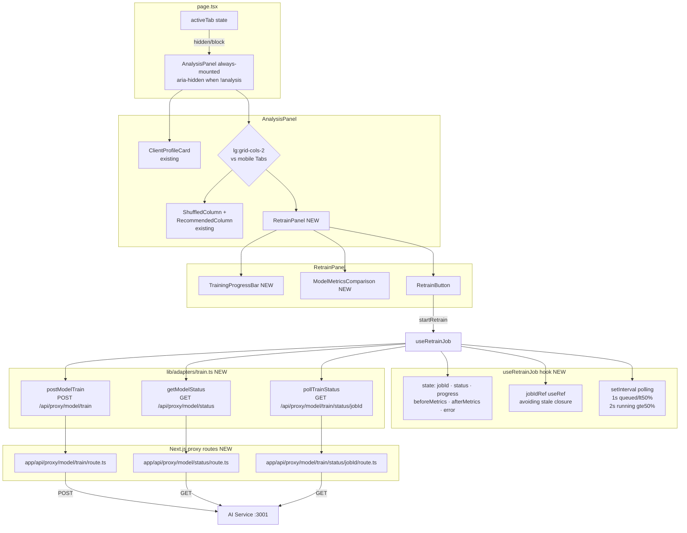

# M9-B — Deep Retrain Showcase — Design

**Status**: Approved
**Date**: 2026-04-26
**Spec**: `.specs/features/m9b-deep-retrain-showcase/spec.md`
**ADRs**: ADR-023 · ADR-024 · ADR-025

---

## Architecture Overview



---

## Code Reuse Analysis

| Existing | Location | How reused |
|---------|----------|------------|
| `AnalysisPanel` | `components/recommendations/AnalysisPanel.tsx` | Modified: always-mounted wiring in `page.tsx`; responsive layout added |
| `ClientProfileCard` | `components/client/ClientProfileCard.tsx` | No modification — coexists |
| `ShuffledColumn` / `RecommendedColumn` | `components/recommendations/` | No modification — coexists |
| `FallbackBanner` / `RecommendationSkeleton` | `components/recommendations/` | No modification |
| `Badge` (shadcn) | `components/ui/badge.tsx` | Reused for metric comparison badges (↑↓→) |
| `Skeleton` (shadcn) | `components/ui/skeleton.tsx` | Reused as loading state in `ModelMetricsComparison` |
| `sonner` toasts | installed M8 | 409, 401, network error toasts |
| `apiFetch` | `lib/fetch-wrapper.ts` | Called from `lib/adapters/train.ts` |
| `cn()` | `lib/utils.ts` | Conditional classes in new components |
| Proxy route pattern | `app/api/proxy/recommend/route.ts` | Template for 3 new proxy routes |
| `useRecommendationFetcher` | `lib/hooks/useRecommendationFetcher.ts` | Reference pattern for async hook with error handling |

---

## Components

### New components

#### `<RetrainPanel>`
- **File**: `components/retrain/RetrainPanel.tsx`
- **Responsibility**: Container for the retrain flow — button, progress bar, before/after metrics
- **Props**: none (reads env var via adapter, not prop-drilled)
- **State**: delegates entirely to `useRetrainJob`
- **Children**: `<TrainingProgressBar>`, `<ModelMetricsComparison>`, retrain button

#### `<TrainingProgressBar>`
- **File**: `components/retrain/TrainingProgressBar.tsx`
- **Responsibility**: Visual progress bar + epoch/loss/ETA text
- **Props**: `{ status: JobStatus; epoch: number; totalEpochs: number; loss: number | null; eta: number | null }`
- **Animation**: `transform: scaleX(fraction)` — GPU-composited (ADR-024). `motion-safe:transition-transform duration-300 ease-out`.
- **Indeterminate mode**: `totalEpochs === 0` → CSS keyframe `animate-pulse` on fill + "Aguardando início..." text

#### `<ModelMetricsComparison>`
- **File**: `components/retrain/ModelMetricsComparison.tsx`
- **Responsibility**: Tabela "Antes / Depois" com badges de comparação
- **Props**: `{ before: ModelMetrics | null; after: ModelMetrics | null; loading: boolean }`
- **States**: loading (Skeleton), empty (no model trained), before-only, before+after

#### `useRetrainJob` (hook)
- **File**: `lib/hooks/useRetrainJob.ts`
- **Responsibility**: Orchestrates retrain lifecycle — POST, polling with backoff, error handling, metrics accumulation
- **Returns**: `{ status, epoch, totalEpochs, loss, eta, beforeMetrics, afterMetrics, startRetrain, errorMessage }`
- **Key implementation**: `jobIdRef` pattern (ADR-025); `consecutiveErrors` counter stops polling at 3 failures (M9B-29)

#### `lib/adapters/train.ts` (pure async functions)
- **File**: `lib/adapters/train.ts`
- **Responsibility**: HTTP calls to proxy routes + response adaptation
- **Functions**: `postModelTrain(adminKey)`, `getModelStatus()`, `pollTrainStatus(jobId)`
- **Env**: reads `NEXT_PUBLIC_ADMIN_API_KEY` here, not in components

### Proxy routes (new)

| File | Method | Upstream |
|------|--------|---------|
| `app/api/proxy/model/train/route.ts` | POST | AI Service `POST /api/v1/model/train` with forwarded `X-Admin-Key` |
| `app/api/proxy/model/status/route.ts` | GET | AI Service `GET /api/v1/model/status` |
| `app/api/proxy/model/train/status/[jobId]/route.ts` | GET | AI Service `GET /api/v1/model/train/status/{jobId}` |

### Modified files

| File | Change |
|------|--------|
| `app/page.tsx` | `AnalysisPanel` always-mounted; `aria-hidden={activeTab !== 'analysis'}` on wrapper div |
| `components/recommendations/AnalysisPanel.tsx` | Add responsive layout (lg:grid-cols-2); add `<RetrainPanel>` right column; add internal `<Tabs>` for mobile |
| `lib/types.ts` | Add `ModelMetrics`, `TrainJobStatus`, `TrainJobResponse` interfaces |

---

## Data Models

```typescript
// Additions to lib/types.ts

export type JobStatus = 'idle' | 'queued' | 'running' | 'done' | 'failed' | 'network-error';

export interface ModelMetrics {
  precisionAt5: number;
  loss: number;
  epoch: number;
  trainedAt: string; // ISO timestamp
}

export interface TrainJobResponse {
  jobId: string;
  status: 'queued';
}

export interface TrainStatusResponse {
  status: 'queued' | 'running' | 'done' | 'failed';
  epoch: number;
  totalEpochs: number;
  loss: number | null;
  eta: number | null; // seconds remaining, may be null
}

export interface ModelStatusResponse {
  currentJobId: string | null; // present if training in progress
  currentModel: ModelMetrics | null;
  versionHistory: ModelMetrics[]; // last 5
}
```

---

## Error Handling Strategy

| Scenario | Where handled | User feedback |
|----------|--------------|---------------|
| `POST /model/train` → 401 | `useRetrainJob` catch | `toast.error("Chave de admin não configurada — verifique NEXT_PUBLIC_ADMIN_API_KEY")` |
| `POST /model/train` → 409 | `useRetrainJob` catch (reads `jobId` from body) | `toast("Retreinamento já em andamento")` + start polling existing jobId |
| `POST /model/train` → network error | `useRetrainJob` catch | `toast.error(...)` + `status: 'idle'` (button re-enabled) |
| Polling → 3 consecutive failures | `consecutiveErrors` counter in hook | `status: 'network-error'` + "Erro de conexão — tente novamente" in panel |
| Poll returns `status: 'failed'` | hook state | `status: 'failed'` + error message in panel + button re-enabled |
| `GET /model/status` fails on mount | try/catch in `useRetrainJob` init | `beforeMetrics: null` → "Nenhum modelo treinado" message |
| `totalEpochs === 0 or null` | `TrainingProgressBar` prop check | Indeterminate bar mode (animated pulse) |

---

## Tech Decisions

| Decision | Rationale |
|----------|-----------|
| `useRetrainJob` as local hook (not Zustand) | Retrain state is session-volatile (M9B-23); Zustand non-persist slice would violate SRP and Rule of Three (no evidence of reuse). Pattern established in AD-018 for RAGDrawer chat history. |
| `AnalysisPanel` always-mounted | Required by M9B-22 (metrics survive tab navigation); consistent with AD-018 (`RAGDrawer` always-mounted). See ADR-023. |
| `transform: scaleX()` for progress bar | GPU-composited — avoids layout thrashing from animating `width`. See ADR-024. |
| `jobIdRef` pattern | Prevents stale closure in setInterval callback. See ADR-025. |
| `lib/adapters/train.ts` for I/O | Separates HTTP concern from hook state management (SRP finding by Principal SW Architect); aligns with existing adapters pattern in `lib/adapters/`. |
| 3 Next.js proxy routes | AI Service is not directly accessible from browser (CORS). Follows established proxy pattern (`app/api/proxy/recommend/route.ts`). |
| shadcn `<Tabs>` for mobile layout | Keyboard-navigable, accessible by default (role=tablist/tab/tabpanel). Consistent with shadcn/ui vocabulary already in the codebase. |

---

## Interaction States

| Component | State | Trigger | Visual |
|-----------|-------|---------|--------|
| `RetrainPanel` button | idle | Initial load / job done / job failed | "🔄 Retreinar Modelo" — enabled |
| `RetrainPanel` button | loading | POST dispatched | "Retreinando..." — `disabled` + `aria-disabled="true"` |
| `TrainingProgressBar` | idle | No job active | Hidden (not rendered) |
| `TrainingProgressBar` | queued | jobId received, first poll pending | Indeterminate pulse + "Aguardando início..." |
| `TrainingProgressBar` | running | Poll returns `running` | `scaleX(epoch/totalEpochs)` + "Epoch N / M — Loss: X.XXXX" + "~Xs restantes" |
| `TrainingProgressBar` | done | Poll returns `done` | 100% fill + "Retreinamento concluído ✅" |
| `TrainingProgressBar` | failed | Poll returns `failed` | Red fill + "Retreinamento falhou" |
| `TrainingProgressBar` | network-error | 3 consecutive poll failures | Gray fill + "Erro de conexão — tente novamente" |
| `ModelMetricsComparison` | loading | On mount, fetching `GET /model/status` | 4x `<Skeleton>` lines |
| `ModelMetricsComparison` | empty | `currentModel === null` | "Nenhum modelo treinado — clique em Retreinar Modelo para começar" |
| `ModelMetricsComparison` | before-only | Model loaded, no retrain done | Single column "Modelo Atual" with metrics |
| `ModelMetricsComparison` | before+after | Retrain completed | Two columns "Antes" / "Depois" with comparison badges |
| `AnalysisPanel` (mobile) | comparison-tab | Default / user clicks "📊 Comparação" | ShuffledColumn + RecommendedColumn visible |
| `AnalysisPanel` (mobile) | retrain-tab | User clicks "🔄 Retreinar" | RetrainPanel visible |

---

## Animation Spec

| Animation | Property | Duration | Easing | Reduced-motion fallback |
|-----------|----------|----------|--------|------------------------|
| Progress bar advance | `transform: scaleX()` | 300ms | `ease-out` | No transition (`motion-safe:transition-transform`) |
| Indeterminate pulse | `opacity` via `animate-pulse` (Tailwind keyframe) | 2s loop | ease-in-out | Disabled — `motion-safe:animate-pulse` |
| Metrics column fade-in (after retrain) | `opacity` 0→1 | 200ms | `ease-out` | No transition (`motion-safe:transition-opacity`) |

---

## Accessibility Checklist

| Component | Keyboard nav | Focus management | ARIA | Mobile |
|-----------|-------------|-----------------|------|--------|
| `RetrainPanel` button | Tab to focus, Enter/Space to activate | Focus stays on button after click (disabled state); returns to button after job ends | `aria-disabled="true"` when disabled; `aria-label="Retreinamento em andamento"` when disabled | Touch target ≥44×44px via `min-h-11 px-4` Tailwind |
| `TrainingProgressBar` | Not interactive | N/A | `role="progressbar"` + `aria-valuenow` + `aria-valuemin=0` + `aria-valuemax=100`; `aria-label="Progresso do retreinamento"` | Full width, readable at any breakpoint |
| `ModelMetricsComparison` badges | Not interactive | N/A | Badge text is descriptive ("↑ Melhora", "→ Igual", "↓ Regressão"); no icon-only UI | Grid collapses to 1 column at <640px |
| `AnalysisPanel` wrapper (always-mounted) | Hidden elements removed from tab order | N/A | `aria-hidden={activeTab !== 'analysis'}` on root container in `page.tsx` | N/A |
| Mobile `<Tabs>` | Tab to TabsList, arrow keys between triggers, Enter/Space to select | Focus moves to TabsTrigger on click | shadcn `<Tabs>` provides `role="tablist"` + `role="tab"` + `role="tabpanel"` natively | 100% width; triggers `flex-1` for equal touch targets |
| Progress updates (screen reader announce) | N/A | N/A | `aria-live="polite"` region wrapping status text for epoch updates | N/A |

---

## Alternatives Discarded

| Node | Approach | Eliminated in | Reason |
|------|----------|---------------|--------|
| A | `useRetrainJob` local hook + conditional render of `AnalysisPanel` | Phase 2 | Conditional render destroys state on tab switch — violates M9B-22 directly (High severity, hydration vector) |
| B | Zustand non-persist slice for retrain state + polling in slice action | Phase 2 | Stale closure on `jobId` in setInterval inside Zustand action (High severity, race condition) + Rule of Three failure (no evidence of reuse) |

---

## Committee Findings Applied

| Finding | Persona | How incorporated |
|---------|---------|-----------------|
| Progress bar `width` causes layout thrashing | Staff UI Designer (High) | ADR-024: progress bar uses `transform: scaleX()` — GPU-composited |
| `jobId` stale closure in setInterval | Staff Engineering (High) | ADR-025: `jobIdRef = useRef` synced via `useEffect([jobId])` |
| Missing proxy routes for model endpoints | Staff Engineering (High) | 3 new proxy routes: `model/train`, `model/status`, `model/train/status/[jobId]` |
| SRP violation: I/O mixed with state in hook | Principal SW Architect (Medium) | `lib/adapters/train.ts` separates HTTP calls from `useRetrainJob` state management |
| `aria-hidden` required on always-mounted hidden panel | Principal SW Architect (Medium) | `aria-hidden={activeTab !== 'analysis'}` on wrapper in `page.tsx` (ADR-023) |
| `aria-disabled` + `disabled` on button | Staff Product Engineer (Medium) | `RetrainPanel` button uses both `disabled` and `aria-disabled="true"` |
| Explicit JobStatus states required | Staff Product Engineer (Medium) | `JobStatus` type: `idle | queued | running | done | failed | network-error`; all 6 states defined in Interaction States table |
| 3 consecutive poll failures circuit-breaker | Staff Engineering (Medium) | `consecutiveErrors` counter in `useRetrainJob`; stops at 3 → `status: 'network-error'` (M9B-29) |
| shadcn `<Tabs>` for mobile (not custom div) | Staff Product Engineer (Low) | Mobile layout uses shadcn `<Tabs>` with `value` + `onValueChange` |
| `prefers-reduced-motion` on progress animation | Staff UI Designer (Medium) | `motion-safe:transition-transform` and `motion-safe:animate-pulse` Tailwind classes |
| `aria-live` region for progress updates | Staff Product Engineer (implicit) | `aria-live="polite"` wrapper on status text in `TrainingProgressBar` |
