# Smart Marketplace Recommender

[Java](https://openjdk.org/projects/jdk/21/) [Spring Boot](https://spring.io/projects/spring-boot) [Node.js](https://nodejs.org/) [TypeScript](https://www.typescriptlang.org/) [TensorFlow.js](https://www.tensorflow.org/js) [Neo4j](https://neo4j.com/) [Next.js](https://nextjs.org/)

A **production-grade hybrid AI recommendation system** for B2B marketplaces — combining a TensorFlow.js neural network with semantic embedding search and an LLM-based RAG pipeline. Fully Dockerized, zero-cost to run, and designed to demonstrate the complete machine learning lifecycle: dataset construction, training, inference, cart-driven profile updates, and visible retraining with before/after comparison.

---

## Table of Contents

- [Overview](#overview)
- [System Architecture](#system-architecture)
- [Quickstart](#quickstart)
- [Neural Network Architecture](#neural-network-architecture)
- [Neural architecture benchmark (CLI)](#neural-architecture-benchmark-cli)
- [Benchmark guide (baseline, M22, and M23)](#benchmark-guide-baseline-m22-and-m23)
- [Dataset Construction & Training Quality](#dataset-construction--training-quality)
- [Hybrid Scoring Engine](#hybrid-scoring-engine)
- [Recency-aware profile & ranking](#recency-aware-profile--ranking)
- [Profile pooling and neural head](#profile-pooling-and-neural-head)
- [Module C — Item representation (dense + sparse)](#module-c--item-representation-dense--sparse)
- [RAG Pipeline](#rag-pipeline)
- [Service Communication Patterns](#service-communication-patterns)
- [Async Training: 202 + Polling Pattern](#async-training-202--polling-pattern)
- [Model Versioning & Rollback](#model-versioning--rollback)
- [Production-Grade Patterns](#production-grade-patterns)
- [Frontend: 4-State AI Learning Showcase](#frontend-4-state-ai-learning-showcase)
- [State Management](#state-management)
- [API Reference](#api-reference)
- [Model Observability](#model-observability)
- [Tech Stack Decision Summary](#tech-stack-decision-summary)

---

## Overview

Smart Marketplace Recommender solves the cold-start and relevance problems in B2B marketplace recommendation — where traditional collaborative filtering fails because purchase history is sparse and product descriptions matter as much as behavioral patterns.

The system combines three complementary signals:


| Signal                   | Source                                        | Weight |
| ------------------------ | --------------------------------------------- | ------ |
| Neural purchase behavior | TF.js dense model trained on purchase history | 60%    |
| Semantic similarity      | Cosine similarity of HuggingFace embeddings   | 40%    |
| Natural language         | LLM-grounded RAG over Neo4j vector store      | —      |


The frontend demonstrates the **full ML lifecycle** in a single interactive session: select a client → see initial recommendations → simulate purchases → observe real-time profile update → trigger full model retrain → compare before/after quality metrics.

**Latest ranking stack (optional, flags):** **[Module C](#module-c--item-representation-dense--sparse)** adds a **dual item representation** — dense **semantic** (HuggingFace) plus **sparse structural** priors (brand, category, subcategory, price bucket) and an optional **identity** embedding keyed by `product_id` for SKU-level memorisation — fused with the **user vector** **u** from **[profile pooling](#profile-pooling-and-neural-head)** (including **attention learned**). Defaults keep the legacy **768-d concat** path until operators enable `**M22_*`** and retrain.

---

## System Architecture

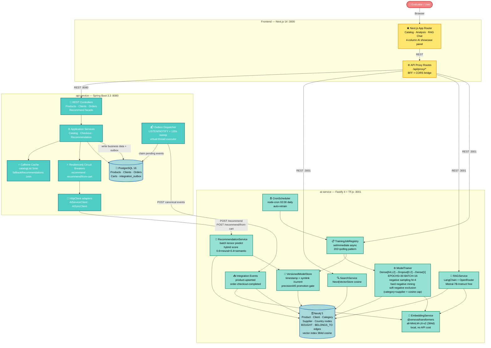


**5 Docker services:** `postgres`, `neo4j`, `api-service`, `ai-service`, `frontend` — all with health checks. `ai-service` health is readiness-based (`/ready`), and `api-service` waits for `ai-service` startup (`service_started`) to avoid compose startup cycles while AI self-healing runs.

> **Cold-start self-sufficient:** `docker compose up` on a completely empty environment (including `docker compose down -v`) automatically seeds both databases, generates embeddings, trains the model, and reaches `/ready = 200` — no manual intervention required.

---

## Quickstart

```bash
git clone git@github.com:gabrielgrillorosa/smart-marketplace-recommender.git
cd smart-marketplace-recommender
cp .env.example .env
docker compose up -d
```

The system is ready when `docker compose ps` shows all services as `healthy`.

**The system is fully self-sufficient on any clean startup:**

- On first boot (empty volumes), `ai-service` automatically seeds PostgreSQL and Neo4j, then generates embeddings and trains the model — no manual seed command required.
- On subsequent boots (volumes present), seeding is skipped and the existing model is reloaded in seconds. When `AUTO_HEAL_MODEL=true`, **StartupRecovery still runs after `listen()`**: it fills **any missing Neo4j product embeddings** even if a model file is already on disk, then **skips retrain** if that model loaded successfully — preventing “model volume + empty embedding graph” drift.

```bash
# Track cold-start progress
docker compose logs -f ai-service
# Look for: [AutoSeed] complete → [StartupRecovery] Filling N product(s) missing embeddings (optional) → training or “skipped retrain” → /ready = 200
```

```bash
# Open the demo UI
xdg-open http://localhost:3000 2>/dev/null || open http://localhost:3000
```

> **Persistent data** — The trained neural model, PostgreSQL database, and Neo4j graph are stored in named Docker volumes (`ai-model-data`, `postgres_data`, `neo4j_data`). They survive `docker compose down`. Use `docker compose down -v` **only** for a full environment reset.

### Managing the environment

```bash
docker compose stop          # Stop services, preserve all data
docker compose down          # Stop and remove containers, preserve volumes
docker compose up -d         # Restart after stop
docker compose down -v       # Full reset — deletes model, data, and graph
```

### Startup self-healing flow (auto-seed + training cache bypass)

The complete boot sequence handles both cold-start (empty databases) and warm-start (existing data):

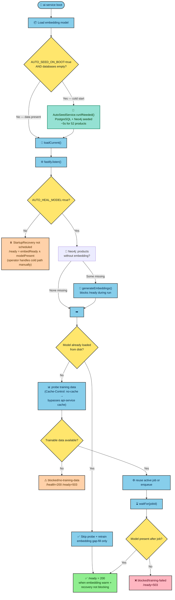


> Full sequence with timing details is summarized in the Mermaid flow in this README.

---

## Neural Network Architecture

### Model Design

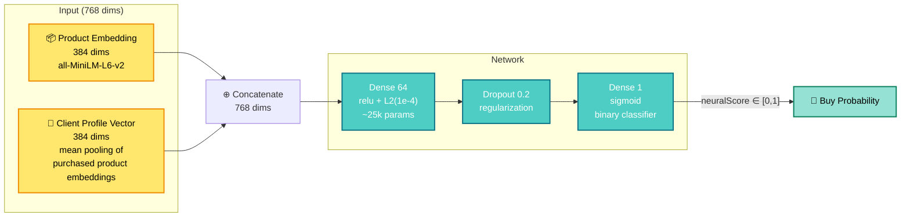


**Baseline path above** (`768 = e_sem ‖ u`) is the default when `**M22_ENABLED=false`**. With **[Module C](#module-c--item-representation-dense--sparse)** enabled and a valid `**m22-item-manifest.json`**, the neural branch uses **multi-input** fusion **f(u, e_sem, e_struct, e_id)** (concat → dense → logit) while `**semanticScore`** stays `**cosine(u, e_sem)**` — the **hybrid** layer still blends that semantic term with `**neuralScore`** via `NEURAL_WEIGHT` / `SEMANTIC_WEIGHT` (tune after large architecture changes).

**Production head (reduced MLP — committee rationale summarized here):**

- **Reduced architecture** — moved from `Dense[256→128→64→1]` (~~65k params) to `Dense[64→1]` (~~25k params). The previous ratio of ~60:1 (params:samples) caused severe overfitting; the new ~39:1 ratio with L2 regularization enables genuine generalization.
- **L2 regularization** `1e-4` on the dense layer — prevents memorization of the small synthetic dataset.
- **Dropout 0.2** — additional regularization guard.
- **EPOCHS=30, BATCH_SIZE=16** — compensates for the smaller dataset produced by selective negative sampling.
- **classWeight `{0: 1.0, 1: 4.0}`** — the dataset has ~1:4 positive:negative ratio after sampling. Without compensation, the network minimizes loss by predicting "not bought" for everything. The 4× weight on positives forces the gradient to prioritize purchase signals.
- **Early stopping patience=5** — halts training when validation loss stops improving, avoiding wasted epochs.

### Client Profile Vector

Each client is represented as the **mean pooling** of all purchased product embeddings:

```
clientProfileVector = mean([embed(product_1), embed(product_2), ..., embed(product_n)])
```

This creates a dense 384-dimensional representation of the client's taste in embedding space — far more expressive than one-hot encoding. Purchasing a new product incrementally shifts the profile vector in the direction of that product's semantic neighborhood.

### Batch prediction (single `tf.tensor2d` forward pass)

All candidate products are scored in a **single TF.js forward pass** using batched tensor operations:

```typescript
// One predict call for all candidates — not N serial calls
const batchTensor = tf.tensor2d(allVectors, [candidates.length, 768])
const scores = model.predict(batchTensor) as tf.Tensor
const scoreArray = scores.dataSync()  // Float32Array, sync-safe in tfjs-node
```

This reduces recommendation latency from ~500ms–2s (serial) to ~20–50ms (batched) for a typical 30–100 product candidate pool.

### Atomic model swap (`ModelStore.setModel`)

`ModelStore` is the single source of truth for the trained model in memory. Training completes fully before `setModel()` is called — a single synchronous JavaScript reference assignment that is atomic in the Node.js event loop. In-flight `/recommend` requests hold the old model reference for their duration via closure; the next request picks up the new model. Zero-downtime model replacement with no mutex needed.

---

## Neural architecture benchmark (CLI)

Offline script in `**ai-service**` to compare alternative **dense** heads (extra hidden layers / widths) against the **production baseline** (`Dense[64,L2] → Dropout → Dense[1]` — see **Neural Network Architecture** above) using the **same** training data pipeline as `ModelTrainer`: HTTP fetch from `api-service`, embeddings from Neo4j, `buildTrainingDataset()` with the same negative sampling and seeds.

**What it does not do:** start the Fastify server, call `POST /model/train`, or overwrite the deployed model under `/tmp/model`. Each candidate architecture is trained in memory, evaluated, and disposed.

### Prerequisites

- `**api-service`** reachable (default local: `http://127.0.0.1:8080`).
- **Neo4j** reachable with product embeddings (default local: `bolt://127.0.0.1:7687`; compose defaults often use user `neo4j` / password `password123` — match your `.env`).
- Environment variables: `**API_SERVICE_URL`**, `**NEO4J_URI**`, `**NEO4J_USER**`, `**NEO4J_PASSWORD**`.

### How to run

From `smart-marketplace-recommender/ai-service`:

```bash
export API_SERVICE_URL=http://127.0.0.1:8080
export NEO4J_URI=bolt://127.0.0.1:7687
export NEO4J_USER=neo4j
export NEO4J_PASSWORD=password123   # or value from your .env

npm run benchmark:neural-arch
```

The npm script runs `**npm run build**` then `**node dist/scripts/neural-arch-benchmark-cli.js**` so Node resolves compiled `.js` imports correctly (running the `.ts` entry with `ts-node` alone can fail on `*.js` import paths).

**Optional flags** (after `--`):


| Flag                 | Description                                                                                |
| -------------------- | ------------------------------------------------------------------------------------------ |
| `--out <path>`       | Write the full JSON report to a file (parent directories are created).                     |
| `--profiles <list>`  | Comma-separated subset: `baseline`, `deep64_32`, `deep128_64`. Default: all three.         |
| `--val-fraction <n>` | Fraction in `(0,1)` for stratified train/validation split on labeled rows. Default: `0.2`. |


Example with artifact file and two profiles only:

```bash
npm run benchmark:neural-arch -- --out ./.benchmarks/nn-arch.json --profiles baseline,deep128_64
```

### Architectures compared


| Profile      | Stack (before sigmoid)                 | Role                                                                                |
| ------------ | -------------------------------------- | ----------------------------------------------------------------------------------- |
| `baseline`   | 64 → Dropout(0.2) → 1                  | Current production head (`buildNeuralModel('baseline')` in `ModelTrainer`).         |
| `deep64_32`  | 64 → Dropout → 32 → Dropout → 1        | One extra narrow hidden layer.                                                      |
| `deep128_64` | 128 → Dropout(0.25) → 64 → Dropout → 1 | Wider + deeper (watch **params : samples** ratio vs the production baseline above). |


Implementation: `ai-service/src/ml/neuralModelFactory.ts`. Orchestration and metrics: `ai-service/src/benchmark/neuralArchBenchmark.ts` (`runNeuralArchBenchmark`). Entrypoint: `ai-service/src/scripts/neural-arch-benchmark-cli.ts`.

### Report shape (JSON)

Top-level fields include `**generatedAt`**, `**gitCommit**` (if `git rev-parse` works from `cwd` or `../..`), `**apiServiceUrl**`, `**dataCounts**` (clients / products / orders), `**hyperparams**` (epochs, batch size, class weights, val fraction), and `**runs**`: one object per profile.

Per run, useful fields for decisions:

- `**trainableParams**`, `**trainingSamples**`, `**paramSampleRatio**` — capacity vs dataset size (contrast with the production baseline).
- `**finalValLoss**`, `**finalValAccuracy**`, `**trainValLossGap**` — training uses the same `classWeight` as production; **early stopping monitors `val_loss`** (unlike the HTTP trainer, which still keys off training loss).
- `**valMetrics**`: `**aucRoc**`, `**aucPr**`, `**brier**`, `**accuracyAt05**` on the held-out stratified validation rows (binary `(client, product)` labels).
- `**precisionAt5**`: same **ranking** protocol as training-time evaluation (temporal split on purchase list per client, top-5 among non-train products).

**How to read results:** strong `**valMetrics`** but lower `**precisionAt5**` on deeper models often means the pointwise classifier improved while **list-wise ranking** that matters for `/recommend` did not — keep the baseline until you deliberately promote a new head and re-tune `**NEURAL_WEIGHT` / `SEMANTIC_WEIGHT`**.

---

## Dataset Construction & Training Quality

The training dataset is built by `buildTrainingDataset()` — a pure function in `training-utils.ts`. The critical part of that pipeline is **how negative examples are chosen**, because in recommender systems the negative sampling strategy can improve or destroy the ranking signal long before model architecture becomes the bottleneck.

### Legacy pipeline: soft negative filters + hard negative mining

The original pipeline worked in four stages:

1. remove products already purchased by the client
2. remove likely **soft negatives**
3. build a "clean negative pool"
4. sample **hard negatives** from that remaining pool

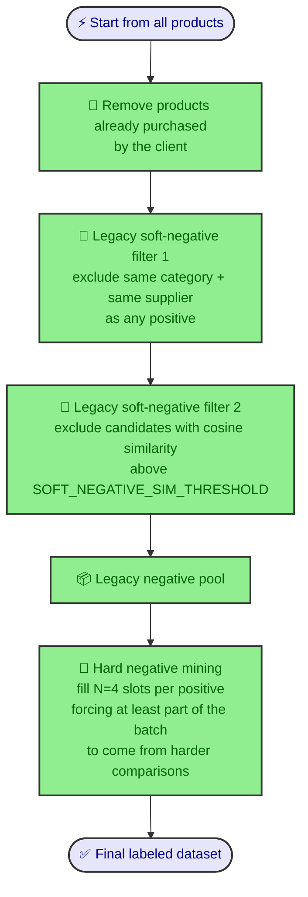

### What "soft negative" meant in the legacy pipeline

In the original implementation, a **soft negative** was a candidate that had not been purchased yet, but was still **too plausible** to be treated as a true negative.

The first heuristic was:

- if the client bought a product from the same **category + supplier**
- then other products with the same `category AND supplierName`
- should **not** be used as negatives

That logic looked like this:

```typescript
const positiveCategorySupplierPairs = new Set(
  positiveProducts.map(p => `${p.category}::${p.supplierName}`)
)
const softPositiveIdsByBrand = new Set(
  candidates.filter(p =>
    positiveCategorySupplierPairs.has(`${p.category}::${p.supplierName}`)
  ).map(p => p.id)
)
```

The second heuristic was semantic:

- even if supplier differs,
- if the candidate is very close in embedding space to any purchased positive,
- it is probably not a good negative either

```typescript
const threshold = parseFloat(process.env.SOFT_NEGATIVE_SIM_THRESHOLD ?? '0.65')
const softPositiveIdsBySimilarity = new Set(
  candidatesAfterBrandFilter.filter(candidate => {
    const cEmb = productEmbeddingMap.get(candidate.id)!
    return positiveProducts.some(pos =>
      cosineSimilarity(cEmb, productEmbeddingMap.get(pos.id)!) > threshold
    )
  }).map(p => p.id)
)
```

So, in the legacy pipeline:

- **soft negative** = "looks too similar to a positive, so exclude it from negative training"
- **hard negative** = "still a valid negative, but more challenging and informative than a random easy negative"

### Why the original soft-negative problem was serious

The original issue was **False Negative Contamination**.

Example:

- client buys several products from `food / Unilever`
- `Knorr Pasta Sauce` has **not** been purchased yet
- but it belongs to the same commercial neighborhood of interest
- if we label it as negative, the model learns the wrong lesson

With weighted BCE training such as `classWeight: {0:1, 1:4}`, this error is amplified:

- the model is penalized for predicting high score on a product that is actually a plausible future purchase
- the learned representation starts to push down exactly the family of products we want to surface later

This is the classic recommender-system failure mode:

- same brand/category candidates are **not observed negatives**
- they are often just **not-yet-interacted items**
- treating them as true negatives injects bias into the ranking objective

In practice, this caused the model to learn against products that were commercially coherent with the client's history. That is why using negatives from the same brand and category is dangerous: it teaches the model to suppress relevance instead of refine it.

### Why the original hard-negative strategy was not enough

The legacy hard-negative mining helped, but it did not fully solve the dataset quality problem.

After soft-negative exclusion, the code still had to compose 4 negatives per positive from the remaining pool. At least part of the batch was forced toward harder examples, but the resulting mixture still depended heavily on what survived the legacy filters.

That created three practical issues:

1. **Curriculum instability**  
   The model could see very different difficulty mixtures across clients and retrains.

2. **Over-reliance on filtering heuristics**  
   If the soft-negative filters were slightly too permissive, contaminated negatives still leaked into training.

3. **Weak control over ranking difficulty**  
   The dataset did not explicitly guarantee a balanced exposure to easy, medium, and hard negatives.

So the legacy pipeline was directionally correct, but still too implicit and too dependent on the leftover pool.

### New approach: `NEGATIVE_SAMPLING_MODE=stratified`

The new **M23** approach keeps the same purchase labels, the same neural heads, and the same M22 item-tower contract, but changes the **construction of negatives** from "filtered leftovers" to a **difficulty-aware sampling curriculum**.

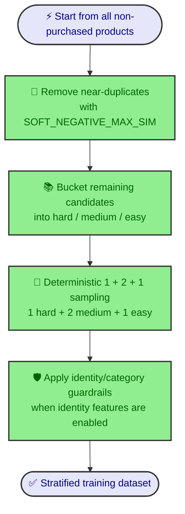

With `NEGATIVE_SAMPLING_MODE=stratified`, the pipeline applies:

- **near-duplicate cleanup** with `SOFT_NEGATIVE_MAX_SIM`
- **three difficulty buckets**: `hard`, `medium`, `easy`
- **deterministic 1 + 2 + 1 sampling** per positive: `1 hard + 2 medium + 1 easy`
- **identity-aware guardrails** when M22 identity is enabled

This is the key conceptual improvement:

- legacy pipeline: "remove obvious bad negatives, then sample from what remains"
- stratified pipeline: "clean the pool, then deliberately build a balanced ranking curriculum"

### Why stratified is better

From a recommender-systems perspective, `stratified` is better because it aligns the training set with the real ranking problem:

- **easy negatives** teach coarse separation
- **medium negatives** teach local discrimination
- **hard negatives** teach the fine-grained ordering that actually matters for top-k recommendation

The result is a cleaner supervisory signal, especially for list-wise metrics such as:

- `precision@5`
- `nDCG@5`
- `MRR`

This is exactly where the benchmark improved materially.

### How to run the legacy sampler

To reproduce the old behavior, run benchmarks with `legacy`:

```bash
cd ai-service

export NEGATIVE_SAMPLING_MODE=legacy
export SOFT_NEGATIVE_SIM_THRESHOLD=0.65

npm run benchmark:m23 -- \
  --sampling-modes legacy \
  --scenarios noIdentity,withIdentity \
  --profiles deep128_64,deep128_64_32,deep256 \
  --pooling-modes attention_light,attention_learned \
  --loss-modes bce \
  --runs-per-config 2 \
  --out ./.benchmarks/m23-legacy.json
```

### How to run the new stratified sampler

Recommended decision-grade block for the current hybrid stack:

```bash
cd ai-service

export NEGATIVE_SAMPLING_MODE=stratified
export SOFT_NEGATIVE_MAX_SIM=0.92
export HARD_NEGATIVE_MIN_SIM=0.70
export MEDIUM_NEGATIVE_MIN_SIM=0.40
export M23_BENCHMARK_RUNS=2

npm run benchmark:m23 -- \
  --sampling-modes stratified \
  --scenarios noIdentity,withIdentity \
  --profiles deep128_64,deep128_64_32,deep256 \
  --pooling-modes attention_light,attention_learned \
  --loss-modes bce \
  --runs-per-config 2 \
  --out ./.benchmarks/m23-stratified.json
```

### How to compare legacy vs stratified directly

```bash
cd ai-service

npm run benchmark:m23 -- \
  --sampling-modes legacy,stratified \
  --scenarios noIdentity,withIdentity \
  --profiles deep128_64,deep128_64_32,deep256 \
  --pooling-modes attention_light,attention_learned \
  --loss-modes bce \
  --runs-per-config 2 \
  --out ./.benchmarks/m23-grid-bce.json
```

### Benchmark impact: what improved and why it matters

The strongest production-facing result under the new sampling regime was:

- `NEGATIVE_SAMPLING_MODE=stratified`
- `NEURAL_ARCH_PROFILE=deep256`
- `PROFILE_POOLING_MODE=attention_light`
- scenario `ab / noIdentity`

Key result versus the previous legacy-era hybrid winner:

- `precision@5`: **0.6000 -> 0.8500**
- relative gain: **+41.7%**
- `nDCG@5`: historical **~0.20-0.21 -> 0.3188**
- `MRR`: **0.4584**
- `pairwiseAccuracyWithinCategory`: **0.9495**
- `topNAfterFirstInteractionHitRate`: **1.0000**

This is the core message for the benchmark:

- the improvement did **not** come only from a bigger head
- it came from **better training data**
- after the negative sampler became cleaner and more structured, the wider `deep256` head and the simpler `attention_light` pooling could finally express a stronger ranking signal

In other words: **the M23 improvement is fundamentally a data curriculum improvement first, and a model-capacity improvement second**.

### Deterministic Seed

The negative sampling seed is derived from the `clientId` hash. Every retrain with the same data produces identical datasets per client — making before/after comparisons reproducible and demo behavior predictable.

---

## Hybrid Scoring Engine

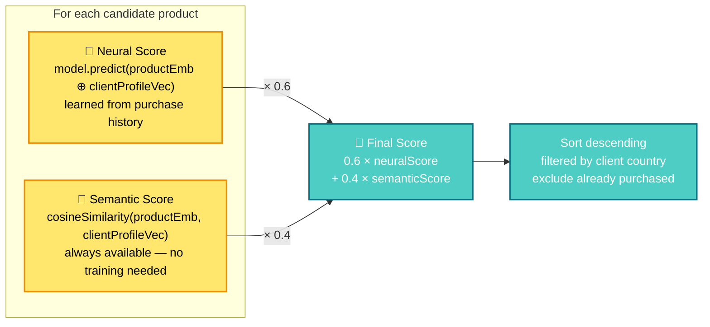


**Why hybrid beats neural-only** (committee evaluation + Tree-of-Thought / self-consistency on weight choice):


| Scenario                        | Neural Only                  | Hybrid                         |
| ------------------------------- | ---------------------------- | ------------------------------ |
| Small / sparse dataset          | ❌ High variance, overfitting | ✅ Semantic anchors predictions |
| Cold start (1–2 purchases)      | ❌ Unstable profile vector    | ✅ Semantic compensates         |
| New product added post-training | ❌ Score ≈ 0 (unseen)         | ✅ Embedding captures meaning   |
| Container restart               | ❌ Depends on saved model     | ✅ Semantic is deterministic    |
| Interpretability                | ❌ Black box                  | ✅ `matchReason` exposes origin |


Weights are configurable via `NEURAL_WEIGHT` and `SEMANTIC_WEIGHT` env vars. The current 60/40 split was evaluated by a three-expert committee using Tree-of-Thought + Self-Consistency reasoning.

`**matchReason` field** in recommendation responses tells the client which signal dominated: `neural` | `semantic` | `hybrid`.

---

## Recency-aware profile & ranking

Recency is rolled out in **orthogonal phases**: **P1** re-ranks candidates after the hybrid score (optional `RECENCY_RERANK_WEIGHT`). **P2** defines how the **client profile vector** **p** is built from purchases (and cart) so **training, `POST /recommend`, `POST /recommend/from-cart`, and offline `precisionAtK` share the same code path** (`aggregateClientProfileEmbeddings` in `ai-service/src/profile/clientProfileAggregation.ts`). **API transparency:** successful recommend responses include `**rankingConfig`** (weights, pooling mode fields) and optional per-row breakdown terms for the UI. **Phase 3** (temporal attention **inside** the ranking MLP) is **planned, not implemented** yet.

Operational detail and env defaults are summarized in the environment and API sections below.

### Where the two mechanisms sit in the pipeline

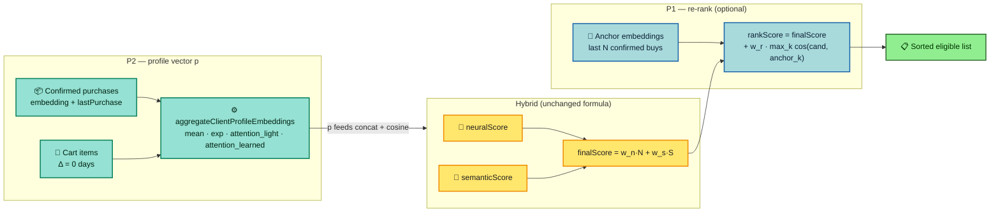


### P2 — Exponential profile pooling (`PROFILE_POOLING_MODE=exp`)

The **client profile** is the vector **p** passed into the MLP (concatenated with each candidate embedding) and into **semantic** cosine similarity. Implementation is a **single** TypeScript function shared by **training dataset construction**, `**POST /recommend`**, `**POST /recommend/from-cart**`, and offline `**precisionAtK**` — `aggregateClientProfileEmbeddings` in `ai-service/src/profile/clientProfileAggregation.ts`.


| Mode                 | Behaviour                                                                                                                                                                                                                                                                       |
| -------------------- | ------------------------------------------------------------------------------------------------------------------------------------------------------------------------------------------------------------------------------------------------------------------------------- |
| `**mean**` (default) | Arithmetic mean of distinct purchase embeddings — legacy behaviour, uniform weight over history.                                                                                                                                                                                |
| `**exp**`            | Weighted mean: each purchase *i* has age Δ*i* days vs a reference instant; `**w_i = exp(−Δ_i / τ)*`* with **τ = H / ln 2** and **H** = `PROFILE_POOLING_HALF_LIFE_DAYS`. Recent purchases weigh more in **p**; cart lines use **Δ = 0** so current intent stays maximal weight. |


**Training vs inference:** training uses order timestamps from the **API snapshot** and per-client **T_ref = max(order dates)** in that snapshot; at request time, inference uses **Neo4j** `lastPurchase` per SKU and **T_ref = request clock (UTC)**. Switching to `**exp`** changes gradients — **retrain** the MLP before expecting offline/online metrics to match.

### P1 — Recency re-rank boost (`RECENCY_RERANK_WEIGHT` > 0)

After **finalScore**, eligible candidates are sorted primarily by **rankScore**:

`rankScore = finalScore + RECENCY_RERANK_WEIGHT × recencySimilarity`

- **Anchors:** up to `**RECENCY_ANCHOR_COUNT`** distinct **confirmed** purchases (non-demo `BOUGHT`, `order_date` set, embedding present), most recent first.
- **recencySimilarity:** **maximum** cosine similarity between the candidate product embedding and each anchor embedding (session-like “similar to something I recently bought”).

When `**RECENCY_RERANK_WEIGHT = 0`** (default), no anchor query runs and ordering follows **finalScore** (plus tie-breaks). When the boost is on, consumers must **not** re-sort eligible rows by `finalScore` alone — use server **order** or `**rankScore`**.

### API envelope (`rankingConfig` + breakdown)

Successful `POST /api/v1/recommend` and `POST /api/v1/recommend/from-cart` return `**rankingConfig**`: `neuralWeight`, `semanticWeight`, `recencyRerankWeight`, and optional P2 fields `profilePoolingMode`, `profilePoolingHalfLifeDays`. Ranked rows may include `**hybridNeuralTerm**`, `**hybridSemanticTerm**`, `**recencyBoostTerm**`, and when P1 is active `**recencySimilarity**` / `**rankScore**` for the score modal.

### Configure (`.env` / compose)

See `[.env.example](.env.example)`: `**RECENCY_RERANK_WEIGHT**`, `**RECENCY_ANCHOR_COUNT**`, `**PROFILE_POOLING_MODE**`, `**PROFILE_POOLING_HALF_LIFE_DAYS**`.

**Profile pooling & neural loss:** beyond `mean` / `exp`, the deploy can use `**attention_light`** (softmax over recency only) or `**attention_learned**` (learned logits + JSON). **How the MLP is trained** (BCE vs pairwise) is orthogonal — see [Profile pooling and neural head](#profile-pooling-and-neural-head).

---

## Profile pooling and neural head

This section summarizes **two orthogonal axes** that are often mixed together:


| Axis                                        | Primary variable                        | What changes                                                                                                         |
| ------------------------------------------- | --------------------------------------- | -------------------------------------------------------------------------------------------------------------------- |
| **Client vector p** (before the MLP)        | `PROFILE_POOLING_MODE`                  | How previous purchases (and cart items) are aggregated into a single 384d vector.                                    |
| **How the network learns the neural score** | `NEURAL_LOSS_MODE` (+ on-disk manifest) | **BCE + sigmoid** head vs **linear + pairwise ranking loss**; inference uses `neural-head.json` from the checkpoint. |


Operational details and environment variables are summarized in this README and in the root environment example file.

### Profile pooling modes (`PROFILE_POOLING_MODE`)

All modes use the same function `**aggregateClientProfileEmbeddings`** (`ai-service/src/profile/clientProfileAggregation.ts`) — training, `POST /recommend`, `POST /recommend/from-cart`, and offline evaluation share the same injected runtime (`ProfilePoolingRuntime`).


| Mode                  | Env name            | Core idea                                                                                                                                                                                                         |
| --------------------- | ------------------- | ----------------------------------------------------------------------------------------------------------------------------------------------------------------------------------------------------------------- |
| **Mean**              | `mean`              | Arithmetic mean of purchase embeddings in the window — legacy behavior with uniform weights.                                                                                                                      |
| **Exponential**       | `exp`               | Weighted mean using `**exp(−Δ/τ)`**, with **τ = H / ln 2** and **H** = `PROFILE_POOLING_HALF_LIFE_DAYS`; recent purchases get higher weight.                                                                      |
| **Attention light**   | `attention_light`   | Softmax over **recency** logits (−Δ/τ), with optional temperature (`PROFILE_POOLING_ATTENTION_*`). Infinite/omitted temperature => uniform weights in the window (**equivalent to mean** over the same multiset). |
| **Attention learned** | `attention_learned` | Softmax with logits `**w·e + b − λΔ/τ`** (weights `**w**`, bias `**b**`, `**λ**`) loaded from service-managed JSON; reloaded after successful training when applicable.                                           |


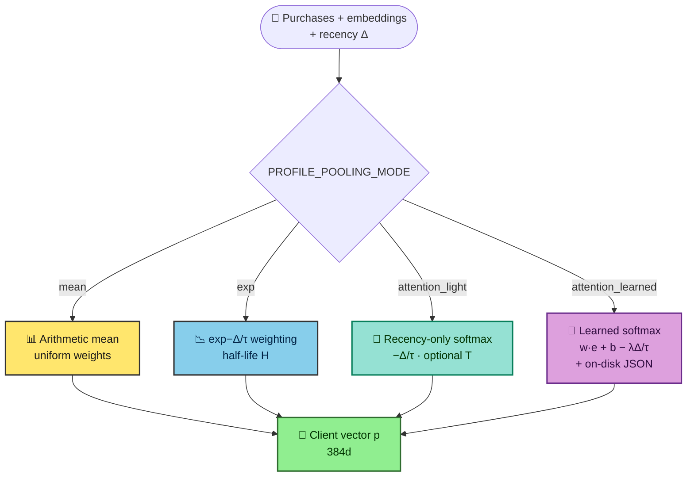


### Training head: BCE vs pairwise (`NEURAL_LOSS_MODE`)

- `**NEURAL_LOSS_MODE=bce**` (default): sigmoid head with **binary cross-entropy** over (client, product) pairs as binary classification. Metrics such as **accuracy** and **loss** follow standard BCE interpretation.
- `**NEURAL_LOSS_MODE=pairwise`**: final **linear** layer with **pairwise ranking loss** over stacked positive/negative rows. Do **not** compare loss/accuracy numerically against BCE runs; focus on **P@5** and relative ordering.
- **Inference:** each promoted version stores `**neural-head.json`** (`bce_sigmoid` vs `ranking_linear`). `RecommendationService` maps raw output to the same hybrid scalar range (for example, sigmoid over linear logits). Legacy checkpoints without a manifest default to **BCE** semantics.

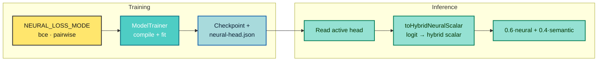


**Frontend:** the metrics column shows **"Model head"**, matching `GET /model/status` -> `neuralHeadKind`.

---

## Module C — Item representation (dense + sparse)

**Module C** (implemented in `ai-service`) adds a **second item pathway** alongside the legacy dense path: the **user** side (profile **u** from [recency / pooling](#recency-aware-profile--ranking) and [Profile pooling and neural head](#profile-pooling-and-neural-head)) is unchanged; the **item** side can either stay **768-d concat** (`e_sem ‖ u`) or switch to **multi-input fusion** `f(u, e_sem, e_struct, e_id)` with **sparse catalog priors** and optional **SKU memorisation**. The **hybrid** contract is unchanged: `**semanticScore = cosine(u, e_sem)`** plus weighted `**neuralScore**` — Module C only changes **how `neuralScore` is produced**.

### Two neural modes (what operators should compare)


| Layer                       | **Baseline (default, single item concat + profile pooling)**                                                                                                                            | **Module C (“dual” item: dense semantic + sparse towers)**                                                                                                                                                                |
| --------------------------- | --------------------------------------------------------------------------------------------------------------------------------------------------------------------------------------- | ------------------------------------------------------------------------------------------------------------------------------------------------------------------------------------------------------------------------- |
| **Profile `u`**             | `aggregateClientProfileEmbeddings` — `**mean**`, `**exp**`, `**attention_light**`, or `**attention_learned**` (see [Profile pooling and neural head](#profile-pooling-and-neural-head)) | **Identical** — Module C does not replace pooling; train and inference still share the same profile builder.                                                                                                              |
| **Item into the MLP**       | One vector `**[e_sem ‖ u]`** (768-d) → dense MLP → logit                                                                                                                                | `**concat(e_sem, u, e_struct, e_id)**` → dense MLP → logit; **(B)** = separate embeddings for brand, category, subcategory, `price_bucket`; **(C)** = separate `**product_id`** table (never shared with **B**).          |
| **Semantic branch**         | `**cosine(u, e_sem)`** for `semanticScore`                                                                                                                                              | **Unchanged** — still pure HF geometry vs the client profile.                                                                                                                                                             |
| **Cold start on structure** | Brand/category/price only implicit via negatives / co-purchase signal                                                                                                                   | **Explicit gradients** on discrete catalog signals (**B**), so new brands/categories get a learnable prior even with few SKU-level events.                                                                                |
| `**M22_IDENTITY=true`**     | N/A                                                                                                                                                                                     | **(C)** on: per-id memorisation tends to **boost repeat or familiar SKUs** seen in training vocab; **off** → single OOV row for **C** (no per-SKU lift). **Requires** `M22_STRUCTURAL=true` (boot fail-fast if violated). |
| **Artifacts**               | `model.json` + `neural-head.json`                                                                                                                                                       | **Also** `**m22-item-manifest.json`** (vocabs, `priceBinEdges`, `identityEnabled`, `vocabSizes`) so serving matches training token→index maps.                                                                            |
| **Promotion**               | `precisionAt5` vs tolerance                                                                                                                                                             | **Same gate** — Module C is not exempt from offline `**precisionAt5`** discipline vs `MODEL_PROMOTION_TOLERANCE`.                                                                                                         |


**Naming “dual tower”:** in recommender literature “two-tower” often means **user tower × item tower**. Here, **Module C** keeps one **user** vector **u** and splits the **item** side into **dense semantic (A)** plus **sparse structural (B)** and optional **identity (C)** — three **item** channels fused before the neural scalar, not a second user network.

### Inference decision (which path runs?)

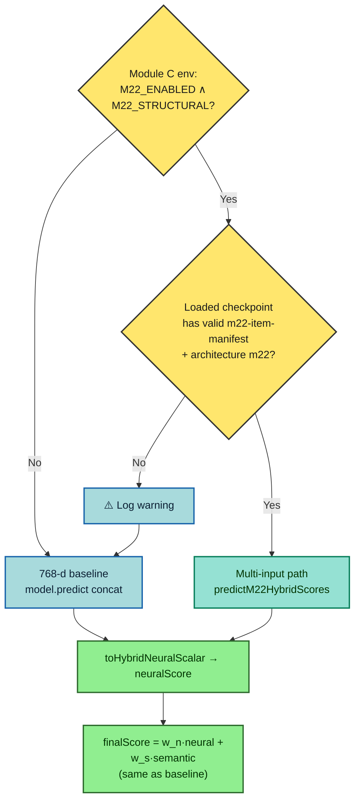


### What you gain (summary)

- **Stronger cold start on catalog axes** (brand, manufacturer/supplier field, category stack, price band) without stuffing those tokens into the HF encoder.
- **Optional memorisation** (**C**) **decoupled** from structural priors (**B**) — when enabled, the model can prefer **known SKUs** without conflating “same category” with “same product id”.
- **Safe default:** flags off ⇒ **bit-identical training shape** to legacy 7-arg dataset path (regression tests); env-only flip without retrain still **loads baseline weights** and falls back at inference (see diagram above).

### How to enable and use (operator checklist)

1. **Configure** `ai-service` process: `M22_ENABLED=true`, `M22_STRUCTURAL=true`; set `M22_IDENTITY=true` only if you want **(C)** (requires structural). See `[.env.example](.env.example)` and `[docker-compose.yml](docker-compose.yml)` — variables are passed into the `ai-service` container.
2. **Restart** `ai-service` so env and fail-fast validation run (`assertM22EnvCombinationsOrThrow`).
3. Run a **full train** (`POST /api/v1/model/train` with admin key or your cron path) so `**ModelTrainer`** builds the Module C graph, writes `**m22-item-manifest.json**`, and promotes if `precisionAt5` passes the gate.
4. **Confirm** the active checkpoint directory contains `**m22-item-manifest.json`** next to `model.json` (otherwise you are still on the 768-d path at inference).
5. **Tune** `NEURAL_WEIGHT` / `SEMANTIC_WEIGHT` after major architecture changes; optional offline slice: `computePrecisionAt5ColdStartCategorySlice` in `ai-service/src/ml/rankingEval.ts`.
6. **Rollback:** `M22_ENABLED=false`, restart; repoint `/tmp/model/current` (or volume) to a **pre–Module C** checkpoint symlink if you need an instant revert.

Full env tables and rollback notes are captured in the root environment files and in the sections below.

### End-to-end flow — user profile + Module C item path + hybrid

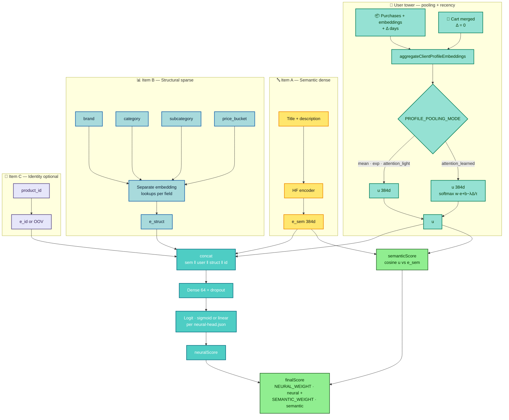


---

## Benchmark guide (baseline, M22, and M23)

### Quick glossary (what each benchmark dimension means)

- `**mean**`: uniform average of profile-history embeddings; strongest regularization, lowest adaptation to recency/content shifts.
- `**attention_light**`: softmax weighting based on recency logits only (`-Δ/τ`), no learned content parameters.
- `**attention_learned**`: learned attention logits (`w·e + b - λΔ/τ`) combining content signal with recency decay; highest expressiveness.
- **M22 hybrid**: model uses semantic item embedding (A) + sparse structural features (B), with optional identity path (C) controlled by `M22_IDENTITY`.
- **Semantic-only baseline**: legacy concat path (`e_sem || u`) without sparse/identity item branches.

This repository supports three benchmark paths in `ai-service`:

1. **Baseline neural head benchmark** (`benchmark:neural-arch`) for the legacy concat path (`e_sem || u`).
2. **M22 benchmark** (`benchmark:m22`) for scenarios `a`, `ab`, `abc` and architecture profiles (`baseline`, `deep64_32`, `deep128_64`, `deep256`, `deep512`).
3. **M23 benchmark** (`benchmark:m23`) for `legacy` vs `stratified` negative sampling under the same M22-style ranking protocol.

### 1) Baseline benchmark (`benchmark:neural-arch`)

```bash
cd ai-service
npm run benchmark:neural-arch -- \
  --pooling-modes mean,attention_light,attention_learned \
  --out ./.benchmarks/nn-arch.grid.json
```

### 2) M22 benchmark (`benchmark:m22`)

```bash
cd ai-service
npm run benchmark:m22 -- \
  --scenarios a,ab,abc \
  --profiles baseline,deep64_32,deep128_64,deep256,deep512 \
  --pooling-modes mean,attention_light,attention_learned \
  --out ./.benchmarks/m22-grid-full.json
```

### 3) M23 benchmark (`benchmark:m23`)

```bash
cd ai-service
npm run benchmark:m23 -- \
  --sampling-modes legacy,stratified \
  --scenarios noIdentity,withIdentity \
  --profiles deep128_64,deep128_64_32,deep256 \
  --pooling-modes attention_light,attention_learned \
  --loss-modes bce \
  --runs-per-config 2 \
  --out ./.benchmarks/m23-grid-bce.json
```

For production decisions, **do not use scenario `a` alone** because it ignores structural and identity signals. Compare `**ab`** and `**abc**`.

### Stability results only (decision-grade, 3 runs each)

#### M23 production rerun (legacy vs stratified, AB/ABC, `bce`, `attention_light` + `attention_learned`)

This rerun changed the decision in the hybrid stack. Under the new `**NEGATIVE_SAMPLING_MODE=stratified**` protocol, the strongest production-facing result came from **AB / no-identity** with a **time-only pooling strategy**:


| Configuration                              | Scenario               | precision@5  | nDCG@5       | MRR          | pairwiseAcc  | hitRate@10   | aucRoc   | aucPr    | brier    | valAcc   | valLoss  |
| ------------------------------------------ | ---------------------- | ------------ | ------------ | ------------ | ------------ | ------------ | -------- | -------- | -------- | -------- | -------- |
| `stratified + deep256 + attention_light`   | `ab` / `noIdentity`    | `**0.8500`** | `**0.3188**` | `**0.4584**` | `**0.9495**` | `**1.0000**` | `0.7897` | `0.5451` | `0.1650` | `0.7726` | `0.5878` |
| `stratified + deep256 + attention_learned` | `ab` / `noIdentity`    | `0.8500`     | `0.3011`     | `0.4126`     | `0.9363`     | `0.9750`     | `0.7602` | `0.5098` | `0.1880` | `0.7471` | `0.6270` |
| `legacy + deep128_64 + attention_light`    | `abc` / `withIdentity` | `**0.7750**` | `**0.2140**` | `**0.3862**` | `0.8160`     | `0.8750`     | `0.9225` | `0.8702` | `0.0710` | `0.9149` | `0.2822` |


**Decision:** for the hybrid recommendation path, the new winner is `**NEGATIVE_SAMPLING_MODE=stratified` + `NEURAL_ARCH_PROFILE=deep256` + `PROFILE_POOLING_MODE=attention_light`**.

Why this winner changed:

- **Ranking objective improved materially:** versus the previous hybrid winner (`ab + attention_learned + deep128_64`), `precision@5` moved from `**0.6000` → `0.8500`** (`+0.2500`, `+41.7%` relative).
- **Top-of-list quality improved even more:** `nDCG@5` moved from roughly `**0.20`-`0.21` historical M22 range** to `**0.3188`**, meaning relevant products are not only found, but found earlier in the ranked list.
- **Ranking generalization improved:** `MRR` reached `**0.4584`** and `pairwiseAccuracyWithinCategory` reached `**0.9495**`, showing the model learned a cleaner local ordering signal rather than only a pointwise separator.
- **User-facing usefulness improved:** `topNAfterFirstInteractionHitRate` reached `**1.0000`** in the winning AB run average, which is exactly the kind of “first useful list” signal an engineering manager cares about for product impact.
- **Attention-light won for a good reason:** the pure recency softmax (`attention_light`) beat `attention_learned` on the same `deep256` profile while being simpler to explain operationally. Under the cleaner stratified dataset, the model benefited more from a stable time-based profile than from extra learned attention parameters.

Executive reading: the new sampling regime improved the **learning signal** enough that a **wider head (`deep256`) plus simpler temporal pooling (`attention_light`)** now beats the older learned-pooling winner on the metrics that matter most for recommendation quality.

#### M22 stability rerun (AB/ABC, `attention_light` + `attention_learned`)


| Configuration                          | precision@5 per run | mean precision@5 | std      |
| -------------------------------------- | ------------------- | ---------------- | -------- |
| `ab + attention_learned + deep128_64`  | `0.65, 0.55, 0.60`  | `0.60`           | `0.0408` |
| `abc + attention_learned + deep128_64` | `0.50, 0.60, 0.60`  | `0.5667`         | `0.0471` |
| `ab + attention_light + deep128_64`    | `0.50, 0.60, 0.55`  | `0.55`           | `0.0408` |
| `ab + attention_learned + deep256`     | `0.55, 0.65, 0.45`  | `0.55`           | `0.0816` |


M22 decision from the 3-run protocol: `ab + attention_learned + deep128_64` is the selected hybrid candidate because it combines the highest mean precision with materially lower variance than competing heads.

**Best M22 candidate (`ab + attention_learned + deep128_64`) — all observed metrics across 3 runs**


| Metric                 | Mean      | Std       | Runs                       |
| ---------------------- | --------- | --------- | -------------------------- |
| `precisionAt5`         | `0.6000`  | `0.0408`  | `0.65, 0.55, 0.60`         |
| `aucRoc`               | `0.9006`  | `0.0257`  | `0.9064, 0.8666, 0.9287`   |
| `aucPr`                | `0.8306`  | `0.0493`  | `0.8598, 0.7612, 0.8709`   |
| `brier` (lower better) | `0.0844`  | `0.0277`  | `0.0662, 0.1235, 0.0636`   |
| `accuracy@0.5`         | `0.8894`  | `0.0427`  | `0.9146, 0.8293, 0.9244`   |
| `finalTrainLoss`       | `0.3048`  | `0.1073`  | `0.2625, 0.4522, 0.1998`   |
| `finalValLoss`         | `0.3193`  | `0.0626`  | `0.2723, 0.4078, 0.2779`   |
| `trainValLossGap`      | `-0.0145` | `0.0501`  | `-0.0099, 0.0444, -0.0780` |
| `durationMs`           | `25086.7` | `13709.2` | `43139, 9937, 22184`       |


Source artifacts:

- `ai-service/.benchmarks/m22-rerun-light-learned-all-arch.json`
- `ai-service/.benchmarks/m22-rerun-ab-abc-light-learned-1286432-12864-256.json`
- `ai-service/.benchmarks/m22-rerun2-ab-abc-light-learned-1286432-12864-256.json`

#### Baseline stability rerun (semantic-only, `attention_light` + `attention_learned`)


| Configuration                   | precision@5 per run | mean precision@5 | std      |
| ------------------------------- | ------------------- | ---------------- | -------- |
| `attention_learned + deep64_32` | `0.70, 0.65, 0.60`  | `0.65`           | `0.0408` |
| `attention_light + baseline`    | `0.60, 0.65, 0.65`  | `0.6333`         | `0.0236` |
| `attention_learned + baseline`  | `0.65, 0.60, 0.60`  | `0.6167`         | `0.0236` |
| `attention_light + deep64_32`   | `0.60, 0.45, 0.65`  | `0.5667`         | `0.0850` |


Baseline decision from the 3-run protocol: `attention_learned + deep64_32` is the selected semantic-only head.

**Best semantic-only candidate (`attention_learned + deep64_32`) — all observed metrics across 3 runs**


| Metric                 | Mean      | Std      | Runs                     |
| ---------------------- | --------- | -------- | ------------------------ |
| `precisionAt5`         | `0.6500`  | `0.0408` | `0.70, 0.65, 0.60`       |
| `aucRoc`               | `0.8847`  | `0.0150` | `0.8635, 0.8956, 0.8949` |
| `aucPr`                | `0.7931`  | `0.0311` | `0.7493, 0.8178, 0.8123` |
| `brier` (lower better) | `0.0923`  | `0.0130` | `0.1103, 0.0867, 0.0801` |
| `accuracy@0.5`         | `0.8837`  | `0.0133` | `0.8659, 0.8878, 0.8976` |
| `finalTrainLoss`       | `0.4017`  | `0.0445` | `0.4646, 0.3715, 0.3691` |
| `finalValLoss`         | `0.3291`  | `0.0338` | `0.3764, 0.3107, 0.3000` |
| `trainValLossGap`      | `0.0727`  | `0.0115` | `0.0882, 0.0607, 0.0691` |
| `durationMs`           | `13403.3` | `1663.9` | `11136, 13992, 15082`    |


#### Final technical position

- **Hybrid winner (current stack):** `ab + stratified + deep256 + attention_light`.
- **Semantic-only winner:** `attention_learned + deep64_32`.
- **Why these are selected (Deep Learning perspective):**
  - **Primary objective (ranking):** the hybrid winner is now top on `**precisionAt5`**, `**nDCG@5**`, `**MRR**`, and **pairwise ranking accuracy** in the production-relevant AB slice.
  - **Discrimination/calibration guardrails:** the semantic-only winner still keeps the best balance of ranking and pointwise quality in the pure concat path; the hybrid winner accepts lower pointwise AUC than legacy because the product objective is ranked recommendation quality, not only binary discrimination.
  - **Generalization check:** the winning hybrid run keeps a controlled **negative** `trainValLossGap`, avoiding the unstable early-stop behaviour seen in weaker stratified identity runs.
  - **Variance-aware decision:** model choice is based on **mean + variance**, not single-run peaks; this is critical in stochastic training pipelines with evolving marketplace data.
  - **Operational fit:** `attention_light` is easier to explain and operate than `attention_learned`, while `deep256` justified its extra capacity only after the M23 sampler improved the ranking curriculum.
- **Executive conclusion:** the M23 rollout changed the hybrid architecture decision. The recommended deploy is now `**NEGATIVE_SAMPLING_MODE=stratified`**, `**NEURAL_ARCH_PROFILE=deep256**`, `**PROFILE_POOLING_MODE=attention_light**` for the hybrid path, while `**attention_learned + deep64_32**` remains the semantic-only reference.

---

## RAG Pipeline

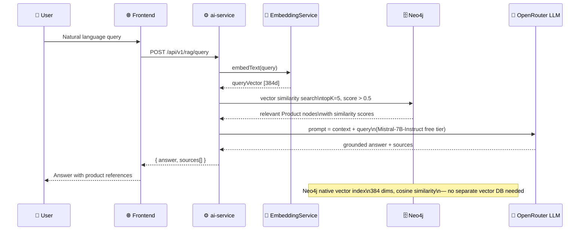


- **Embedding model:** `sentence-transformers/all-MiniLM-L6-v2` via `@xenova/transformers` — runs fully locally, zero API cost
- **Vector store:** Neo4j 5 native vector indexes — graph relationships and vector search in one database, no Pinecone/Weaviate needed
- **LLM:** OpenRouter free tier (`mistralai/mistral-7b-instruct:free`) — zero cost
- **Prompt engineering:** Grounded answers only; explicit "not found" response when context is insufficient; supports pt-BR and English

---

## Service Communication Patterns

### Inter-Service Call Map

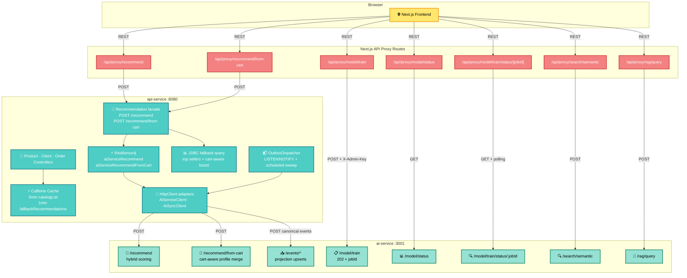

### Circuit Breaker — API Service → AI Service (Resilience4j)

The `api-service` now acts as a **recommendation facade** for both `POST /api/v1/recommend` and `POST /api/v1/recommend/from-cart`. It calls the `ai-service` with `java.net.http.HttpClient`, protects each route with its own Resilience4j circuit breaker, and degrades to relational fallback when AI is unavailable or times out.

```mermaid
sequenceDiagram
    participant FE as 🌐 Frontend Proxy
    participant API as ⚙️ api-service
    participant CB as ⚡ Circuit Breaker
    participant AI as ⚙️ ai-service
    participant PG as 💾 PostgreSQL

    FE->>+API: POST /api/v1/recommend/from-cart {clientId, productIds, limit}
    API->>+CB: Execute AI call
    alt AI available
        CB->>+AI: POST /api/v1/recommend/from-cart
        AI-->>-CB: 200 recommendations + rankingConfig
        CB-->>-API: Success
        API-->>-FE: 200 {recommendations, isFallback:false}
    else AI unavailable / timeout / open circuit
        CB-->>API: Fallback signal
        API->>+PG: Query top sellers with cart-aware ranking
        PG-->>-API: Fallback rows
        API-->>-FE: 200 {recommendations, isFallback:true}
    end
```

Fallback behavior:

- `recommend`: top sellers in the client's country, excluding products already purchased
- `recommend/from-cart`: same rule, also excluding cart items and prioritizing categories present in the cart
- `fallbackRecommendations` stays cached for 1 minute; the cart-aware fallback is computed fresh

### Transactional outbox — API Service → AI Service

Product writes and checkout no longer call the `ai-service` inline. The `api-service` writes business data and an `integration_outbox` row in the same PostgreSQL transaction, and the `OutboxDispatcher` pushes canonical events to the `ai-service`.

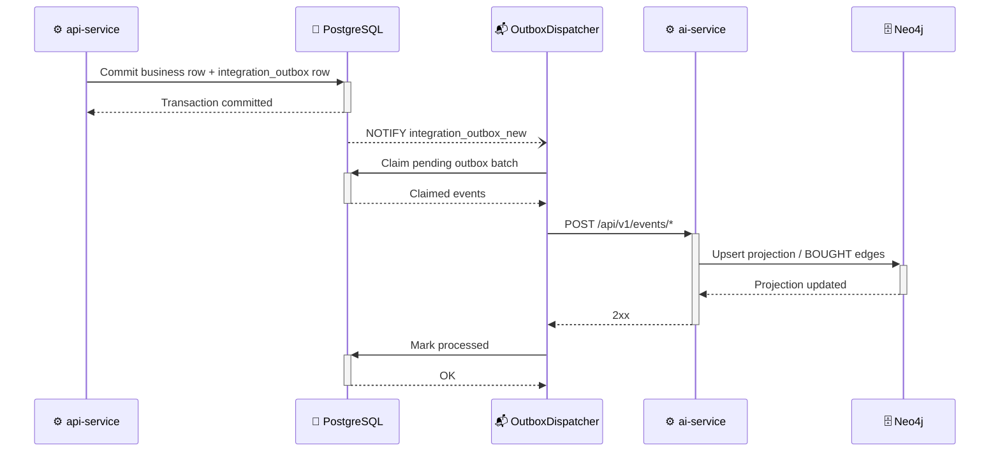

### Caffeine in-memory cache — API service

Programmatic `CaffeineCacheManager` configuration with two named caches and different TTLs:


| Cache                     | TTL   | Key dimensions                                       | Eviction                                         |
| ------------------------- | ----- | ---------------------------------------------------- | ------------------------------------------------ |
| `catalogList`             | 5 min | page + size + category + country + supplier + search | `@CacheEvict(allEntries=true)` on product create |
| `fallbackRecommendations` | 1 min | country + client + limit                             | Recommendation fallback without cart             |


`recordStats()` enabled — cache hit/miss rates exposed automatically via Micrometer at `/actuator/metrics`.

### Training read cache bypass (`Cache-Control: no-cache`)

`ModelTrainer` always sends `Cache-Control: no-cache` when fetching training data from `api-service`.
This prevents cold-start cache poisoning: if `api-service` became healthy before the seed completed,
it could cache an empty product list for 5 minutes — starving the training pipeline.

The `api-service` side wires the header into the `@Cacheable` condition:

```java
// ProductController — reads Cache-Control header
boolean noCache = isCacheBypass(cacheControl);   // true for "no-cache" or "no-store"
productService.listProducts(..., noCache);

// ProductApplicationService — @Cacheable is skipped when noCache=true
@Cacheable(value = "catalogList", condition = "!#noCache")
public PagedResponse<ProductSummaryDTO> listProducts(..., boolean noCache) { ... }
```

The public catalog path (`noCache=false`) retains full caching. Internal training reads always hit
PostgreSQL directly and are never stored in Caffeine.

### Next.js Proxy Routes — CORS Bridge

The `ai-service` is not directly accessible from the browser. All AI calls from the frontend go through Next.js API Route handlers (`app/api/proxy/*`) that forward the request server-side. This also allows injecting the `X-Admin-Key` header from server-only env vars without exposing it to the browser.

---

## Async Training: 202 + Polling Pattern

Training a neural model can take 12–60 seconds. Synchronous HTTP responses would time out across proxies. The system implements the **202 Accepted + job polling** pattern (async train without blocking HTTP):

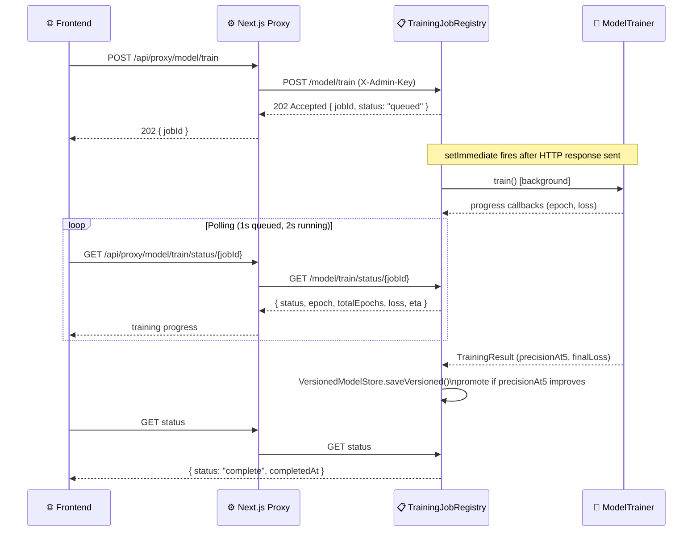


**Key implementation details:**

- `POST /model/train` returns `202` immediately with a `jobId` — HTTP response is sent before training starts
- `setImmediate(() => _runJob(jobId))` fires the training after the current event loop turn (after the response is flushed)
- `isTraining` guard is checked **inside** `setImmediate`, not at enqueue time — closes the race window between cron timer fire and actual job start
- `409 Conflict` if a training job is already in progress
- Job history capped at 20 entries in-memory (`MAX_JOBS = 20`)
- Frontend `useRetrainJob` hook uses **adaptive polling**: 1-second interval while `status === "queued"`, 2-second interval during `running` — stops after 3 consecutive poll failures (`consecutiveErrors` circuit breaker)

### Admin key security (scoped Fastify plugin)

Admin-protected endpoints (`POST /model/train`, `POST /embeddings/generate`) are wrapped in a **scoped Fastify plugin** with a single `addHook('onRequest', adminKeyHook)` that applies only within the plugin's encapsulation scope. The internal outbox consumer endpoints (`POST /api/v1/events/product-upserted`, `POST /api/v1/events/order-checkout-completed`) are registered outside the plugin — zero whitelist maintenance needed when adding new internal ingestion routes.

```
X-Admin-Key: $ADMIN_API_KEY    → 200 OK
X-Admin-Key: wrong             → 401 Unauthorized
(no header)                    → 401 Unauthorized
```

---

## Model Versioning & Rollback

`VersionedModelStore` extends `ModelStore` with filesystem-backed versioning (symlink `current`, promotion gate):

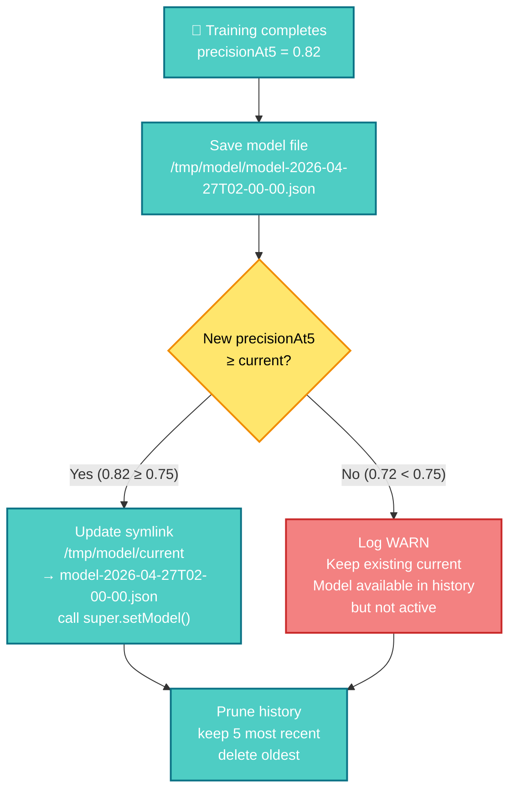


- **Promotion gate:** A new model only becomes `current` if its `precisionAt5` is ≥ the previous model's. Regressions are saved to history but never deployed.
- **Startup recovery:** after `listen()`, whenever `AUTO_HEAL_MODEL=true`, `StartupRecoveryService` runs in the background: it **always** checks Neo4j for products **without** `embedding` and calls `generateEmbeddings` if needed (even when a model is already on disk — fixes mixed-volume drift). **Retrain** (probe → `TrainingJobRegistry.enqueue` / `waitFor`) runs **only** when no model was loaded from `loadCurrent()`.
- **Readiness contract:** `/health` stays liveness-only (`200`), while `/ready` is `200` only when `embeddingService.isReady && modelStore.getModel() !== null && !startupRecoveryService.isBlockingReadiness()`.
- **Blocked semantics:** if seed/training data is missing, service remains alive with `/ready=503` and explicit blocked reason in logs (no crash, no tight retry loop).
- **Docker persistence:** The `ai-model-data` volume preserves trained models across container restarts and `docker compose down`.
- **History:** `GET /api/v1/model/status` returns the last 5 model versions with timestamps and metrics.
- **FsPort interface:** All filesystem operations (`symlink`, `unlink`, `readdir`, `stat`, `mkdir`) go through an injected `FsPort` interface — the production implementation uses `node:fs/promises`; tests use `vi.fn()` mocks.

### Nightly Retraining

`CronScheduler` registers a `node-cron` job that fires every day at 02:00:

```
cron: "0 2 * * *"
```

It calls `TrainingJobRegistry.enqueue()` inside `setImmediate` — never blocks the Fastify event loop. If training is already in progress at cron trigger time, the job is skipped with a log warning. `GET /model/status` exposes `nextScheduledTraining` (ISO datetime) from `cronScheduler.getNextExecution()`.

---

## Production-Grade Patterns

### TensorFlow.js async boundary (`tf.tidy`)

`tf.tidy()` does not support async operations. All I/O (Neo4j queries, HTTP calls) completes **before** entering the TF.js tensor computation block. This prevents tensor memory leaks from async calls that escape the tidy scope:

```typescript
// All async I/O done before tf.tidy()
const [clientEmbeddings, candidateProducts] = await Promise.all([
  repo.getClientPurchasedEmbeddings(clientId),
  repo.getCandidateProducts(clientId, country)
])

// Synchronous tensor operations inside tidy()
const scores = tf.tidy(() => {
  const batchTensor = tf.tensor2d(allVectors, [n, 768])
  const predictions = model.predict(batchTensor) as tf.Tensor
  return Array.from(predictions.dataSync())
})
```

### Profile vector and Neo4j reads (demo-buy removed)

The product path uses **confirmed purchases** (and optionally **cart items**) to build the client profile vector; `RecommendationService` scores the catalog via a single internal path (`recommendFromVector`). The legacy `**POST /api/v1/demo-buy`** API and its Neo4j write helpers were **removed** from this codebase — any old `BOUGHT {is_demo: true}` edges are ignored by read queries (`coalesce(r.is_demo, false) = false`) until operators delete them; see `scripts/neo4j-delete-demo-bought-edges.cypher`.

### Neo4j Driver Singleton

The Neo4j driver is instantiated once at startup and shared across all repository methods. Each method opens a session, executes the query, and closes the session in a `finally` block — avoiding connection leaks while reusing the driver's internal connection pool.

### Custom Error with statusCode

Services define typed errors:

```typescript
export class ModelNotTrainedError extends Error {
  readonly statusCode = 503
}
export class ClientNotFoundError extends Error {
  readonly statusCode = 404
}
```

Route handlers do a single `instanceof` check and use `error.statusCode` for the HTTP response — no `switch/case` sprawl.

### Observability


| Layer          | Tool                         | Metrics                                                     |
| -------------- | ---------------------------- | ----------------------------------------------------------- |
| API Service    | Spring Actuator + Micrometer | Request latency, cache hit rate, AI service call duration   |
| Caffeine cache | `recordStats()`              | `cache.gets`, `cache.puts` auto-exposed                     |
| Model status   | `GET /model/status`          | `precisionAt5`, `finalLoss`, `staleDays`, `trainingSamples` |
| Nightly cron   | `GET /api/v1/cron/status`    | `nextScheduledTraining`                                     |
| Admin audit    | Structured logs              | Virtual thread name `ai-sync-{productId}` visible in JFR    |


---

## Frontend: 4-State AI Learning Showcase

The Analysis tab demonstrates the complete ML learning cycle with four side-by-side recommendation columns, each capturing a snapshot at a different phase:

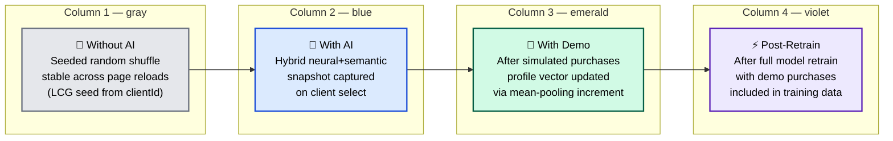


### Snapshot Orchestration

`AnalysisPanel` orchestrates snapshot capture via a **discriminated union** type (`analysisSlice` — four phases: `empty` → `initial` → `demo` → `retrained`):

```typescript
type AnalysisState =
  | { phase: 'empty' }
  | { phase: 'initial';   clientId: string; initial: Snapshot }
  | { phase: 'demo';      clientId: string; initial: Snapshot; demo: Snapshot }
  | { phase: 'retrained'; clientId: string; initial: Snapshot; demo: Snapshot; retrained: Snapshot }
```

TypeScript enforces that:

- You cannot have a `demo` snapshot without an `initial` snapshot
- You cannot have a `retrained` snapshot without `demo`
- Switching clients resets to `empty` — no stale snapshots from another client

Capture triggers:

- `initial` → captured when recommendations first load after client selection
- `demo` → captured when the cart / analysis flow updates the “with cart” snapshot (see frontend `analysisSlice`; no `demo-buy` HTTP call)
- `retrained` → captured when `useRetrainJob.status === 'done'`

### FLIP animation — catalog reorder

When clicking "✨ Sort by AI", product cards animate to their new ranked positions using the **FLIP technique** (First–Last–Invert–Play) without `flushSync` — which is an anti-pattern in React 18 Concurrent Mode:

1. **Before render:** `useLayoutEffect` captures all card DOM positions in a `prevPositionsRef: Map<key, DOMRect>`
2. **After render:** A second `useLayoutEffect` computes position deltas, applies `transform: translate(dx, dy)` synchronously (with `transition: none`), then removes the transform in the next `requestAnimationFrame`, letting CSS `transition: transform 300ms ease-out` animate to `(0, 0)`

Cards use only GPU-composited properties (`transform`, `opacity`) — zero layout thrashing during animation.

### Cart-driven profile: incremental recommendations

Adding items to the cart and refreshing recommendations:

1. The app calls `POST /api/v1/recommend/from-cart` on the `api-service` facade with `clientId` and `productIds` (cart contents)
2. The frontend proxy sends that request to the `api-service` facade, which first tries the `ai-service` route behind a dedicated circuit breaker
3. On AI success, the `ai-service` loads **non-demo** purchase embeddings from Neo4j, merges **cart product** embeddings, mean-pools them into `clientProfileVector`, then runs the same scoring path as `POST /api/v1/recommend`
4. On AI failure, the `api-service` falls back to relational ranking in PostgreSQL: top sellers in the client's country, excluding already purchased items and current cart items, while prioritizing the same categories present in the cart
5. Checkout persists real `BOUGHT` edges through the transactional outbox path into `ai-service` projections (no `is_demo` flag on that flow)

The old **demo-buy** HTTP surface was removed; optional cleanup of legacy `is_demo` edges uses `scripts/neo4j-delete-demo-bought-edges.cypher` as documented above.

### Progress bar — GPU-composited (`scaleX`)

The training progress bar uses `transform: scaleX(epoch/totalEpochs)` instead of `width` — the former is GPU-composited and never triggers layout recalculation:

```css
.progress-bar {
  transform-origin: left;
  transition: transform 300ms ease-out;
  /* transform: scaleX(0.4) for 40% progress */
}
```

`prefers-reduced-motion: reduce` is respected via `motion-safe:transition-transform` Tailwind class.

---

## State Management

The frontend uses **Zustand with domain-specific slices** instead of React Contexts:

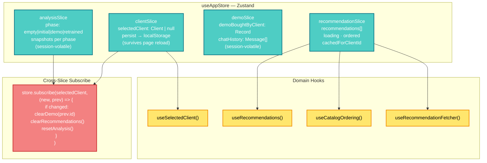


**Why Zustand over React Context:**

- `clientSlice` persists to `localStorage` — selected client survives page reload
- Cross-slice dependency (client change → clear demo state → reset analysis) is implemented via `store.subscribe()` at initialization, not via `useEffect` in components — no cascading re-renders
- No `<Provider>` wrappers in `layout.tsx` — slices compose into a single store
- Domain hooks (`useSelectedClient()`, `useRecommendations()`) abstract the store shape — components don't import `useAppStore` directly

---

## API Reference

Full OpenAPI documentation: `http://localhost:8080/swagger-ui.html`

### ai-service (:3001)

Training can use `**NEURAL_LOSS_MODE=pairwise`** (linear head + pairwise loss); default `**bce**` matches legacy BCE + sigmoid. After save, `**neural-head.json**` drives how raw neural outputs map to hybrid scores on `**/recommend**`.


| Endpoint                            | Method | Auth          | Description                                                 |
| ----------------------------------- | ------ | ------------- | ----------------------------------------------------------- |
| `/api/v1/recommend`                 | POST   | —             | Hybrid recommendation for a client                          |
| `/api/v1/recommend/from-cart`       | POST   | —             | Same scoring with profile = purchases + cart `productIds`   |
| `/api/v1/search/semantic`           | POST   | —             | Semantic product search via vector similarity               |
| `/api/v1/rag/query`                 | POST   | —             | LLM-grounded natural language product query                 |
| `/api/v1/model/train`               | POST   | `X-Admin-Key` | Trigger async neural model training → 202 + jobId           |
| `/api/v1/model/train/status/:jobId` | GET    | —             | Poll training job progress                                  |
| `/api/v1/model/status`              | GET    | —             | Model health, metrics, version history                      |
| `/api/v1/embeddings/generate`       | POST   | `X-Admin-Key` | Generate embeddings for all products                        |
| `/api/v1/events/product-upserted`   | POST   | —             | Internal: idempotent product projection upsert              |
| `/api/v1/events/order-checkout-completed` | POST | —         | Internal: idempotent checkout projection / BOUGHT sync      |


### api-service (:8080)


| Endpoint                       | Method | Description                                                          |
| ------------------------------ | ------ | -------------------------------------------------------------------- |
| `/api/v1/products`             | GET    | Paginated catalog with filters (category, country, supplier, search) |
| `/api/v1/products/{id}`        | GET    | Product detail                                                       |
| `/api/v1/products`             | POST   | Create product (writes PostgreSQL + outbox event in one transaction) |
| `/api/v1/clients`              | GET    | Client list                                                          |
| `/api/v1/clients/{id}`         | GET    | Client profile with purchase summary                                 |
| `/api/v1/clients/{id}/orders`  | GET    | Paginated order history                                              |
| `/api/v1/recommend`            | POST   | Recommendation facade to `ai-service` with circuit breaker + fallback |
| `/api/v1/recommend/from-cart`  | POST   | Cart-aware recommendation facade with circuit breaker + fallback     |
| `/api/v1/recommend/{clientId}` | GET    | Legacy compatibility endpoint mapped to the recommendation facade    |
| `/actuator/health`             | GET    | Service health                                                       |
| `/actuator/metrics`            | GET    | Micrometer metrics (latency, cache stats)                            |
| `/swagger-ui.html`             | GET    | Full OpenAPI documentation                                           |


### Quick Examples

```bash
# Hybrid recommendation
curl -X POST http://localhost:3001/api/v1/recommend \
  -H "Content-Type: application/json" \
  -d '{"clientId": "<uuid>", "limit": 10}'

# Semantic search
curl -X POST http://localhost:3001/api/v1/search/semantic \
  -H "Content-Type: application/json" \
  -d '{"query": "sugar-free beverages for corporate clients", "limit": 5}'

# RAG query
curl -X POST http://localhost:3001/api/v1/rag/query \
  -H "Content-Type: application/json" \
  -d '{"query": "What cleaning products are available in the Netherlands?"}'

# Train model (async)
curl -X POST http://localhost:3001/api/v1/model/train \
  -H "X-Admin-Key: $ADMIN_API_KEY"
# → { "jobId": "abc-123", "status": "queued" }

# Poll training progress
curl http://localhost:3001/api/v1/model/train/status/abc-123
# → { "status": "running", "epoch": 15, "totalEpochs": 30, "loss": 0.18, "eta": "8s" }

# Offline neural architecture benchmark (from repo: smart-marketplace-recommender/ai-service)
# Requires API + Neo4j with embeddings; see "Neural architecture benchmark (CLI)" in TOC
export API_SERVICE_URL=http://127.0.0.1:8080 NEO4J_URI=bolt://127.0.0.1:7687 NEO4J_USER=neo4j NEO4J_PASSWORD=password123
npm run benchmark:neural-arch -- --out ./.benchmarks/nn-arch.json
```

---

## Model Observability

`GET /api/v1/model/status` returns:

```json
{
  "status": "trained",
  "trainedAt": "2026-04-27T02:00:00.000Z",
  "staleDays": 0,
  "staleWarning": null,
  "syncedAt": "2026-04-27T01:58:00.000Z",
  "precisionAt5": 0.82,
  "finalLoss": 0.14,
  "finalAccuracy": 0.91,
  "trainingSamples": 640,
  "currentModel": "model-2026-04-27T02-00-00.json",
  "models": [
    { "filename": "model-2026-04-27T02-00-00.json", "precisionAt5": 0.82, "accepted": true },
    { "filename": "model-2026-04-26T02-00-00.json", "precisionAt5": 0.75, "accepted": true }
  ],
  "nextScheduledTraining": "2026-04-28T02:00:00.000Z"
}
```

### Why Precision@K, not Accuracy?

With 52 products and clients buying ~10 on average, the model sees ~80% negative examples. A model that always predicts "not bought" would achieve >90% accuracy. **Precision@K=5** asks: "of the 5 products the model most confidently recommends, how many did the client actually buy?" This reflects the actual use case and is robust to class imbalance.

`precisionAt5` is computed on a 20% holdout set (per client) — not on training data.

### Model Staleness

- `staleDays`: days since last training; `null` if never trained
- `staleWarning`: present when `staleDays >= 7` — suggests retraining

---

## Tech Stack Decision Summary


| Decision             | Choice                                      | Rationale                                                                                                                                                                |
| -------------------- | ------------------------------------------- | ------------------------------------------------------------------------------------------------------------------------------------------------------------------------ |
| AI service language  | TypeScript / Node.js 22                     | Course stack (`@xenova/transformers` runs HuggingFace locally; `@tensorflow/tfjs-node` for dense model); no Python overhead                                              |
| API service language | Java 21 / Spring Boot 3.3                   | Virtual Threads (Project Loom) for I/O-bound throughput; Swagger auto-gen; Actuator observability out-of-the-box                                                         |
| Graph + vector store | Neo4j 5                                     | Native vector indexes eliminate a separate vector DB (Pinecone/Weaviate); graph relationships (`BOUGHT`, `BELONGS_TO`) enable multi-hop Cypher for future RAG enrichment |
| Relational store     | PostgreSQL 16                               | Transactional data (orders, products catalog, clients)                                                                                                                   |
| Embedding model      | `all-MiniLM-L6-v2` (384d)                   | Free, local, state-of-the-art sentence embeddings; runs on CPU without GPU                                                                                               |
| LLM                  | Mistral-7B via OpenRouter                   | Zero cost (free tier); supports pt-BR and English                                                                                                                        |
| Frontend             | Next.js 14 App Router + Tailwind            | Server components for API proxying; Tailwind for rapid UI composition                                                                                                    |
| State management     | Zustand (3 slices + 1 analysis slice)       | Persistence, cross-slice subscribe, no Provider boilerplate — simpler than Redux for this scope                                                                          |
| Async training       | 202 + polling + `setImmediate`              | Non-blocking HTTP response; no external queue (Redis) needed; compatible with nightly cron                                                                               |
| Model versioning     | VersionedModelStore + symlink               | SRP preserved; `FsPort` interface keeps unit tests clean; promotion gate protects against regressions                                                                    |
| Product sync         | Virtual Thread + `java.net.http.HttpClient` | Idiomatic Java 21 servlet stack; no Reactor scheduler; observable in thread dumps                                                                                        |
| Cache                | Caffeine (5min catalog, 1min fallback)      | In-process; Micrometer integration; `CacheEvict` on write; two TTLs in one `CacheManager`                                                                                |
| Negative sampling    | N=4 + hard mining + soft exclusion          | Eliminates False Negative Contamination; MNAR-aware; equivalent to production-grade exposure-aware sampling                                                              |


---

## Dataset

Synthetic dataset — no real or proprietary data:

- **52 products** across 5 categories: `beverages`, `food`, `personal_care`, `cleaning`, `snacks`
- **3 suppliers:** fictional equivalents of Ambev, Nestlé, Unilever
- **5 countries:** BR, MX, CO, NL, RO
- **20+ clients** with realistic B2B purchase histories (5–15 orders each)
- Neo4j graph nodes: `Product`, `Client`, `Category`, `Supplier`, `Country`
- Neo4j edges: `BOUGHT {quantity, date}`, `BELONGS_TO`, `SUPPLIED_BY`, `AVAILABLE_IN`
- Seed script is idempotent — safe to run multiple times

---

## Testing


| Layer       | Framework                           | Coverage                                                                                                              |
| ----------- | ----------------------------------- | --------------------------------------------------------------------------------------------------------------------- |
| AI Service  | Vitest                              | 76 unit tests — ModelTrainer, buildTrainingDataset, soft negative filters, RecommendationService, TrainingJobRegistry |
| API Service | JUnit + Testcontainers (PostgreSQL) | Service layer unit tests + REST endpoint integration tests                                                            |
| Frontend    | Playwright E2E                      | Semantic search, hybrid recommendations, RAG chat flows                                                               |


```bash
# AI service tests
cd ai-service && npm test

# API service tests
cd api-service && ./mvnw test

# E2E tests (services must be running)
cd frontend && npx playwright test
```

---

*Capstone project — Post-graduation course: Engenharia de Software com IA Aplicada (modulo01), under Erick Wendel (Google Developer Expert, Node.js core contributor).*