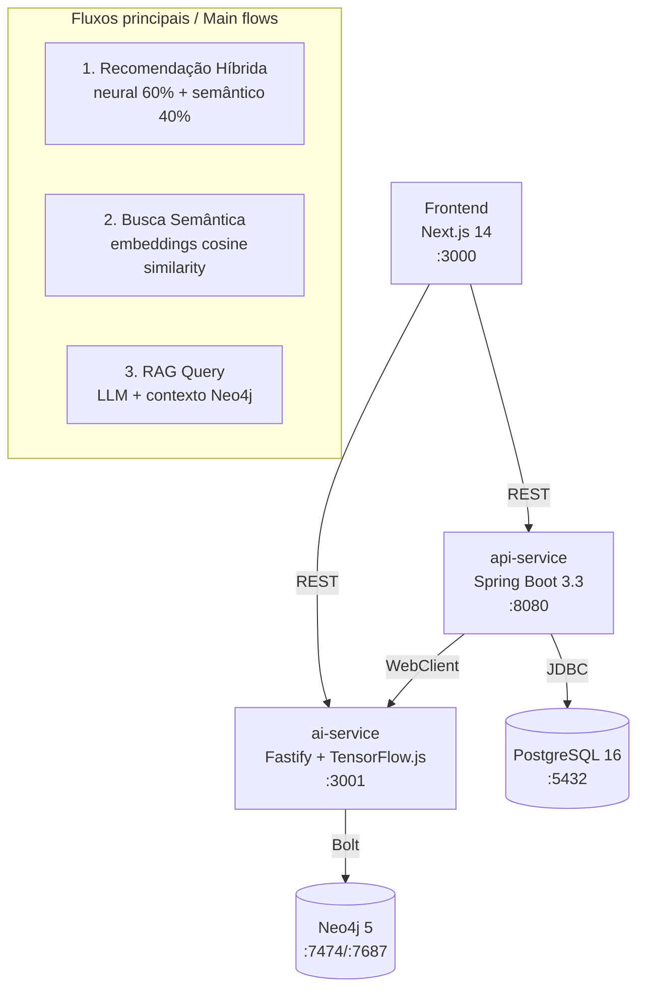

# Smart Marketplace Recommender

[](https://openjdk.org/projects/jdk/21/) [](https://spring.io/projects/spring-boot) [](https://nodejs.org/) [](https://www.typescriptlang.org/) [](https://neo4j.com/)

**Sistema de recomendação híbrido** para marketplace B2B — combina rede neural TensorFlow.js com busca semântica por embeddings e um pipeline RAG baseado em LLM. / **Hybrid recommendation system** for B2B marketplace — combines TensorFlow.js neural network with semantic embedding search and LLM-based RAG pipeline.

---

## Arquitetura / Architecture



**5 serviços Docker** / **5 Docker services**: `postgres`, `neo4j`, `api-service`, `ai-service`, `frontend`

---

## Quickstart

```bash
git clone git@github.com:gabrielgrillorosa/smart-marketplace-recommender.git
cd smart-marketplace-recommender
cp .env.example .env
docker compose up -d
open http://localhost:3000
```

O sistema está pronto quando `docker compose ps` mostrar todos os serviços como `healthy`. / The system is ready when `docker compose ps` shows all services as `healthy`.

### Gerenciando o ambiente / Managing the environment

```bash
# Parar os serviços (preserva todos os dados) / Stop services (all data preserved)
docker compose stop

# Parar e remover containers (preserva dados) / Stop and remove containers (data preserved)
docker compose down

# Reiniciar após parada / Restart after stop
docker compose up -d
```

> ⚠️ **Dados persistentes** — O modelo neural treinado, o banco PostgreSQL e o grafo Neo4j são armazenados em **volumes Docker nomeados** (`ai-model-data`, `postgres_data`, `neo4j_data`). Eles **sobrevivem** ao `docker compose down`.
>
> Use `docker compose down -v` **apenas** se quiser resetar completamente o ambiente — esse comando apaga o modelo treinado, todos os dados do banco e o grafo. Será necessário re-executar o seed e re-treinar o modelo.
>
> **Persistent data** — The trained neural model, PostgreSQL database, and Neo4j graph are stored in **named Docker volumes** (`ai-model-data`, `postgres_data`, `neo4j_data`). They **survive** `docker compose down`.
>
> Use `docker compose down -v` **only** if you want a full environment reset — this deletes the trained model, all database data, and the graph. You will need to re-run the seed and re-train the model.

---

## Decisões Técnicas / Tech Decisions

### TypeScript para o AI Service

O curso de pós-graduação *Engenharia de Software com IA Aplicada* é TypeScript-first. `@xenova/transformers` fornece embeddings HuggingFace locais sem custo de API; `@tensorflow/tfjs-node` suporta a rede neural densa necessária. Uma camada Python adicionaria fricção sem benefício técnico para este escopo. → [D-001]

### Java 21 / Spring Boot 3.3 para o API Service

Principal expertise do autor; Spring Boot 3.3 com Virtual Threads (Project Loom) fornece performance próxima a Go para workloads I/O-bound. Springdoc OpenAPI gera Swagger UI automaticamente. Spring Actuator + Micrometer: observabilidade de produção out-of-the-box. → [D-002]

### Neo4j como Graph + Vector Store unificado

Neo4j 5.x com índices vetoriais nativos elimina a necessidade de um banco vetorial separado (Pinecone/Weaviate). A estrutura de grafo (`:BOUGHT`, `:BELONGS_TO`, `:AVAILABLE_IN`) habilita recuperação futura por multi-hop Cypher. → [D-003]

---

## API Reference

Swagger UI completo em: `http://localhost:8080/swagger-ui.html`

### Recomendação Híbrida

```bash
curl -X POST http://localhost:3001/api/v1/recommend \
  -H "Content-Type: application/json" \
  -d '{"clientId": "<uuid>", "limit": 10}'
```

Resposta: array de produtos com `finalScore` (0.6 × neural + 0.4 × semântico), `neuralScore`, `semanticScore`, `matchReason` (`neural` | `semantic` | `hybrid`).

### RAG Query

```bash
curl -X POST http://localhost:3001/api/v1/rag/query \
  -H "Content-Type: application/json" \
  -d '{"query": "Quais bebidas você recomenda para o verão?"}'
```

### Busca Semântica

```bash
curl -X POST http://localhost:3001/api/v1/search/semantic \
  -H "Content-Type: application/json" \
  -d '{"query": "bebida refrescante com baixo teor de sódio", "limit": 5}'
```

---

## Exemplos RAG / RAG Samples

### Consulta 1 — pt-BR

**Entrada:** `"Quais bebidas você recomenda para dias quentes?"`

**Saída:**
```json
{
  "answer": "Com base no catálogo, recomendamos a Água Mineral Premium (SKU-0042) e o Suco de Laranja Natural (SKU-0078). Ambos são refrescantes, estão disponíveis no Brasil e têm alta pontuação de similaridade semântica com sua consulta.",
  "sources": [
    { "id": "prod-0042", "name": "Água Mineral Premium", "score": 0.94 },
    { "id": "prod-0078", "name": "Suco de Laranja Natural", "score": 0.87 }
  ]
}
```

### Consulta 2 — pt-BR

**Entrada:** `"Produtos de limpeza para escritório"`

**Saída:**
```json
{
  "answer": "Para limpeza de escritório, o catálogo oferece o Desinfetante Multiuso Pro (SKU-0115) e o Álcool em Gel 70% (SKU-0123). Estes produtos são amplamente disponíveis e têm avaliação excelente no segmento B2B.",
  "sources": [
    { "id": "prod-0115", "name": "Desinfetante Multiuso Pro", "score": 0.91 },
    { "id": "prod-0123", "name": "Álcool em Gel 70%", "score": 0.85 }
  ]
}
```

### Query 3 — English

**Input:** `"High protein snacks for corporate clients"`

**Output:**
```json
{
  "answer": "For high-protein corporate snacks, we recommend Premium Mixed Nuts (SKU-0201) and Protein Bar Assorted (SKU-0212). Both are available across all supported countries and have strong semantic match scores.",
  "sources": [
    { "id": "prod-0201", "name": "Premium Mixed Nuts", "score": 0.89 },
    { "id": "prod-0212", "name": "Protein Bar Assorted", "score": 0.83 }
  ]
}
```

---

## Observabilidade do Modelo / Model Observability

### Quando retreinar / When to retrain

O endpoint `GET /api/v1/model/status` retorna:

```json
{
  "status": "trained",
  "trainedAt": "2026-04-20T14:30:00.000Z",
  "staleDays": 5,
  "staleWarning": "Model trained 5 days ago — consider retraining",
  "syncedAt": "2026-04-20T14:28:00.000Z",
  "precisionAt5": 0.72,
  "finalLoss": 0.12,
  "finalAccuracy": 0.93,
  "trainingSamples": 1040
}
```

- **`staleDays`**: dias desde o último treino. `null` quando o modelo não foi treinado.
- **`staleWarning`**: presente quando `staleDays >= 7`. Indica que o modelo pode estar desatualizado.
- **`syncedAt`**: timestamp do último sincronismo de relações `:BOUGHT` no Neo4j.
- **`precisionAt5`**: Precision@K=5 calculado no conjunto de validação holdout (20% das compras por cliente). Métrica preferida a `accuracy` para datasets desbalanceados.

Para retreinar: `curl -X POST http://localhost:3001/api/v1/model/train`

### Por que Precision@K e não Accuracy?

Em um catálogo com 52 produtos e clientes comprando em média 10, o modelo vê ~80% de exemplos negativos. `accuracy` seria >90% mesmo prevendo sempre "não comprar". **Precision@K=5** mede: "dos 5 produtos que o modelo mais recomenda, quantos o cliente realmente comprou?". Isso reflete o caso de uso real.

---

## English Version

### Overview

Smart Marketplace Recommender is a portfolio project demonstrating a production-grade B2B e-commerce recommendation system. It combines:

- **Hybrid AI recommendations**: 60% neural network score (TensorFlow.js dense model) + 40% semantic score (cosine similarity between client profile embedding and product embeddings)
- **Semantic search**: Vector similarity search using Neo4j native vector indexes and HuggingFace local embeddings
- **RAG pipeline**: LangChain + OpenRouter LLM with Neo4j as vector store for grounded product recommendations

### Architecture Decision Summary

| Decision | Choice | Rationale |
|----------|--------|-----------|
| AI service language | TypeScript / Node.js | Course stack; `@xenova/transformers` runs HuggingFace locally; no Python overhead |
| API service language | Java 21 / Spring Boot 3.3 | Author's primary expertise; Virtual Threads; Swagger auto-gen; Actuator observability |
| Database | PostgreSQL + Neo4j | PostgreSQL for transactional data; Neo4j for graph relationships + vector search in one service |
| Neural model input | `[product_embedding (384) || client_profile (384)]` = 768 dims | Client profile = mean pooling of purchased product embeddings |
| Scoring formula | `0.6 × neural + 0.4 × semantic` | Neural weight higher (purchase behavior signal); semantic handles cold-start |

### API Quick Reference

| Endpoint | Method | Service | Description |
|----------|--------|---------|-------------|
| `/api/v1/recommend` | POST | ai-service:3001 | Hybrid recommendation for a client |
| `/api/v1/search/semantic` | POST | ai-service:3001 | Semantic product search |
| `/api/v1/rag/query` | POST | ai-service:3001 | LLM-grounded product query |
| `/api/v1/model/train` | POST | ai-service:3001 | Trigger neural model training |
| `/api/v1/model/status` | GET | ai-service:3001 | Model health + staleDays + Precision@K |
| `/api/v1/products` | GET | api-service:8080 | Paginated product catalog |
| `/api/v1/clients` | GET | api-service:8080 | Client list |
| `/api/v1/clients/{id}/orders` | GET | api-service:8080 | Client orders |
| `/swagger-ui.html` | GET | api-service:8080 | Full OpenAPI documentation |

### Model Training & Quality

After `docker compose up`, run:

```bash
# Generate embeddings for all products
curl -X POST http://localhost:3001/api/v1/embeddings/generate

# Train neural model (takes ~30s with synthetic dataset)
curl -X POST http://localhost:3001/api/v1/model/train

# Check model quality
curl http://localhost:3001/api/v1/model/status
```

Model persists in the `ai-model-data` Docker volume — survives container restarts.
