# Smart Marketplace Recommender

[](https://openjdk.org/projects/jdk/21/) [](https://spring.io/projects/spring-boot) [](https://nodejs.org/) [](https://www.typescriptlang.org/) [](https://www.tensorflow.org/js) [](https://neo4j.com/) [](https://nextjs.org/)

A **production-grade hybrid AI recommendation system** for B2B marketplaces — combining a TensorFlow.js neural network with semantic embedding search and an LLM-based RAG pipeline. Fully Dockerized, zero-cost to run, and designed to demonstrate the complete machine learning lifecycle: dataset construction, training, inference, live demo buying, and visible retraining with before/after comparison.

---

## Table of Contents

- [Overview](#overview)
- [System Architecture](#system-architecture)
- [Quickstart](#quickstart)
- [Neural Network Architecture](#neural-network-architecture)
- [Dataset Construction & Training Quality](#dataset-construction--training-quality)
- [Hybrid Scoring Engine](#hybrid-scoring-engine)
- [RAG Pipeline](#rag-pipeline)
- [Service Communication Patterns](#service-communication-patterns)
- [Async Training: 202 + Polling Pattern](#async-training-202--polling-pattern)
- [Model Versioning & Rollback](#model-versioning--rollback)
- [Production-Grade Patterns](#production-grade-patterns)
- [Frontend: 4-State AI Learning Showcase](#frontend-4-state-ai-learning-showcase)
- [State Management](#state-management)
- [API Reference](#api-reference)
- [Model Observability](#model-observability)
- [Tech Stack Decision Summary](#tech-stack-decision-summary)
- [Architecture Decision Records](#architecture-decision-records)

---

## Overview

Smart Marketplace Recommender solves the cold-start and relevance problems in B2B marketplace recommendation — where traditional collaborative filtering fails because purchase history is sparse and product descriptions matter as much as behavioral patterns.

The system combines three complementary signals:

| Signal | Source | Weight |
|--------|--------|--------|
| Neural purchase behavior | TF.js dense model trained on purchase history | 60% |
| Semantic similarity | Cosine similarity of HuggingFace embeddings | 40% |
| Natural language | LLM-grounded RAG over Neo4j vector store | — |

The frontend demonstrates the **full ML lifecycle** in a single interactive session: select a client → see initial recommendations → simulate purchases → observe real-time profile update → trigger full model retrain → compare before/after quality metrics.

---

## System Architecture

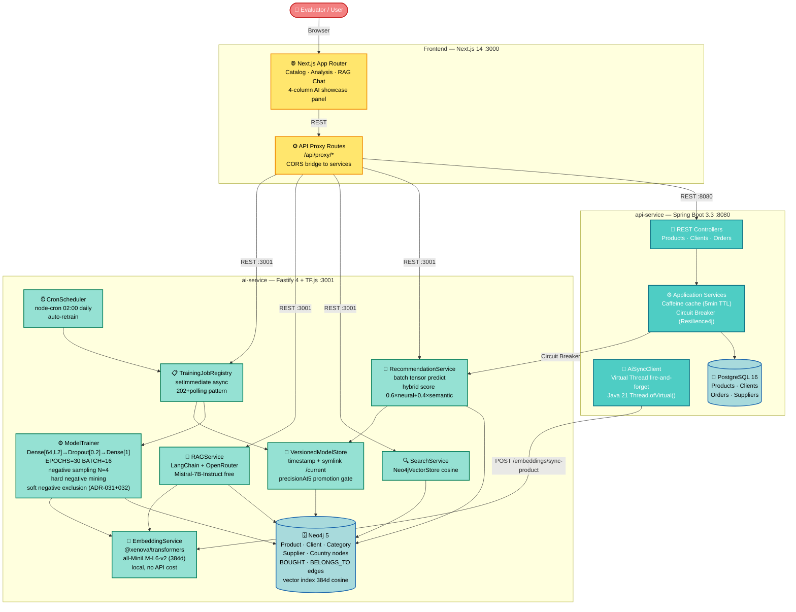

**5 Docker services:** `postgres`, `neo4j`, `api-service`, `ai-service`, `frontend` — all with health checks. `ai-service` health is readiness-based (`/ready`), and `api-service` waits for `ai-service` startup (`service_started`) to avoid compose startup cycles while AI self-healing runs.

> **Cold-start self-sufficient:** `docker compose up` on a completely empty environment (including `docker compose down -v`) automatically seeds both databases, generates embeddings, trains the model, and reaches `/ready = 200` — no manual intervention required. See [boot flow diagram](docs/diagrams/cold-start-boot-flow.md).

---

## Quickstart

```bash
git clone git@github.com:gabrielgrillorosa/smart-marketplace-recommender.git
cd smart-marketplace-recommender
cp .env.example .env
docker compose up -d
```

The system is ready when `docker compose ps` shows all services as `healthy`.

**The system is fully self-sufficient on any clean startup:**
- On first boot (empty volumes), `ai-service` automatically seeds PostgreSQL and Neo4j, then generates embeddings and trains the model — no manual seed command required.
- On subsequent boots (volumes present), seeding is skipped and the existing model is reloaded in seconds.

```bash
# Track cold-start progress
docker compose logs -f ai-service
# Look for: [AutoSeed] complete → generateEmbeddings → training complete → /ready = 200
```

```bash
# Open the demo UI
xdg-open http://localhost:3000 2>/dev/null || open http://localhost:3000
```

> **Persistent data** — The trained neural model, PostgreSQL database, and Neo4j graph are stored in named Docker volumes (`ai-model-data`, `postgres_data`, `neo4j_data`). They survive `docker compose down`. Use `docker compose down -v` **only** for a full environment reset.

### Managing the environment

```bash
docker compose stop          # Stop services, preserve all data
docker compose down          # Stop and remove containers, preserve volumes
docker compose up -d         # Restart after stop
docker compose down -v       # Full reset — deletes model, data, and graph
```

### Startup Self-Healing Flow (M12 + ADR-052)

The complete boot sequence handles both cold-start (empty databases) and warm-start (existing data):

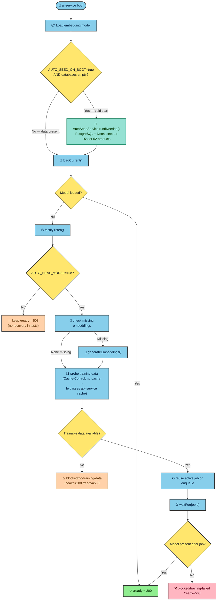

> Full sequence with timing details: [docs/diagrams/cold-start-boot-flow.md](docs/diagrams/cold-start-boot-flow.md)

---

## Neural Network Architecture

### Model Design

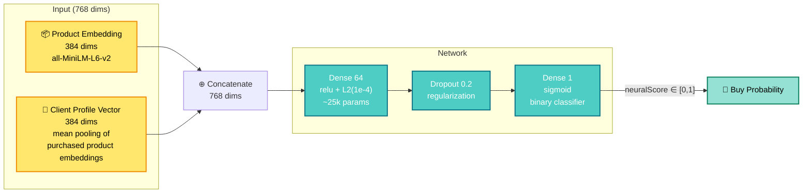

**Architecture decisions (ADR-028):**

- **Reduced architecture** — moved from `Dense[256→128→64→1]` (~65k params) to `Dense[64→1]` (~25k params). The previous ratio of ~60:1 (params:samples) caused severe overfitting; the new ~39:1 ratio with L2 regularization enables genuine generalization.
- **L2 regularization** `1e-4` on the dense layer — prevents memorization of the small synthetic dataset.
- **Dropout 0.2** — additional regularization guard.
- **EPOCHS=30, BATCH_SIZE=16** — compensates for the smaller dataset produced by selective negative sampling.
- **classWeight `{0: 1.0, 1: 4.0}`** — the dataset has ~1:4 positive:negative ratio after sampling. Without compensation, the network minimizes loss by predicting "not bought" for everything. The 4× weight on positives forces the gradient to prioritize purchase signals.
- **Early stopping patience=5** — halts training when validation loss stops improving, avoiding wasted epochs.

### Client Profile Vector

Each client is represented as the **mean pooling** of all purchased product embeddings:

```
clientProfileVector = mean([embed(product_1), embed(product_2), ..., embed(product_n)])
```

This creates a dense 384-dimensional representation of the client's taste in embedding space — far more expressive than one-hot encoding. Purchasing a new product incrementally shifts the profile vector in the direction of that product's semantic neighborhood.

### Batch Prediction (ADR-007)

All candidate products are scored in a **single TF.js forward pass** using batched tensor operations:

```typescript
// One predict call for all candidates — not N serial calls
const batchTensor = tf.tensor2d(allVectors, [candidates.length, 768])
const scores = model.predict(batchTensor) as tf.Tensor
const scoreArray = scores.dataSync()  // Float32Array, sync-safe in tfjs-node
```

This reduces recommendation latency from ~500ms–2s (serial) to ~20–50ms (batched) for a typical 30–100 product candidate pool.

### Atomic Model Swap (ADR-006)

`ModelStore` is the single source of truth for the trained model in memory. Training completes fully before `setModel()` is called — a single synchronous JavaScript reference assignment that is atomic in the Node.js event loop. In-flight `/recommend` requests hold the old model reference for their duration via closure; the next request picks up the new model. Zero-downtime model replacement with no mutex needed.

---

## Dataset Construction & Training Quality

The training dataset is built by `buildTrainingDataset()` — a pure function in `training-utils.ts` that applies four layers of quality control before a single sample reaches the model.

### Negative Sampling Pipeline (ADR-027 + ADR-031 + ADR-032)

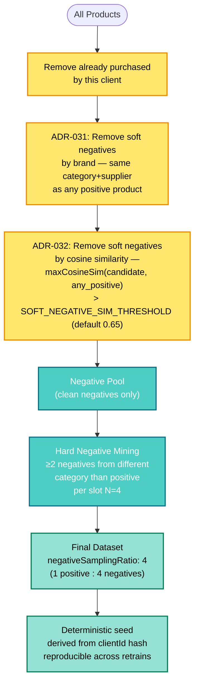

### Why Soft Negative Exclusion Matters

**The problem (False Negative Contamination):** Suppose a client buys 3 products from `food/Unilever`. The model sees `Knorr Pasta Sauce` (also `food/Unilever`, not yet purchased) as a "negative example." With `classWeight: {0:1, 1:4}`, the amplified gradient teaches the network to actively predict against `food/Unilever` products. After retraining, `Knorr Pasta Sauce` score drops from 64% → 42% — the opposite of the desired learning signal.

This is formally known as **False Negative Contamination**, documented in ANCE (Approximate Nearest Neighbor Negative Contrastive Estimation) and Debiased Contrastive Learning (NeurIPS 2020). The same exclusion practice is used in YouTube (2016, impression-based negatives), Pinterest (in-batch negatives), and Amazon (BERT4Rec).

**Two complementary filters are applied additively:**

**ADR-031 — Exclusion by (category + supplier):** Deterministic, zero-hyperparameter. Products sharing `category AND supplierName` with any purchased product are excluded from the negative pool. O(1) lookup per candidate.

```typescript
const positiveCategorySupplierPairs = new Set(
  positiveProducts.map(p => `${p.category}::${p.supplierName}`)
)
const softPositiveIdsByBrand = new Set(
  candidates.filter(p =>
    positiveCategorySupplierPairs.has(`${p.category}::${p.supplierName}`)
  ).map(p => p.id)
)
```

**ADR-032 — Exclusion by cosine similarity (ANCE-simplified):** Catches products from different suppliers in the same category that are semantically close in embedding space (e.g., `food/Nestlé` after purchases of `food/Unilever` — soups, sauces, and broths share similar descriptions). If `maxCosineSimilarity(candidate, any_positive) > SOFT_NEGATIVE_SIM_THRESHOLD`, the candidate is excluded.

```typescript
const threshold = parseFloat(process.env.SOFT_NEGATIVE_SIM_THRESHOLD ?? '0.65')
const softPositiveIdsBySimilarity = new Set(
  candidatesAfterBrandFilter.filter(candidate => {
    const cEmb = productEmbeddingMap.get(candidate.id)!
    return positiveProducts.some(pos =>
      cosineSimilarity(cEmb, productEmbeddingMap.get(pos.id)!) > threshold
    )
  }).map(p => p.id)
)
```

`SOFT_NEGATIVE_SIM_THRESHOLD` is an env var (default `0.65`) — adjustable to demonstrate pedagogically that **data quality hyperparameters have the same impact as model hyperparameters**.

### Hard Negative Mining (ADR-027)

After soft negative exclusion, at least 2 of the 4 negative slots per positive are filled with products from **different categories** than the positive. This forces the network to learn inter-category discrimination — without it, category-specific purchase signals (e.g., "client likes beverages") are diluted by unrelated negatives.

### Deterministic Seed

The negative sampling seed is derived from the `clientId` hash. Every retrain with the same data produces identical datasets per client — making before/after comparisons reproducible and demo behavior predictable.

---

## Hybrid Scoring Engine

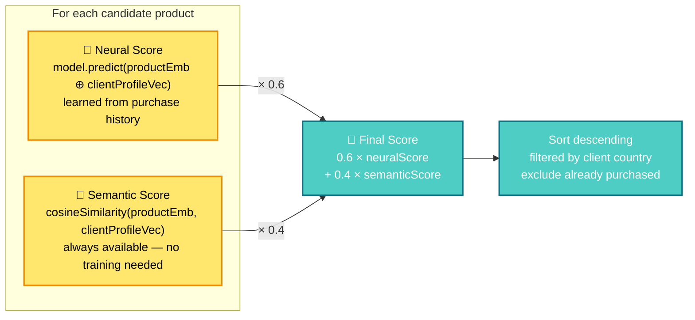

**Why hybrid is better than neural-only (ADR-016, validated by Technical Committee):**

| Scenario | Neural Only | Hybrid |
|----------|-------------|--------|
| Small / sparse dataset | ❌ High variance, overfitting | ✅ Semantic anchors predictions |
| Cold start (1–2 purchases) | ❌ Unstable profile vector | ✅ Semantic compensates |
| New product added post-training | ❌ Score ≈ 0 (unseen) | ✅ Embedding captures meaning |
| Container restart | ❌ Depends on saved model | ✅ Semantic is deterministic |
| Interpretability | ❌ Black box | ✅ `matchReason` exposes origin |

Weights are configurable via `NEURAL_WEIGHT` and `SEMANTIC_WEIGHT` env vars. The current 60/40 split was evaluated by a three-expert committee using Tree-of-Thought + Self-Consistency reasoning.

**`matchReason` field** in recommendation responses tells the client which signal dominated: `neural` | `semantic` | `hybrid`.

---

## RAG Pipeline

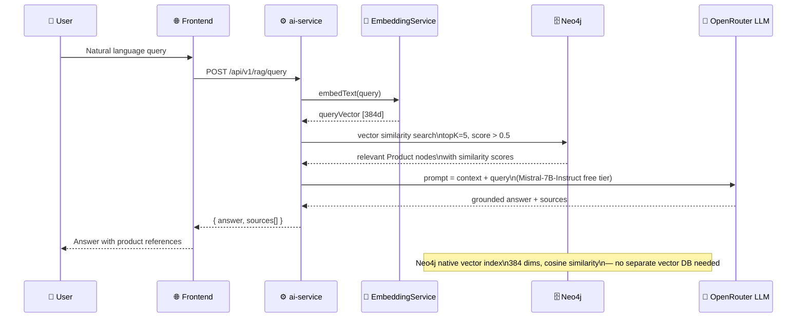

- **Embedding model:** `sentence-transformers/all-MiniLM-L6-v2` via `@xenova/transformers` — runs fully locally, zero API cost
- **Vector store:** Neo4j 5 native vector indexes — graph relationships and vector search in one database, no Pinecone/Weaviate needed
- **LLM:** OpenRouter free tier (`mistralai/mistral-7b-instruct:free`) — zero cost
- **Prompt engineering:** Grounded answers only; explicit "not found" response when context is insufficient; supports pt-BR and English

---

## Service Communication Patterns

### Inter-Service Call Map

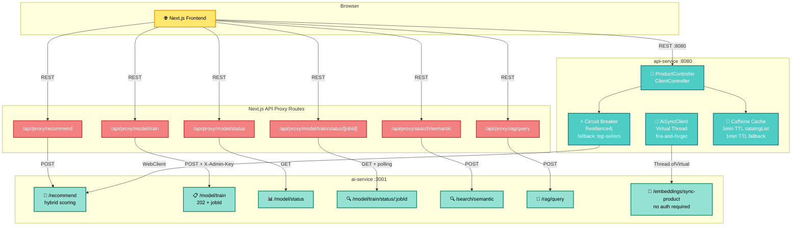

### Circuit Breaker — API Service → AI Service (Resilience4j)

The `api-service` recommendation proxy (`GET /api/v1/recommend/{clientId}`) wraps the call to `ai-service` with a **Resilience4j circuit breaker**. If `ai-service` is unavailable or slow, the fallback returns top-selling products by country from a short-TTL Caffeine cache (1-minute TTL), ensuring the API never returns an error to the frontend due to AI service downtime.

### Fire-and-Forget Product Sync — Java Virtual Threads (ADR-015)

When a new product is created via `POST /api/v1/products`, the `api-service` must notify the `ai-service` to create the Neo4j node and generate its embedding — without blocking the 201 response.

**Choice: `Thread.ofVirtual()` (Java 21) over Reactor `WebClient.subscribe()`**

```java
public void notifyProductCreated(ProductDetailDTO product) {
    Thread.ofVirtual()
        .name("ai-sync-" + product.id())
        .start(() -> {
            try {
                // POST /embeddings/sync-product
                httpClient.send(request, HttpResponse.BodyHandlers.discarding());
            } catch (Exception e) {
                log.warn("[AiSync] failed for productId={}: {}", product.id(), e.getMessage());
            }
        });
}
```

Why not Reactor: this is a servlet-stack project. Using `.subscribe()` would mix two threading models at a call site that reads synchronously to the developer (CUPID-I violation). Virtual threads are semantically obvious, visible in thread dumps via JFR/VisualVM, and testable with standard Mockito — no `CountDownLatch` tricks needed.

### Caffeine In-Memory Cache — API Service (ADR-003)

Programmatic `CaffeineCacheManager` configuration with two named caches and different TTLs:

| Cache | TTL | Key dimensions | Eviction |
|-------|-----|----------------|---------|
| `catalogList` | 5 min | page + size + category + country + supplier + search | `@CacheEvict(allEntries=true)` on product create |
| `fallbackRecommendations` | 1 min | country | Independent — circuit breaker fallback |

`recordStats()` enabled — cache hit/miss rates exposed automatically via Micrometer at `/actuator/metrics`.

### Training Read Cache Bypass (ADR-052)

`ModelTrainer` always sends `Cache-Control: no-cache` when fetching training data from `api-service`.
This prevents cold-start cache poisoning: if `api-service` became healthy before the seed completed,
it could cache an empty product list for 5 minutes — starving the training pipeline.

The `api-service` side wires the header into the `@Cacheable` condition:

```java
// ProductController — reads Cache-Control header
boolean noCache = isCacheBypass(cacheControl);   // true for "no-cache" or "no-store"
productService.listProducts(..., noCache);

// ProductApplicationService — @Cacheable is skipped when noCache=true
@Cacheable(value = "catalogList", condition = "!#noCache")
public PagedResponse<ProductSummaryDTO> listProducts(..., boolean noCache) { ... }
```

The public catalog path (`noCache=false`) retains full caching. Internal training reads always hit
PostgreSQL directly and are never stored in Caffeine.

### Next.js Proxy Routes — CORS Bridge

The `ai-service` is not directly accessible from the browser. All AI calls from the frontend go through Next.js API Route handlers (`app/api/proxy/*`) that forward the request server-side. This also allows injecting the `X-Admin-Key` header from server-only env vars without exposing it to the browser.

---

## Async Training: 202 + Polling Pattern

Training a neural model can take 12–60 seconds. Synchronous HTTP responses would time out across proxies. The system implements the **202 Accepted + job polling** pattern (ADR-012):

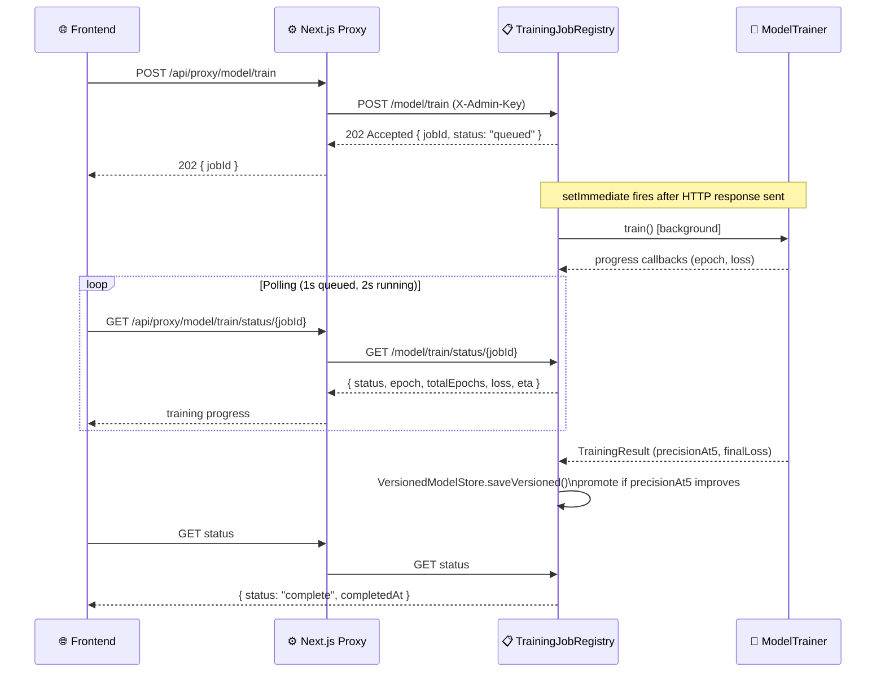

**Key implementation details:**

- `POST /model/train` returns `202` immediately with a `jobId` — HTTP response is sent before training starts
- `setImmediate(() => _runJob(jobId))` fires the training after the current event loop turn (after the response is flushed)
- `isTraining` guard is checked **inside** `setImmediate`, not at enqueue time — closes the race window between cron timer fire and actual job start
- `409 Conflict` if a training job is already in progress
- Job history capped at 20 entries in-memory (`MAX_JOBS = 20`)
- Frontend `useRetrainJob` hook uses **adaptive polling**: 1-second interval while `status === "queued"`, 2-second interval during `running` — stops after 3 consecutive poll failures (`consecutiveErrors` circuit breaker)

### Admin Key Security (ADR-014)

Admin-protected endpoints (`POST /model/train`, `POST /embeddings/generate`) are wrapped in a **scoped Fastify plugin** with a single `addHook('onRequest', adminKeyHook)` that applies only within the plugin's encapsulation scope. The internal `POST /embeddings/sync-product` endpoint (called by api-service, not the browser) is registered outside the plugin — zero whitelist maintenance needed when adding new internal endpoints.

```
X-Admin-Key: $ADMIN_API_KEY    → 200 OK
X-Admin-Key: wrong             → 401 Unauthorized
(no header)                    → 401 Unauthorized
```

---

## Model Versioning & Rollback

`VersionedModelStore` extends `ModelStore` with filesystem-backed versioning (ADR-013):

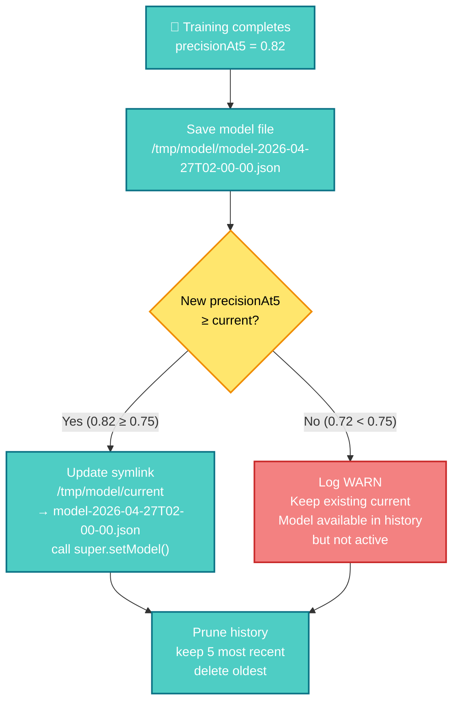

- **Promotion gate:** A new model only becomes `current` if its `precisionAt5` is ≥ the previous model's. Regressions are saved to history but never deployed.
- **Startup recovery (M12):** after startup, if model is missing and `AUTO_HEAL_MODEL=true`, `StartupRecoveryService` runs in background, generates only missing embeddings, probes trainable data, and reuses or enqueues training via `TrainingJobRegistry.waitFor()`.
- **Readiness contract:** `/health` stays liveness-only (`200`), while `/ready` is `200` only when `embeddingService.isReady && modelStore.getModel() !== null && !startupRecoveryService.isBlockingReadiness()`.
- **Blocked semantics:** if seed/training data is missing, service remains alive with `/ready=503` and explicit blocked reason in logs (no crash, no tight retry loop).
- **Docker persistence:** The `ai-model-data` volume preserves trained models across container restarts and `docker compose down`.
- **History:** `GET /api/v1/model/status` returns the last 5 model versions with timestamps and metrics.
- **FsPort interface:** All filesystem operations (`symlink`, `unlink`, `readdir`, `stat`, `mkdir`) go through an injected `FsPort` interface — the production implementation uses `node:fs/promises`; tests use `vi.fn()` mocks.

### Nightly Retraining

`CronScheduler` registers a `node-cron` job that fires every day at 02:00:

```
cron: "0 2 * * *"
```

It calls `TrainingJobRegistry.enqueue()` inside `setImmediate` — never blocks the Fastify event loop. If training is already in progress at cron trigger time, the job is skipped with a log warning. `GET /model/status` exposes `nextScheduledTraining` (ISO datetime) from `cronScheduler.getNextExecution()`.

---

## Production-Grade Patterns

### TensorFlow.js Async Boundary (ADR-008)

`tf.tidy()` does not support async operations. All I/O (Neo4j queries, HTTP calls) completes **before** entering the TF.js tensor computation block. This prevents tensor memory leaks from async calls that escape the tidy scope:

```typescript
// All async I/O done before tf.tidy()
const [clientEmbeddings, candidateProducts] = await Promise.all([
  repo.getClientPurchasedEmbeddings(clientId),
  repo.getCandidateProducts(clientId, country)
])

// Synchronous tensor operations inside tidy()
const scores = tf.tidy(() => {
  const batchTensor = tf.tensor2d(allVectors, [n, 768])
  const predictions = model.predict(batchTensor) as tf.Tensor
  return Array.from(predictions.dataSync())
})
```

### Unified Neo4j Transaction for Demo Buy (ADR-021)

`POST /demo-buy` must create the `BOUGHT` edge **and** read all embeddings for profile recalculation in one step. Using two separate sessions creates a timing gap where the new edge may not be visible to the subsequent read — a race condition.

The solution: a single `session.executeWrite()` transaction that writes the edge and returns the embeddings in the same commit scope. The Neo4j driver provides automatic retry on deadlock.

### Neo4j Driver Singleton

The Neo4j driver is instantiated once at startup and shared across all repository methods. Each method opens a session, executes the query, and closes the session in a `finally` block — avoiding connection leaks while reusing the driver's internal connection pool.

### Custom Error with statusCode

Services define typed errors:

```typescript
export class ModelNotTrainedError extends Error {
  readonly statusCode = 503
}
export class ClientNotFoundError extends Error {
  readonly statusCode = 404
}
```

Route handlers do a single `instanceof` check and use `error.statusCode` for the HTTP response — no `switch/case` sprawl.

### Observability

| Layer | Tool | Metrics |
|-------|------|---------|
| API Service | Spring Actuator + Micrometer | Request latency, cache hit rate, AI service call duration |
| Caffeine cache | `recordStats()` | `cache.gets`, `cache.puts` auto-exposed |
| Model status | `GET /model/status` | `precisionAt5`, `finalLoss`, `staleDays`, `trainingSamples` |
| Nightly cron | `GET /api/v1/cron/status` | `nextScheduledTraining` |
| Admin audit | Structured logs | Virtual thread name `ai-sync-{productId}` visible in JFR |

---

## Frontend: 4-State AI Learning Showcase

The Analysis tab demonstrates the complete ML learning cycle with four side-by-side recommendation columns, each capturing a snapshot at a different phase:

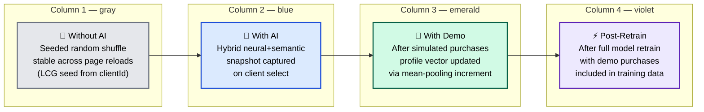

### Snapshot Orchestration

`AnalysisPanel` orchestrates snapshot capture via a **discriminated union** type (`analysisSlice`, ADR-029):

```typescript
type AnalysisState =
  | { phase: 'empty' }
  | { phase: 'initial';   clientId: string; initial: Snapshot }
  | { phase: 'demo';      clientId: string; initial: Snapshot; demo: Snapshot }
  | { phase: 'retrained'; clientId: string; initial: Snapshot; demo: Snapshot; retrained: Snapshot }
```

TypeScript enforces that:
- You cannot have a `demo` snapshot without an `initial` snapshot
- You cannot have a `retrained` snapshot without `demo`
- Switching clients resets to `empty` — no stale snapshots from another client

Capture triggers:
- `initial` → captured when recommendations first load after client selection
- `demo` → captured after any `POST /demo-buy` (detected via `demoSlice` store subscription)
- `retrained` → captured when `useRetrainJob.status === 'done'`

### FLIP Animation — Catalog Reorder (ADR-017)

When clicking "✨ Sort by AI", product cards animate to their new ranked positions using the **FLIP technique** (First–Last–Invert–Play) without `flushSync` — which is an anti-pattern in React 18 Concurrent Mode:

1. **Before render:** `useLayoutEffect` captures all card DOM positions in a `prevPositionsRef: Map<key, DOMRect>`
2. **After render:** A second `useLayoutEffect` computes position deltas, applies `transform: translate(dx, dy)` synchronously (with `transition: none`), then removes the transform in the next `requestAnimationFrame`, letting CSS `transition: transform 300ms ease-out` animate to `(0, 0)`

Cards use only GPU-composited properties (`transform`, `opacity`) — zero layout thrashing during animation.

### Live Demo Buy: Incremental Profile Update

Clicking "🛒 Demo Buy" on a product card:

1. Calls `POST /api/v1/demo-buy` on `ai-service`
2. The AI service executes a **unified Neo4j write+read transaction** (ADR-021): creates `(:Client)-[:BOUGHT {is_demo: true}]->(:Product)` and returns all purchased embeddings in the same commit
3. Recalculates `clientProfileVector` via mean-pooling increment (~180–350ms total)
4. Returns fresh recommendations with the updated profile
5. Frontend animates the catalog reorder via FLIP
6. "↩ Undo" calls `DELETE /api/v1/demo-buy` to remove `is_demo: true` edges and restore the original profile

### Progress Bar — GPU-Composited (ADR-024)

The training progress bar uses `transform: scaleX(epoch/totalEpochs)` instead of `width` — the former is GPU-composited and never triggers layout recalculation:

```css
.progress-bar {
  transform-origin: left;
  transition: transform 300ms ease-out;
  /* transform: scaleX(0.4) for 40% progress */
}
```

`prefers-reduced-motion: reduce` is respected via `motion-safe:transition-transform` Tailwind class.

---

## State Management

The frontend uses **Zustand with domain-specific slices** (ADR-019) instead of React Contexts:

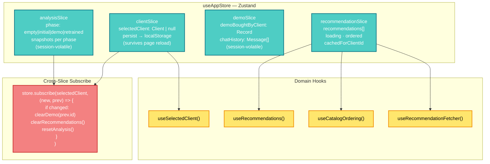

**Why Zustand over React Context:**
- `clientSlice` persists to `localStorage` — selected client survives page reload
- Cross-slice dependency (client change → clear demo state → reset analysis) is implemented via `store.subscribe()` at initialization, not via `useEffect` in components — no cascading re-renders
- No `<Provider>` wrappers in `layout.tsx` — slices compose into a single store
- Domain hooks (`useSelectedClient()`, `useRecommendations()`) abstract the store shape — components don't import `useAppStore` directly

---

## API Reference

Full OpenAPI documentation: `http://localhost:8080/swagger-ui.html`

### ai-service (:3001)

| Endpoint | Method | Auth | Description |
|----------|--------|------|-------------|
| `/api/v1/recommend` | POST | — | Hybrid recommendation for a client |
| `/api/v1/search/semantic` | POST | — | Semantic product search via vector similarity |
| `/api/v1/rag/query` | POST | — | LLM-grounded natural language product query |
| `/api/v1/model/train` | POST | `X-Admin-Key` | Trigger async neural model training → 202 + jobId |
| `/api/v1/model/train/status/:jobId` | GET | — | Poll training job progress |
| `/api/v1/model/status` | GET | — | Model health, metrics, version history |
| `/api/v1/embeddings/generate` | POST | `X-Admin-Key` | Generate embeddings for all products |
| `/api/v1/embeddings/sync-product` | POST | — | Internal: sync single product to Neo4j + generate embedding |
| `/api/v1/demo-buy` | POST | — | Create demo purchase edge + recalculate profile |
| `/api/v1/demo-buy` | DELETE | — | Remove demo purchases + restore original profile |

### api-service (:8080)

| Endpoint | Method | Description |
|----------|--------|-------------|
| `/api/v1/products` | GET | Paginated catalog with filters (category, country, supplier, search) |
| `/api/v1/products/{id}` | GET | Product detail |
| `/api/v1/products` | POST | Create product (triggers ai-service sync via virtual thread) |
| `/api/v1/clients` | GET | Client list |
| `/api/v1/clients/{id}` | GET | Client profile with purchase summary |
| `/api/v1/clients/{id}/orders` | GET | Paginated order history |
| `/api/v1/recommend/{clientId}` | GET | Proxy to ai-service with circuit breaker + fallback |
| `/actuator/health` | GET | Service health |
| `/actuator/metrics` | GET | Micrometer metrics (latency, cache stats) |
| `/swagger-ui.html` | GET | Full OpenAPI documentation |

### Quick Examples

```bash
# Hybrid recommendation
curl -X POST http://localhost:3001/api/v1/recommend \
  -H "Content-Type: application/json" \
  -d '{"clientId": "<uuid>", "limit": 10}'

# Semantic search
curl -X POST http://localhost:3001/api/v1/search/semantic \
  -H "Content-Type: application/json" \
  -d '{"query": "sugar-free beverages for corporate clients", "limit": 5}'

# RAG query
curl -X POST http://localhost:3001/api/v1/rag/query \
  -H "Content-Type: application/json" \
  -d '{"query": "What cleaning products are available in the Netherlands?"}'

# Train model (async)
curl -X POST http://localhost:3001/api/v1/model/train \
  -H "X-Admin-Key: $ADMIN_API_KEY"
# → { "jobId": "abc-123", "status": "queued" }

# Poll training progress
curl http://localhost:3001/api/v1/model/train/status/abc-123
# → { "status": "running", "epoch": 15, "totalEpochs": 30, "loss": 0.18, "eta": "8s" }
```

---

## Model Observability

`GET /api/v1/model/status` returns:

```json
{
  "status": "trained",
  "trainedAt": "2026-04-27T02:00:00.000Z",
  "staleDays": 0,
  "staleWarning": null,
  "syncedAt": "2026-04-27T01:58:00.000Z",
  "precisionAt5": 0.82,
  "finalLoss": 0.14,
  "finalAccuracy": 0.91,
  "trainingSamples": 640,
  "currentModel": "model-2026-04-27T02-00-00.json",
  "models": [
    { "filename": "model-2026-04-27T02-00-00.json", "precisionAt5": 0.82, "accepted": true },
    { "filename": "model-2026-04-26T02-00-00.json", "precisionAt5": 0.75, "accepted": true }
  ],
  "nextScheduledTraining": "2026-04-28T02:00:00.000Z"
}
```

### Why Precision@K, not Accuracy?

With 52 products and clients buying ~10 on average, the model sees ~80% negative examples. A model that always predicts "not bought" would achieve >90% accuracy. **Precision@K=5** asks: "of the 5 products the model most confidently recommends, how many did the client actually buy?" This reflects the actual use case and is robust to class imbalance.

`precisionAt5` is computed on a 20% holdout set (per client) — not on training data.

### Model Staleness

- `staleDays`: days since last training; `null` if never trained
- `staleWarning`: present when `staleDays >= 7` — suggests retraining

---

## Tech Stack Decision Summary

| Decision | Choice | Rationale |
|----------|--------|-----------|
| AI service language | TypeScript / Node.js 22 | Course stack (`@xenova/transformers` runs HuggingFace locally; `@tensorflow/tfjs-node` for dense model); no Python overhead |
| API service language | Java 21 / Spring Boot 3.3 | Virtual Threads (Project Loom) for I/O-bound throughput; Swagger auto-gen; Actuator observability out-of-the-box |
| Graph + vector store | Neo4j 5 | Native vector indexes eliminate a separate vector DB (Pinecone/Weaviate); graph relationships (`BOUGHT`, `BELONGS_TO`) enable multi-hop Cypher for future RAG enrichment |
| Relational store | PostgreSQL 16 | Transactional data (orders, products catalog, clients) |
| Embedding model | `all-MiniLM-L6-v2` (384d) | Free, local, state-of-the-art sentence embeddings; runs on CPU without GPU |
| LLM | Mistral-7B via OpenRouter | Zero cost (free tier); supports pt-BR and English |
| Frontend | Next.js 14 App Router + Tailwind | Server components for API proxying; Tailwind for rapid UI composition |
| State management | Zustand (3 slices + 1 analysis slice) | Persistence, cross-slice subscribe, no Provider boilerplate — simpler than Redux for this scope |
| Async training | 202 + polling + `setImmediate` | Non-blocking HTTP response; no external queue (Redis) needed; compatible with nightly cron |
| Model versioning | VersionedModelStore + symlink | SRP preserved; `FsPort` interface keeps unit tests clean; promotion gate protects against regressions |
| Product sync | Virtual Thread + `java.net.http.HttpClient` | Idiomatic Java 21 servlet stack; no Reactor scheduler; observable in thread dumps |
| Cache | Caffeine (5min catalog, 1min fallback) | In-process; Micrometer integration; `CacheEvict` on write; two TTLs in one `CacheManager` |
| Negative sampling | N=4 + hard mining + soft exclusion | Eliminates False Negative Contamination; MNAR-aware; equivalent to production-grade exposure-aware sampling |

---

## Architecture Decision Records

All architectural decisions are documented in `.specs/features/` with context, alternatives considered, and consequences:

| ADR | Feature | Decision |
|-----|---------|---------|
| ADR-001 | Foundation | Seed strategy — idempotent script, PostgreSQL via API, Neo4j direct |
| ADR-002 | Foundation | Neo4j health check strategy |
| ADR-003 | API Service | Programmatic Caffeine cache with two named caches and different TTLs |
| ADR-004 | AI Service | Neo4j driver singleton — one driver, sessions per operation |
| ADR-005 | AI Service | Model warm-up as liveness/readiness gate |
| ADR-006 | Neural Model | ModelStore atomic swap — single synchronous reference assignment |
| ADR-007 | Neural Model | Batch predict over serial predict — single tf.tensor2d call for all candidates |
| ADR-008 | Neural Model | tf.tidy async boundary — all I/O before entering tidy() |
| ADR-009 | Quality | Vitest DI mocking strategy |
| ADR-010 | Quality | @xenova/transformers model prebake in Docker builder stage |
| ADR-011 | Quality | Next.js standalone Dockerfile |
| ADR-012 | Production | TrainingJobRegistry — 202 + polling pattern with setImmediate |
| ADR-013 | Production | VersionedModelStore — SRP extension, FsPort injectable, precisionAt5 promotion gate |
| ADR-014 | Production | Admin key via scoped Fastify plugin hook (OCP) |
| ADR-015 | Production | AiSyncClient — Java 21 Virtual Thread fire-and-forget |
| ADR-016 | Neural Model | Hybrid score weight calibration — committee validation, future grid search |
| ADR-017 | UX Refactor | FLIP animation without flushSync — prevPositionsRef + two useLayoutEffect cycles |
| ADR-018 | UX Refactor | RAG Drawer always-mounted — chat history survives open/close |
| ADR-019 | UX Refactor | Zustand slices with domain hooks — replaces React Contexts |
| ADR-021 | Demo Buy | Unified Neo4j write+read transaction — eliminates race condition |
| ADR-022 | Demo Buy | Delete via path params for demo-buy undo |
| ADR-023 | Deep Retrain | AnalysisPanel always-mounted — metrics survive tab navigation |
| ADR-024 | Deep Retrain | Progress bar scaleX — GPU-composited, no layout thrashing |
| ADR-025 | Deep Retrain | jobIdRef pattern — prevents stale closure in setInterval polling |
| ADR-026 | Demo-Retrain | Demo purchases included in retrain training data |
| ADR-027 | AI Showcase | Negative sampling N=4 + hard negative mining by category |
| ADR-028 | AI Showcase | Reduced network Dense[64]+L2 + classWeight {0:1, 1:4} |
| ADR-029 | AI Showcase | analysisSlice discriminated union — 4-phase type safety |
| ADR-030 | AI Showcase | RecommendationColumn presentational — SRP, 4 colorSchemes |
| ADR-031 | AI Showcase | Soft negative exclusion by (category + supplier) — False Negative Contamination fix |
| ADR-032 | AI Showcase | Soft negative exclusion by cosine similarity — ANCE-simplified complement to ADR-031 |
| ADR-052 | Self-Healing | AutoSeedService on boot + Cache-Control bypass for training reads — zero-touch cold start |
| ADR-053 | Tech Debt | Migration roadmap: move seed responsibility from `ai-service` to `api-service` |

---

## Dataset

Synthetic dataset — no real or proprietary data:

- **52 products** across 5 categories: `beverages`, `food`, `personal_care`, `cleaning`, `snacks`
- **3 suppliers:** fictional equivalents of Ambev, Nestlé, Unilever
- **5 countries:** BR, MX, CO, NL, RO
- **20+ clients** with realistic B2B purchase histories (5–15 orders each)
- Neo4j graph nodes: `Product`, `Client`, `Category`, `Supplier`, `Country`
- Neo4j edges: `BOUGHT {quantity, date}`, `BELONGS_TO`, `SUPPLIED_BY`, `AVAILABLE_IN`
- Seed script is idempotent — safe to run multiple times

---

## Testing

| Layer | Framework | Coverage |
|-------|-----------|---------|
| AI Service | Vitest | 76 unit tests — ModelTrainer, buildTrainingDataset, soft negative filters, RecommendationService, TrainingJobRegistry |
| API Service | JUnit + Testcontainers (PostgreSQL) | Service layer unit tests + REST endpoint integration tests |
| Frontend | Playwright E2E | Semantic search, hybrid recommendations, RAG chat flows |

```bash
# AI service tests
cd ai-service && npm test

# API service tests
cd api-service && ./mvnw test

# E2E tests (services must be running)
cd frontend && npx playwright test
```

---

*Capstone project — Post-graduation course: Engenharia de Software com IA Aplicada (modulo01), under Erick Wendel (Google Developer Expert, Node.js core contributor).*
