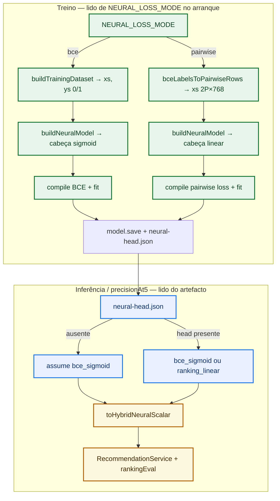

# AI Service (`smart-marketplace-recommender/ai-service`)

Fastify + TensorFlow.js hybrid recommender backed by Neo4j (catalog, embeddings, `BOUGHT` history).

## M20 / ADR-067 — Checkout sync vs training enqueue

| Env | Default | Meaning |
|-----|---------|---------|
| `CHECKOUT_ENQUEUE_TRAINING` | **`false`** | When **`false`**, `POST /api/v1/orders/:orderId/sync-and-train` **only** runs `syncBoughtRelationships` (Neo4j `BOUGHT`); it does **not** call `TrainingJobRegistry.enqueue`. Deep training uses **`POST /api/v1/model/train`** (admin key), cron, or set this flag **`true`** for legacy “train on every checkout”. |

**Compose / `.env`:** set the **same** value on **`api-service`** and **`ai-service`** — `api-service` maps it to `expectedTrainingTriggered` on checkout; `ai-service` gates enqueue. If they diverge, the UI may poll for training that never started.

## M21 T1 — Pairwise ranking loss (`NEURAL_LOSS_MODE`, ADR-071)

| Env | Default | Meaning |
|-----|---------|---------|
| `NEURAL_LOSS_MODE` | `bce` | `bce` = legacy **binary cross-entropy** with a **sigmoid** output head (unchanged behaviour). `pairwise` = **linear** output head + pairwise ranking loss on stacked (positive, negative) rows; each saved version writes `neural-head.json` beside `model.json`. |

**Inference and eval** use the **saved head** from `neural-head.json`, not the env: `ranking_linear` logits are mapped with **sigmoid** into the same `(0,1)` scalar space as the hybrid path. If the manifest is **missing** (pre-M21 models), the head defaults to **`bce_sigmoid`**.

**Rollback:** set `NEURAL_LOSS_MODE=bce`, restore the previous `current` model symlink (or an earlier promoted version), restart the service.

**Promotion gate:** unchanged — `precisionAt5` vs `MODEL_PROMOTION_TOLERANCE` still decides promotion.

### How to test (not env alone)

Setting only `NEURAL_LOSS_MODE=pairwise` is **not** enough by itself:

1. **Set the variable** in the process that runs **`ai-service`** (`.env`, `docker compose` environment for the `ai-service` service, or `export` before `npm start`).
2. **Restart** `ai-service` so `ENV` is parsed at boot (`ModelTrainer` reads the value from DI).
3. **Run training** (`POST /api/v1/model/train` with admin key, cron, or — only if `CHECKOUT_ENQUEUE_TRAINING=true` — checkout-triggered enqueue) so a **new** checkpoint is built with the pairwise branch, **`neural-head.json`** written, and promotion rules applied.
4. **Recommendations** then use **`neural-head.json`** (via `getNeuralHeadKind()`), not the env flag, to map logits → hybrid scalar. If you flip the env to `pairwise` but never retrain, the **loaded** model may still be legacy BCE + missing manifest → inference stays **`bce_sigmoid`**.

You still need the usual training prerequisites (Neo4j `BOUGHT` / embeddings, `API_SERVICE_URL` reachable, etc.).

### Flow (M21 T1 — train vs infer)



**M17 roadmap:** **P1** (re-rank + `rankingConfig` / ADR-063) and **P2** (shared profile pooling / ADR-065) are implemented below. **Not in this service yet:** ADR-062 **Phase 3** (temporal attention in the MLP) — see [.specs/features/m17-phased-recency-ranking-signals/spec.md](../.specs/features/m17-phased-recency-ranking-signals/spec.md).

## M17 P2 — Profile pooling (`PROFILE_POOLING_*`, ADR-065)

Training (`buildTrainingDataset`) and inference (`recommend` / `recommendFromCart`) build the **client profile vector** with one shared function: `aggregateClientProfileEmbeddings` (`src/profile/clientProfileAggregation.ts`).

| Env | Default | Meaning |
|-----|---------|---------|
| `PROFILE_POOLING_MODE` | **`attention_learned`** | `mean` = legacy arithmetic mean. `exp` = exponential decay weights. **`attention_light`** = softmax só sobre recência (M21 A). **`attention_learned`** = softmax sobre **\(w\cdot e + b - \lambda\Delta/\tau\)** com **`w`/`b`/`λ`** lidos de JSON (M21). |
| `PROFILE_POOLING_HALF_LIFE_DAYS` | `30` | Half-life in days for `exp` and for **attention** modes \(\tau\); ignored for `mean`. Must be finite and **> 0**. |

**Training snapshot:** per-client \(T_{\mathrm{ref}}\) is the max normalized order date in the fetched `orders` payload; each product’s purchase time is the max date for that product in the snapshot.

**Inference:** Neo4j method `getClientProfilePoolForAggregation` returns all eligible BOUGHT rows with embedding + latest purchase instant per SKU (same eligibility as P1 anchors, **no LIMIT**). \(T_{\mathrm{ref}}\) is **request time** (UTC).

**`recommendFromCart`:** history rows keep real \(\Delta_i\); cart SKUs are merged with \(\Delta=0\) (cart overrides the same `productId` in the map).

**API:** `rankingConfig` includes optional **`profilePoolingMode`**, **`profilePoolingHalfLifeDays`**, and (for **`attention_light`** / **`attention_learned`**) **`profilePoolingAttentionTemperature`**, **`profilePoolingAttentionMaxEntries`**, plus **`profilePoolingAttentionLearned`: `true`** when the mode is **`attention_learned`**. UI may ignore them (PRS-29).

After changing pooling mode to `exp`, **retrain** the MLP so the gradient matches inference.

## M21 A — Light attention profile pooling (`attention_light`, M21-04 — M21-06)

Set **`PROFILE_POOLING_MODE=attention_light`** to use a **softmax** over recency logits \(-\Delta_i / \tau\) with \(\tau = H/\ln 2\) and **`PROFILE_POOLING_HALF_LIFE_DAYS`** \(H\). **Training, `POST /recommend`, `recommendFromCart`, and offline `precisionAt5`** share the same `aggregateClientProfileEmbeddings` + injected `ProfilePoolingRuntime` (ADR-065 + M21 design).

| Env | Default | Meaning |
|-----|---------|---------|
| `PROFILE_POOLING_ATTENTION_TEMPERATURE` | *(empty)* | **Omit or `inf`:** uniform softmax weights ⇒ **arithmetic mean** over the selected purchase window (safe default when exploring the mode). **Finite \(T>0\):** sharper weights; **`T=1`** matches **`exp`** normalization when all purchases are kept (`PROFILE_POOLING_ATTENTION_MAX_ENTRIES=0`). |
| `PROFILE_POOLING_ATTENTION_MAX_ENTRIES` | `0` | **`0`** = use all purchases. **`N>0`** = keep only the **N** most recent purchases (smallest \(\Delta\)) before softmax. |

**M21-06 (regressão):** With **`PROFILE_POOLING_MODE=mean`** or **`exp`** (legacy deploy), behaviour and offline metrics **SHALL** match the pre-M21 baseline within the same float tolerance as before. With **`attention_light`** and **empty temperature** (uniform) on the **same** purchase multiset, the profile vector matches **`mean`** on that multiset (see unit tests).

**Rollback:** set `PROFILE_POOLING_MODE=mean` (or `exp`), restart, retrain if you had switched training away from legacy.

**`rankingConfig`:** when mode is **`attention_light`** or **`attention_learned`**, responses may include **`profilePoolingAttentionTemperature`** (`null` = uniform / infinite), **`profilePoolingAttentionMaxEntries`**, and **`profilePoolingAttentionLearned`** for the learned mode.

## M21 — Learned attention pooling (`attention_learned`, ADR-073)

**Separate from `attention_light`:** use **`PROFILE_POOLING_MODE=attention_learned`** when you want logits

\[
\ell_j = (w \cdot e_j + b) - \lambda \frac{\Delta_j}{\tau},
\quad
\text{weights} = \mathrm{softmax}(\ell / T)
\]

with **`w`** same length as the purchase embedding (e.g. 384), **`b`** scalar, optional **`lambda`** (default `1`). **`attention_light`** remains **recency-only** (no `w`/`b`).

| Env | Required when | Meaning |
|-----|---------------|---------|
| `PROFILE_POOLING_ATTENTION_LEARNED_JSON_PATH` | *(omit)* | When omitted, defaults to **`{cwd}/data/attention-learned.json`** (Docker: volume `ai-attention-learned-data` → `/app/data`). JSON: `{ "w": number[], "b": number, "lambda"?: number }`. |

**Process entry:** `npm start` runs **`dist/entry.js`**, which **creates or validates** that JSON **before** loading `env.ts` (cold start safe for default `attention_learned`).

**After each successful `POST /api/v1/model/train`** (cron or admin), when `PROFILE_POOLING_MODE=attention_learned`, the service **regenerates** the JSON from the same API + Neo4j snapshot and **reloads** pooling in memory (no restart).

**Admin (corruption / manual refresh):** `POST /api/v1/admin/attention-learned/regenerate` with header **`X-Admin-Key`**. Optional JSON body `{ "force": true }` to retrain even if the current file parses (`force` defaults to false = skip if valid).

**Cron:** `ENABLE_DAILY_TRAIN=false` disables the **02:00** training enqueue; schedule override: **`DAILY_TRAIN_CRON`** (default `0 2 * * *`). Optional second job **`ATTENTION_LEARNED_REFRESH_CRON`** (e.g. `30 2 * * 1,4` for Mon/Thu 02:30) only refreshes the attention JSON (no full MLP retrain). **`ATTENTION_LEARNED_NEGATIVES_PER_POSITIVE`** (default `2`) affects dataset size for both boot-time generator and admin refresh.

Same **`PROFILE_POOLING_ATTENTION_TEMPERATURE`** and **`PROFILE_POOLING_ATTENTION_MAX_ENTRIES`** as M21 A. **Retrain** the ranking MLP after changing pooling mode away from what was used during its last train (ADR-065).

### CLI alternativo (`train:attention-pooling`)

| Moment | Who runs what |
|--------|----------------|
| **CI / laptops** | `npm run train:attention-pooling` (mesmas flags de antes). |
| **Produção** | Preferir **boot + train hook + admin** acima; CLI só quando quiseres NDJSON custom (`--from-ndjson`). |

```bash
PROFILE_POOLING_MODE=mean \
API_SERVICE_URL=http://localhost:8080 \
NEO4J_URI=bolt://localhost:7687 NEO4J_USER=neo4j NEO4J_PASSWORD=… \
npm run train:attention-pooling -- --out ./config/attention-learned.json
```

Rows default: each **positive** is a purchased product embedding that still has a **strictly later** purchase by the same client in the training snapshot; **negatives** are random non-purchased products with embeddings (`--negatives-per-positive`).

**Custom labels:** `--from-ndjson path` where each line is `{"embedding":[...],"label":0|1}` (or a single JSON array of such objects).

Flags: `--epochs`, `--batch-size`, `--validation-split`, `--l2`, `--lambda` (written to JSON for runtime \(\lambda\)), `--lr`, `--early-stop-patience`, `--negatives-per-positive`.

Implementation: `src/services/attentionLearnedJsonGenerator.ts` (runtime + boot), `src/ml/attentionPoolingTrainDataset.ts`, `src/ml/trainAttentionPoolingWeights.ts`, `src/scripts/train-attention-pooling-cli.ts`.

## M17 P1 — Recency re-rank (ADR-062)

`finalScore` remains **only** `NEURAL_WEIGHT * neuralScore + SEMANTIC_WEIGHT * semanticScore` on eligible catalog rows (after M16 eligibility: cart, `recently_purchased` window, `no_embedding` excluded from the neural batch).

When **`RECENCY_RERANK_WEIGHT` > 0**, the service loads up to **`RECENCY_ANCHOR_COUNT`** distinct **confirmed** purchase embeddings (non-demo `BOUGHT`, `order_date` set, product embedding present), ordered by latest purchase, and re-sorts eligible scored items using:

`rankScore = finalScore + RECENCY_RERANK_WEIGHT * recencySimilarity`

where `recencySimilarity` is the **maximum** cosine similarity between the candidate embedding and each anchor (see feature design).

**Sorting:** `rankScore` descending, then `finalScore` descending, then `sku` ascending.

**Disable the boost:** set `RECENCY_RERANK_WEIGHT=0` (default). No extra Neo4j anchor query is executed.

**API:** when the boost is active, ranked eligible items include optional `recencySimilarity` and `rankScore`. Consumers that sort client-side by `finalScore` alone should switch to the response **order** or to `rankScore` when recency re-rank is enabled.

**Response envelope (M17 ADR-063):** successful `POST /api/v1/recommend` and `POST /api/v1/recommend/from-cart` return `recommendations` together with **`rankingConfig`**: `{ neuralWeight, semanticWeight, recencyRerankWeight }` and optional P2/M21 fields `{ profilePoolingMode?, profilePoolingHalfLifeDays?, profilePoolingAttentionTemperature?, profilePoolingAttentionMaxEntries?, profilePoolingAttentionLearned? }`. Ranked eligible rows may also include `hybridNeuralTerm`, `hybridSemanticTerm`, and `recencyBoostTerm` for UI breakdown.

**Staging / metrics:** when turning weights above zero, record an offline or staging baseline (`precisionAt5`, etc.) before tuning (success criteria in the M17 spec).

## M18 — Client HTTP payload (AD-055 / CSL-01)

`POST /api/v1/recommend`, `POST /api/v1/recommend/from-cart`, and `POST /api/v1/recommend` with `eligibilityOnly: true` serialize **filtered** recommendation rows:

- **Omitted from JSON:** `eligible === false` and `eligibilityReason` is `no_embedding` or `in_cart`.
- **Still included:** all eligible rows and ineligible `recently_purchased` (with `suppressionUntil` when applicable).
- **Backward compatibility:** rows without explicit `eligible: false` (legacy tests / older clients) are not stripped.

The ranking pipeline inside `RecommendationService` is unchanged; filtering runs only in the HTTP layer (`filterRecommendationsForClientHttp`).

**Example (conceptual):** M16 merged array might return `[rankedEligible…, inCart, noEmbedding, recentlyPurchased]`. M18 HTTP body is `[rankedEligible…, recentlyPurchased]` only.
