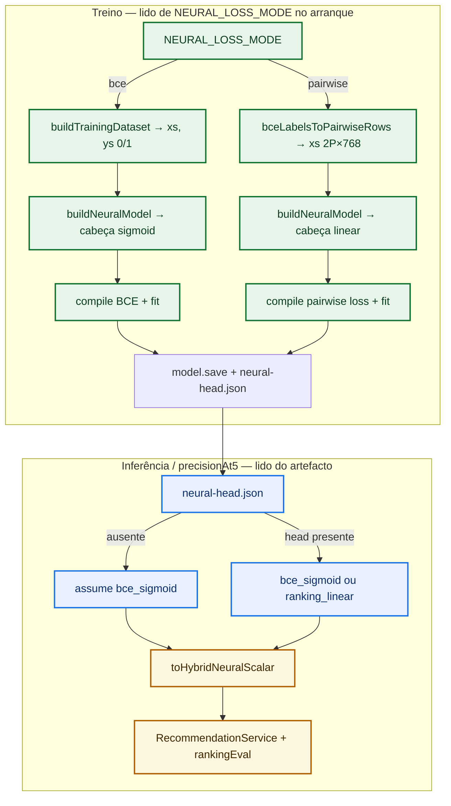

# AI Service (`smart-marketplace-recommender/ai-service`)

Fastify + TensorFlow.js hybrid recommender backed by Neo4j (catalog, embeddings, `BOUGHT` history).

## M21 T1 — Pairwise ranking loss (`NEURAL_LOSS_MODE`, ADR-071)

| Env | Default | Meaning |
|-----|---------|---------|
| `NEURAL_LOSS_MODE` | `bce` | `bce` = legacy **binary cross-entropy** with a **sigmoid** output head (unchanged behaviour). `pairwise` = **linear** output head + pairwise ranking loss on stacked (positive, negative) rows; each saved version writes `neural-head.json` beside `model.json`. |

**Inference and eval** use the **saved head** from `neural-head.json`, not the env: `ranking_linear` logits are mapped with **sigmoid** into the same `(0,1)` scalar space as the hybrid path. If the manifest is **missing** (pre-M21 models), the head defaults to **`bce_sigmoid`**.

**Rollback:** set `NEURAL_LOSS_MODE=bce`, restore the previous `current` model symlink (or an earlier promoted version), restart the service.

**Promotion gate:** unchanged — `precisionAt5` vs `MODEL_PROMOTION_TOLERANCE` still decides promotion.

### How to test (not env alone)

Setting only `NEURAL_LOSS_MODE=pairwise` is **not** enough by itself:

1. **Set the variable** in the process that runs **`ai-service`** (`.env`, `docker compose` environment for the `ai-service` service, or `export` before `npm start`).
2. **Restart** `ai-service` so `ENV` is parsed at boot (`ModelTrainer` reads the value from DI).
3. **Run training** (`POST /api/v1/model/train` with admin key, cron, or checkout flow) so a **new** checkpoint is built with the pairwise branch, **`neural-head.json`** written, and promotion rules applied.
4. **Recommendations** then use **`neural-head.json`** (via `getNeuralHeadKind()`), not the env flag, to map logits → hybrid scalar. If you flip the env to `pairwise` but never retrain, the **loaded** model may still be legacy BCE + missing manifest → inference stays **`bce_sigmoid`**.

You still need the usual training prerequisites (Neo4j `BOUGHT` / embeddings, `API_SERVICE_URL` reachable, etc.).

### Flow (M21 T1 — train vs infer)

**M17 roadmap:** **P1** (re-rank + `rankingConfig` / ADR-063) and **P2** (shared profile pooling / ADR-065) are implemented below. **Not in this service yet:** ADR-062 **Phase 3** (temporal attention in the MLP) — see [.specs/features/m17-phased-recency-ranking-signals/spec.md](../.specs/features/m17-phased-recency-ranking-signals/spec.md).

## M17 P2 — Profile pooling (`PROFILE_POOLING_*`, ADR-065)

Training (`buildTrainingDataset`) and inference (`recommend` / `recommendFromCart`) build the **client profile vector** with one shared function: `aggregateClientProfileEmbeddings` (`src/profile/clientProfileAggregation.ts`).

| Env | Default | Meaning |
|-----|---------|---------|
| `PROFILE_POOLING_MODE` | `mean` | `mean` = arithmetic mean over distinct purchased product embeddings (legacy behaviour). `exp` = weighted mean with \(w_i=\exp(-\Delta_i/\tau)\), \(\tau = H/\ln 2\), \(H=\) `PROFILE_POOLING_HALF_LIFE_DAYS`. |
| `PROFILE_POOLING_HALF_LIFE_DAYS` | `30` | Half-life in days for `exp`; ignored for `mean`. Must be finite and **> 0**. |

**Training snapshot:** per-client \(T_{\mathrm{ref}}\) is the max normalized order date in the fetched `orders` payload; each product’s purchase time is the max date for that product in the snapshot.

**Inference:** Neo4j method `getClientProfilePoolForAggregation` returns all eligible BOUGHT rows with embedding + latest purchase instant per SKU (same eligibility as P1 anchors, **no LIMIT**). \(T_{\mathrm{ref}}\) is **request time** (UTC).

**`recommendFromCart`:** history rows keep real \(\Delta_i\); cart SKUs are merged with \(\Delta=0\) (cart overrides the same `productId` in the map).

**API:** `rankingConfig` includes optional **`profilePoolingMode`** and **`profilePoolingHalfLifeDays`** (effective runtime values). UI may ignore them (PRS-29).

After changing pooling mode to `exp`, **retrain** the MLP so the gradient matches inference.

## M17 P1 — Recency re-rank (ADR-062)

`finalScore` remains **only** `NEURAL_WEIGHT * neuralScore + SEMANTIC_WEIGHT * semanticScore` on eligible catalog rows (after M16 eligibility: cart, `recently_purchased` window, `no_embedding` excluded from the neural batch).

When **`RECENCY_RERANK_WEIGHT` > 0**, the service loads up to **`RECENCY_ANCHOR_COUNT`** distinct **confirmed** purchase embeddings (non-demo `BOUGHT`, `order_date` set, product embedding present), ordered by latest purchase, and re-sorts eligible scored items using:

`rankScore = finalScore + RECENCY_RERANK_WEIGHT * recencySimilarity`

where `recencySimilarity` is the **maximum** cosine similarity between the candidate embedding and each anchor (see feature design).

**Sorting:** `rankScore` descending, then `finalScore` descending, then `sku` ascending.

**Disable the boost:** set `RECENCY_RERANK_WEIGHT=0` (default). No extra Neo4j anchor query is executed.

**API:** when the boost is active, ranked eligible items include optional `recencySimilarity` and `rankScore`. Consumers that sort client-side by `finalScore` alone should switch to the response **order** or to `rankScore` when recency re-rank is enabled.

**Response envelope (M17 ADR-063):** successful `POST /api/v1/recommend` and `POST /api/v1/recommend/from-cart` return `recommendations` together with **`rankingConfig`**: `{ neuralWeight, semanticWeight, recencyRerankWeight }` and optional P2 fields `{ profilePoolingMode?, profilePoolingHalfLifeDays? }`. Ranked eligible rows may also include `hybridNeuralTerm`, `hybridSemanticTerm`, and `recencyBoostTerm` for UI breakdown.

**Staging / metrics:** when turning weights above zero, record an offline or staging baseline (`precisionAt5`, etc.) before tuning (success criteria in the M17 spec).

## M18 — Client HTTP payload (AD-055 / CSL-01)

`POST /api/v1/recommend`, `POST /api/v1/recommend/from-cart`, and `POST /api/v1/recommend` with `eligibilityOnly: true` serialize **filtered** recommendation rows:

- **Omitted from JSON:** `eligible === false` and `eligibilityReason` is `no_embedding` or `in_cart`.
- **Still included:** all eligible rows and ineligible `recently_purchased` (with `suppressionUntil` when applicable).
- **Backward compatibility:** rows without explicit `eligible: false` (legacy tests / older clients) are not stripped.

The ranking pipeline inside `RecommendationService` is unchanged; filtering runs only in the HTTP layer (`filterRecommendationsForClientHttp`).

**Example (conceptual):** M16 merged array might return `[rankedEligible…, inCart, noEmbedding, recentlyPurchased]`. M18 HTTP body is `[rankedEligible…, recentlyPurchased]` only.
