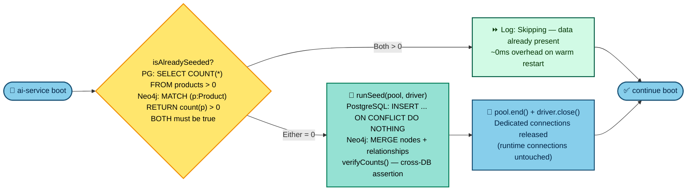
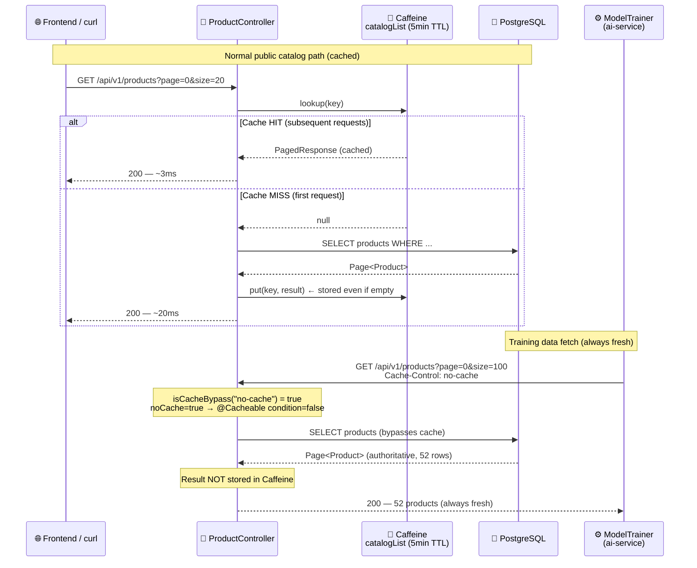

# Cold-Start Boot Flow — AutoSeed + Self-Healing

Complete boot sequence for `ai-service` from a clean environment (`docker compose down -v`) through a
fully ready recommendation engine. Covers the two phases introduced post-M12:
**AutoSeed** (data layer warm-up) and **StartupRecovery** (model self-healing), plus the
**cache-bypass contract** that prevents cold-start cache poisoning in `api-service`.

---

## 1 · Full Boot Sequence (happy path)

```mermaid
flowchart TD
    subgraph "Infrastructure"
        PG[("💾 PostgreSQL\nhealthy")]
        NEO[("🗄️ Neo4j\nhealthy")]
    end

    subgraph "api-service :8080"
        API_BOOT["🚀 Spring Boot starts\n~10s after PG healthy"]
        CACHE["💾 Caffeine cache\nCATALOG_LIST\n5 min TTL"]
        API_READY["✅ api-service healthy"]
    end

    subgraph "ai-service :3001 — boot sequence"
        direction TB

        EMB_LOAD["📦 Load embedding model\nparaphrase-multilingual-MiniLM-L12-v2\n~2-4 min (first boot, HF download)\n~15s (warm volume cache)"]
        MODEL_CHECK{"Model present\non disk?"}
        LOAD_MODEL["📂 loadCurrent()\nread symlink → load JSON"]

        AUTOSEED_CHECK{"isAlreadySeeded?\nPG + Neo4j have products"}
        AUTOSEED_RUN["🌱 AutoSeedService.runIfNeeded()\nown short-lived Pool + Driver\nON CONFLICT DO NOTHING (PG)\nMERGE (Neo4j)\n~5s for 52 products"]
        AUTOSEED_SKIP["⏩ Skip — data already present\n(warm restart or second boot)"]
        AUTOSEED_DONE["✅ AutoSeed complete\n52 products, 20 clients,\n130 orders seeded"]

        LISTEN["🌐 fastify.listen(:3001)\nHTTP server up — requests accepted\n/ready still 503 (no model yet)"]

        HEAL_FLAG{"AUTO_HEAL_MODEL\n= true?"}
        HEAL_EMBEDDINGS{"Missing product\nembeddings in Neo4j?"}
        GEN_EMB["🧠 EmbeddingService\ngenerateEmbeddings()\n384d per product"]
        PROBE["📊 probeTrainingData()\nfetch /clients + /products\n+ /orders via api-service\nwith Cache-Control: no-cache"]
        PROBE_CHECK{"clients > 0\nproducts > 0\norders with items?"}
        BLOCKED["⚠️ blocked/no-training-data\n/ready = 503\n(data not available yet)"]
        ENQUEUE["⚙️ TrainingJobRegistry.enqueue()\nsetImmediate async job"]
        TRAIN["🧠 ModelTrainer.train()\n30 epochs, batch=16\nhard negative mining\nsoft negative exclusion\n~30-60s"]
        PROMOTE{"precisionAt5 ≥\nprevious?"}
        SAVE["💾 VersionedModelStore\nsave + update symlink\n/tmp/model/current"]
        REJECT["⚠️ Model rejected\n(score regression)\nold model stays current"]
        READY["✅ /ready = 200\nembeddingReady=true\nmodelPresent=true\nrecoveryBlocking=false"]
        SKIP_HEAL["⏩ Skip recovery\n(disabled or model present)"]
    end

    PG -->|service_healthy| API_BOOT
    PG -->|service_healthy| ai-service
    NEO -->|service_healthy| ai-service

    API_BOOT --> CACHE
    API_BOOT --> API_READY

    ai-service --> EMB_LOAD
    EMB_LOAD --> MODEL_CHECK
    MODEL_CHECK -->|Yes| LOAD_MODEL
    MODEL_CHECK -->|No| AUTOSEED_CHECK
    LOAD_MODEL --> AUTOSEED_CHECK

    AUTOSEED_CHECK -->|No data| AUTOSEED_RUN
    AUTOSEED_CHECK -->|Data present| AUTOSEED_SKIP
    AUTOSEED_RUN --> AUTOSEED_DONE
    AUTOSEED_DONE --> LISTEN
    AUTOSEED_SKIP --> LISTEN

    LISTEN --> HEAL_FLAG
    HEAL_FLAG -->|No| SKIP_HEAL
    HEAL_FLAG -->|Yes| HEAL_EMBEDDINGS
    HEAL_EMBEDDINGS -->|Yes| GEN_EMB
    HEAL_EMBEDDINGS -->|No| PROBE
    GEN_EMB --> PROBE

    PROBE -->|GET /products?Cache-Control: no-cache| API_READY
    API_READY -.->|"fresh read\n(bypasses Caffeine)"| PROBE
    PROBE --> PROBE_CHECK
    PROBE_CHECK -->|No| BLOCKED
    PROBE_CHECK -->|Yes| ENQUEUE
    ENQUEUE --> TRAIN
    TRAIN --> PROMOTE
    PROMOTE -->|Yes| SAVE
    PROMOTE -->|No| REJECT
    SAVE --> READY
    SKIP_HEAL --> READY

    classDef infra fill:#A8DADC,stroke:#1864AB,color:#000,stroke-width:2px
    classDef apiservice fill:#4ECDC4,stroke:#0B7285,color:#fff,stroke-width:2px
    classDef seed fill:#95E1D3,stroke:#087F5B,color:#000,stroke-width:2px
    classDef decision fill:#FFE66D,stroke:#F08C00,color:#000,stroke-width:2px
    classDef success fill:#90EE90,stroke:#2d6a2d,color:#003300,stroke-width:2px
    classDef warning fill:#FFD1A9,stroke:#cc6600,color:#5A2D00,stroke-width:2px
    classDef failure fill:#FFB6C1,stroke:#DC143C,color:#5A0015,stroke-width:2px
    classDef process fill:#87CEEB,stroke:#1a5276,color:#002244,stroke-width:2px

    class PG,NEO infra
    class API_BOOT,CACHE,API_READY apiservice
    class AUTOSEED_RUN,AUTOSEED_DONE,AUTOSEED_CHECK,AUTOSEED_SKIP seed
    class MODEL_CHECK,HEAL_FLAG,HEAL_EMBEDDINGS,PROBE_CHECK,PROMOTE decision
    class READY,SAVE success
    class BLOCKED,REJECT,SKIP_HEAL warning
    class EMB_LOAD,LISTEN,GEN_EMB,PROBE,ENQUEUE,TRAIN,LOAD_MODEL process
```

---

## 2 · AutoSeedService — Idempotency Contract

---

## 3 · Cache-Bypass Contract (api-service ↔ ai-service)

---

## 4 · Timing Comparison: cold-start vs warm-start

| Phase | Cold Start (volumes empty) | Warm Start (volumes present) |
|-------|---------------------------|-------------------------------|
| Embedding model load | ~2–4 min (HF download) | ~15s (volume cache) |
| AutoSeed | ~5s (52 products) | ~0ms (isAlreadySeeded=true, skip) |
| Missing embeddings | ~30s (52 products × ~0.5s) | 0s (all embedded) |
| Training probe | ~1s (api-service fetch) | ~1s |
| Model training (30 epochs) | ~30–60s | ~30–60s |
| **Total to /ready=200** | **~3–7 min** | **~45–90s** |

> Cold-start timing dominated by HuggingFace model download.
> The model is cached in the `ai-hf-cache` Docker volume after the first run.
> `docker compose down` (without `-v`) preserves both model and HF cache.
> `docker compose down -v` resets everything — use only for full environment reset.

---

## Files changed by this feature

| File | Change |
|------|--------|
| `ai-service/src/seed/seed.ts` | Extracted `runSeed()` + `isAlreadySeeded()` + `SeedVerificationError`; CLI `main()` preserved via `require.main === module` guard |
| `ai-service/src/services/AutoSeedService.ts` | New — boot-time idempotent seed orchestrator |
| `ai-service/src/config/env.ts` | Added `AUTO_SEED_ON_BOOT`, `POSTGRES_*` typed block; generalised `parseBooleanFlag` |
| `ai-service/src/index.ts` | Wired `AutoSeedService.runIfNeeded()` before `listenAndScheduleRecovery` |
| `ai-service/src/services/ModelTrainer.ts` | Added `Cache-Control: no-cache` to all training-data fetches |
| `api-service/.../ProductApplicationService.java` | `@Cacheable condition="!#noCache"` — cache bypass param |
| `api-service/.../ProductController.java` | Reads `Cache-Control` header → `isCacheBypass()` → `noCache` flag |
| `docker-compose.yml` | Added `POSTGRES_*` + `AUTO_SEED_ON_BOOT` to `ai-service`; added `postgres: service_healthy` to `ai-service depends_on` |
| `.env` | Added `AUTO_SEED_ON_BOOT=true` with comment |
