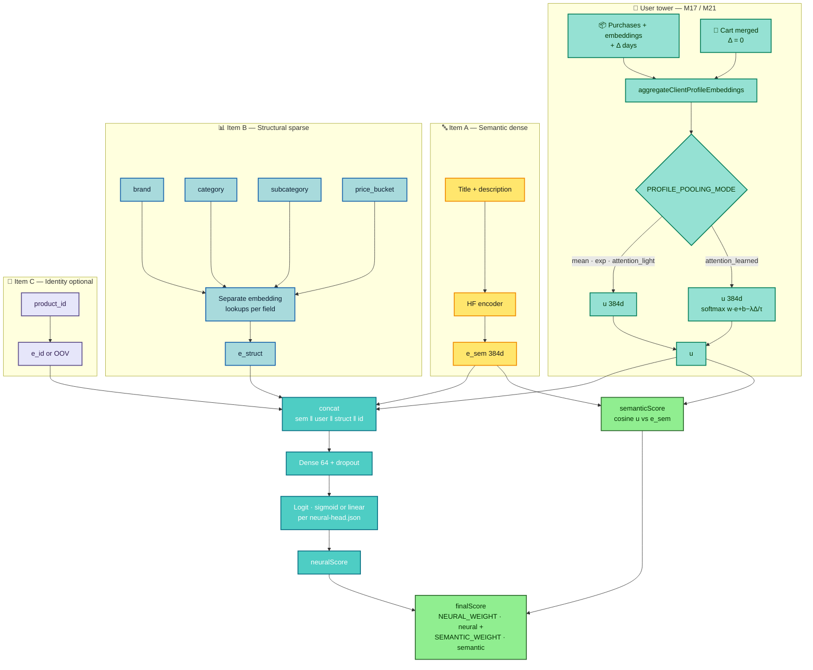

# M22 + M21 — Neural ranking architecture (dual item tower + user pooling)

Companion to the root **[README](../../README.md)** § *M22 — Hybrid dual item tower (delivered)* and **[ADR-074](../../.specs/features/m22-hybrid-dual-item-tower-cold-start/adr-074-m22-milestone-hybrid-sparse-item-tower.md)**.

**Summary:** The **user vector u** comes from **M17/M21** (`aggregateClientProfileEmbeddings`), optionally **`attention_learned`**. The **item** side under **M22** splits into **A** semantic (HF), **B** structural sparse priors (disjoint vocabs), **C** optional **product_id** memorisation — fused as **concat → MLP → neuralScore**, alongside **semanticScore = cosine(u, e_sem)** per **ADR-016**.

When **`M22_ENABLED=false`**, the neural path remains the legacy **768-d** concat `(e_sem ‖ u)`.

---

## Flowchart

